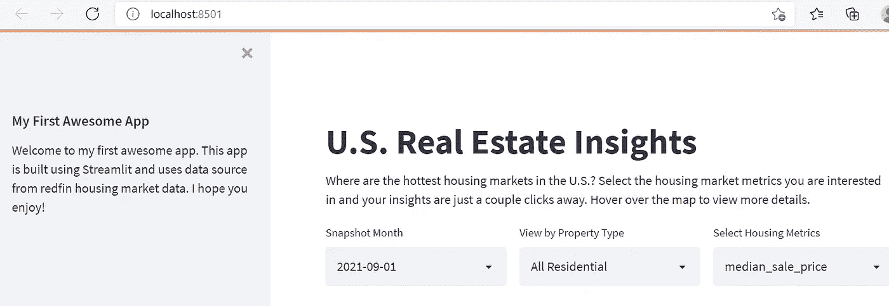

# 简化实践:从零到你的第一个优秀的网络应用

> 原文：<https://towardsdatascience.com/streamlit-hands-on-from-zero-to-your-first-awesome-web-app-2c28f9f4e214?source=collection_archive---------1----------------------->

## 学习核心概念并使用 Streamlit 创建您的第一个 Web 应用程序的分步指南

图片来源: [Pixabay](https://pixabay.com/photos/coding-programming-working-macbook-924920/)

# 目录

[***第 1 部分:Streamlit 基础知识***](#1168)
∘ [简介](#88fd)
∘ [什么是 Streamlit](#52c5)
∘ [为什么要将 Streamlit 添加到您的数据科学家工具包中](#730f)
∘ [如何在 Windows 上安装 streamlit](#7a5a)

*[***第二部分:创建你的第一个 streamlit web App***](#0efb)
∘[先决条件](#4fb3)
∘ [启动 Visual Studio 编辑器和 Streamlit](#f56d)
∘ [数据准备](#7262)
∘ [构建 Streamlit App](#2990)
∘ [将 Choropleth 地图添加到 app 中](#3046)*

# *第 1 部分:简化基础知识*

## *介绍*

*自从我开始使用这个奇妙的基于 python 的框架来构建交互式仪表盘和机器学习 web 应用程序以来，我一直想写一个 Streamlit 教程。在我看来，Streamlit 应该是任何数据科学家工具箱中的必备工具，因为它简单、灵活、健壮且免费。*

*在本教程中，我将向您简要介绍什么是 Streamlit，为什么我喜欢它并向任何在分析和数据科学领域工作的人推荐它，以及如何在您的计算机上安装它。*

*安装完成后，我将一步一步地向您展示一个详细的实践示例，通过可视化美国各州的房价，使用 Streamlit 创建您的第一个交互式仪表板。您将通过 python 编写代码来完成创建此 web 应用程序的完整端到端流程，并使用两个可免费下载的开放数据集来简化它。*

*在本教程结束时，您应该对 Streamlit 的核心概念及其出色的功能有了坚实的理解。您可以将此示例保存为起始模板，以便在将来的项目中重用和扩展。*

*我们正在构建的仪表板/web 应用程序看起来会像这样。你准备好了吗？我们开始吧！*

**

*使用 Streamlit 创建的交互式仪表板/ Web 应用程序(由作者提供)*

## *什么是细流*

*[Streamlit](https://streamlit.io/) 是一个免费的开源全 python 框架，使数据科学家能够快速构建交互式仪表盘和机器学习 web 应用，无需前端 web 开发经验。如果你懂 python，那么你就可以在几小时内，而不是几周内，使用 Streamlit 创建和共享你的 web 应用。*

*如果你有兴趣了解更多，你可以查看 Streamlit 网站的图库页面，了解一些由其用户开发的很棒的应用程序:【https://streamlit.io/gallery】T2。*

## *为什么您应该将 Streamlit 添加到您的数据科学家工具包中*

*我是 Tableau 的长期用户，一直使用 Tableau 作为我的主要工具，为工作中的各种分析任务创建交互式仪表盘和数据可视化。虽然我喜欢 Tableau 全面的分析和可视化功能，但我一直在为自己的分析项目寻找一个灵活、免费和可扩展的替代方案。*

*当我碰到 Streamlit 的时候，我立刻就爱上了它！这都是 python，所以如果你已经知道 python(像许多数据科学家一样)，那么利用 Streamlit 只需几行代码就可以让你的仪表板或数据应用程序启动并运行，而不需要任何前端 web 应用程序开发知识。*

*最棒的是。免费的！免费的！免费的！重要的事情说三遍！😂因此，如果你是一名自由职业的数据科学家或正在考虑开始自己的分析咨询业务，我强烈建议你探索 Streamlit，并将其添加到你的工具包中，因为它简单、灵活、可伸缩且免费。*

*对于 Tableau 用户，我也建议你花些时间去探索和学习 Python 和 Streamlit。请记住，开源是一种趋势(就像 Python 在短短几年内取代 SAS 在分析行业的统治地位一样)，所以要向前看，做好走在时代前列的准备！*

## *如何在 Windows 上安装 Streamlit*

*要在 Windows 上安装 Streamlit，让我们先安装 Anaconda(如果您还没有这样做)，因为根据 Streamlit 文档，Streamlit 在 Windows 上正式支持的环境管理器是 [Anaconda Navigator](https://docs.anaconda.com/anaconda/navigator/) 。*

*第一步:安装 Anaconda(如果你已经安装了 Anaconda，跳过这一步)*

*进入 [Anaconda 下载页面](https://www.anaconda.com/products/individual)并在 Windows 上下载 Anaconda 个人版。关于如何安装和启动 Anaconda 的更多详细说明可以在[这里](https://docs.anaconda.com/anaconda/install/windows/)找到。*

***步骤 2** :使用 Anaconda navigator 设置您的环境*

*遵循 Anaconda 提供的这些详细说明，使用 Anaconda navigator 来[创建和管理您的环境](https://docs.anaconda.com/anaconda/navigator/getting-started/#managing-environments)。*

***步骤 3:** 在您的新环境中打开终端(我将我的环境命名为‘geo _ env’)*

**

*作者图片*

***第四步:**安装 Streamlit*

*在打开的终端中，键入以下命令:*

**

*作者图片*

***步骤 5:** 测试 Streamlit 安装是否成功*

*在命令行中键入“Streamlit hello”。如果安装成功，您将会在终端上看到欢迎消息，并且在 web 浏览器上显示 Streamlit 的 Hello 应用程序。*

**

*作者图片*

**

*作者图片*

# *第 2 部分:创建您的第一个 Streamlit Web 应用程序*

## *先决条件*

*在我们开始编码和创建我们的应用程序之前，我们需要先做一些准备，包括下载本教程所需的数据集和用于编码的文本编辑器。*

*本教程需要两个数据集，你可以点击下面的链接下载它们。它们都是开放数据集，可免费用于我们的项目演示目的:*

*(1):数据集 1 (Redfin 美国住房市场数据):*

*转到 [redfin 的数据中心](https://www.redfin.com/news/data-center/)，向下滚动到“它如何工作”部分，并下载“州”级别的区域数据。在本教程中，为了简单起见，我们将只查看各州的房价，但是您当然可以将可视化扩展到其他地区级别，如城市、县、邮政编码等。*

**

*来源: [Redfin 数据中心](https://www.redfin.com/news/data-center/)*

*该文件是一个. gz 文件，如下所示:*

**

*作者图片*

*(2):数据集 2(美国州界 Geojson 文件):*

*转到[public.opendatasoft.com](https://public.opendatasoft.com/explore/dataset/us-state-boundaries/export/)，向下滚动到“地理文件格式”部分，下载美国州界的 geojson 文件。这个 geojson 文件定义了每个州的地理边界/坐标，我们需要用它来绘制我们的 choropleth 地图。*

*如果你不熟悉 choropleth 地图或者不知道什么是 geojson 文件以及我们为什么需要它，请阅读我以前的文章[如何使用 python/folio 创建 choropleth 地图](https://medium.com/p/c8cee104455f?source=post_stats_page----------------------------------------)了解更多信息。*

**

*geojson 文件(数据来源:[https://public . opendatasoft . com/explore/dataset/us-state-boundaries/export/](https://public.opendatasoft.com/explore/dataset/us-state-boundaries/export/))*

*(3):用于编码的文本编辑器:*

*你可以为这个项目使用任何你喜欢的文本编辑器(只是不要使用记事本；不是专门为编码和开发者设计的文本编辑器)。如果你没有，你可以去 https://code.visualstudio.com/的[下载/安装微软的 Visual Studio 编辑器。](https://code.visualstudio.com/)*

**

*下载 Visual Studio 代码编辑器(图片由作者提供)*

## *启动 Visual Studio 编辑器并简化*

*让我们启动 VS 代码编辑器，打开一个新的空文件，将其命名为“my_first_app ”,并将其保存为项目文件夹中的 python 文件(my_first_app.py)。*

**

*创建一个新的 python 文件“my_first_app.py”(图片由作者提供)*

*让我们通过打开 Anaconda Navigator 来启动 Streamlit，单击“Environments ”,然后选择您在第 1 部分中创建的环境，并单击“Open Terminal”。*

**

*从 Anaconda Navigator 打开终端(图片由作者提供)*

*在终端中，首先您需要将您的目录更改为保存“my_first_app.py”文件的目录。然后键入以下命令启动 Streamlit。您将看到一个新的 web 浏览器打开，暂时没有内容。*

*简化运行 my_first_app.py*

**

*从终端启动 Streamlit(图片由作者提供)*

*在网络浏览器中，单击右上角的菜单图标，然后单击“设置”。在“Settings”下，让我们选中“Run on save ”,这样每次我们在 VS code editor 中进行代码更改并保存时，更改都会自动反映在 Streamlit web 应用程序中。*

**

*Streamlit 设置(图片由作者提供)*

## *数据准备*

*让我们在 VS 代码编辑器中键入以下代码，导入本教程所需的所有包，并通过只选择少数感兴趣的字段来准备我们清理的数据集。之后，我们将清理后的房屋市场数据集与 geojson 文件合并。*

*在上面的代码中，需要注意/记住一些重要的事情:*

*首先，streamlit 从上到下读取并执行您的脚本。每当代码发生变化或用户与应用程序交互时(例如应用过滤器)，Streamlit 会从头到尾重新运行整个 Python 脚本。*

*其次，Streamlit 提供了一种缓存机制，允许您的应用程序在加载、读取或操作大量数据时保持高性能，这些数据可能会导致昂贵的计算。这是用@st.cache 装饰器完成的。*

*例如，在我们的案例中，如果没有缓存，每次用户与应用程序交互并且应用程序被刷新时，数据都会被重新加载和重新计算，这可能会使应用程序运行缓慢，并导致糟糕的用户体验。通过缓存，数据只需加载到应用程序中一次。下次调用缓存的函数时，如果函数输入没有任何变化，Streamlit 将跳过函数的执行，而是返回之前存储在缓存中的输出。*

*第三，可以使用 st.write()向 app 写入参数。您想要传递给应用程序的参数可以是很多东西，比如数据框、图表、字符串、函数等。在上面的代码中，我们将 df_final 数据帧写入应用程序，以便查看最终数据的样子。*

*当您保存代码时，一个代表 df_final 的表格将出现在您的应用程序中。在你看完数据并对所有字段有了很好的理解之后(你可以在这个[页面](https://www.redfin.com/news/data-center-metrics-definitions/)中参考 Redfin 的数据字典)，你可以注释掉 st.write()命令，因为我们不打算在我们的应用程序中显示这个表。*

**

*用于创建 Choropleth 地图的已清理数据(图片由作者提供)*

## *构建 Streamlit 应用程序*

*现在我们已经准备好了数据，让我们开始使用 Streamlit 创建我们的应用程序。非常刺激！*

*首先，让我们在应用程序中添加一个侧边栏，显示一些关于这个应用程序的介绍性信息或者免责声明。我们还将在应用程序的主界面中添加标题和副标题。*

*保存代码后，您将看到您的 web 应用程序也自动重新运行/更新，如下所示:*

**

*作者图片*

*其次，让我们添加一些过滤器，让用户能够灵活地对数据进行切片和切块，并从不同角度生成见解。我们希望将这三个过滤器并排放在同一行中，因此，我们使用下面的代码创建三列。*

**

*作者图片*

*到目前为止，这个看起来很不错…但是等等！当用户在这些过滤器中选择不同的选项时，Streamlit 如何接受这些输入并相应地过滤数据？例如，如果用户想查看每个州基于最近一个月(2021–09–01)的销售价格中值，并且只查看单户住宅，我们如何将这些过滤器传递回我们的数据框？*

*我们可以使用下面的代码，根据用户的选择更新 df_final。然后，您可以将数据框写入应用程序，尝试更改过滤器并检查它们是否正常工作(确保在完成检查后注释掉 st.write)。*

## *将 Choropleth 地图添加到应用程序*

*现在我们的数据已经准备好了，让我们在应用程序中绘制 choropleth 地图。请参考我的上一篇文章[如何使用 python/leav 创建 choropleth 地图](https://medium.com/p/c8cee104455f?source=post_stats_page----------------------------------------)来更详细地理解关于使用 python/leav 创建 choropleth 地图的代码和步骤。*

* [## 叶和 Choropleth 地图:从零到专业

### 使用带有图层控制和自定义工具提示的 follow 创建交互式 Choropleth 地图的分步教程

towardsdatascience.com](/folium-and-choropleth-map-from-zero-to-pro-6127f9e68564) 

让我们使用下面的代码来创建 follow map，它根据用户的输入，按不同的时期、财产类型和评估指标来可视化美国住房市场数据。

在代码中，第 2 行和第 3 行初始化一个空的美国地图，并将地图的默认中心位置设置为(40，-100)。第 6 行到第 18 行根据用户在三个过滤器上的输入创建 choropleth 映射。请注意第 10 行，它通过从第三个过滤器传递的“metrics”参数来确定每个状态的阴影。

Choropleth 地图(图片由作者提供)

这个看起来不错！然而，如果我们还能在用户悬停在地图上时显示每个州的一些信息，那就更好了。因此，让我们通过在上面代码的最后一行 folium_static(m)之前插入以下代码来为地图添加工具提示。

这就对了。您已经使用 Streamlit 创建了第一个交互式仪表板/web 应用程序。玩玩它，想想如何扩展它的功能，或者给它添加更多的功能。您也可以阅读我的文章[*Streamlit hand-On:增强应用程序用户体验的功能和技巧*](/streamlit-hands-on-features-and-tips-for-enhanced-app-user-experience-aef7be8035fa) ，了解增强该应用程序可用性的其他功能和技术。

 [## 简化动手操作:增强应用程序用户体验的功能和技巧

### 通过真实的使用案例和完整的代码示例提升您的 Streamlit 技能

towardsdatascience.com](/streamlit-hands-on-features-and-tips-for-enhanced-app-user-experience-aef7be8035fa) 

祝贺你完成这个项目，我希望你喜欢这个教程。快乐学习！

作者图片

你可以通过这个[推荐链接](https://medium.com/@insightsbees/membership)注册 Medium 会员(每月 5 美元)来获得我的作品和 Medium 的其他内容。通过这个链接注册，我将收到你的一部分会员费，不需要你额外付费。谢谢大家！*