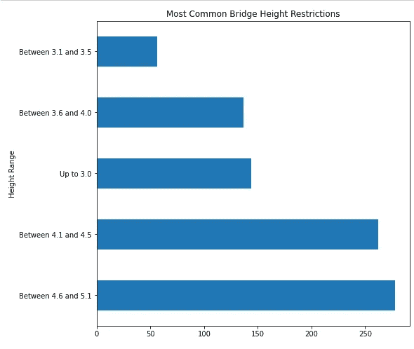

# 罢工和排水沟，起起落落

> 原文：<https://towardsdatascience.com/strikes-and-gutters-ups-and-downs-79d0a93c7280?source=collection_archive---------30----------------------->

## (不是关于杰夫·布里吉斯；但是伦敦桥)

澄清一下——这不是伦敦桥，而是塔桥。(照片由 [Unsplash](https://unsplash.com?utm_source=medium&utm_medium=referral) 上的 [Gabriel Kraus](https://unsplash.com/@gabrielkraus?utm_source=medium&utm_medium=referral) 拍摄)

好吧，也许这是一篇关于伦敦桥梁高度限制的简短博客的标题，有点误导；我还能怎么让你读这个？

我偶然发现了一个有趣的伦敦交通局(TFL)数据集，名为“**桥梁高度限制**”，如下:

<https://blog.tfl.gov.uk/2019/10/09/data-drop-ordnance-survey-data-bridge-height-restrictions/>  

根据该网站，整个伦敦平均每月有两起桥梁撞击事件。在这种背景下，大伦敦边界/M25 内有 877 个结构，包括矮桥、隧道和路障。粗略的数据分析表明**最常见的**类型的桥梁限制在 4.6 米和 5.1 米之间；

最常见的桥梁类型在 4.6 米和 5.1 米之间(由作者可视化)

## 探索性数据分析

这就是为什么我需要借用一个大的勒波斯基的报价来引起你的注意；TFL 数据集可以产生更多的见解，但一些数据清理是必要的。请随意跳到下一部分。

在这个阶段，值得强调的是，如果没有 OSMNX，这篇博客中的分析是不可能的；这是我以前曾经用过的一个包，因为它在这个数据集的上下文中有很多可能性，所以我又回到了这个包中。阅读此处的文档:

  

下面是清理数据集的几行代码(数据集包含大量重复信息):

利用一点当地知识将伦敦行政区分为北部和南部(作者代码)

## 按行政区划分的限制分布

利用清理后的数据集，我们可以构建一个交互式地图，邀请用户悬停并点击伦敦的各个区，以直观地检查每个区的高度限制分布情况。当用户将鼠标悬停在每个区的每个高度限制类别上时，“计数”参数会给出该类别在该区出现的频率。当然，整个数据集是根据特定的行政区是在河的北面(还是南面)来划分的。

浏览图表(作者可视化)

## 这些身高限制都去哪了？

使用一个交互式的叶群地图，我们可以看到大伦敦地区的所有高度限制。将鼠标悬停在每个标记上并点击，应会产生有关限制类型的更多信息，以及有关该限制生效的道路名称或道路编号(如果有)的信息。

## 我的路线上有什么限制吗？

我们并不是每天都坐在双层汽车或重型货车的方向盘后面，但是如果我们坐了，我们会比现在每天更加注意桥梁高度的限制。作为该分析的一部分，我们编写了一个简单的函数，它绘制了大伦敦两点之间的最短*驾驶*路线，其中**也**标出了可能与 HGV 驾驶员相关的所有高度限制。代码如下所示:

现在我们有了这个函数，我们可以沿着随机选择的三条路线开车；一条在河的北面，一条在河的南面，最后一条(刚好)穿过河。实际路线是红色的，而标记表示*可能*是适用的限制。某些面向 HGV 驾驶员的导航系统可能已经有了这种功能，所以用现有的数据从头开始构建这种导航系统(至少对我来说)很有趣。

3 条穿越伦敦的随机路线(作者可视化)

## 结论

很容易忘记数据集是关于**桥高限制**而不是桥的位置。虽然限制的存在是桥梁存在的合理替代，但情况并非总是如此。

如果您还记得，数据集中记录的最高净空水平与 4.6 米至 5.1 米之间的车辆限制有关；该数据集实际上对任何潜在的高于 5.1 米的净空没有任何限制。这就是为什么在哈格斯顿和伦敦桥之间的第三条路线上，伦敦桥的火车隧道(对你们伦敦人来说，这是一个人刚刚穿过泰晤士河到达博罗市场之前的一段)几乎没有记录。这是因为它们高得令人难以置信，可能超过 5.1 米(我还没有检查过，下次路过时我会检查的)。

这是一个(有趣的)数据限制——它描绘了限制条件，而不是实际的桥梁。如果一个人驾驶一辆超过 5.1 米高的汽车，这可能会产生一些有趣的结果；但是任何超过这个高度的交通工具都应该有自己的博客。