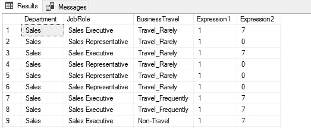
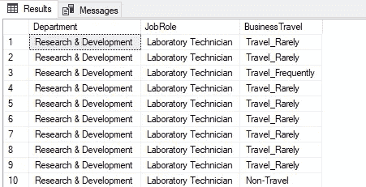
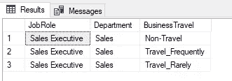
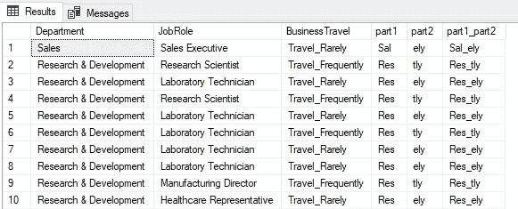
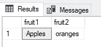
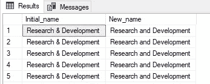

# SQL 第 1 部分中的字符串

> 原文：<https://towardsdatascience.com/strings-in-sql-part-1-122185dd0099?source=collection_archive---------27----------------------->

## 使用 SQL 字符串技术从字符列中提取有意义的信息

费德里科·布尔加拉西在 [Unsplash](https://unsplash.com?utm_source=medium&utm_medium=referral) 上的照片

## 介绍

读完这篇文章后，我们应该更有信心提取包含在字符变量中的数据洞察力。一个字符变量或字符串可以用文本值来表示，比如一个人的；姓名、工作或地址。所使用的许多 ML 模型需要数字格式的特征来提取含义。使用字符串操作技术，可以清理数据并将其转换成所需的格式。

本文中显示的 SQL 代码是使用 Microsoft SQL Server Management Studio 18 的一个实例创建的。所使用的每个示例都旨在强调可用的不同 SQL 字符串函数的基本概念。

## 输入数据

对于这段分析，IBM HR 分析数据集的一个样本取自 Kaggle。在这个数据集中，有许多字符变量可用。

 [## IBM HR Analytics 员工流失和绩效

### 预测你有价值的员工的流失

www.kaggle.com](https://www.kaggle.com/pavansubhasht/ibm-hr-analytics-attrition-dataset) 

## 查林德克斯

字符索引方法可用于检查字符列中是否存在字符串值。

使用 charindex 方法定位表达式的 SQL 代码 1.1

在上面显示的 SQL 代码中，我们在该方法的第一个应用程序中搜索值“sales”。字符串搜索显示该值不区分大小写，因为搜索的列中的实际值显示的是 camel 大小写格式。当筛选子句应用于数据集时，查询结果中将只显示与筛选表达式匹配的值。

SQL 输出 1.1 来自对 JobRole 列的 charindex 检查

如上面的输出所示，已经搜索的两个字符串值将返回表示第一个字符的索引位置，该字符与正在搜索的整个字符串值相匹配。如果字符串值不存在，则将返回零值。我们可以在第二行中看到，列值“代表”与搜索的“执行”值不匹配，因此返回零。

## PATINDEX

当检查包含在列中的模式时，模式索引方法是合适的。

SQL 代码 1.2 标识 JobRole 中的模式

通过使用百分比符号，我们为该方法提供了一个通配符。正是这个通配符允许在要搜索的模式之间存在任意数量的其他值。

SQL 输出 1.2 匹配模式的职务范围

结果突出显示，在找到第一个字母“b”之前存在两个值，然后在第二个字母“y”之前存在六个值。

SQL 代码 1.3 检查要搜索的模式索引的值列表

在对 job role 列的检查中，我们寻找包含在 string 列中任意位置的值的列表。

SQL 输出 1.3 字母 x 似乎是模式列表中最常见的

从 SQL 输出中可以看出，在这个搜索中只识别出了字母“x”。然而，如果列表中的任何或所有字母出现在该行中，那么将显示这些结果。

## 左侧和右侧

这两种方法可用于返回从字符串开头或结尾开始的字符串部分。

SQL 代码 1.4 从开头和结尾提取字符串的元素

通过选择 left 方法，将返回字符串开头的前三个字符值。

SQL output 1.4 返回的字符串元素

而使用正确的方法，则返回最后三个字符值。如果字符串的开头或结尾是您分析的起点，这些方法中的每一种都有助于返回所需的结果。但是，如果需要另一个起始位置，那么使用 substring 方法会更实用。

## 子链

能够识别所需字符串的起始位置和长度位置是 substring 方法的核心。有了这两个位置参数，在检查字符串变量时就有了更大的灵活性。

SQL 代码 1.5 创建字符串逻辑来测试方法

使用已经声明的句子变量，可以提取许多项。使用 substring 方法和索引中的起始值和长度值，用户可以找到两个水果项。由于子字符串索引从 1 开始，并且长度位置参数是包含性的，因此可以返回位置参数值为 1 和 6 的“Apples”。

SQL 输出 1.5 从创建的字符串中提取水果项目

通过将起始位置值从索引扩展到适当的位置，已经识别出第二个水果。在这个例子中，长度位置指的是所需水果的长度。如果没有包括长度位置参数，那么查询结果中将返回起始位置之后的所有字符串值。

## 替换

在识别出我们感兴趣的字符串值之后，可能会有需要调整这个字符串值的时候。对于此任务，可以使用替换方法。

SQL 代码 1.6 调整字符串中的符号

在 department 列中，找到了&符号，但需要将其改为“and ”,而不是“&”符号。方法中的参数是第二个参数的旧项和第三个参数的新项。

SQL 输出 1.6 返回带有 new_name 列的字符串的扩展版本

随着结果的突出显示，新的部门名称已按预期创建。这是一个小例子，说明了在识别可以转换成另一种格式的文本时可以实现的功能。

## 结论

可以从包含在文本列或要素中的数据中获得许多附加信息。在本文中，展示了许多不同的方法来帮助这个提取过程。每种方法都强调了理解字符串的索引是如何为创建新功能提供机会的。

在下一篇文章中，我们将继续探索可以使用的不同 SQL 字符串方法。

*非常感谢您阅读*

[1]:ka ggle dataset IBM HR analytics attraction dataset 来自【https://opendatacommons.org/licenses/dbcl/1-0/】https://www . ka ggle . com/pavansubhasht/IBM-HR-analytics-attraction-dataset，许可协议为