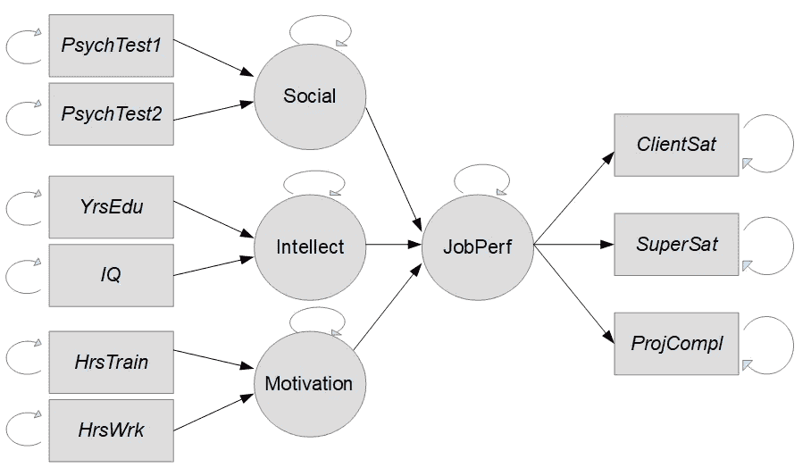
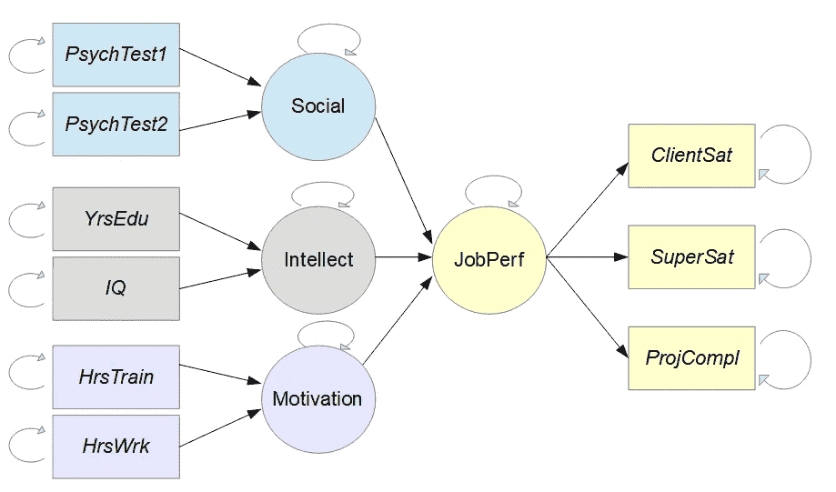
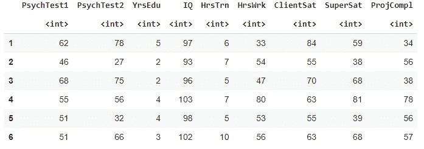
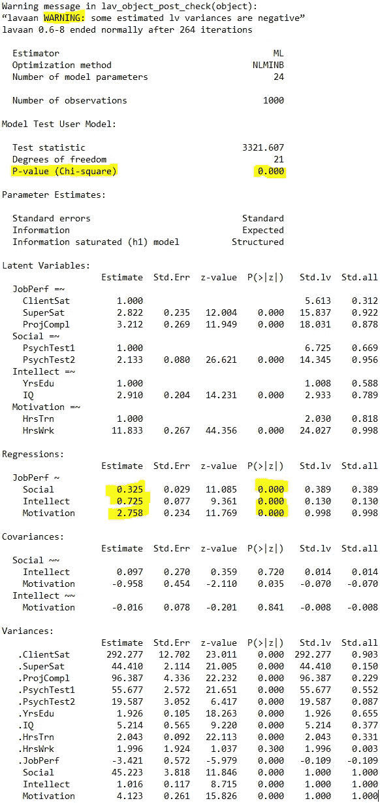
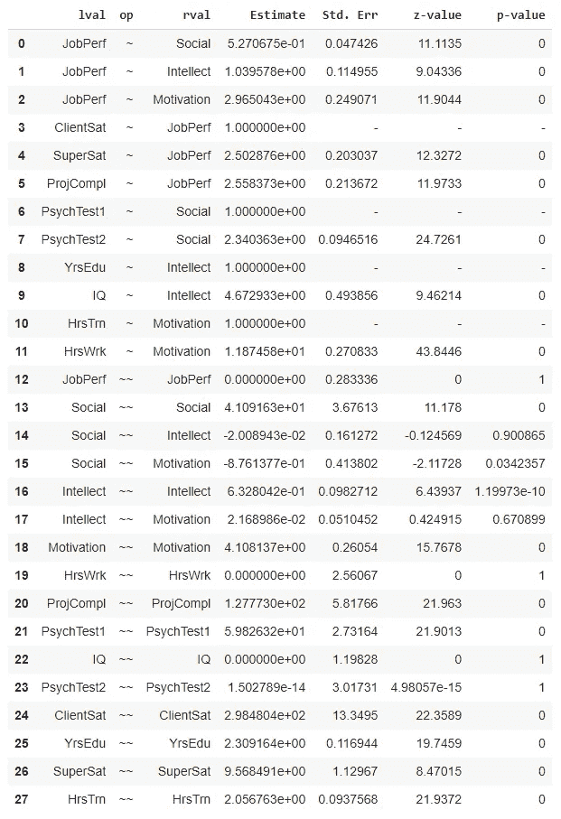

# 结构方程建模

> 原文：<https://towardsdatascience.com/structural-equation-modeling-dca298798f4d?source=collection_archive---------0----------------------->

## 结构方程建模的全面概述，以及使用 R 和 Python 的示例的完整演练

结构方程建模——照片由[朗达克拍摄，佛罗里达州本地民间艺术家](https://unsplash.com/@rhondak?utm_source=unsplash&utm_medium=referral&utm_content=creditCopyText)在 [Unsplash](https://unsplash.com/s/photos/color?utm_source=unsplash&utm_medium=referral&utm_content=creditCopyText)

# 什么是结构方程建模？

结构方程模型是解释测量变量和潜在变量之间的**关系、潜在变量之间的**和**关系的模型。**潜在变量是作为人类，我们理解为一个概念的变量，但是*不能直接测量*。

无法直接测量的潜在变量的一个很好的例子是智力。我们有很多学校考试、智商测试、心理测试来衡量像智力这样的概念，但它们总是归结为:

*   在多个领域的多项选择问卷上测量分数
*   将这些分数转换成对智力的评估

所以你需要一个模型来**将测量变量(考试分数)转化为潜在变量智力。**这就是结构方程建模作为一种最好的工具来评估这些关系的地方！

# 何时使用结构方程建模？

那么，什么时候用结构方程建模呢？让我们讨论一些考虑因素，看看结构方程建模是否适合特定的用例。

*   如果你想使用结构方程建模，在你的用例中有一个**测量和潜在变量**的概念是很关键的。结构方程模型的目标是模拟测量变量和潜在变量之间的关系，或者多个潜在变量之间的关系。如果你想使用结构方程建模，你必须*尝试识别重要但不可测量的潜在概念*。
*   其次，**结构方程建模主要应用于确认和测试方法**。正如您将在本文后面看到的，您通过定义您心中的关系假设来开始建模阶段。例如，如果你做一个智力模型，你需要从识别你认为可能影响智力的不同的测量和潜在变量开始。
*   因此，结构方程建模**不适合作为纯粹的探索工具。**如果你还不知道你的用例之间的关系是如何联系起来的，你最好使用其他的技术来探索潜在的可变问题。[探索性因素分析](/what-is-the-difference-between-pca-and-factor-analysis-5362ef6fa6f9)在这种情况下是一个很好的选择。
*   结构方程模型**非常适合分析。**它们帮助你了解许多影响潜在现象的不同概念。然而，结构方程模型在预测性能方面并不总是有效的。如果你纯粹是为了预测性能而不是**理解和解释**，结构方程建模可能是错误的选择。
*   结构方程模型根据变量之间的假设关系给出了系数的估计值。除了您指定的关系之外，**找不到其他关系。使用结构方程模型的一个很好的方法是提供多个假设模型，对每个模型进行估计，然后分析它们之间的差异，以朝着越来越好的模型努力。**

# 结构方程建模的类型

有不同类型的结构方程模型。在我们进入其中两个的代码实现之前，让我们先讨论一下 SEM 模型的一般情况。

如果我们查看官方定义，我们将不得不承认许多模型是结构方程建模的**类型。**例如，可视为结构方程建模类型的模型包括:

*   验证性因素分析
*   验证性复合分析
*   路径分析
*   偏最小二乘路径建模
*   潜在增长建模

然而，在本文中，为了简单起见，让我们不要进入这些模型的细节，并保持结构方程模型的范围是具有以下特征的模型:

*   **测量变量**
*   **潜在变量**
*   **变量之间的假设关系**

# 结构方程建模示例

我们将使用一个关于*工作表现*的结构方程模型的例子。这个项目最重要的变量是 ***工作绩效*** *。在我们的例子中，工作绩效是一个潜在变量，因为它不可能直接测量。注意:一些工作场所使用非常明确的 KPI 来定义工作表现，它可能不是一个潜在的变量。*

在我们的案例中，考虑一项办公室工作，其中**工作绩效**基于**三个测量变量**进行评估:

*   客户满意度:你的主要客户给你的满意度评分，在 1 到 100 分之间
*   **超级评估员**:你的上司对你工作表现的评估，介于 1 到 100 分之间
*   **ProjCompl** :你的项目成功交付的百分比

让我们从工作绩效受到其他三个潜在变量强烈影响的假设开始:员工的**社交技能、**和**动机。**

这些潜在变量中的每一个也不能直接测量。因此，让我们也为每个独立的潜在变量定义测量变量。

潜在变量**社交技能**将基于以下两个测量变量:

*   **心理测验 1:**1-100 之间的分数
*   **心理测试 2:** 也是一个介于 1-100 之间的分数

潜在变量**智力技能**将基于以下两个测量变量:

*   YrsEdu :接受高等教育的年数
*   智商:智商测试的分数

潜在变量**动机**将基于以下两个测量变量:

*   **HrsTrain** :花费在训练上的小时数
*   工作周的平均小时数

# 结构方程模型图

让我们通过创建结构方程模型图来使这个复杂的例子更容易理解。结构方程模型非常复杂，因为它们包含许多方向的许多系数，图表是理解结构方程模型的最佳方式。

结构方程模型通常遵循一些一般惯例:

*   潜在变量用圆圈表示
*   测量变量用正方形表示
*   关系用箭头表示
*   方差和残差由从变量到自身的箭头表示

以下是工作绩效问题的图表:

结构方程建模图

因为有许多变量和关系，让我们放大不同的方面。通常，结构方程模型图中没有任何颜色，但它肯定有助于更好地理解它:

结构方程建模图

在此图中，您可以看到:

*   工作绩效作为一个**因变量**，右边是三个**测量变量**。
*   三个**独立潜变量** *社会技能*、*智力技能、*和*动机*在 JobPerf 的左边是
*   从三个独立的潜在变量到工作绩效的**箭头**表明*这三个潜在变量预计会影响工作绩效*。
*   左边的六个**测量变量**是*预期每个变量影响一个潜在自变量*。箭头显示哪个潜在变量受到每个测量变量的影响

现在，结构方程建模技术的目标是估算图表中每个箭头的系数。每个箭头是一个系数，标准误差也是要估计的。这些估计将允许你量化测量变量和潜在变量之间的复杂关系。

# 结构方程建模技术

为了拟合一个结构方程模型，你需要估计相当多的系数:图中每个箭头一个系数。有许多软件产品和技术用于估计结构方程模型，包括:

*   利斯雷尔
*   阿摩司
*   MPlus
*   在 Stata 或 SPSS 中实现 SEM
*   r 包`sem`、`lavaan`、`OpenMx`、`LISREL`、`EQS`和`Mplus`
*   Python 包`semopy`

结构方程建模很棘手，因为应该使用哪种算法没有绝对的定义，不同的软件包可以给出不同的结果。报告结构方程模型时，建议始终报告您使用过的软件。

在本文的下一部分，让我们使用 R 和 Python 来估计我们的工作绩效模型的系数。

# R 中的 SEM

我已经将数据上传到了 S3 的一个桶中，以便于你理解。您可以使用 R 中的下面一行来获取数据:

R 中的 SEM 数据导入

数据看起来是一个千行 CSV 文件，文件头如下所示:

R 中的 SEM 数据

下一步是安装包`lavaan`,这是一个很棒的结构方程建模包:它有很好的文档记录，易于使用，并且与其他 R 包的语法一致。您可以使用以下两行代码安装并打开该库:

R 中的 SEM 安装 lavaan 包

下一步是描述我们想要拟合的模型。这必须代表我们之前在图表中绘制的架构。我们可以指定三种不同类型的关系:

*   使用`=~`符号定义潜在变量如下:
    `a_latent_variable =~ measured_var_1 + measured_var_2`
*   使用`~`符号从一个潜在变量回归一个或多个其他潜在变量，如下:
    `latent_variable_1 ~ latent_variable_2 + latent_variable_3`
*   如果您期望某些测量变量具有潜在变量中没有表示的相关性(例如没有必要)，请使用`~~`符号，如下:
    `measured_var_1 ~~ measured_var_2`

使用这个语法，我们可以使用下面的 R 语法来指定我们的图:

R 中的 SEM 定义模型

作为最后一步，您需要拟合模型并显示模型摘要。您可以使用以下代码来实现这一点:

R 中的 SEM 拟合模型

您将获得下面的汇总表，其中我强调了最重要的学习内容:

R 中的 SEM 输出摘要

## 海伍德案件

我们首先看到的是 lavaan 报告了一个**警告**。有些差异是负的。这被称为**海伍德案例**，在结构方程建模中相对常见。结构方程模型从来都不是完美的，所以如果负方差在不太重要的参数中，那么继续下去就没有问题。否则，您可能想玩玩模型定义和数据集:Heywood 案例的一个常见原因是变量相关性太强。

## 总体结构方程模型的卡方检验

第二件要看的是卡方检验的意义。这个测试给你一个 p 值，显示你的模型是否解释了数据变化中足够重要的部分。

如果你对使用 p 值没有信心，看看[这个对假设检验和 p 值的直观解释](/an-intuitive-explanation-of-hypothesis-testing-and-p-values-8391db2c90f)。通常，p 值需要低于 0.05 才具有显著性。这是我们的情况，所以我们可以得出结论，我们的模型总体上做得很好。

## 结构方程模型的回归系数

既然我们知道这个模型运行良好，我们将分析它告诉我们什么。为此，我们主要需要查看**回归**部分。在这里，我们发现了社会、智力和动机这三个潜在变量是如何影响工作绩效的。

首先要看的是 P( > |z|)表示的独立潜变量的 **P 值。每个独立的潜在变量都有自己的一行。如果一个独立潜变量的 P 值低于 0.05，我们可以得出结论，这个特定的潜变量影响了因变量(工作绩效)。在我们的案例中，**三个独立潜在变量中的每一个的 P 值都小于 0.05** ，这意味着**每个独立潜在变量都显示出对工作绩效有影响**。**

既然我们知道了这一点，我们可以更进一步问每个潜在的独立变量对工作绩效的影响有多大。我们通过查看估计列(系数的估计值)来实现这一点。我们看到:

*   **动机的系数最高(2.758)，这意味着动机的变化对工作绩效的影响最大。**
*   **智力具有第二高的系数(0.725)，这意味着智力对工作表现的影响第二高。**
*   **社交技能排在最后，系数为 0.325。社交技能仍然对工作表现有影响，只是不如动机和智力。**

至此，我们得出了我们的结构方程模型的结论。数据验证了我们的理论:好消息！

# Python 中的 SEM

如果您对 Python 更熟悉，您可以使用 Python 包`semopy`来拟合与之前完全相同的模型。您可以使用下面的语法开始。

首先，您可以使用以下代码直接从 S3 时段导入数据:

Python 中的 SEM 导入数据

然后安装并导入`semopy`包，如下所示:

下一步是模型的规范。这与 R 代码的工作方式完全相同。然后实例化并拟合模型，并使用 inspect 方法显示结果表:

Python 中的 SEM 定义和拟合模型

您将获得一个包含系数估计值和 p 值的数据框。与 R 代码的区别在于 Python 输出的组织性稍差，因此您需要查看变量的名称(lval 和 rval 列)来找到您的系数:

Python 中的 SEM 输出摘要

回归系数可以在第 0 行到第 2 行找到。您可以在`p-value`列中看到，这三个变量的 p 值都小于 0.05，因此它们都是显著的。这证实了 R 结果。

在`Estimate`栏中，您可以获得系数估计值:

*   `semopy`发现*动机*的系数为 2.96，与`lavaan`的估计接近。
*   对*智力*的估计排在第二位，就像在 R 代码中一样，尽管它的估计要高得多(`semopy`中的 1.04 对`lavaan`中的 0.725)。
*   和 R 一样，*社交技能*是影响最小的潜在变量。`semopy`的估计值是 0.527，而`lavaan`的估计值是 0.325。

尽管估计值略有不同，但 R 和 Python 实现在变量方面给出了相同的结论。这不是问题，许多高级建模技术都会出现这种情况:只需报告您使用的软件。

# 关键要点

总之，您已经首先了解了什么是结构方程建模以及何时可以使用它。您还看到了不同类型和技术的存在。

然后，您将结构方程模型应用于工作绩效数据集。基于九个测量变量，你假设工作表现可以用潜在变量社会技能、智力技能和动机来解释。

统计指标表明假设模型非常合适，你最后得出结论，动机对工作表现最重要，其次是智力技能和社交技能。

我希望这篇文章对你有用。不要犹豫，继续关注更多的数学、统计和数据内容！