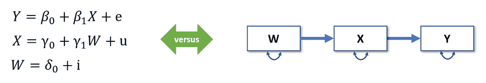
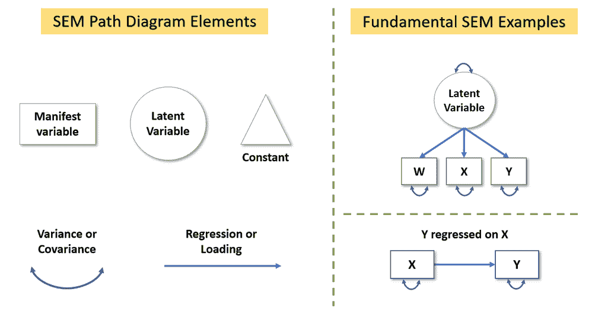
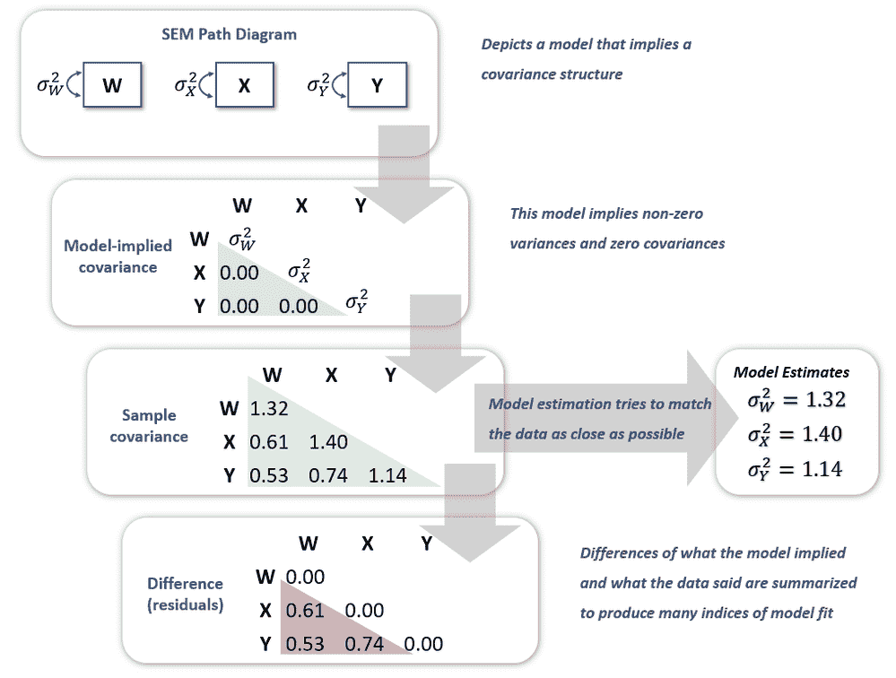

# 结构方程模型

> 原文：<https://towardsdatascience.com/structural-equations-models-3d8578952f87?source=collection_archive---------21----------------------->

## 在使用它们的人中最受欢迎…想知道为什么吗？

如果你从事行为科学或社会科学，你可能知道或听说过结构方程模型(SEM)。人们在这些领域的经验越丰富，就越有可能将 SEM 列为他们的首选工具。这是为什么呢？

如果您正在寻找 SEM 的简要介绍，以帮助您理解为什么这个工具在使用它的人当中受到高度重视，那么这篇文章就是为您准备的。如果你是一名 SEM 专家，那么这篇文章可能是一个很好的资源，向你的同行解释你是做什么的(以及为什么你如此热爱它！).以下是扫描电镜的基本知识。

# 统计模型=路径图

SEM 的一个中心特点是 ***所有的模型都可以用一个路径图*** 来表示。对比图 1 中的等式和图表。如果你必须向一个 6 岁的孩子解释你的统计模型，你更喜欢哪个版本？

*图一。W、X 和 Y 变量之间关联的方程与路径图表示。图片作者。*

SEM 用户欣赏路径图的直观性质，这使他们能够有效地向广泛的受众传达他们的模型。因此，我们必须从描述如何正确创建路径图开始。绘制路径图所需的构建模块在图 2 的左侧，SEM 的两个标准路径图在图 2 的右侧。

*图二。用于绘制 SEM 路径图的构建模块(左)和两个简单 SEM 模型的示例(右)。图片作者。*

以下是创建和解释路径图的主要指南:

*   你直接测量的变量，在 SEM 行话中称为“显式”变量，用正方形画出。
*   未观察到的变量或“潜在”变量是[因素分析意义上的因素](https://community.jmp.com/t5/JMP-Blog/Principal-components-or-factor-analysis/ba-p/38347?utm_campaign=cm&utm_source=mediumblog&utm_medium=social)。也就是说，它们代表其显式变量(即指标)的*共同*方差，它们*导致*我们在它们的指标中观察到的变化。潜在变量用圆圈表示。
*   三角形用于表示常数，它是 SEM 的一部分，可以估计平均值和截距(将变量回归到常数上，就可以得到它的平均值)。当模型不对变量均值进行限制时，三角形通常会被忽略。
*   单向箭头代表回归效应或负荷(负荷是显式变量对潜在变量的回归)。
*   双头箭头在相同变量上开始和结束时表示方差，在不同变量上开始和结束时表示协方差。

使用这些指南，您可以绘制指定高度复杂模型的路径图(描绘图 1 中的模型，其中 W、X 和 Y 都是潜在变量，并且包括附加的预测器和结果)！潜在变量之间的建模能力是 SEM 经常被认为是因子分析和回归的结合的原因。

图 2 右侧描述的第一个模型是**单因素验证性因素分析**。这里，潜在变量有指向 W、X 和 Y 的箭头，因为这些变量中观察到的变化是由潜在变量引起的。请注意，潜在变量和观察变量有一个方差。然而，要估计这样的模型，必须为潜在变量设置一个尺度。这通常是通过将负荷或潜在变量的方差固定为 1 来实现的。图 2 右侧描述的第二个模型是一个**简单回归**。注意，X 有一个方差，因此假设它是正态分布的。这种假设在标准最小二乘回归中是不存在的。然而，如果我们有缺失的数据，做出这样的假设使我们能够在分析中保留所有可用的数据——这是 SEM 的一个巨大优势！

# 路径图=数据结构

SEM 的另一个主要特征是 ***路径图暗示了变量如何协变的特定结构*** 。例如，图 3 顶部方框中的路径图没有连接任何 W、X 和 Y 变量。因此，这意味着这些变量完全不相关。然而，双向箭头表示变量具有非零方差。图 3 中的下一个方框显示了路径图对数据协方差结构的影响。事实上，模型隐含的协方差矩阵显示了方差的三个参数和其他地方的零。

*图三。结构方程模型的估计:从路径图到模型拟合评估。图片作者。*

自然，我们收集的数据都有自己的协方差矩阵。因为我们假设我们的数据是多元正态的，这个矩阵(有时是变量的均值，但我将在另一篇文章中讨论)足以满足我们的需求。事实上，样本协方差矩阵是我们对总体协方差矩阵的最佳估计。因此，SEM 中的 ***估计算法试图尽可能地匹配样本协方差矩阵中的值，同时保留模型*** 所隐含的约束。在图 3 中，模型暗示 W、X 和 Y 的方差有三个非零值，因此，模型的估计值就是样本协方差矩阵中对角线的值。

最后，我们可以通过比较样本协方差矩阵和估计的模型协方差矩阵来衡量模型的拟合度。这些矩阵之间的差异(图 3 中的最后一个框)为我们提供了模型的残差，可以将其归一化并总结为拟合指数，以量化模型的拟合度。请注意，这些残差是 SEM 特有的，因为它们是样本和估计的*协方差*之间的差异，而不是响应和预测值之间的差异，如在标准回归模型中。

图 3 用一个非常简单的例子抓住了 SEM 的本质。结构路径图对数据的影响可能要复杂得多，但是如果图 3 有意义，那么你就已经开始理解 SEM 了！

# 使用 SEM 的主要原因

如果您有以下任何需求，SEM 特别有用:

*   无法直接测量的模型变量(也称为潜在变量)
*   具有测量误差的模型变量(并解释其原因)
*   指定一个模型，其中的变量既是预测者又是结果
*   测试关于变量关联的特定理论
*   使用尖端方法处理缺失数据，避免多重插补的麻烦
*   [图表](https://community.jmp.com/t5/JMPer-Cable/Can-your-SEM-path-diagrams-do-this/ba-p/357489?utm_campaign=cm&utm_source=mediumblog&utm_medium=social)直观地描述你的模型

如果你与这些需求中的任何一个都不相关，那么 SEM 可能不适合你的分析。事实上，就像[有很多很好的理由使用 SEM](https://community.jmp.com/t5/JMPer-Cable/Sharing-is-caring-A-few-reasons-to-fit-structural-equation/ba-p/357484?utm_campaign=cm&utm_source=mediumblog&utm_medium=social) 一样，也有其他的理由阻止你使用这个框架。

# 不使用 SEM 的主要原因

当分析师 ***没有*** ***有一套理论*** 或一套竞争理论，旨在解释数据中的模式时，不应使用 SEM。对 SEM 的自动模型搜索的研究正在进行中，但是标准软件并不实现从该工作中产生的专门算法。因此，为了避免第一类错误(参见 [MacCallum，Roznowski，& Necowitz，1992](https://www3.nd.edu/~kyuan/courses/sem/readpapers/MacCallum.pdf) )，分析师应该根据理论和以前的研究提前仔细设计他们的模型。这对于避免[确认偏差](https://en.wikipedia.org/wiki/Confirmation_bias)尤为重要。

如果你能轻松地将回归模型拟合到小样本*(比如说，N = 30)，那么你同样可以轻松地在 SEM 中拟合等价的回归模型。然而，对于更复杂的模型，分析师必须考虑他们的样本量是否足够。变量的数量、它们的分布、缺失值和效应大小在确定适当的样本量时起着作用(提示:没有简单的经验法则！).一些研究指出每个参数估计值有 5-10 个观察值(Bentler & Chou，1987)，但是当效应大小较低或变量有偏差时，即使这样也可能是错误的。*

# *SEM 中的各种模型*

*SEM 可用于一系列目的:从拟合简单的线性回归，到用预测和作为该过程结果的因素来建模随时间变化的非线性过程。其他应用可能包括:*

*   *通过 ***验证性因素分析*** 开发用于测量一个或多个潜在变量的测试或调查*
*   *一组变量通过 ***路径分析*** 导向其他变量的测试机制*
*   *通过 ***中介分析*** 调查一个或多个变量对其他变量的间接影响*
*   *通过 ***潜在增长曲线分析*** 表征过程的个体和平均轨迹*
*   *通过 ***动态因子分析*** 研究时间序列过程内部和之间的动态*

# *推荐*

*尽管路径图简单直观，但 SEM 可能是一项非常复杂的技术。因此，如果您想了解关于这个建模框架的更多信息，这里有一些参考资料可供您参考:*

***一本应用焦点的优秀书籍:***

*Kline，R. B. (2016 年)。 [*结构方程建模原理与实践*](http://www.guilford.com/books/Principles-and-Practice-of-Structural-Equation-Modeling/Rex-Kline/9781462523344) (第 4 版。).纽约:吉尔福德出版社。*

***有技术细节和应用的优秀书籍:***

*[博伦，K. A.](https://en.wikipedia.org/wiki/Kenneth_A._Bollen) (1989)。 [*带潜变量的结构方程*](https://en.wikipedia.org/wiki/Structural_Equations_with_Latent_Variables) 。威利。*

***如果你没有时间看一整本书，试着用 SEM 的概述来搜索这篇文章:***

*乌尔曼，J. B .，&本特勒，P. M. (2013 年)。结构方程建模。在 J. A. Schinka，W. F. Velicer 和 I. B. Weiner(编辑。)，*《心理学手册:心理学中的研究方法》*(第 661–690 页)。美国新泽西州霍博肯:约翰·威利父子公司。*

***准备好安装自己的 SEM 了吗？**查看[这篇文章](https://community.jmp.com/t5/JMPer-Cable/Structural-Equation-Modeling-The-arrival-of-a-powerful-new/ba-p/230440?utm_campaign=cm&utm_source=mediumblog&utm_medium=social)了解为什么 [JMP Pro](https://www.jmp.com/en_us/software/predictive-analytics-software.html?utm_campaign=pro&utm_source=mediumblog&utm_medium=social) 中的 SEM 平台会让你的生活变得轻松！*

**本文原载于 2019 年 10 月 23 日* [*JMP 用户社区*](https://community.jmp.com/t5/JMP-Blog/Structural-equations-models-A-favorite-amongst-those-who-use/ba-p/230334?utm_campaign=cm&utm_source=mediumblog&utm_medium=social) *。**