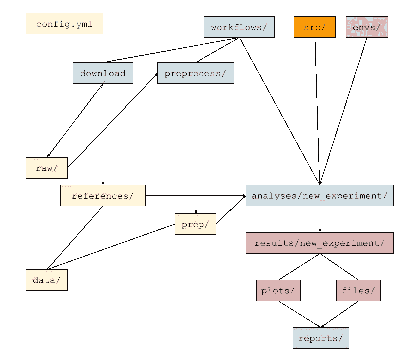

# “构建您的数据科学项目！”

> 原文：<https://towardsdatascience.com/structure-up-your-data-science-project-4ee934d9ce11?source=collection_archive---------26----------------------->

## 一个可扩展和可复制的模板来构建您的项目


Jo Szczepanska 在 [Unsplash](https://unsplash.com?utm_source=medium&utm_medium=referral) 上拍摄的照片

# 我为什么要考虑我的项目结构呢？

我花了很多时间试图学习和实现“最佳编码实践”，但我从未真正关注过“最佳项目结构实践”。

在进行课程或者小任务的时候，我从来不会去思考我应该如何架构项目；我会尝试将输入、输出、脚本和日志文件混合在一起，马上解决这个问题。

然而，随着项目开始增长，新的问题从这些即兴分析中产生，我发现自己经常不得不重写大量代码来理解数据，并且不确定如果有人要求我重新运行分析，我是否能够这样做并得到相同的结果。事实上，在我的第一次实习期间，我觉得把一个按照我的“最佳混乱实践”构建的项目交给一位同事很尴尬。我意识到我需要改变这种方式。

理想情况下，我希望找到最简单的项目结构——及其相应的工作流程——以促进可重复性和可伸缩性。当我开始谷歌搜索时，我注意到关于构建数据科学项目艺术的资源比预期的要少。特别是应用于生物信息学或计算生物学，我的主要兴趣领域。

剧透:我还没有找到理想的项目结构，但是在网上搜集了更多信息并自己实现了一些方法后，我创建了一个项目模板作为 [GitHub 库](https://github.com/MiqG/project_template)，到目前为止它为我做了这项工作，我希望它也能为你工作。到目前为止，至少从一开始就有一个清晰的项目结构在避免空白页综合症和保持事物有序方面帮助了我很多。

# 原则:命名和模块化

为了创建这个项目模板，我试图遵循最佳编码实践的文献中经常提到的两个原则:清晰的名称和模块化。

例如，在命名目录、子目录和文件时，应该尽量使用既有意义又能在阅读文件的完整路径时相互补充的词。

另一方面，人们应该尝试构建项目，迫使它模块化地增长。可能受我过去在湿实验室的影响，我喜欢将项目的数据分析部分视为一系列试图回答假设的实验。我试图让每个实验回答一个特定的子问题，这样如果我们不需要一个实验，我们可以删除包含它的目录，这个操作不会影响其余的实验。在一个实验的结果是另一个实验的输入的情况下，子实验最好作为父实验的一部分引入，以避免这种依赖性。

# 再现性的基本工具

正如我提到的，我希望我的项目简单且可重复。幸运的是，这些属性符合社区中许多人的兴趣，他们在这方面开发了大量不同的工具。其中，我发现工作流和环境管理器非常有用，让我们能够在相同的环境中自动重新运行所有的分析。我最喜欢的是基于 python 的工作流和环境管理器: [snakemake](https://snakemake.readthedocs.io/en/stable/tutorial/short.html) 和 [conda](https://docs.conda.io/projects/conda/en/latest/user-guide/concepts/environments.html) 。

# 基本工作流程

这是使用此项目结构模板的基本工作流示例:



基本项目工作流程。图片由[作者](https://medium.com/@miquelangladagirotto)提供。

1.  根据您的喜好修改`config.yml`,添加对项目有用的变量。
2.  创建工作流，分别在`workflows/download/`和`workflows/preprocess`下载和预处理项目数据。确保区分专门用于项目那一部分的代码——放在你工作流程的`scripts/`子目录中——或者可以在整个项目中使用的代码——放在项目的`src/`模块中，并调用你工作流程中的函数。
3.  现在，您可以分析您的数据，创建不同的实验作为`workflows/analyses`的子目录，这些子目录将从`data/`获得输入，并在`results/your_experiment_name/`输出。
4.  提交您的工作，并考虑添加自述文件。
5.  检查和探索在`reports/notebooks/`创建 jupyter 笔记本的结果，这些结果可以通过`[jupyter-book](https://jupyterbook.org/intro.html)`呈现到静态网页中。通过修改`reports/_toc.yml`来构建你的项目手册。

# 详细的结构

## ``data/``

```
data
├── prep
├── raw
└── references
```

在这里，我们将放置项目所需的所有数据，以便从任何地方都能轻松访问。子目录名称不言自明:

*   在`raw/`,我们存储实验产生或下载的数据；
*   在`prep/`中，我们存储我们以某种方式处理过的原始数据，即预处理、清理或估算的数据；和
*   在`references`中，我们存储有用的“基本事实文件”或查找表，比如，在我的例子中，基因组注释。

## ``envs/``

```
envs
└── main.yml
```

与 conda 等环境管理人员合作，可以无缝地促进大多数项目的可重复性。在这个目录中，我们放置了“main.yml”项目环境文件，其中包含了在整个项目中使用的包。我们可以添加某些工具可能需要的附加环境；当我们运行工作流程时，可以通过 snakemake 轻松激活它。

## ``reports/``

```
reports/
├── _config.yml
├── images
│   └── logo.png
├── notebooks
│   ├── example_notebook.md
│   ├── intro.md
│   └── README.md
├── README.md
└── _toc.yml
```

数据科学最重要和最有趣的部分之一是沟通。由于这个原因，我认为每个项目产生一系列报告是很重要的，通过这些报告，人们试图用我们的分析结果来回答问题。在这种情况下，我认为 [jupyter-book](https://jupyterbook.org/intro.html) 是一个好朋友，因为它允许我们创建一个简单的静态网页，将我们所有的笔记本结合起来，并可以作为 GitHub 页面发布，就像[这个](https://miqg.github.io/project_template/intro.html)。

## ``workflows/``

```
workflows/
├── analyses
│   └── new_experiment
│       ├── README.md
│       ├── run_all.sh
│       ├── scripts
│       │   └── workflow_step.py
│       └── snakefile
├── download
│   ├── README.md
│   ├── run_all.sh
│   ├── scripts
│   │   └── workflow_step.py
│   └── snakefile
├── preprocess
│   ├── README.md
│   ├── run_all.sh
│   ├── scripts
│   │   └── workflow_step.py
│   └── snakefile
└── README.md
```

这是我们在项目中花费大部分时间的目录。在这里，我们将创建我们的“实验”,尝试回答一个特定的问题。

`workflows/analyses/`中的每个实验都使用`data/`中的文件作为输入，并将输出保存到`results/`中。例外的是，在项目开始时，`workflows/download`和`workflows/preprocess`中的工作流将输出到前者的`data/raw`和`data/references`，并输出到后者的`data/prep`。

然后，可以通过`bash run_all.sh`来执行实验，这是一个简单的脚本，它会告诉您最喜欢的工作流管理器使用一些通用参数来运行实验。我们的工作流管理器脚本——这里是“snake file”——包含了执行我们分析的每一步的规则。最后，`workflows/analyses/new_experiment/scripts/`子目录包含那些执行“new_experiment”的特定步骤的脚本。

## ``results/``

```
results
├── new_experiment
│   ├── files
│   │   └── output_example.tsv
│   └── plots
│       └── output_example.pdf
└── README.md
```

这里我们将放置我们实验的所有输出。`results`中的子目录应该与实验同名，并且通常可能包含可以从我们的报告中轻松读取的文件和图表。

## ``src/``

```
src
└── python
    ├── setup.py
    └── your_project_name
        └── config.py
```

为了最大限度地减少跨不同实验复制粘贴函数或脚本所带来的错误，在这个目录中，我们将创建项目范围的模块，可以从项目中的任何地方调用这些模块。在这种情况下，我认为“config.py”是必不可少的模块之一，它将读取我们的顶级“config.yml”以从项目中的任何地方访问变量。

# 到目前为止，结论是

以我的经验来看，使用这种项目结构尤其有助于我一次专注于一件事。虽然构建项目的每一步都需要更多的时间，但我觉得这些步骤是可靠的，从长远来看，可以让我从所有的重构、错误修复和错误纠正中节省时间，而这些都是我以前“混乱”的方法所必须做的。

如果你正在读这篇文章，你可能对这个话题感兴趣，并且正在努力寻找最适合你需求的项目结构。所以，请随时联系我们，更好的是，提交一份 PR 并改进 [project_template](https://github.com/MiqG/project_template) ！

# 参考

*   弗吉尼亚州布法罗(2015 年)。生物信息学数据技能:用开源工具进行可重复的和健壮的研究。奥莱利媒体公司。[链接](https://www.oreilly.com/library/view/bioinformatics-data-skills/9781449367480/)
*   Noble WS (2009)组织计算生物学项目的快速指南。公共科学图书馆计算机生物学 5(7): e1000424。[https://doi.org/10.1371/journal.pcbi.1000424](https://doi.org/10.1371/journal.pcbi.1000424)
*   [Eric Ma —原则性数据科学工作流程](https://www.youtube.com/watch?v=Dx2vG6qmtPs&ab_channel=PyData)
*   [Pat Schloss-riff omonas 项目](https://www.youtube.com/channel/UCGuktEl5InrcxPfCjmPWxsA)