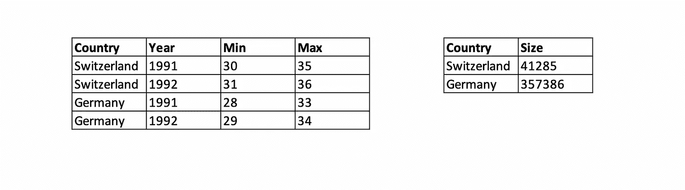
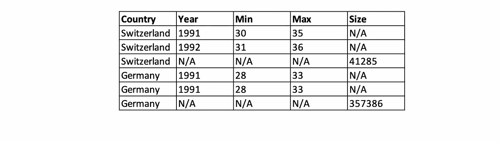
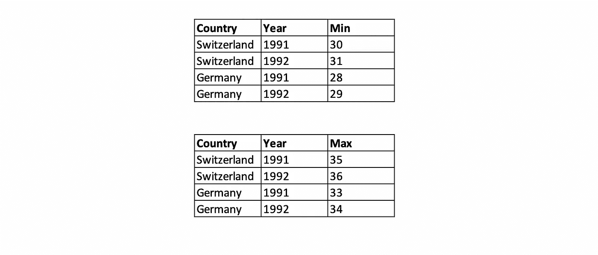

# 像诺贝尔奖获得者一样组织你的数据

> 原文：<https://towardsdatascience.com/structure-your-data-like-a-nobel-prize-winner-c0127fd82abe?source=collection_archive---------27----------------------->

## 为了便于操作、可视化和建模

在 [Unsplash](https://unsplash.com?utm_source=medium&utm_medium=referral) 上由 [Samet Kurtkus](https://unsplash.com/@sametkurtkus?utm_source=medium&utm_medium=referral) 拍摄的照片

你认为有“最好的方式”来组织你的数据吗？

我特别想在评论中听听你的看法。因为就我而言，我最初认为必须有许多方法来构造数据集，我们存储和操作数据的方式是特定于我们正在进行的项目的。

但事实上，有一种方法——一种框架——我们几乎可以系统地使用它来尽可能简单高效地清理数据。

我第一次听说这种方法是在麻省理工学院在线课程“[社会科学家数据分析](https://www.edx.org/course/data-analysis-for-social-scientists)”中埃丝特·杜弗洛(2019 年诺贝尔经济学奖)的一次演讲中，她在演讲中推广了“整齐的数据”和一个名为“Tidyverse”的框架。

这种结构非常有利于数据操作、可视化和建模。我们可能应该将它添加到我们下一个项目的最佳实践列表中。你不觉得吗？

在这篇博客文章中，我想给你一个概述:

*   整洁数据的概念，
*   数据集有多乱，以及
*   我们可以使用 python 函数将杂乱的数据转换成整齐的数据。

让我们开始吃吧。

# 那么，什么是整齐的数据呢？

整齐数据的概念是由 Wickham Hadley 在他的论文“整齐数据”中首次提出的，他的框架在“欢迎来到 Tidyverse”中提出。

我们来看一下定义。

为了被认为是“整洁的”,数据应该按照以下三个规则排列在表格中:

1.  每个变量在其自己的列中
2.  每个观察值在它自己的行中
3.  各自单元格中的每个值

仅此而已。只有三条规则。但这实际上很好，因为一小组规则导致一小组工具，我们需要这些工具来重新排列和清理杂乱的数据集。

为了便于说明，我将定义两个简单的整齐数据集。第一个连续两年观察最小和最大值的观测单位(在下图的左边)。第二个观察单位观察不同国家的大小(下图右侧)。

这两个表很整洁:每个变量都有自己的列，每个观察值都有自己的行，每个值都有自己的单元格。

整洁观测单位的两个例子

这种结构非常简单，但是在下一部分中，您将会看到，在查看杂乱无章的数据时，这样的安排并不总是显而易见的。

# 能有多乱？

杂乱的数据集可以有几种形式，但谢天谢地，Wickham Hadley 为我们过滤了噪音，并将“杂乱的数据”分为 5 个常见的类别。

*   **当列标题有值而不是变量时。**
    例如，如果我们在列标题中设置年份(1992，1993)，就会出现这种情况。

列标题是值而不是变量

*   **当一列包含多个变量时。**
    在我们的例子中，如果我们将最小值和最大值追加到一列中，就会出现这种情况。

一列包含多个变量

*   **当变量同时存储在列和行中时。这个例子更难发现。如果您发现一个存储变量名(在我们的例子中是 Min，Max)而不是值的列，通常会发生这种情况。**

变量同时存储在列和行中

*   **当多种类型的观测单位存储在同一个表中时。**
    大量未定义的单元格就是这种情况的最好证明。在上一部分中，我们定义了两个表(观察单位),用于报告不同的研究。如果我们将它们合并在一起，我们最终会得到许多未定义的“N/A”值。

多种类型的观测单位存储在同一个表中

*   **当单个观测单位存储在多个表中时。**
    在我们之前的示例中，在同一个研究中测量了“最小”和“最大”变量，我们同意使用单个表格更方便。

一个观测单位存储在多个表中

既然我们已经看到了数据集有多乱，那么是时候看看我们可以用来整理它们的 Python 函数了！

# **将杂乱的数据转换成整齐的数据**

让我们来看看常见的 Python 函数，我们可以使用这些函数来整理前一部分中描述的五种类型的杂乱数据集。

好消息是整齐的数据是一种非常直观的处理熊猫数据框架的方式。例如，Rodrigo Marino 分析了上述所有场景，并在本文中演示了如何整理每一个场景[。根据他的研究，我得出了以下我认为最相关的函数:](/whats-tidy-data-how-to-organize-messy-datasets-in-python-with-melt-and-pivotable-functions-5d52daa996c9)

*   [**透视表 _ 表格**](https://pandas.pydata.org/pandas-docs/stable/reference/api/pandas.pivot_table.html#pandas.pivot_table) **:** 创建电子表格样式的透视表
*   [**融化**](https://pandas.pydata.org/pandas-docs/stable/reference/api/pandas.melt.html) **:** “逆透视”一个数据帧从宽到长的格式
*   [**赋值**](https://pandas.pydata.org/pandas-docs/stable/reference/api/pandas.DataFrame.assign.html) **:** 计算并追加一个或多个新列
*   [**因式分解**](https://pandas.pydata.org/pandas-docs/stable/reference/api/pandas.factorize.html) **:** 将列表编码为分类变量
*   [**串联**](https://pandas.pydata.org/docs/reference/api/pandas.concat.html) **:** 将两个熊猫对象串联在一起
*   [**sort_values**](https://pandas.pydata.org/pandas-docs/stable/reference/api/pandas.DataFrame.sort_values.html?highlight=sort_values) :按列或行的值排序

为了理解每个函数的机制，我想与您分享我的 Jupyter 笔记本的代码，这些代码通过简单的示例来实践它们:

将杂乱的数据转换成整齐的基本 Python 函数

# 最后的话

我们一起看到了整洁数据的概念，它会变得多乱，以及我们可以使用什么工具来整理它们。

这种简单框架的第一个主要优点是，我们可以用少量的函数整理混乱的数据集。在我看来，第二个主要优点是，一个整洁的数据框架在 Python 中与流行的 Pandas 库完美且非常直观地配合工作。

数据争论是一个很大的领域,“整齐的数据”只涵盖了它的一部分，但它肯定会给你一个良好的开端！

# 参考

[1]韦翰，哈德利。“整齐的数据。”*统计软件杂志*59.1(2014):1–23。

[2]韦翰、哈德利等人，“欢迎来到蒂德弗斯。”*开源软件杂志* 4.43 (2019): 1686。