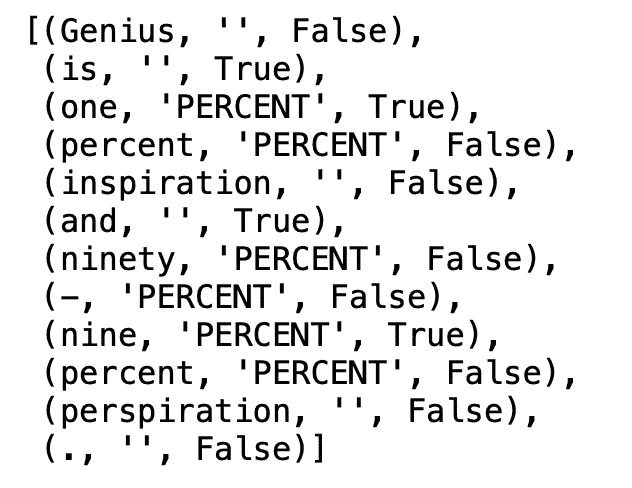
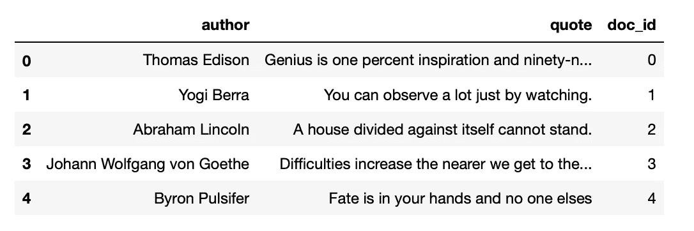
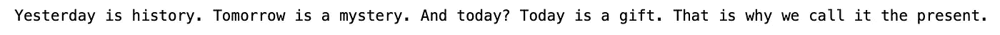
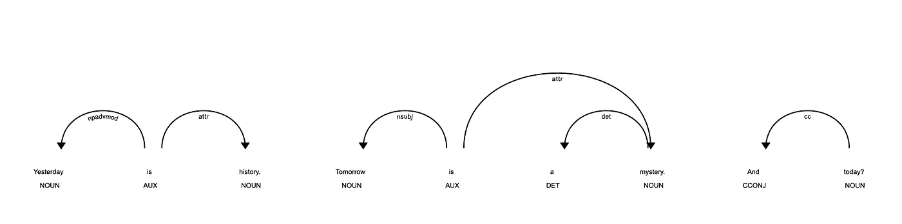
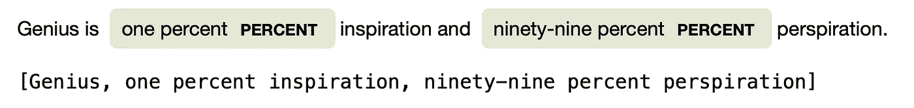
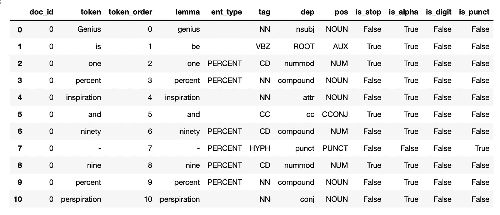
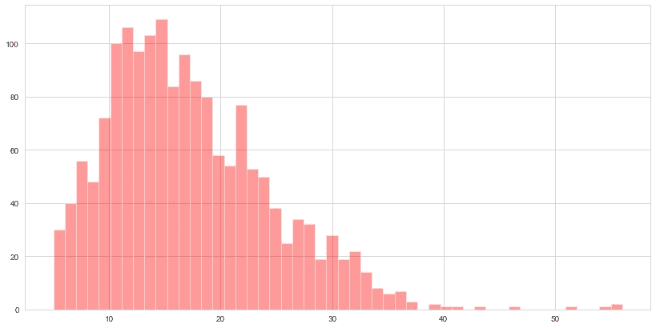
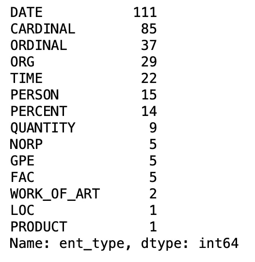
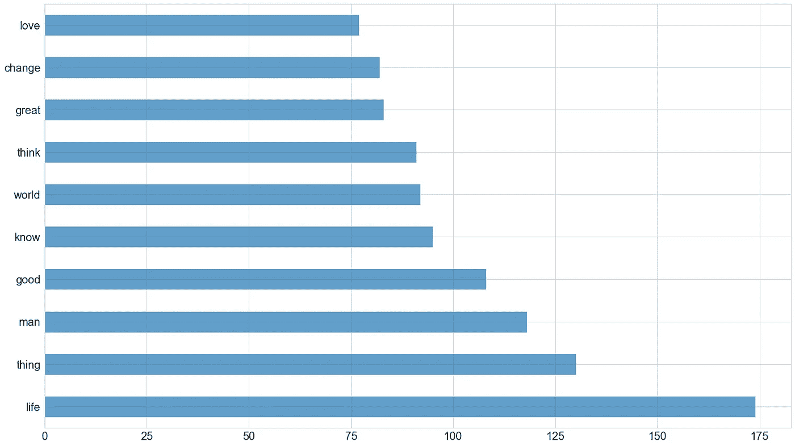
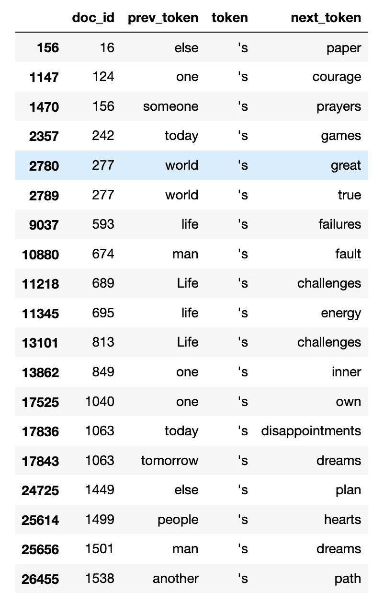

# 熊猫与空间的结构化自然语言处理

> 原文：<https://towardsdatascience.com/structured-natural-language-processing-with-pandas-and-spacy-7089e66d2b10?source=collection_archive---------6----------------------->

## 通过将非结构化数据结构化来加速分析



由于自然语言数据缺乏结构性，处理自然语言数据通常具有挑战性。大多数数据科学家、分析师和产品经理都熟悉由**行和**列组成的**结构化** **表格**，但不太熟悉由**句子和**单词组成的**非结构化** **文档**。出于这个原因，知道如何处理自然语言数据集可能是相当具有挑战性的。在这篇文章中，我想展示如何使用令人敬畏的 Python 包`**spaCy**`和`**Pandas**`，来构建自然语言并快速提取有趣的见解。

## 空间介绍

spaCy 是一个非常流行的用于高级自然语言处理的 Python 包——我这里有一个关于 spaCy 的[初学者友好介绍。spaCy 是应用数据科学家在从事 NLP 项目时的完美工具包。**API 非常直观，软件包运行速度极快，并且有很好的文档记录**。可以说它是目前最好的 NLP 通用软件包。在开始构建 NLP 数据之前，熟悉 spaCy 库和 api 的基础知识是很有用的。](/a-short-introduction-to-nlp-in-python-with-spacy-d0aa819af3ad)

安装软件包后，您可以加载模型(在这种情况下，我加载的是简单的 Engilsh 模型，它针对效率而非准确性进行了优化)，即底层神经网络的参数较少。

```
import spacy
nlp = spacy.load("en_core_web_sm")
```

按照惯例，我们将这个模型实例化为`**nlp**`。在整篇文章中，我将使用这个著名的激励语录数据集。让我们将`**nlp**`模型应用于数据中的单个报价，并将其存储在一个变量中。



数据集标题-按作者分类的图像。

```
doc = nlp(df.quote[819]) 
print(doc)
```



图片作者。

如果我们打印这个文档，你可以看到它只是返回了原来的引用，**但是在这个引擎盖下，发生了很多 NLP 的魔法——我们创建了一个 spaCy `**doc**`对象。那么我们能用它做什么呢？**

首先，我们可以做两个非常酷和有趣的可视化。下面的可视化显示了文档的**依赖结构**。



这些依存关系通过显示文档中每个单词如何与其他单词相关来描述句子的**语言结构。值得停下来惊叹一下。在引擎盖下，spaCy 已经将一个大型神经语言模型应用于文档，解析了依赖结构，并使我们能够轻松地查看它— **所有这一切都只需要一行代码。**如果你想更好地理解如何解释这个依赖结构，你可以使用`**spacy.explain**`函数来获得每个依赖类型的定义。**

下一个可视化显示了已经被语言模型识别的实体。在这种情况下，语言模型已经识别出几个属于**日期**类型的单词。


图片作者。

我们可以通过编程来访问文档的这些属性，如下所示。

```
[(i, i.label_) for i in doc.ents]
```

`**doc.ents**`方法允许访问 spaCy 语言模型预测的实体。和依赖标签一样，你可以使用`**spacy.explain**`来理解每个实体标签的意思。

`**doc**`对象的其他有用属性是`**sents**`和`**noun_chunks**`方法，它们使您能够将文档分割成句子或名词块(即名词加上它们的描述符)。

```
doc = nlp(df.quote[0])
spacy.displacy.render(doc, style="ent")
doc_nouns = list(doc.noun_chunks)
print(doc_nouns)
```



图片作者。

如果我们从文档中访问一个单词，我们实际上是在访问一个空间 `**token**` **对象**。像`**doc**`对象一样，`**token**`对象包含许多有用的属性。例如，我们可以遍历文档来提取每个令牌及其各种属性。

```
[(i, i.ent_type_, i.is_stop) for i in doc]
```


图片作者。

既然我们已经介绍了 spaCy 和 api 的一些基础知识，让我们对数据采取一种更结构化的方法。

## 结构化自然语言数据


由[哈维·卡夫雷拉](https://unsplash.com/@xavi_cabrera?utm_source=medium&utm_medium=referral)在 [Unsplash](https://unsplash.com?utm_source=medium&utm_medium=referral) 上拍摄的照片

这里的目标是将非结构化文档转换成结构化的数据表。本质上，我们希望从文档、令牌及其元数据的非结构化语料库转移到行和列的结构化数据集。

*   **步骤 1:** 我们首先需要将`**spaCy**`语言模型应用于整个报价集合。最简单和计算效率最高的方法是使用`**nlp.pipe**`函数。这将迭代每个文档并应用语言模型。

```
docs = list(nlp.pipe(df.quote))
```

*   **第二步:**定义一个函数，提取你想要包含在表格中的每个单词的所有属性。该函数将在单个`**doc**`中迭代令牌，并将提取各种属性，如词条、位置、实体和标签。使用该函数定义您想要从`token`对象中提取的所有属性。在这种情况下，我提取我经常使用的公共属性，这将有助于分析数据。

*   **步骤 3:** 定义一个函数，将上面的函数应用于所有文档，并将输出存储在一个 Pandas `**dataframe**`中。

如果我们运行这些步骤，我们最终会得到如下所示的数据集:



图片作者。

每行代表一个令牌，各列捕获该令牌上的各种元数据。重要的是，我们还可以使用`doc_id`列将每个单词链接回它的文档。

## 分析结构化自然语言数据

现在我们有了这种格式的数据，我们可以像分析任何其他结构化数据集一样分析它。例如，我们可以计算每篇文档的字数，并用直方图显示出来。

```
tidy_docs.groupby("doc_id").size().hist(figsize=(14, 7), color="red", alpha=.4, bins=50);
```



图片作者。

或者，我们可能有兴趣了解在语料库中识别的最常见的实体:

```
tidy_docs.query("ent_type != ''").ent_type.value_counts()
```



图片作者。

在过滤掉停用词和切分后，我们可以对单词做同样的事情:

```
tidy_docs.query("is_stop == False & is_punct == False").lemma.value_counts().head(10).plot(kind="barh", figsize=(24, 14), alpha=.7)
plt.yticks(fontsize=20)
plt.xticks(fontsize=20);
```



图片作者。

我们可以对结构化数据进行的另一个有趣的分析是查看所有格，以了解 corpu 中的所有权。下面的代码按每个文档分组，然后提取前面和后面的标记，然后过滤带有`**POS**`标记的标记，该标记指示所有格关系，即 ***前一个标记的对象拥有后一个标记的主题。***



图片作者。

这使我们能够理解语料库中的所有格关系。例如，你可以看到这样的短语:*【一个人的勇气】**【某人的祈祷】**【今日运动会】*。深！

正如您所看到的，由于数据是结构化的，处理数据变得非常简单。

## 把一切都包起来

这篇文章展示了如何将非结构化的文本数据转化为易于分析的结构化数据集。我经常发现这是对 NLP 项目的数据有感觉时有用的第一步，并且经常可以揭示有趣和有用的见解。

感谢阅读！

附:这篇文章的所有代码可以在这里找到。