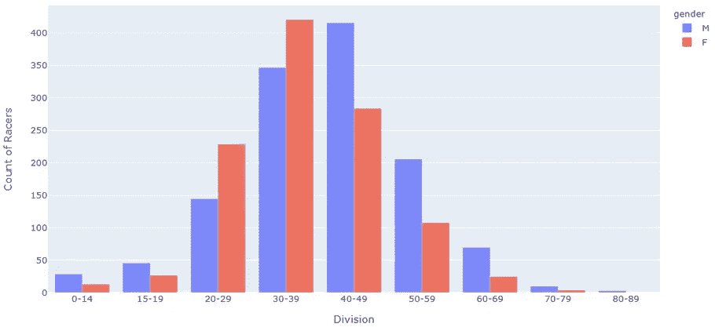
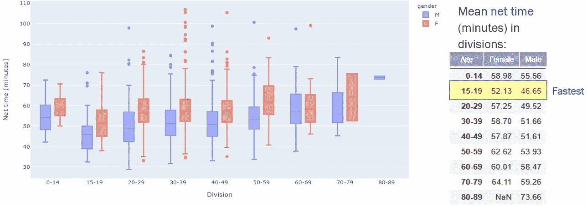

# 用先进的 EDA 技术为讲故事进行结构化思考

> 原文：<https://towardsdatascience.com/structured-thinking-for-story-telling-with-advanced-eda-77c14853a525?source=collection_archive---------10----------------------->

## 为开放式分析定义好的 DS 问题的 5 步指南


格伦·卡丽在 [Unsplash](https://unsplash.com?utm_source=medium&utm_medium=referral) 拍摄的照片

大多数数据科学(DS)项目都有我们想要实现的明确目标，比如开发一个有监督或无监督的机器学习(ML)模型，或者我们想要测试的一个假设。然而，在没有定义任何特定分析目标的情况下，数据集被用于探索也并不罕见。这种情况发生在你参加数据聚会，或者像 Meetup 小组这样的学习小组的时候。提供数据集是为了激发 DS 的创意，看看**你能提供多少见解，你能用它讲述什么故事**。在我看来，这些任务比那些预先定义了 DS 问题的任务更难。在清理数据并绘制一系列图表来检查数据分布后，很容易陷入困境，因为您会开始问一些关键问题:

> **>数据可视化还能做什么？**
> 
> **>要从哪些角度去挖掘数据，以讲故事和有价值的见解？**

问这些问题是作为数据科学家的**高级 EDA** (探索性数据分析)向**结构化思维**迈进的第一步。结构化思维不仅需要头脑风暴，还需要合理的逻辑。在这篇博客中，我希望分享一种方法，你可以遵循这种方法来获得数据清理和分布检查之外的更高级的 EDA，以及基于实践数据集和 Jupyter 笔记本(可在我的 [Github](https://github.com/mingjiezhao/advanced_EDA) 中获得)来处理这些**开放式 DS 项目**的技巧

# 1.高级 EDA 的结构化思维概述

*   **什么是结构化思维？**

结构化思维是把一个框架放到一个非结构化问题上的过程。拥有一个结构不仅有助于分析师从宏观层面理解问题，还有助于识别需要更深入理解的领域。(参考 1)

*   **什么是“进阶 EDA”？**

对于目标明确的 DS 项目**，EDA 旨在帮助理解数据的问题和分布，然后对数据进行相应的清理和预处理，以获得模型就绪的数据集。对于没有**明确目标的 DS 项目**，高级 EDA 包括绘制数据中隐藏相关性的额外步骤，以及从特定角度进行深入分析。**

*   **让我们从方法开始吧！**

下面总结了 5 个步骤的方法，我将在下面的部分用练习数据集来说明更多的细节。请注意，这种方法有局限性，可能不适用于每个数据集。请看本博客最后一节的讨论。

*   **第一步**:单变量初步 EDA(单变量)

目标:使用数据字典了解每个变量的含义，检查它们的分布，执行数据清理和预处理以处理异常值、缺失值等。

*   **第二步**:根据特征对变量进行分类

目标:根据数据的收集方式，将变量分为情境变量(变量代表年龄、地点、性别等特征)和动态变量(在数据收集过程中观察/监控的变量，如账户余额、交易次数、游戏结果)。

*   第三步:探索变量之间的相关性

目标:通过创建显示相关性的图表、对观察值进行分段、创建新变量等，理解变量之间的相互关系。

*   **步骤 4** :“放大”分析

目标:通过将子集与总体进行比较，选择一个子集进行深入分析。子集可以是一个观察结果(例如，一个对象对所有对象)或一个类别(有机食品对所有种类的食品)

*   **第五步**:发掘建模潜力

目标:调查数据建模的潜力，并用统计方法和/或机器学习技术提供分析结果。例如，尝试找到一个变量作为预测建模的响应变量，或者执行聚类以了解下面的相关性。

# 2.练习数据集简介

为了展示这种方法是如何工作的，以及如何在分析的同时讲述一个故事，我们用一个马拉松比赛的练习数据集创建了一个示例 DS 项目。数据字典如下所示:
-地点:每名选手相对于同性别选手的完赛顺序
-编号:选手的围兜号
-姓名:选手姓名
- Ag:选手年龄
-家乡:选手家乡。对于国内赛车手，是“城市，州”，对于国外赛车手，是“国家，。
-性别:选手的性别
-组别:年龄组包括相同性别组的选手
-枪时间(分钟)表示从比赛正式开始到选手越过终点线所经过的时间
-净时间(分钟)表示从选手越过起跑线到选手越过终点线所经过的时间
-速度时间(分钟):选手在这场比赛中每英里的平均时间(分钟)

这是该数据集前几行的视图:


作者图片

看起来很简单，不是吗？我很确定检查每一列的分布并不困难。我们已经提到了一些要制作的基本描述图，如数字变量(如步速、枪支时间)的密度图和箱线图，分类变量(如性别、部门)的条形图和饼状图

**现在让我们深入数据集，看看我们如何一步一步地应用该方法！**

# 3.逐步实现高级 EDA

**3.1 初步 EDA(单变量)**

大多数人已经熟悉了通常与数据清理相关的这一步。这部分有很多教程，所以我不打算多谈。这一步的目标是生成一个干净的数据集，让您感觉良好，开始挖掘其中的真知灼见这一激动人心的部分！如果你对我所做的数据清理感兴趣，请随时查看 Github 中名为“part1_data_cleaning”的 Jupyter 笔记本。

**3.2 分组变量**
第二步在编码上不花太多功夫，但在批判性思维上花了很多。在我们对数据有了大致的了解之后，我们希望将它们分组为**上下文变量**(变量代表特征)和**动态变量**(数据收集过程中观察到的变量)。为什么是这一步？因为:
*为第 3 步做准备，在第 3 步中，我们创建图表来查看两组变量如何相互作用。
*选择讲述故事的视角(即从上下文变量中选择子集)用于步骤 4 中的“放大”分析
*发现在步骤 5 中使用上下文变量进行聚类分析和赛车细分建模的潜力
*在步骤 5 中探索建模潜力时在动态变量中寻找负责任的变量

为了对变量进行分组，我们需要考虑数据是如何收集的，以及数据来自什么结构。对于此示例数据集，下表显示了分组结果:在马拉松比赛期间收集了比赛结果(例如，净时间、枪时间)，其他特征是参赛者的特征:


作者图片

**3.3 探究变量之间的相互作用**
一个有趣的数据故事总是包括探究变量之间如何相互作用。当数据集有许多变量时，查看数据的方式有很多，因此可能很难知道如何有效地探索数据集以获得最有价值的见解。这就是为什么我们在步骤 2 中对变量进行了分组，现在我们可以使用一些技术来有效地从变量中找到有用的相关性。使用**上下文变量**和**动态变量**，在探索它们之间的相互作用时可以有 3 种组合，每种组合导致不同的数据探索视角:


作者图片

让我们用练习数据集来试试:

**1 个上下文变量与上下文变量**

在 3.1 节(初步 EDA)中，我们已经对参赛者的分布和统计数据有了一些基本的了解。下图显示了一些关于性别和年龄的统计数据。


作者图片

总的来说，评估背景变量之间的相关性可以帮助我们理解混杂效应。为了找到性别和年龄之间的进一步关联，我们可以使用并列图来显示不同分区中的计数(基于年龄)。一些有趣的见解显示在下面的图中，例如**大多数参赛者年龄在 30-49 岁(61.9%)，男女都是如此，除了 20-29 岁和 30-39 岁，所有组别中女性参赛者都少于男性。**

```
import plotly.express as px
fig = px.histogram(df, x="div", color="gender", 
                         hover_data=df.columns,opacity=0.8)
fig.update_xaxes(title="Division")
fig.update_xaxes(categoryorder='array', categoryarray= ['0-14','15-19','20-29','30-39','40-49','50-59','60-69','70-79','80-89'])fig.update_yaxes(title="Count of Racers")
fig.update_layout(barmode='group')
fig.show()
```



作者图片

类似地，我们可以尝试绘制其他上下文变量。比如用性别和家乡画个地图，看看全国男女赛车手分布是否均匀。

**2 动态变量对动态变量**

响应变量通常选自 ML 模型中的动态变量。动态变量是我们想要研究来回答现实世界问题的变量。例如，银行分析客户的账户余额以预测客户是否会流失，商店分析客户的购物记录以决定向他们推荐什么产品。在这里，帐户余额和购物记录是我们想要调查的动态变量。在示例数据中，动态变量是比赛结果(净时间、枪时间、速度和名次)。他们是我们想用来讲述比赛故事的关键变量。

探索数据不应该局限于提供的变量，我们也可以**创建新的变量**，就像我们在特征工程中所做的一样。比赛结果包括两个时间变量:枪时间和净时间。看了数据描述，我们知道枪响时间是净时间加上枪响后越过起跑线所用的时间。因此，我们可以使用这个信息来创建一个新的变量，我称之为“cross_t ”,来表示枪时间和净时间之间的差异。

为什么这个新变量很有趣？我们需要使用数据本身之外的一些知识。思考收集数据时的情况是发现观察数据的新角度的好方法——我们通过首先提出好的问题来讲述好的故事。马拉松开始前，参赛者排队等候发令枪响。有获胜野心的参赛者会在乎他/她是否站在起跑线附近吗？这对他们的比赛结果会有什么影响？为了回答这些问题，我画了一个交叉时间与净时间的图表，来看看谁跑得最快:

```
```python
fig = px.scatter(df, x=”cross_t”, y=”net_s”, color=’gender’,opacity=0.5)
fig.update_xaxes(title=”Cross Time (minutes)”)
fig.update_yaxes(title=”Net Time (minutes)”)
fig.show()
```


作者图片

**讲故事的洞见** :
-一般来说，穿越时间较短的选手也有较短的净时间
-大多数最快的选手(净时间< 40 分钟。)也花了更少的时间在发令枪响后冲过起跑线(他们从一开始就认真对待比赛！)

**3 上下文变量与动态变量**

通过将情境变量和动态变量放在一起，我们可以看到参赛者的特征如何影响他们的结果。请注意，这不同于步骤 1(初步 EDA)中的基本分析:现在我们正在评估不同人群子群中的 race 结果。

让我们首先从枪支时间结果和性别组开始，我们可以检查它们是如何与并排箱线图交互的:

```
import plotly.express as px
fig = px.box(df, y='gun_s', x='gender',  color="gender", points="all",
             notched=False, # used notched shape
             title="Box plot of net time",)
fig.update_xaxes(title="Gender")
fig.update_yaxes(title="Net time (minutes)")
fig.update_traces(orientation='v') # horizontal box plots
fig.show()
```


作者图片

类似地，我们可以做同样的速度与性别对比图:


作者图片

**讲故事的感悟**:男性组比女性组快。

我们还可以检查各组的净时差:

```
fig = px.box(df, x="div", y="net_s", color="gender")
fig.update_traces(quartilemethod="exclusive") # or "inclusive", or "linear" by default
fig.update_xaxes(categoryorder='array', categoryarray= ['0-14','15-19','20-29','30-39','40-49','50-59','60-69','70-79','80-89'])
fig.update_xaxes(title="Division")
fig.update_yaxes(title="Net time (minutes)")
fig.show()
```



作者图片

**讲故事的洞察力**:15-19 岁年龄组的赛车手拥有最好的上网时间记录，无论男女。此外，与女选手相比，男选手在每个组别都有更好的成绩。

还记得我们在上一节中创建的新变量“cross_t”吗？我迫不及待地想看看它是如何与上下文变量交互的！但在此之前，让我先画出不同性别群体的持枪时间和上网时间:

```
plt.figure(figsize=(12, 6))
sns.kdeplot(df_f.loc[:,'gun_s'], color='orange', linestyle='--',label='Female gun time (min)', linewidth=2)
sns.kdeplot(df_m.loc[:,'gun_s'], label='Male gun time (min)', linestyle='--', color='green',linewidth=2)
sns.kdeplot(df_f.loc[:,'net_s'], color='orange',label='Female net time (min)', linewidth=2)
sns.kdeplot(df_m.loc[:,'net_s'], label='Male net time (min)', color='green',linewidth=2)
plt.legend(loc=1, prop={'size': 10})
plt.xlabel('Time', fontsize=16);plt.ylabel('Density', fontsize=16)
```


作者图片

在这里，我注意到男性持枪时间的密度曲线比女性持枪时间的密度曲线更平坦，这让我很想知道在开枪后发生了什么，直到参赛者越过起跑线。所以我绘制了新变量“cross_t”相对于性别的密度:

```
plt.figure(figsize=(12, 6))
sns.kdeplot(df.loc[df.gender=='F','cross_t'], label='Female', color='orange',linewidth=2)
sns.kdeplot(df.loc[df.gender=='M','cross_t'], label='Male', color='green',linewidth=2)plt.xlabel('Cross Time (minutes)', fontsize=16);plt.ylabel('Density', fontsize=16); 
plt.title('Distribution of cross time in minutes', fontsize=18)plt.legend(loc=1, prop={'size': 10})
```


作者图片

首先，这个情节很有趣，因为有三个高峰。此外，如果我们查看大约 2.2 分钟的时间戳，我们可以看到一些模式:在开始时，雄性组的密度线在雌性组的线之上，但是在 2.2 分钟之后，情况走向相反。所以我做了一些简单的计算来抽象出讲故事的**见解**:
——大多数参赛者的穿越时间是 1.3 分钟，3.6 分钟。5.2 分钟，与性别无关
-男性选手在开始时更具侵略性:75.5%的女性选手花了> 2.2 分钟冲过起跑线，相比之下，男性选手的这一比例为 54.7%

**在我们进入下一步** :
之前的其他想法-除了上面提到的图表，我们可以绘制带有“家乡”变量的地图，并查看它如何影响比赛结果
-此外，为所有数值变量绘制相关图表(例如热图)总是很好的。如果您决定在步骤 5 中拟合模型，这样做可以帮助您避免共线性

# 3.4“放大”分析

在上一节的步骤 3 之后，我们已经从数据集中获得了一些很好的见解。我们如何进一步调查？当我深入挖掘数据来讲述一个故事时，“放大”分析是一个有用的技巧。“放大”意味着我们从总体中挑选一个数据子集或一组数据，并定义一个有趣的问题进行分析。到目前为止，我们一直专注于整个人口(又名所有赛车)。我感兴趣的是挑选一个中等水平的赛车手(克里斯·多伊)，并尝试回答“克里斯与顶级赛车手相差多少时间”这个问题。以下是这位赛车手的一些基本信息:


作者图片

然后，我做了一些计算，并创建了一些可视化效果，将他的结果与他所在组别中前 10%的选手进行比较:


作者图片

```
fig = px.histogram(df_cd, x="net_s")
dt = df_m.loc[df_m.Name=="Chris Doe",'net_s']
fig.add_vline(x=np.sum(dt), line_width=3, line_dash="dash", line_color="brown")
fig.add_vline(x=perc, line_width=3, line_dash="dash", line_color="yellow")
fig.add_vline(x=np.sum(np.mean(df_top.net_s)), line_width=3, line_dash="dash", line_color="red")
fig.update_yaxes(title="Count of racers")
fig.update_xaxes(title="Net time (minutes)")
fig.show()
```


作者图片

**讲故事的洞察力** :
-克里斯需要减少他的净时间 8 分钟才能进入前 10%的赛车组！
-克里斯的净时间比排名前 10%的赛车组的平均净时间多 11.6 分钟

哇！看来要成为顶级赛车手还有很长的路要走！克里斯，希望你下次能做得更好！

# 3.5 利用机器学习发现建模潜力

通过遵循上述步骤，我们提供了不同视角的见解。我相信我们对数据和比赛有了更多的了解。现在是时候集思广益，利用机器学习(ML)技术，从这个数据集找到创建 DS 模型的机会了。

我首先想到的是以净时间为响应变量的分层建模。当我在第 3.3 节绘制部门与性别的对比图时，我注意到每个部门的参赛者数量都非常不同。换句话说，有些部门有超过 300 名选手，但有些部门只有不到 50 名。这表明，通过考虑部门和性别的随机效应，很有可能建立一个层次模型。我们可以添加其他变量(即交叉时间)作为固定效应的独立变量。所以我开始用一个简单的双向 ANOVA(方差分析)来测试我的想法。

```
# get ANOVA table as R like output
# drop div 80-89 because only male group has racer in this range
df1 = df.copy().loc[df.loc[:,'div']!='80-89',:]
# Ordinary Least Squares (OLS) model
model = ols('net_s ~ C(div) + C(gender)+ C(div):C(gender)', data=df1).fit()
anova_table = sm.stats.anova_lm(model, typ=2)
anova_table.round(2)
```


作者图片

**讲故事的洞察力**:双因素方差分析结果显示，分班和性别会显著影响上网时间。但是它们的交互作用没有显著影响。

下一步将是创建分级模型来测试随机截距和随机斜率的影响，并比较模型性能。受限于博客的长度，我没有继续这项工作。但是如果你感兴趣，你可以继续探索。我建议在 R 中使用一个名为 lme4 的库来适应这个模型。此外，使用“brms”来尝试贝叶斯层次模型。

我能想到的另一个建模机会是对赛车进行聚类分析。我们可以试着对参赛者进行细分，看看这是否有助于预测净时间。

# 4 总结和讨论

这个博客提供了一个简单易懂的方法来帮助你思考和发现数据背后的洞察力，使用先进的 EDA 技术。我希望通过遵循这些步骤，您学会了结构化思维的基础知识，能够用“开放式”数据科学项目讲述一个好故事。

同时，我想指出这种方法的局限性。将变量分组为上下文变量和动态变量的方法可能不适用于每个数据集。例如，对于时间是重要考虑因素的数据集。假设我们有一个关于用户一年购物活动的数据集，我们可能没有太多的“上下文”信息(用户的特征，如年龄、性别等)。)，相反，我们有与时间戳相关联的信息(即，用户何时开户或进行购买)。然后，我们需要将季节性、用户活动顺序等因素纳入建模考虑。对于 EDA 来说，这将是一个不同的话题，希望我可以很快在另一个博客上与你分享更多。

## 💖喜欢这个故事吗？请随意[订阅 DS 和 ML 粉丝的邮件列表](https://mingjie-zhao.medium.com/subscribe)，[成为会员](https://medium.com/@mingjie-zhao/membership)！🤩

# 这篇博客最初发表在我的[个人网站](https://mingjiezhao.github.io/)上。

**参考:**
1。结构化思考与分析的艺术([https://www . analyticsvidhya . com/blog/2013/06/art-structured-thinking-analyzing/](https://www.analyticsvidhya.com/blog/2013/06/art-structured-thinking-analyzing/))