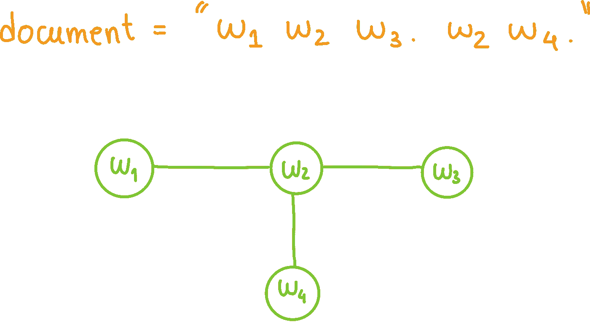

# 用图形表示结构化文本

> 原文：<https://towardsdatascience.com/structuring-text-with-graph-representations-41dd4f2a3ab3?source=collection_archive---------12----------------------->

## 如何用图来表示自由文本，**使其结构清晰明了，并且易于被下游算法管理**。

文本是一种数据类型，如果使用得当，它可以成为有价值的信息来源。然而，探索文本形式的数据，尤其是自由文本形式的数据，可能具有挑战性。

自由文本缺乏明确的结构和标准化。在这篇文章中，我将向你展示如何用一个图来表示自由文本，**，使它的结构清晰，易于下游算法管理**。有各种自然语言处理(NLP)任务可以从自由文本的图形表示中受益，例如[关键词提取](https://medium.com/gumgum-tech/exploring-different-keyword-extractors-graph-based-approaches-c46ec6c12c34)和[摘要](https://medium.com/@devilchauhan0/techniques-for-extractive-and-abstractive-text-summarization-6ed44a5465f6)。这是因为文本的隐含结构现在以图形的形式表现出来，**可以用标准的基于图形的算法**来探索，例如中心性、最短路径、连接部分和许多其他算法。

在这篇文章中，我将展示文本文档的 3 种不同的图形表示。这些是:

1)无向、未加权的图；
2)有向的、未加权的图；
3)有向、加权图；


从左到右，从上到下:(1)无向、无权重图；(2)有向的、未加权的图；(3)有向加权图。图片作者。

无论表示是什么，**主要思想总是相同的**:首先，**识别文本中的实体**以表示为图中的节点，其次，**识别那些实体之间的关系**以表示为图中节点之间的边。实体和关系的确切类型取决于上下文和任务。

实体可以是单个单词、二元模型、n 元模型、可变长度的序列等。；关系可以表示句子中实体之间的邻接、固定长度窗口中的共现、某种语义或句法关系等。



根据我们的假设，示例抽象文档的无向加权图表示。图片作者。

为了简单易懂，我将把**单个单词视为节点**，把**视为相邻的**(也就是说，它们在一个句子中形成一个二元组)**视为一个关系。**

尽管我将展示一个基于 [NetworkX](https://networkx.org) 的 Python 实现，但是所有的思想和方法都可以很容易地移植到任何其他实现中。

以下文档将是我们的运行示例(改编自[维基百科](https://en.wikipedia.org/wiki/Graph_theory)):

> 在数学中，图论是对图形的研究，图形是用于建模对象之间成对关系的数学结构。在这种情况下，图由顶点组成，也称为节点或点，它们通过边连接，也称为链接或线。无向图和有向图是有区别的，在无向图中，边对称地连接两个顶点，在有向图中，边不对称地连接两个顶点。图形是离散数学的主要研究对象之一。

# (1)无向、未加权的图

如前所述，无论用什么图形表示，**的高级方法总是相同的**，在这种情况下，由**的 4 个步骤**组成:

1.  文档预处理；
2.  识别实体(图中的节点)；
3.  识别关系(图中的边)；
4.  构建实际的图表。

我现在将详细介绍这些步骤(以及各自的实现)。这些步骤中的每一步的实现，尤其是实体和关系获取器，是我们为构建其他图形表示所做的改变。

主函数的 Python 实现。输入=文本文档(字符串)。Output = NetworkX 图形对象。

## 文档预处理

根据上面的规范，单个单词是节点，句子中的二元模型是边。**因此，预处理步骤必须将文档拆分成句子，并将每个句子拆分成单词**。此外，因为我们想最小化可变性，它还必须将所有文本**小写**(例如，单词“hello”和“Hello”被认为是同一个术语)。因为我们在任务定义中忽略了标点符号，所以它们也被删除了。

## 识别实体(图中的节点)

根据我们的定义，单个单词是图中的节点。因此，**对于文档中的每个唯一单词，必须有一个节点**。

## 识别关系(图中节点之间的边)

根据我们的定义，**如果相应的单词在输入文档的句子**中形成二元模型，则图中的两个节点之间存在边。幸运的是，在预处理步骤中，我们相应地分割了文档，这有助于计算。

## 构建图表

现在我们有了节点和边，我们可以轻松地构建实际的图。在这个例子中，**我使用 NetworkX 构建一个图形对象**。我们现在可以用一个简单的函数来绘制实际的图形。


运行主函数 build_graph()后，示例文档的无方向、无权重的图形。图片作者。

# (2)有向未加权图

如前所述，为了创建一个有向图，我们只需要稍微改变我们构建图的方式。

我们将两个节点之间的边的方向定义为相应单词在二元模型中出现的顺序。因此，**二元组“a 图”将导致从节点“a”到节点“图”的边。**幸运的是，我们之前捕获的二元模型已经考虑了文本中的原始词序(即，我们从来没有故意改变它们的顺序)。这意味着**我们唯一需要改变的是构建实际图形对象**(在这种情况下，用 NetworkX)的部分，告诉**考虑边的方向**。

因此，我们只需要更改该行:

```
G = nx.Graph()
```

To(有向图代表有向图):

```
G = nx.DiGraph()
```

我们结束了。


在运行 main 函数 build_graph()并对其进行适当修改(在本例中，只有一行)后，示例文档的有向、未加权图形图。图片作者。

# (3)有向加权图

最后，最后一块对应于给图的边增加权重。在这种情况下，我们将根据相应的二元模型在文档中出现的次数**对每条边进行加权。因此，如果二元模型“a 图”在文档中出现 3 次，则链接节点“a”和“图”的有向边(在该方向)的权重等于 3。**

因此，我们需要改变之前定义的关系 getter，来计算每个二元模型在文档中出现的次数。

最后，修改主函数以说明新的加权边缘获取器。**注意，构建的图仍然是有向图**，就像之前一样，**但是添加加权边的方法有稍微不同的接口**(不同的名字)。


在运行主函数 build_weighted_graph()并进行适当修改后，示例文档的有向加权图。图片作者。

# 好了，现在我有了一个图表…我能用它做什么呢？

将自由文本转换为图形表示使文本的隐含结构显而易见。这意味着现在您可以立即访问信息，例如哪些单词最常用(度)，哪些 n 元语法最常用，哪些单词最常用于信息流动(图中每两个节点之间的路径)，等等。 **NetworkX 提供了大量的方法应用于你的图表，提取有价值的信息。**

我将在以后的文章中讨论从文本中提取信息，其中一些将主要基于我们在这篇文章中看到的图形表示。

编辑(2021 年 10 月 22 日):你可以在[我的新帖](/keyphrase-extraction-with-graph-centrality-989e142ce427)中了解和看到一个例子，关于如何应用文本的图形表示进行关键短语/关键词提取。