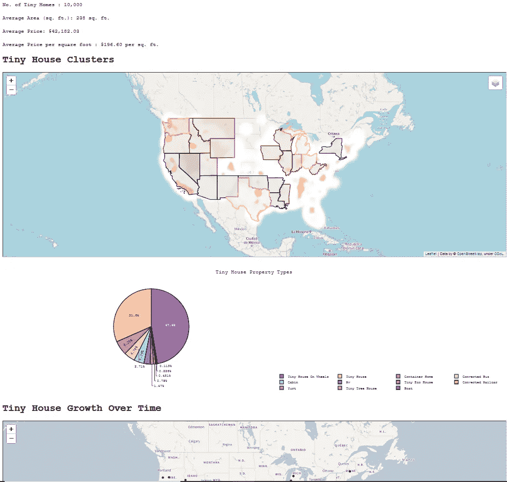
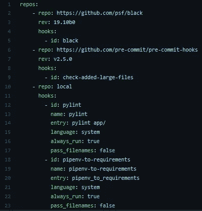
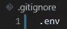
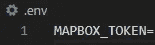
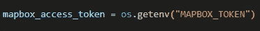
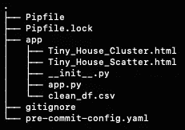
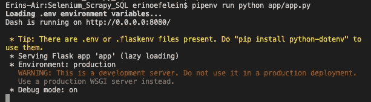
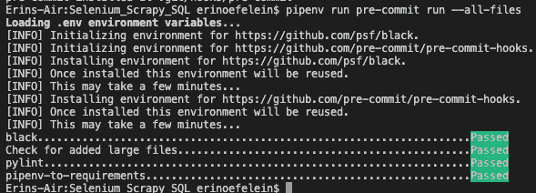

# 构建您的 Dash 应用

> 原文：<https://towardsdatascience.com/structuring-your-dash-app-e33d8e70133e?source=collection_archive---------10----------------------->

## 选择正确的结构使得开发和部署 Dash 应用程序变得更加容易

由[爱德华·克鲁格](https://www.linkedin.com/in/edkrueger/)和[艾琳·欧菲莱因](https://www.linkedin.com/in/erin-oefelein-3105a878/)


照片由[上](https://unsplash.com/s/photos/dash?utm_source=unsplash&utm_medium=referral&utm_content=creditCopyText)的[刻痕](https://unsplash.com/@jannerboy62?utm_source=unsplash&utm_medium=referral&utm_content=creditCopyText)拍摄

# 引入破折号

简而言之，Dash 是一个 Python 包，允许在不使用 HTML、CSS 或 JavaScript 的情况下用纯 Python 创建“仪表板”。由于它是可编程的，它比其他仪表板选项更强大。

近年来，有一股将 Python 脚本制作成 web 应用程序的强大推动力。某种程度上，甚至 Jupyter 笔记本也在这个方向推动 Python。然而，包括 Dash 和 Streamlit 在内的新工具通过允许用户将 web 应用程序编写为脚本，使 Python 的分发变得更加容易。

## 为什么结构和工具很重要？

您已经完成了项目，并创建了一个应用程序来展示您的成果。现在，您想通过部署 Dash 应用程序来分享您的项目见解。本文将带您了解如何将您的应用程序构建成易于部署的形式！

如果这种工具看起来很多，确实很多。但是，如果你不愿意，你不需要把它都写出来。我们不仅在下面的回购中提供了代码，而且还将其作为模板。所以，你可以点击“使用这个模板”按钮，按照指示开始编辑`app/`目录中的代码。

<https://github.com/edkrueger/dash-template> [## GitHub-edkrueger/dash-模板

github.com](https://github.com/edkrueger/dash-template) 

## 示例应用程序

我们将使用一个示例应用程序来展示一个项目。让我们快速看一下我们正在部署的应用程序。Erin 的项目是收集微小房屋列表、将结果存储为 CSV 并在 Dash 应用程序中可视化结果的结果。有些地块需要地图框，因此需要地图框标记。



应用程序截图(来源:作者)

# 如何构建你的 Dash 应用

在我们开始之前，这里有一个我们将涵盖的概述。

我们将涵盖:

*   关于 Pipenv 的内容已经足够，可以开始了
*   如何使用 Pipenv 安装依赖项
*   我们如何以及为什么安装开发依赖项
*   我们如何以及为什么使用预提交钩子
*   如何设置环境变量
*   如何构建存储库
*   如何测试我们所有的工具

## Pipenv 基础知识

强烈建议使用 pipenv 包管理您的应用程序的虚拟环境，因为 pipenv 允许其他功能，例如:

*   自动获取环境资源的能力。env)文件。
*   在 Pipfile 中指定应用需求的能力，避免了在生产中使用它们的需要。
*   虚拟环境中使用的 Python 版本的规范。

pipenv 提供的功能使部署您的应用程序变得更加容易。如果您希望在此时安装 pipenv，可以通过运行以下命令来完成:

```
pip install pipenv
```

</virtual-environments-for-data-science-running-python-and-jupyter-with-pipenv-c6cb6c44a405>  

## 属国

在项目文件夹中，运行:

```
pipenv install <your app dependencies>
```

我们的微型家用仪表盘应用程序使用熊猫、Dash 和 Plotly。因此，为了创建我们的 pipenv 环境，我们运行:

```
pipenv install pandas dash plotly gunicorn
```

*注意加了 gunicorn。将 gunicorn 包含在您的 Pipfile 中非常重要，这样，如果您希望部署到 Google 云平台应用程序引擎服务或为您的应用程序构建 Docker 容器，两者都将按预期工作。*

上面的`pipenv`命令将创建一个 Pipfile 和一个 Pipfile.lock，包含您的应用程序的依赖项。

## 开发依赖性

开发依赖是应用程序在生产中运行时不需要的所有依赖，但可以增强开发人员的体验或代码质量。

我们将使用以下开发依赖项:

*   `black`将格式化你的代码。
*   `pylint`会检查你的应用程序的代码风格，并对一行代码的长度，是否存在未使用的变量，导入是否正确地放在模块的顶部等提出建议。
*   `pipenv-to-requirements`将您的应用需求写入 requirements.txt 文件，多家云提供商要求以此格式正确识别。
*   `pre-commit`是在你的代码提交到你的 GitHub repo 之前，自动检查你的代码的工具(这里是 black，pylint 和 pipenv-to-requirements)。

可以用`pipenv install --dev --pre black pylint pipenv-to-requirements pre-commit`安装。

或者，从我们的模板中取出下面的代码片段，粘贴到您的 Pipfile 中并运行`pipenv install --dev --pre`。

```
[dev-packages]
black = "*"
pylint = "*"
pre-commit = "*"
pipenv-to-requirements = "*"
```

## 预提交挂钩:预提交配置. yaml

接下来，您将通过运行以下命令将`pre-commit-config.yaml`文件添加到您的项目中:

```
touch pre-commit-config.yaml
```

**注意:为了正确识别，该文件必须命名为* `pre-commit-config.yaml` *！*

您可以使用下面的文本轻松复制并粘贴我们的`pre-commit-config.yaml` 文件的文本:

```
repos:
    - repo: [https://github.com/psf/black](https://github.com/psf/black)
      rev: 19.10b0
      hooks:
        - id: black
    - repo: [https://github.com/pre-commit/pre-commit-hooks](https://github.com/pre-commit/pre-commit-hooks)
      rev: v2.5.0
      hooks:
        - id: check-added-large-files
    - repo: local
      hooks:
        - id: pylint
          name: pylint
          entry: pylint app/
          language: system
          always_run: true
          pass_filenames: false
        - id: pipenv-to-requirements
          name: pipenv-to-requirements
          entry: pipenv_to_requirements
          language: system
          always_run: true
          pass_filenames: false
```

如果你的文件夹不是 git repo，你需要在创建预提交钩子之前运行`git init`。现在，通过运行以下命令，使用`pre-commit` dev 依赖项(在创建虚拟环境时安装)来安装和设置 git 挂钩:

```
pipenv run pre-commit install
```

pipenv 包再次用于运行预提交钩子。你开始明白我们为什么推荐它了吗？现在`pre-commit`在运行`git commit`时会自动运行！

以下是文件在您选择的编辑器中的外观:



`pre-commit-config.yaml (source: by authors)`

如果你想阅读更多关于预提交钩子的内容，可以看看我们下面的文章。

</getting-started-with-python-pre-commit-hooks-28be2b2d09d5>  

## 环境变量

环境变量有助于提高应用程序的安全性。您可以使用环境变量引用令牌，而不是将令牌保存在脚本中。您的应用程序中使用的令牌的一些示例可能是到数据库的连接、第三方 API 等。

在我们的例子中，我们使用 Mapbox 来呈现美国的交互式 follow 地图，而不是在脚本中保存我们的令牌，我们使用一个环境变量来引用我们的令牌的密钥。

要创建一个环境变量，您将首先使用以下命令创建一个`.env`文件:

```
touch .env
```

接下来，创建一个`.gitignore`文件，并将刚刚创建的`.env`文件添加到`.gitignore`文件中，如下所示:



`.gitignore (source: by authors)`

在`.env`文件中，我们现在可以创建我们的环境变量。为此，指定变量的名称，这里命名为`MAPBOX_TOKEN`，并指定其值。为了安全起见，我们把令牌的密钥藏在这里了。



`.env (source: by authors)`

现在，当运行`pipenv`时，您的环境变量将自动从`.env`文件中获取并加载。跑步时:

```
pipenv run echo $MAPBOX_TOKEN
```

您的令牌值将打印到控制台。

如果您最初没有以这种方式设置您的令牌，您可以很容易地将您的 env 变量设置为等于您的应用程序的令牌的原始名称(此处为`mapbox_access_token`)，以避免在您的应用程序中出现的每个地方都更改令牌名称:



`app.py (source: by authors)`

## 构建您的应用程序代码

现在，您已经拥有了部署应用程序所需的所有文件，您需要确保您的应用程序能够被理解并轻松部署到云。

创建一个名为`app`的文件夹，并将所有必要的文件保存到 app 文件夹中，这样您的项目结构如下所示:



`Tree Structure of the Repo (source: by authors)`

## 测试你的应用

首先在本地运行你的应用程序**来确保一切按预期运行总是一个好主意**！您不希望将您的应用程序部署到云后发现它在那里不工作，然后在问题与您的云部署相关的前提下进行调试，却发现问题出在应用程序本身！



`Dash App in Action (source: by authors)`

一旦你确认你的应用可以在你的机器上运行，你就可以把你的工作提交给 GitHub 了！

## 提交到 GitHub

如果您还没有创建 GitHub repo 来备份您的文件，现在就创建吧。您可以通过遵循这些说明来轻松设置 GitHub repo。将您的应用程序文件暂存并添加到存储库中:

```
git add pre-commit-config.yaml Pipfile Pipfile.lock app/
```

并承诺他们:

```
git commit -m "Update package management"
```

现在，您的应用程序已正确构建，并且所有文件都已暂存，要对所有应用程序文件运行挂钩，请运行:



`The Pre-commit Hooks Running (source: by authors)`

这将显示并执行您已经实现的钩子。

** *注意:预提交挂钩要求文件在运行* `pipenv run pre-commit run --all-files`时被分阶段发现

当使用预提交钩子时，你需要添加和存放你的文件两次，因为`black`和`pipenv-to-requirements`会对你的代码进行修改，也就是说 black 会格式化你的脚本，pipenv-to-requirements 会创建一个 requirements.txt 文件。这将导致本地存储的版本和已提交的版本不同步。

通过运行以下命令，添加刚刚通过`pipenv-to-requirements`钩子创建的 requirements.txt 文件:

```
git add requirements*
```

完成后，通过运行以下命令推送文件:

```
git commit -m "your-message"
```

不错！你的应用已经被结构化、清理并保存到 GitHub。

如果你想更仔细地观察和更深入地理解这个过程，看看我们下面的文章。*注意:我们使用一些不同的工具，但是概念是相同的。*

</ci-cd-by-example-in-python-46f1533cb09d>  

我们的下一篇文章将带您了解如何使用 Google 的应用引擎服务部署 Dash 应用。在这个平台上部署很方便，因为不需要对你的应用进行 Dockerize，而在部署到谷歌的云运行和计算引擎服务时，这是必要的。

我们希望你喜欢这篇文章！有关数据科学、机器学习和开发的更多内容，请查看 [Edward 的 YouTube 频道](https://www.youtube.com/channel/UCmvdvjDaSjjMRIAxE5s7EZA)并订阅我下面的邮件列表，成为第一个听到新文章的人！

<https://edkruegerdata.com/subscribe> [## 每当爱德华·克鲁格发表文章时，就收到一封电子邮件。

edkruegerdata.com](https://edkruegerdata.com/subscribe)