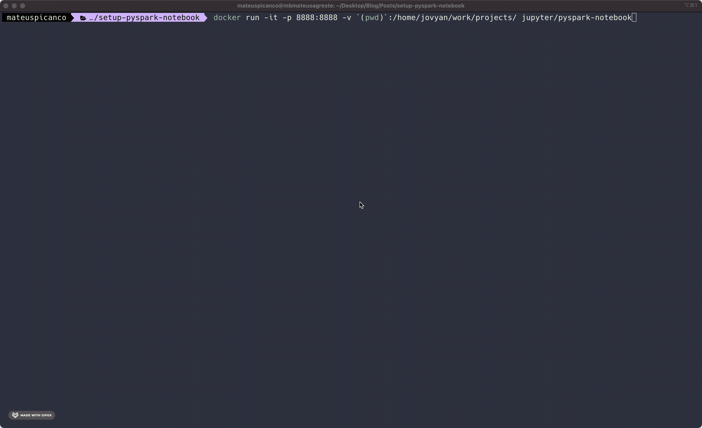
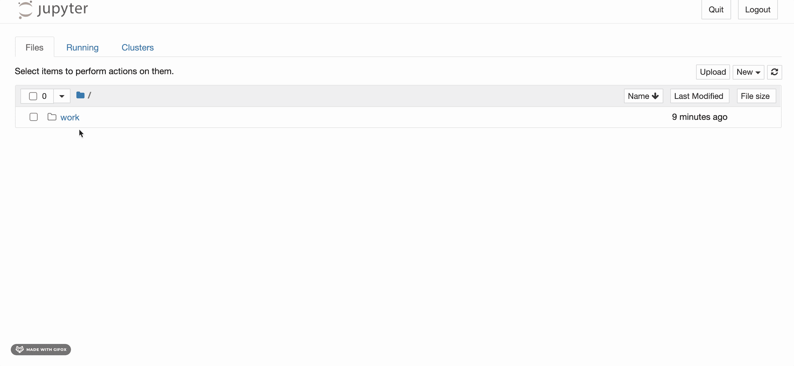

# 尝试让 PySpark 在您的数据科学环境中工作时遇到困难？这里有另一种方法。

> 原文：<https://towardsdatascience.com/stuck-trying-to-get-pyspark-to-work-in-your-data-science-environment-here-is-another-way-fb80a4bb7d8f?source=collection_archive---------10----------------------->

## 如何用 Docker 和 Jupyter Notebook 搭建 PySpark 开发环境

## 将配置工作留给 Docker，开始编写 PySpark 代码


作者蒙太奇

Apache Spark 是全球数据科学家日常工作中最常用的工具之一。Spark 无处不在，任何数据科学家都可以从熟悉其 API 和最佳实践中受益。

如果您需要处理来自多个来源的大量数据或与企业数据湖进行交互，那么您很可能会在数据处理管道中以某种形式使用 Spark。而且，如果您是初学者，您肯定很难设置运行 PySpark 脚本的环境。

本文将向您展示一种简单的方法来启动并运行一个全功能的 PySpark 环境，这样您会更加得心应手。

但是，在我们开始之前，让我们先看一下您需要遵循的一些要求:

*   关于 **3.5 GB** 可用在你的机器上；
*   安装**码头工人**；
*   对于 Windows 和/或 macOS 用户:在完成本教程中的步骤时，确保 Docker 桌面应用程序正在运行(绿灯)。
*   对于 macOS 用户:如果你有一台 M1 Mac，确保有苹果芯片的 Docker 桌面。否则，当您试图运行容器时会遇到问题，并且不会获得 M1 体系结构的好处；

到本文结束时，我们将拥有一个运行在 Docker 容器上的隔离环境，其中安装了功能齐全的 PySpark，并且可以访问您计算机的本地文件，所有这些都可以通过一个终端命令完成。

# 步骤 1:为开发环境设置 Docker

Docker 容器是一种*预配置的虚拟机(1)* 。开发人员和其他专业人员可以编写一个配置文件(一个 *Dockerfile* )，其中包含一组指令，说明如何从头开始构建这个虚拟机，从选择哪个操作系统到在其上安装什么 python 包。

任何人都可以使用`docker build`命令并在他们的本地环境中用手头的这个文件复制这个虚拟机。

由于 Docker 的灵活性，开源社区非常喜欢它，而且它也在工业界得到了广泛的应用。对于数据科学工作来说，这没什么不同。在 Docker 生态系统中学习自己的方式需要很长时间。

随着这种流行，很容易在互联网上的特殊存储库中找到预建的 docker 图像。幸运的是，来自 Project Jupyter 的人员已经开发了一系列 docker 映像，其中包含了在本地机器上运行 PySpark 代码所需的所有配置。在本文中，我们将使用名为[jupyter/pyspark-notebook](https://hub.docker.com/r/jupyter/pyspark-notebook)的图片。

第一步是下载并安装这个映像。我们可以用一个`docker pull`命令来做这件事。

```
# downloading the required image
docker pull jupyter/pyspark-notebook
```

如果一切正常，上面那行应该开始下载指定的 docker 映像并安装到您的计算机上。然后，我们可以使用`docker run name-of-the-image`从命令行运行它。

但是，我们将稍微改变一下这个过程，使它更容易与 Docker 环境交互。

# 步骤 2:智能地运行 PySpark docker 映像

Docker 容器上运行的应用程序通常被设计成独立的体验。除了其他限制之外，他们通常不能访问`host`机器上的数据。类似地，默认情况下，主机不能直接访问容器上下文中生成的数据。

在我们的例子中，我们希望与在 Docker 环境中创建的 Jupyter 笔记本进行交互，并将文件移入和移出 Docker 环境。

下面这个讨厌的命令显示了如何进行这种设置。不要害怕。我将解释配置的每一点，以阐明我们在做什么。

```
# if running on Windows (cmd.exe):
docker run -it -p 8888:8888 -v %cd%:/home/jovyan/work/projects/ jupyter/pyspark-notebook# if running on a mac or linux computer:
docker run -it -p 8888:8888 -v `(pwd)`:/home/jovyan/work/projects/ jupyter/pyspark-notebook
```

## 了解设置

当我们使用`docker run`时，我们可以向它传递几个参数来控制我们如何使用容器。跟在`docker run`语句后面的参数是这些底层控件。

第一个是`-it`。这意味着我们想在`interactive`模式下运行容器。`-it`允许我们查看 docker 容器运行时被编程执行的命令输出。在这种情况下，它只是运行`jupyter notebook`，因此我们将能够看到运行`jupyter notebook`命令的结果，这在以后是必要的，因为我们将复制一些打印到终端窗口的信息，并将其粘贴到我们的浏览器中。

命令的第二部分是`-p 8888:8888`。`-p`表示“出版”该参数将容器中的一个网络端口“映射”(2)到主机中的一个网络端口。在本例中，我们将主机中的端口`8888`映射到容器中的端口`8888`。语法是`-p {host's port}:{container's port}`。

实际上，这意味着当我们在端口`8888` (localhost:8888)打开本地机器时，我们将在屏幕上看到容器发送到同一个端口的内容。

当我们用这个参数运行容器时，我们计算机中的 Jupyter 笔记本服务器将可以像从常规命令行运行`jupyter notebook`一样被访问。

最后是`-v`参数，代表 ***音量*** 。它的工作方式几乎与`-p`的情况相同，并且具有相似的语法。在第一种情况下，我们映射网络端口，现在我们映射卷，这是 Docker 所说的“文件目录”当我们传递参数`-v (pwd):/home/jovyan/work/projects/`时，我们告诉 Docker 将`(pwd)` (3)映射到容器中的`/home/jovyan/work/projects/`目录，这是当前的工作目录(换句话说，您的终端当前所在的位置)。

现在，我们可以直接从 Jupyter 笔记本界面或容器内的命令行访问当前目录，这使得移动文件变得更加容易。

# **步骤 3:访问 PySpark 环境**

当我们按照描述运行整个命令时，我们会得到如下所示的输出。



完整命令的结果信息

结果的最后一位包含一个紧接在**`*?token=*`*之后的*访问令牌*。将这一整行复制并粘贴到你的浏览器中。你现在应该看到熟悉的 jupyter 笔记本界面。***

**

*在 Docker 容器中运行的 Jupyter 笔记本*

*我们现在在 Jupyter 上运行了一个全功能的 PySpark 环境，您可以开始了解这个流行工具的更多信息。*

## *给来到这里的人的额外提示*

*如果您是 macOS 或 Linux 用户，有一种简单的方法可以将上面的命令打包成 bash 函数或别名，这样您就不必每次都复制并粘贴上面的代码行。*

*在您的`.zshrc`或`.bashrc`中，添加如下所示的函数定义:*

```
*# defining a wrapper function for running the command 
run_spark() {
   docker run -it -p 8888:8888 -v `(pwd)`:/home/jovyan/work/projects/ jupyter/pyspark-notebook
}# on the command line then run this to update your profile:
source ~/.zshrc 
# or
source ~/.bashrc*
```

*如果您现在在命令行中运行`run_spark`，您会得到与上面讨论的相同的结果。*

***Windows 用户** : 当我找到一种简单的方法来做类似的事情时，我会把它添加到本文中。*

# *如果您想了解更多关于 PySpark for Data Science 的信息*

*随时 [***关注我上媒***](https://medium.com/@mateuspicanco)*每周新鲜内容！**

# **脚注**

*   **(1)这是对 Docker 容器概念的过度简化，但对于本文来说，这仍然是一个很好的类比。**
*   **(2)映射也不是真正在`-p`参数中发生的事情，但是将它视为端口之间关系的映射有助于理解信息是如何流动的。**
*   **(3)我们对 Windows 用户有同样的想法，但是我们把`(pwd)`换成了`%cd%`。**