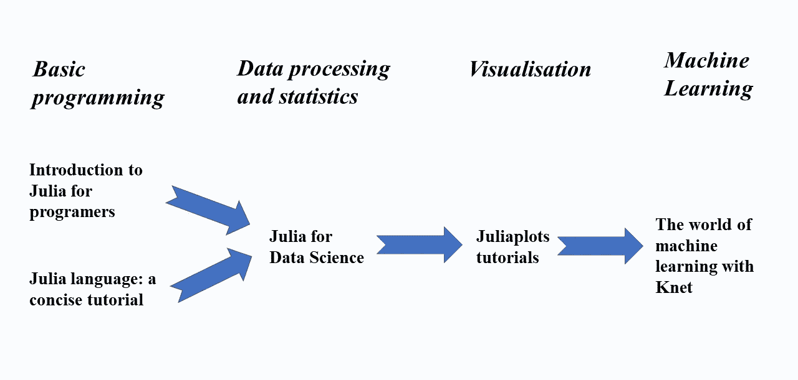
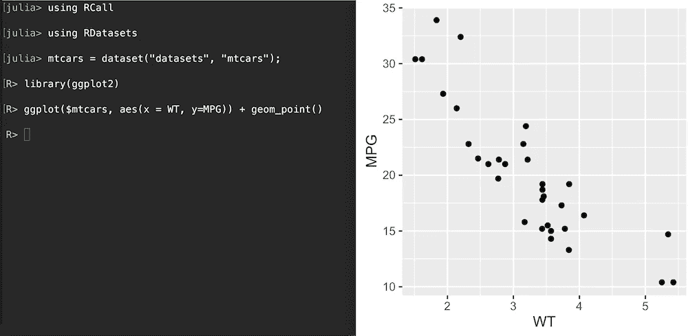
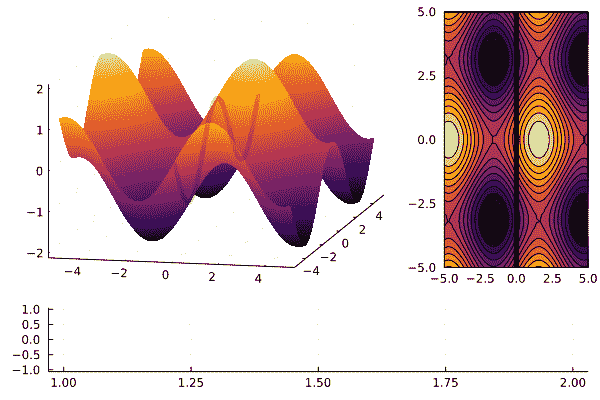

# 茱莉亚一个月基础学习计划

> 原文：<https://towardsdatascience.com/study-plan-for-learning-basics-of-julia-in-one-month-b2981051003d?source=collection_archive---------43----------------------->

## 学习 Julia 语言的基本资源和行动计划

作者图片

ulia 是麻省理工学院为高速计算开发的一种相对较新的编程语言。它比 Python、R 和 Matlab 快得多，但仍然保持了简单的语法。它的创造者在 2019 年因数值软件获得了[James h . Wilkinson Prize](https://en.wikipedia.org/wiki/J._H._Wilkinson_Prize_for_Numerical_Software)[，Julia 被许多人认为是机器学习和科学计算的未来编程语言。原因很简单:Julia 速度非常快，处理大量数据的速度比大多数其他编程语言都快。要阅读更多关于不同语言的 Julia 的性能比较，请点击](https://en.wikipedia.org/wiki/J._H._Wilkinson_Prize_for_Numerical_Software)[这里](https://julialang.org/benchmarks/)。

我最近决定坚持下去，并花了一些时间学习 Julia 的基础知识，以便能够完成一些基本的数据科学任务并编译简单的 ML 模型。这篇文章描述了我走向茱莉亚之旅的学习计划。

# 我的背景

我对 Python 和 STATA 等其他一些程序有扎实的知识。从这个角度来看，学习 Julia 的基础知识很简单。Julia 的语法和 Python 非常相似，有些东西在 Julia 中甚至比在 Python 中更直观。

所以，如果你很了解 Python，并且显然有一些标准的统计学知识，那么学习 Julia 对你来说应该很有趣🙂。

# 朱莉娅一步一步地学习

我使用了一种从一般到特殊的方法，首先完成了两个介绍性教程，然后完成了数据处理和统计课程，转到了图形准备教程。为期 4 周的学习窗口以机器学习介绍结束。

## **茱莉亚语言:简明教程**

 [## 介绍

### ➞·安东内洛·洛比安科(2019)，“朱丽亚快速语法参考”，本教程的过程兼容性表与朱丽亚…

syl1.gitbook.io](https://syl1.gitbook.io/julia-language-a-concise-tutorial/) 

使用本教程主要是为了在计算机上安装 Julia。我运行了 JupyterLab 中所有扩展名为 *IJulia* 的 Julia 笔记本。[本文](https://datatofish.com/add-julia-to-jupyter/)展示了 Jupyter 的 Julia 内核的安装过程。开发者可能会在 VSCode 插件中使用 *Julia 来编写 VS 代码。*

## Julia 介绍(面向程序员)

要开始编程，强烈推荐**茱莉亚学院**教程。

 [## 主页

### 编辑描述

juliaacademy.com](https://juliaacademy.com/) 

Julia Academy 的第一门课程涵盖基本主题，如处理字符串、数据结构、循环、函数、包介绍和绘图。在这里，你真的可以看到 Julia 和 Python 是多么的相似，因为它们之间只有很小的语法差异。所有笔记本都可以下载，这样您就可以在您的 JupyterLab 中运行它们。

## Julia 负责数据科学

茱莉亚学院(Julia Academy)更高级的数据科学课程处理面向数据的人在日常工作中需要的主题。课程只展示了 Julia 中的编程实现，很大程度上忽略了背后的统计理论。同样，Python 用户可以更容易地浏览教程。

涵盖的主题有:

*   聚类、降维
*   线性代数
*   统计，优化
*   分类、回归、神经网络
*   高级绘图。

Julia 支持导入 R、Python 和 Matlab 格式的数据。还有，用 [*RCall*](https://juliainterop.github.io/RCall.jl/stable/gettingstarted/) 包，可以在 Julia 内部运行 R 代码进行数据科学运算。优秀的 R 库如 *ggplot2* 可以在 Julia 中调用，我认为这是一件非常酷的事情。

使用 ggplot2 在 Julia 中绘制散点图。来源:[GitHub 上的 RCall.jl。](https://github.com/JuliaInterop/RCall.jl/blob/master/ggplot.png)

[*py call*](https://github.com/JuliaPy/PyCall.jl)*包对 Python 做同样的事情。可以从 Julia 导入 Python 模块，调用函数，从 Julia 方法定义 Python 类，在 Julia 和 Python 之间共享大型数据结构，而无需复制。*

## *Juliaplots 教程*

*因为 Julia 主要是为科学计算开发的，所以它只需要几行代码就可以提供漂亮的出版图。*

* [## 辅导的

### 这是一个让你开始使用 Plots.jl 的指南。它的主要目标是向你介绍使用的术语…

docs.juliaplots.org](http://docs.juliaplots.org/latest/tutorial/#tutorial) 

**JuliaPlots 教程**从简单的线形图绘制到更复杂的图形绘制，解释了使用不同后端和输入数据绘制属性，并提供了颜色方案、宏和动画的详细文档。你可以运行你 Jupyter 笔记本里的所有代码(安装了 *IJulia* 内核)。

Julia 中准备的一些图表看起来令人印象深刻:

来源: [JuliaPlots 教程。](http://docs.juliaplots.org/latest/)

## 机器学习

一门更高级的茱莉亚学院课程展示了茱莉亚如何处理经典的人工智能话题，这就是 Knet 的机器学习世界。涵盖了手写数字分类、影评情感分析、递归神经网络(RNNs)语言建模、卷积神经网络(CNN)图像分类等基本课题。

 [## 主页

### 编辑描述

juliaacademy.com](https://juliaacademy.com/) 

在登陆它之前，您可以刷新您的机器学习技能，因为这个简短的教程假设了一些 ML 原则的基础知识。

# 结论

处理数据包括不断学习、阅读论文以及跟踪新的软件和技术。Julia 是一种令人兴奋的语言，因为它比竞争对手快得多，这使它非常适合机器学习和大型数据处理。我介绍的免费课程是一个很好的起点。

当然，还要查看[的官方文档。](https://docs.julialang.org/en/v1/)

*PS:你可以订阅我的* [*邮件列表*](https://medium.com/subscribe/@petrkorab) *在我每次写新文章的时候得到通知。如果你还不是中等会员，你可以在这里加入***。***