# 用 SQL 为 2021 年东京奥运会做准备

> 原文：<https://towardsdatascience.com/studying-up-for-the-tokyo-2021-olympics-with-sql-719a0ae3779b?source=collection_archive---------4----------------------->

## 用 Python 查询 PostgreSQL 数据库，用 Pandas 显示结果，用 Matplotlib 可视化

现在，我比以往任何时候都更希望自己是一名职业运动员，处于人生中最好的状态，为 2021 年东京奥运会做好准备。但是，当我用枕头、毯子和非蔬菜小吃在沙发上摆好位置时，我没有为自己感到难过，而是认为这将是一个应用我的一些 SQL 知识(对 Udemy 和 Coursera 大喊)并从历史奥运数据集中学习一两件事的合适时机。四年——嗯，现在是五年——是一段很长的时间。客观地说，在去年夏季奥运会的时候，我以前从未编写过代码，对数据科学几乎是零接触。在这段时间里，我们很难在观看奥运会的时候保持正确的心态。我知道我个人只是盯着屏幕，对展示的难以想象的运动能力感到敬畏。不过，这次不会了！


来源:[https://unsplash.com/photos/ZIoi-47zV88](https://unsplash.com/photos/ZIoi-47zV88)作者@kfdias

这个项目的动机是询问和*回答*关于奥运会如何随着时间的推移而演变的问题，包括关于女性的参与和表现、不同运动项目和不同国家的运动员体格(即身高、体重、年龄)的差异，以及通过获得的奖牌数证明的不同国家在奥运会上的主导地位。

我将使用现代奥运会的历史数据集，包括从 1896 年雅典到 2016 年里约的所有奥运会(夏季和冬季)。来源是从 www.sports-reference.com[刮来的](http://www.sports-reference.com/)，并作为 [Kaggle 数据集](https://www.kaggle.com/heesoo37/120-years-of-olympic-history-athletes-and-results)发布(感谢 Kaggle 用户 [rgriffin](https://www.kaggle.com/heesoo37) )。如果您想继续，您将需要下载该数据集中的两个可用文件:athlete_events.csv 和 noc_regions.csv。大部分数据包含在前者中，但后者将有助于在我们的数据表上执行 SQL 连接，并获得国家/地区名称，而不是国家奥委会的 3 个字母代码。

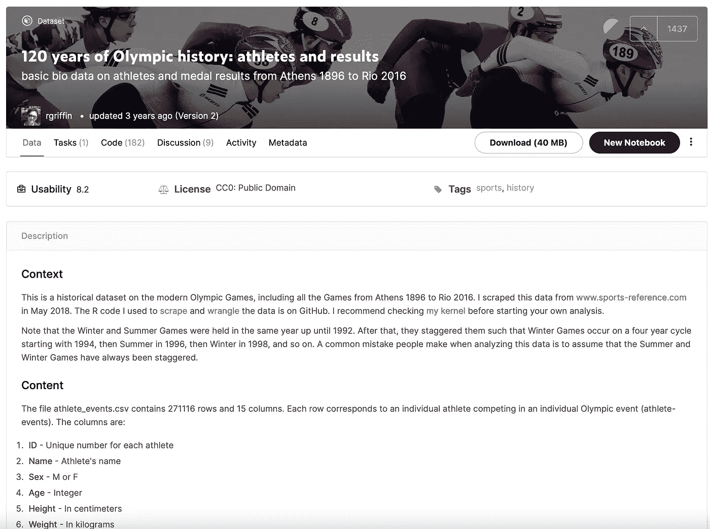

Kaggle 数据集的屏幕截图

我们将使用的数据属性包括:id、姓名、性别、年龄、身高、体重、团队、noc、比赛、年份、赛季、城市、运动、事件、奖牌。注意，有几个“NA”值代表缺失的数据，因此唯一包含纯整数的列是 year 列。还要注意的是，虽然奥运会现在每两年在夏季和冬季运动之间交替举行，但情况并不总是如此，这就是为什么季节栏会很有用。

在这个循序渐进的教程中，我将带您了解不同类型的 SQL 查询，这些查询的难度和复杂性各不相同。至于在编码环境中进行设置，您需要确保在本地机器上安装了 PostgreSQL 和 PgAdmin。如果您还没有安装这些工具，并且需要帮助，请参考本文末尾的参考资料部分。接下来，您将希望通过本地主机启动一个服务器。您可以通过 psql 命令行或通过 PgAdmin 来实现这一点。默认端口可能是 5432。我将我的服务器命名为“playground ”,但是服务器的名称并不重要。请确保您记住了数据库的名称和用户名，因为我们稍后会用到它们。

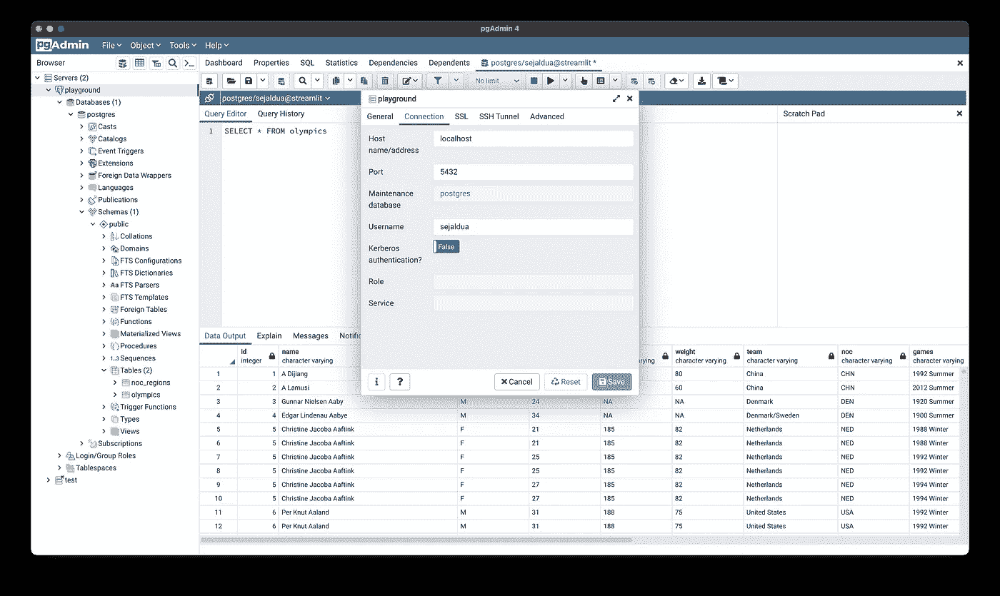

PostgreSQL 服务器配置的屏幕截图

为了编写 Python 代码，您还需要导航到您喜欢的代码编辑器。为了获得最愉快的体验，我建议跳到一个空白的 Jupyter 笔记本上。在您的 Python 环境中，确保您安装了以下包: [psycopg2](https://pypi.org/project/psycopg2/) 、[熊猫](https://pypi.org/project/pandas/)和 [matplotlib](https://pypi.org/project/matplotlib/) 。

在笔记本的第一个单元格中，粘贴以下导入内容:

```
import psycopg2
import pandas.io.sql as sqlio
import pandas as pd
import matplotlib.pyplot as plt
import seaborn as sns # optional
plt.style.use('ggplot') # optional
```

我们必须做的第一件事是使用 psycopg2 库建立到 PostgreSQL 数据库的连接。

使用 psycopg2 方法创建到数据库的连接，创建表，并将数据复制到表中

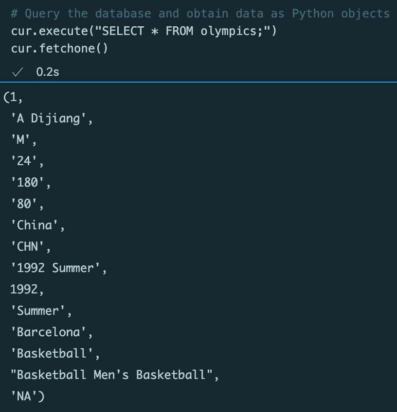

从执行的 SQL 查询中取出一个结果

既然我们所有的数据都位于我们的两个关系数据库表中，我们应该能够用一个简单的 select 语句来访问它。然而，psycopg2 库的一个不太理想的方面是，以可理解的格式查看结果集有点困难。

虽然 cursor 类允许我们通过迭代或使用`[**fetchone()**](https://www.psycopg.org/docs/cursor.html#cursor.fetchone)`、`[**fetchmany()**](https://www.psycopg.org/docs/cursor.html#cursor.fetchmany)`和`[**fetchall()**](https://www.psycopg.org/docs/cursor.html#cursor.fetchall)`等方法从数据库中检索数据，但如果能够以表格格式查看数据，那就更好了。

幸运的是，`pandas.io.sqlio`类允许我们这样做。具体来说，`[**read_sql_query()**](https://pandas.pydata.org/pandas-docs/version/0.16.0/generated/pandas.read_sql_query.html?highlight=read_sql_query#pandas.read_sql_query)`方法有两个参数:要执行的 SQL 查询和到数据库的连接。然后，它返回一个包含结果集的 pandas DataFrame。

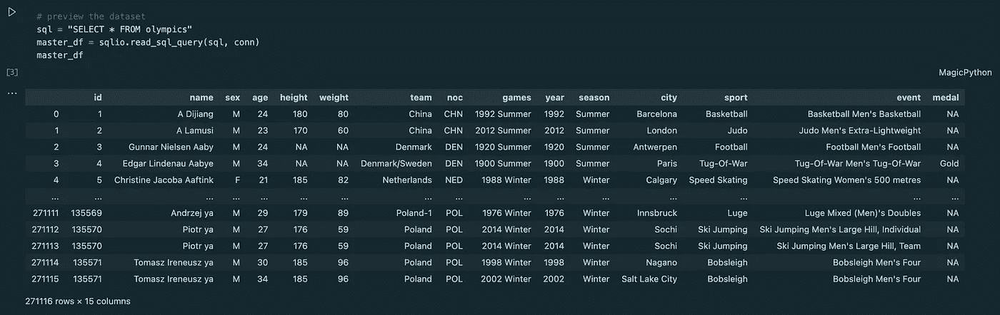

从 olympics 数据表中选择所有列，并使用 sqlio.read_sql_query()显示结果

好多了！现在我们知道了如何查询数据集和查看结果，让我们进入更高级的内容。在接下来的探索中，我将遵循以下每个子主题的结构:

1.  研究问题
2.  SQL 查询
3.  表格或可视化(如果适用)
4.  答案/结论/发现

当我们希望在处理数据时对数量级有一个高层次的理解时，`COUNT`和`DISTINCT`函数就派上了用场。`COUNT()`是一个内置函数，用于检索符合查询条件的行数。`DISTINCT`是用于从结果集中删除重复值的运算符。

## 有几个队？

```
SELECT COUNT(DISTINCT noc) FROM olympics
```

甲:230 英镑

## 有多少种运动？

```
SELECT COUNT(DISTINCT sport) FROM olympics
```

甲:66

## 有多少个项目？

```
SELECT COUNT(DISTINCT event) FROM olympics
```

甲:765

下面的查询使用了`WHERE`谓词，它限制了结果集，评估为真、假或未知。您还将看到正在使用的`ORDER BY`操作符，它根据列值对结果集中的行进行排序，可以是升序，也可以是降序(默认情况下 SQL 使用升序)。最后，`LIMIT`操作符用于将我们的结果集限制在前 N 行。

## 有史以来参加比赛的最年轻的前 5 名运动员是谁？

```
SELECT DISTINCT name, CAST(age AS INTEGER), sport, event, noc, games, city, medal FROM olympics
WHERE age <> 'NA'
ORDER BY age
LIMIT 5
```


哇哦。我不知道你是怎么想的，但是在我 10 岁的时候，我嚼着金鱼饼干，试图通过我五年级的拼写测试，却没有在雅典赢得体操铜牌。帮你自己一个忙，如果你想看有史以来参加比赛的最年轻运动员的漂亮的棕褐色照片，谷歌一下“迪米特里奥斯·伦德拉”。

## 参加过奥运会的年龄最大的前 5 名运动员是谁？

```
SELECT DISTINCT name, CAST(age AS INTEGER), sport, event,noc, games, city, medal FROM olympics
WHERE age <> 'NA'
ORDER BY age **DESC**
LIMIT 5
```

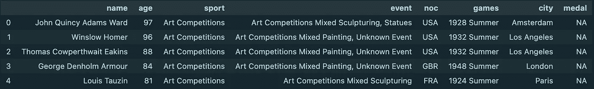

约翰·昆西·亚当斯·沃德以 97 岁高龄参加了 1928 年夏季奥运会。虽然在那个年龄还活着并且身体健康令人印象深刻，但在前面的陈述中有一个星号，因为这 5 名年龄最大的运动员都参加了“艺术比赛”，而不是更具竞争性、体力消耗大的运动。1912 年至 1948 年间，艺术比赛是奥运会的一部分。建筑、文学、音乐、绘画和雕塑都获得了奖牌。

由于它们不再是奥运会的一部分，让我们来完善我们的搜索。实际上有两种方法可以做到这一点:

1.  通过增加一个`WHERE`条款，将“艺术比赛”排除在兴趣运动之外

```
SELECT DISTINCT name, CAST(age AS INTEGER), sport, noc, games, city FROM olympics
WHERE age <> 'NA' AND sport <> 'Art Competitions'
ORDER BY age DESC
LIMIT 5
```

2.使用子查询来指定我们希望结果集包含截至 2014 年仍处于活动状态的 sport

```
SELECT DISTINCT name, CAST(age AS INTEGER), sport, noc, games, city FROM olympics
WHERE age <> 'NA' AND sport IN (SELECT DISTINCT sport FROM olympics WHERE year >= 2014)
ORDER BY age DESC
LIMIT 5
```

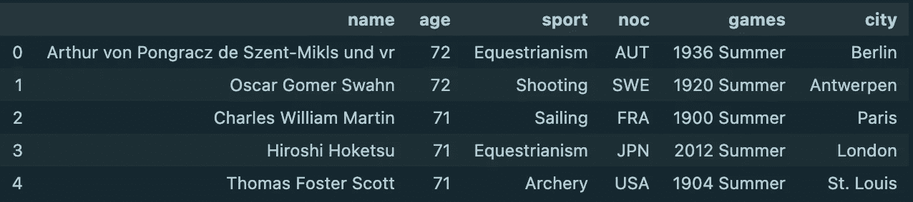

两种方法产生相同的结果！原来我们新的最老的运动员是一位来自奥地利的 72 岁的马术运动员。尽管 Aurthur von(插入非常长的姓氏)早在 1936 年就参加了比赛，但老年比赛似乎在马术比赛中仍然很常见(见第四行)。

## 有史以来参加比赛的最重的前 5 名运动员是谁？

```
SELECT DISTINCT name, CAST(weight AS DECIMAL), sport, event, noc, games, city, medal FROM olympics
WHERE weight <> 'NA'
ORDER BY weight DESC
LIMIT 5
```

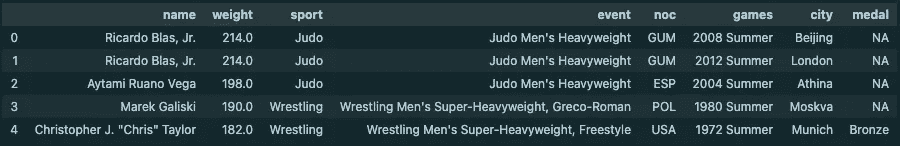

重量级男子柔道和超重量级男子摔跤是最重运动员参加的运动，这并不奇怪。这里，重量以千克为单位。对于美国人来说，214 公斤相当于 472 磅。你可能还想谷歌一下“小里卡多·布拉斯”来获得完整的效果！对身高和体重的研究让我想起了体育运动有许多不同的形式……而且围绕着即将到来的东京奥运会的纸板床的神话几乎肯定会被揭穿。

`GROUP BY`允许我们根据某个类别聚合列。它们通常出现在`FROM`或`WHERE`语句之后。一个棘手的规定是，如果我们想在使用`GROUP BY`后过滤我们的聚合结果，我们不能在其后放置一个`WHERE`谓词。这样做的原因是因为一个`WHERE`谓词在之前*被执行，结果集与`GROUP BY`聚合。解决方法是在`GROUP BY`语句后使用`HAVING`条件，在*结果被聚合后过滤结果*。*

## 随着时间的推移，可视化每个地区每个运动项目的运动员人数

让我们利用`GROUP BY`子句通过几种不同的分类分组方案来计算运动员的人数。由于`sqlio`，我们一直将结果集视为 pandas 数据帧，因此我们可以轻松地制作 matplotlib 条形图，进行更强大的数量级比较。首先，我们可以执行一个简单的查询来了解一段时间内有多少运动员参加了夏季奥运会。

```
SELECT year, COUNT(*) AS num_athletes FROM olympics
WHERE season = 'Summer'
GROUP BY year
```

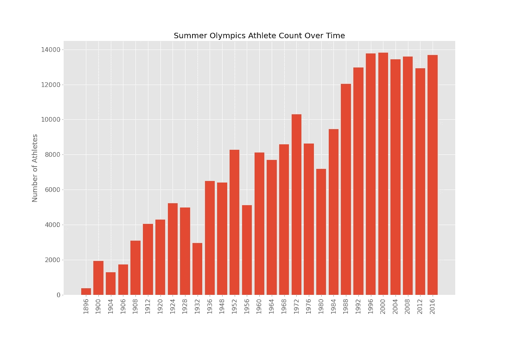

参加夏季奥运会的运动员数量似乎相对呈线性增长。自 1896 年第一届奥运会以来，当时只有不到 1000 名运动员参赛，现在运动员人数已经增加到将近 14000 人。不幸的是，我们很有可能在 2021 年看到一个明显的下降，因为许多运动员要么在新冠肺炎的测试中呈阳性，要么由于疫情经历了一些其他情况，使他们无法参加比赛。接下来我们来看看每个运动项目的运动员人数，按照运动员最多的运动项目排序。

```
SELECT sport, COUNT(*) AS num_athletes FROM olympics
GROUP BY sport
HAVING COUNT(*) > 5000
ORDER BY COUNT(*) DESC
```

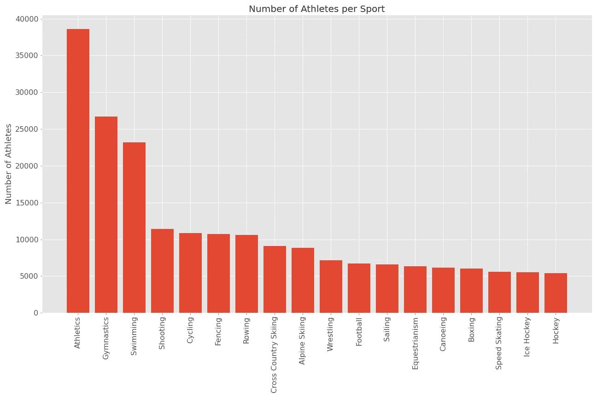

我们可以看到，运动员人数最多的前三项运动是田径(也称为田径)、体操和游泳。这些运动的特点是项目众多，而且主要是个人运动。

为了查看哪些地区派出了最多的竞争对手，我们几乎可以复制相同的查询，只是将“noc”而不是“sport”作为分类列。这里的一个警告是，我们希望能够看到完整的国家/地区名称，而不是 3 个字母的国家奥委会缩写。因此，我们将使用较小的数据集`ON`执行`LEFT JOIN`操作，即“noc”列。A `LEFT JOIN`返回左表中的所有行，即使右表中没有匹配的行。

```
SELECT region, COUNT(*) AS num_athletes FROM olympics
LEFT JOIN noc_regions
ON noc_regions.noc = olympics.noc
GROUP BY region
HAVING COUNT(*) > 5000
ORDER BY COUNT(*) DESC
```

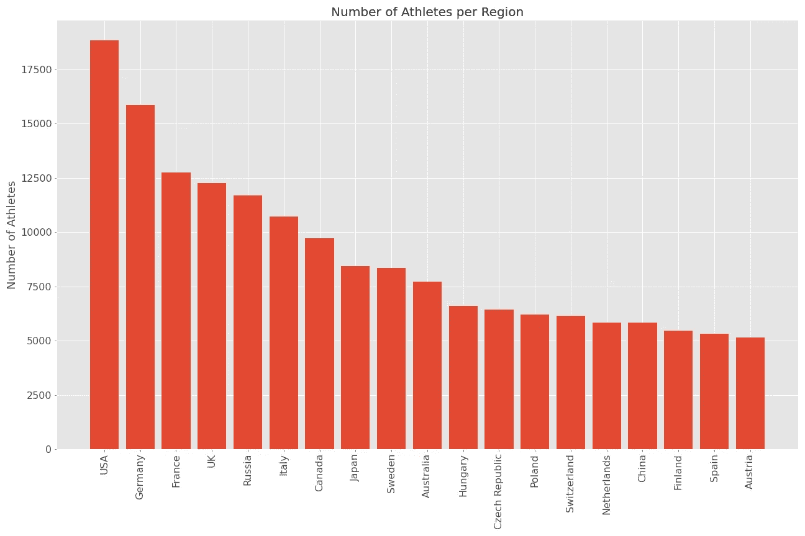

派出最多运动员参加奥运会的前两个国家是美国和德国，每个国家总共有 15，000 多名运动员。法国、英国、俄罗斯和意大利各派出 1 万多名运动员。我个人对加拿大、日本和澳大利亚没有排在前列感到有点惊讶。众所周知，加拿大参加冬季奥运会的人数很多，但也许它参加夏季奥运会的运动员较少。我假设在这个结果集中，日本和澳大利亚没有其他大国那么多的田径运动员。

在这一节中，我将在使用`GROUP BY`和`LEFT JOIN`的基础上引入一个新的主题:子查询！子查询允许您构造复杂的查询，实质上是对另一个查询的结果执行一个查询。该语法涉及两个 SELECT 语句；首先执行括号中的代码(子查询),其结果集用作主(外部)SELECT 语句的筛选表。

## 女篮的世界是怎么回事？

这个问题是针对那些我个人认为没有得到足够认可的女球员的。我最近了解到，他们已经取得了相当大的连胜，所以我开始验证这一点，并在全球舞台上发现一些相关的背景。以下 SQL 查询确定了在过去 10 场比赛中哪个国家获得了女子篮球金牌。

```
SELECT year, region AS gold FROM olympics
LEFT JOIN noc_regions
ON olympics.noc = noc_regions.noc
WHERE sport = 'Basketball' AND sex = 'F' AND medal = 'Gold'
GROUP BY year, region
ORDER BY year DESC
```

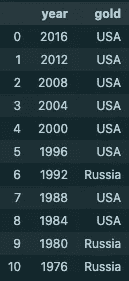

美国女篮自 1992 年以来还没有尝过失败的滋味，那是连续 6 块金牌！客观地说，在我出生之前，他们就已经是卫冕冠军了。令人印象深刻，但我现在需要知道更多。让我们做一些调查，找出他们过去 10 场比赛的亚军是谁。这就是子查询发挥作用的地方。

当`FROM`子句中的表名被子查询替换时，子查询就形成了所谓的派生表。派生表可以被赋予别名，以使选择列不那么冗长。当从两个不同的(派生的)表中选择列时，我们必须指定一个`WHERE`谓词，表明它们共享相同的索引列，否则将执行交叉连接，这将产生比我们预期的多得多的行。

```
SELECT G.year, G.gold, S.silver FROM
 (SELECT year, region AS gold FROM olympics
  LEFT JOIN noc_regions
  ON olympics.noc = noc_regions.noc
  WHERE sport = 'Basketball' and sex = 'F' and medal = 'Gold'
  GROUP BY year, region) G,
 (SELECT year, region AS silver FROM olympics
  LEFT JOIN noc_regions
  ON olympics.noc = noc_regions.noc
  WHERE sport = 'Basketball' and sex = 'F' and medal = 'Silver'
  GROUP BY year, region) S
WHERE G.year = S.year
ORDER BY year DESC
```

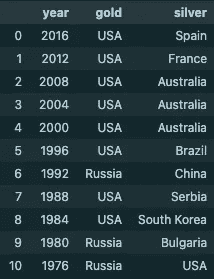

有意思——西班牙和法国分别在最近两届夏季奥运会上获得银牌。在此之前，澳大利亚是美国女篮连续三场比赛的亚军。尽管从理论上讲，她们正处于几十年来的连胜状态，但美国女子篮球队最近在奥运会前的一场表演赛中以 70 比 67 输给了一个缺少明星球员的澳大利亚队，这可能是一个值得警惕的原因。

## 谁是美国女子篮球队的关键球员？

```
SELECT name, COUNT(*) FROM olympics
WHERE sport = 'Basketball' and sex = 'F' and medal = 'Gold' and noc = 'USA'
GROUP BY name
HAVING COUNT(*) >= 3
ORDER BY count DESC
```

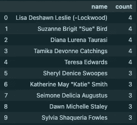

为了让这个小小的探索更进一步，研究这些年来让球队背负重担的传奇人物的名字总是很重要的。丽萨·莱斯利、苏·伯德、戴安娜·陶乐斯、塔米卡·凯金斯和特蕾莎·爱德华兹各自为美国赢得了 4 次金牌，这对于任何一个精英运动员来说都是一个巨大的职业成就，性别除外。

本节将涉及一些由多个子查询组成的相对复杂的查询。如果您是 SQL 新手，请不要害怕。解释图表是这一分析中更重要的部分。

也就是说，如果您是一名 SQL 专家或者正在努力成为一名 SQL 专家，本节将介绍聚合函数的使用，比如`MIN()`、`MAX()`和`AVG()`，这些函数接受一个列名，并在执行数学运算后返回计算出的值。由于聚合函数只能应用于由数字数据组成的列，因此`CAST`操作符在这里会派上用场，使我们能够从一种数据类型(字符串)转换为另一种数据类型(整数或小数)。

## 按运动项目分析运动员体格(身高和体重)

与过去的 SQL 查询不同，有时我们不一定知道我们希望突出显示数据中的哪些关系。在这些场景中，能够将我们的数据集过滤到一个可管理的大小，并将整个结果集放入一个探索性的`seaborn`绘图函数中，比如[蜂群绘图](https://seaborn.pydata.org/generated/seaborn.swarmplot.html)，这很好。群体图能更好地表示值的分布，但它不能很好地适应大量的观察结果。在这里，SQL 查询将我们的结果集缩小到参加了 2012 年或 2016 年夏季奥运会、参加了一项“流行”运动并获得了一枚奖牌的运动员。

```
SELECT sport, CAST(height AS INTEGER) FROM olympics
WHERE sport IN (
   SELECT sport FROM olympics
   GROUP BY sport
   HAVING COUNT(*) > 3000
) 
AND height <> 'NA' 
AND season = 'Summer' 
AND year >= 2012 
AND medal <> 'NA'
ORDER BY sport
```

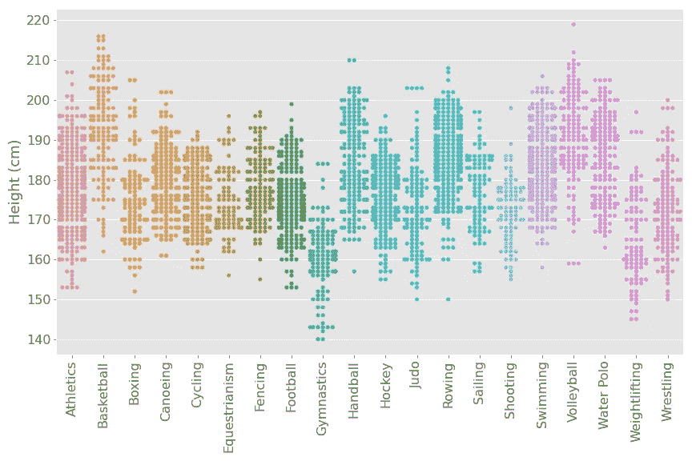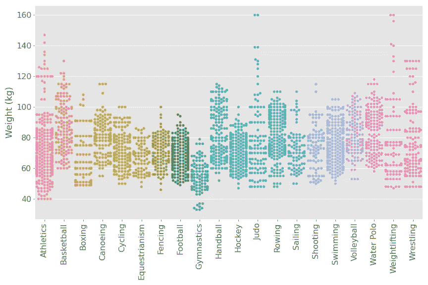

上面的群体图描述了高水平运动员的身高和体重分布。凭直觉，运动员最高的项目似乎是篮球、手球和排球，而运动员最矮的项目似乎是体操、举重和摔跤。

就体重而言，我们看到摔跤、举重、柔道和拳击的分布更广，因为这些项目都有重量级别，运动员会有意识地训练他们的身体。田径运动描述了一点尾巴效应，这可能是因为许多投掷项目需要大量的力量。体操、曲棍球、足球、游泳分布最集中。

在分析这个数字时，我想到我没有按性别来区分数据。与其制作更多的群体图来解决这个问题，不如让我们应用一些集合函数，用两个系列的数据制作一个散点图，一个是雄性的，另一个是雌性的。完成这一任务的复杂 SQL 查询已经成为感兴趣者的要点:

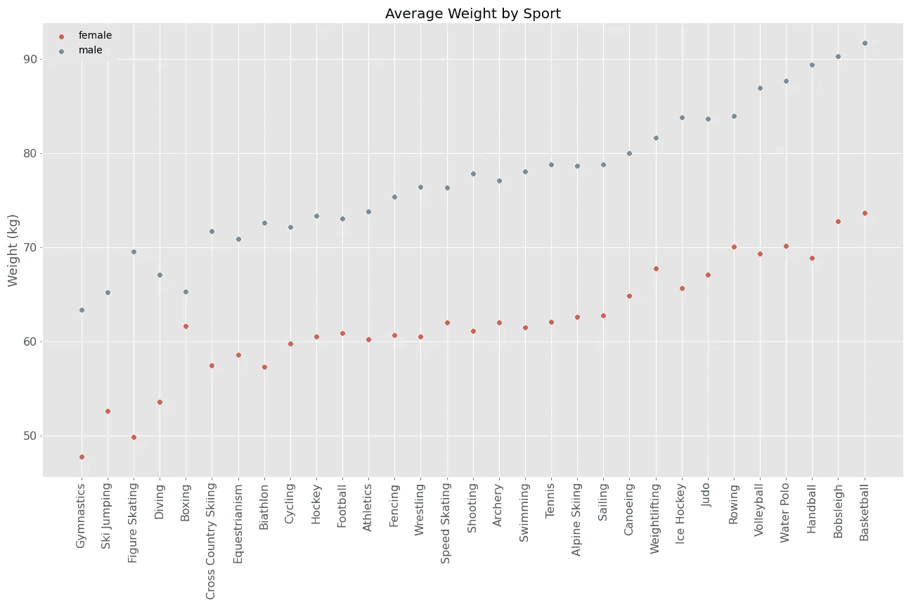

看着上面的体重散点图，我们可以收集到一些有趣的发现。最引人注目的是，女性拳击手的平均体重非常接近男性拳击手的平均体重，我们在举重中也看到了类似的趋势。也许这和肌肉量或者重心低有关，但只能推测。对于花样滑冰来说，根据体重数据，普通的女运动员更娇小、更瘦，而普通的男运动员则更重。这具有直观的意义，因为男性花样滑冰运动员在运动中经常举起他们的女性伙伴，所以他们必须有更强壮的体格。最后，体操运动员是所有运动员中最轻量级的也就不足为奇了。

只是为了好玩，看看奖牌获得者按运动分类的年龄群图可能会很有趣。身体什么时候能发挥到巅峰？什么时候是退役的时候？

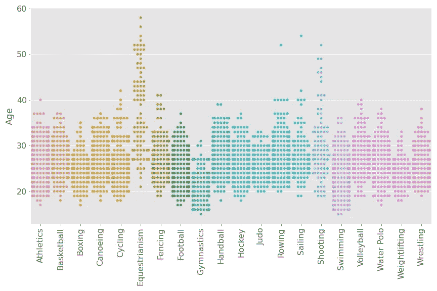

在我们的“流行”运动中，从青少年到 40 岁出头似乎是奥运会奖牌获得者，更一般地说，是精英运动员的标准职业生涯。也就是说，如果你是马术或射击运动员，不要担心年龄！你可以经历中年危机，但仍然追求黄金。另一方面，如果你的运动是体操、柔道或举重，30 岁出头似乎是放弃的好时机。也许重冲击运动对一个人的关节有“磨损”效应，使其多年难以高水平发挥。说到这里，让我们看看所有运动项目中奖牌获得者的年龄分布，不分性别。

```
SELECT CAST(age AS INTEGER), COUNT(*) AS num_medalists
FROM olympics
WHERE age <> 'NA' AND medal <> 'NA'
GROUP BY age
```

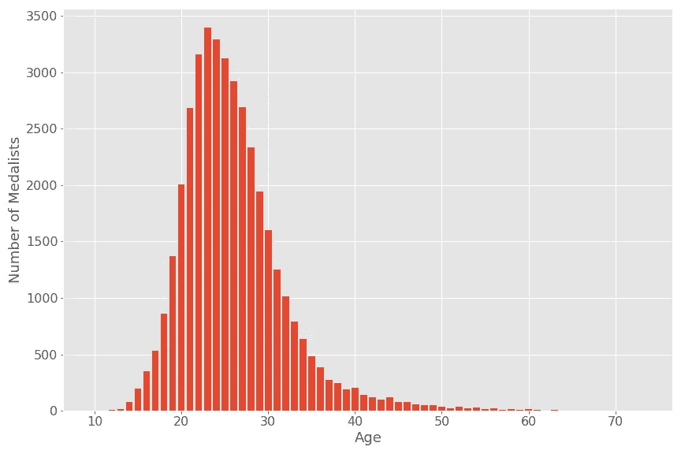

一个漂亮的正态分布！23 岁似乎是获得奥运奖牌的最佳年龄。这种分布有一个右偏——一个长右尾——意味着在 20 多岁时追逐奖牌的几率仍然相当高，然后随着一个人接近 40 岁或更高，它们缓慢但肯定会直线下降。

我们将采用的最后一个 SQL 课程是`CASE`语句，它本质上类似于其他编程语言中的“if-else”语句。它使我们能够对列应用条件逻辑，并将数据转换为对我们的任务更有意义或更方便的值。

## 谁收集了有史以来最多的硬件？

最后，也许是最重要的，是时候看看谁在奥运会历史上收集了最多的奖牌。我们将在奖牌栏中应用`CASE`语句，以计算加权和。我们希望考虑运动员获得的金牌、银牌和铜牌的数量，以一种符合逻辑的方式对它们进行缩放，而不是笼统地计算获得的奖牌数量。

```
SELECT name, sex, noc, sport, SUM(CASE medal
  WHEN 'Gold' THEN 3
  WHEN 'Silver' THEN 2
  WHEN 'Bronze' THEN 1
  ELSE 0
  END)
FROM olympics
GROUP BY
name, sex, noc, sport
ORDER BY sum DESC
LIMIT 10;
```

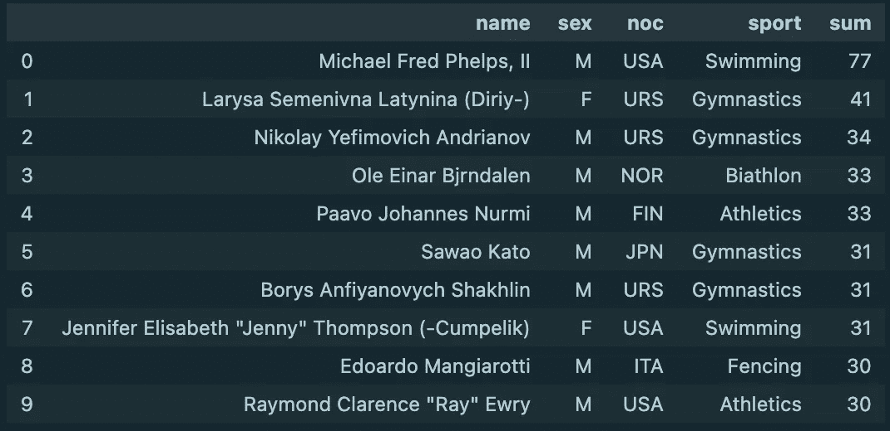

迈克尔·菲尔普斯和帕沃·鲁米是我唯一认识的名字，但这很酷。在这十大奖牌获得者中，有十分之八是男性，并且有很多来自美国和俄罗斯的代表。还有很多代表来自三大运动:田径、体操和游泳！如果我们不列出有史以来前 10 名女奥运选手，这个项目会感觉不平衡，让我们继续下去，尽快完成。

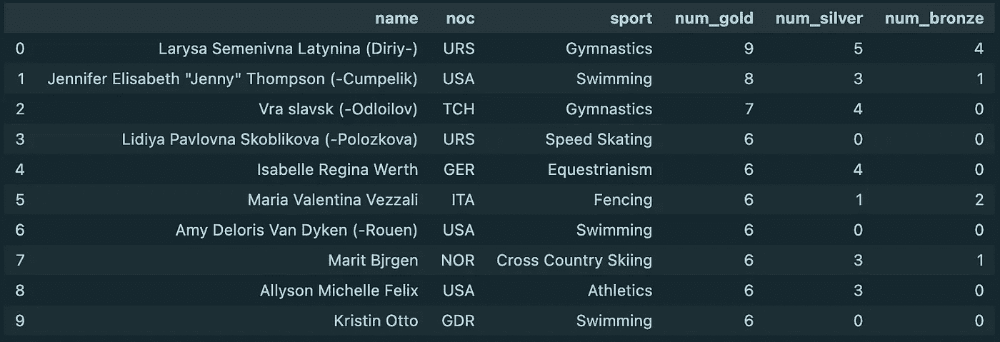

## 哪些国家在某项运动中表现出了奥运优势？

为了构建这个查询，我们将使用前面提到的相同的加权和列，以金牌、银牌和铜牌的组合来衡量成功。从结果集中，我们将能够识别出最值得记住的配对(国家→运动),然后才能进行为期 3 周的持续运动！

```
SELECT region, sport, SUM(CASE medal
  WHEN 'Gold' THEN 3
  WHEN 'Silver' THEN 2
  WHEN 'Bronze' THEN 1
  ELSE 0
  END)
FROM olympics
LEFT JOIN noc_regions
ON noc_regions.noc = olympics.noc
GROUP BY sport, region
ORDER BY sum DESC
LIMIT 8;
```

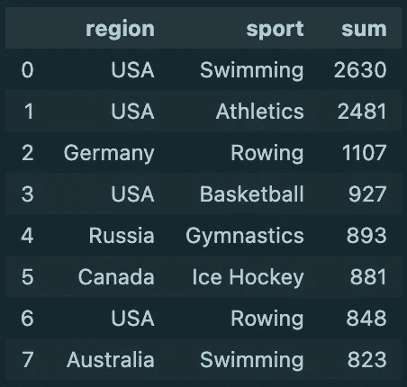

如果你想在这个周末的客厅里听起来很聪明，只要记住美国队以其在游泳、田径、篮球和赛艇上的成功而闻名；德国以赛艇成功著称；俄罗斯在体操领域大放异彩；冰球场上的加拿大；游泳池里的澳大利亚。

## 跟着走

这是一个总结！如果你能走到这一步，非常感谢。距离我的上一篇文章已经有一段时间了，但是我计划继续做一些项目，同时将我推出舒适区，并帮助我对感兴趣的领域有更多的了解。如果您有任何建议或反馈，请不要犹豫，通过电子邮件与我联系。

对于那些想要复制这项工作或按照自己的方向进行的人，这里是包含所有代码和数据的 GitHub 存储库:

[](https://github.com/sejaldua/sql-olympics) [## sejaldua/SQL-奥林匹克

### 通过对历史奥运数据进行 SQL 查询来宣传奥运会

github.com](https://github.com/sejaldua/sql-olympics) 

请随时在 [LinkedIn](https://www.linkedin.com/in/sejaldua/) 上与我联系，或者查看我的[投资组合网站](https://sejaldua.com)！

## 参考

[](https://www.postgresqltutorial.com/install-postgresql/) [## 安装 PostgreSQL

### 摘要:在本教程中，您将逐步学习如何在本地系统上安装 PostgreSQL。PostgreSQL 是…

www.postgresqltutorial.com](https://www.postgresqltutorial.com/install-postgresql/) [](https://www.pgadmin.org) [## pgAdmin

### pgAdmin 开发团队很高兴宣布 pgAdmin 4 版本 5.5。这个版本的 pgAdmin 4 包括 18 个错误…

www.pgadmin.org](https://www.pgadmin.org)