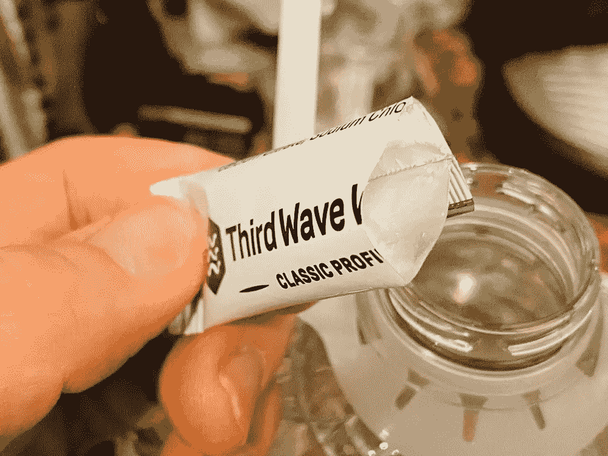
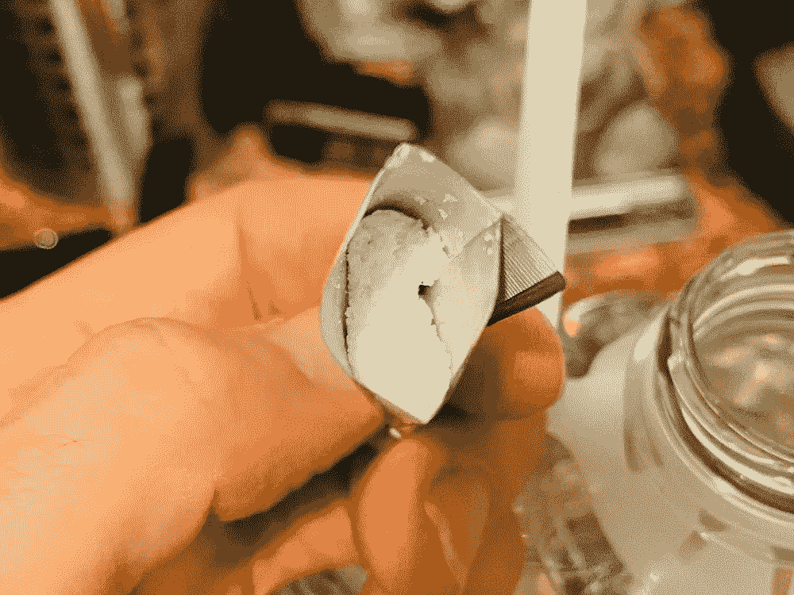
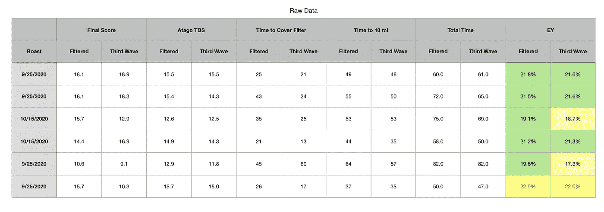
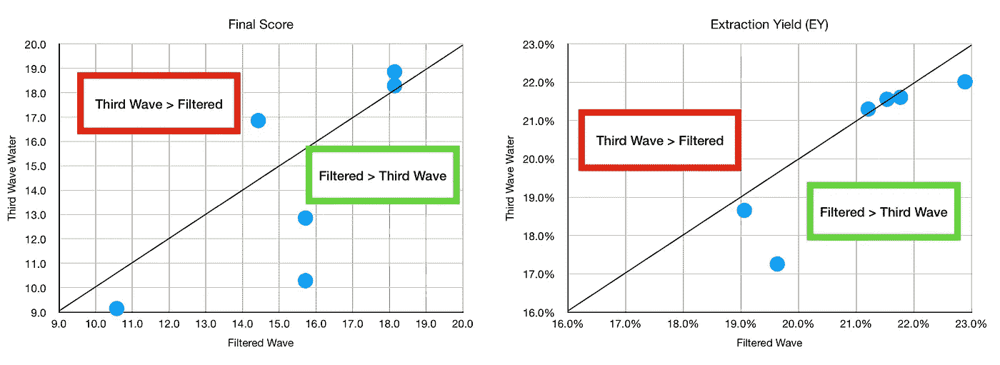
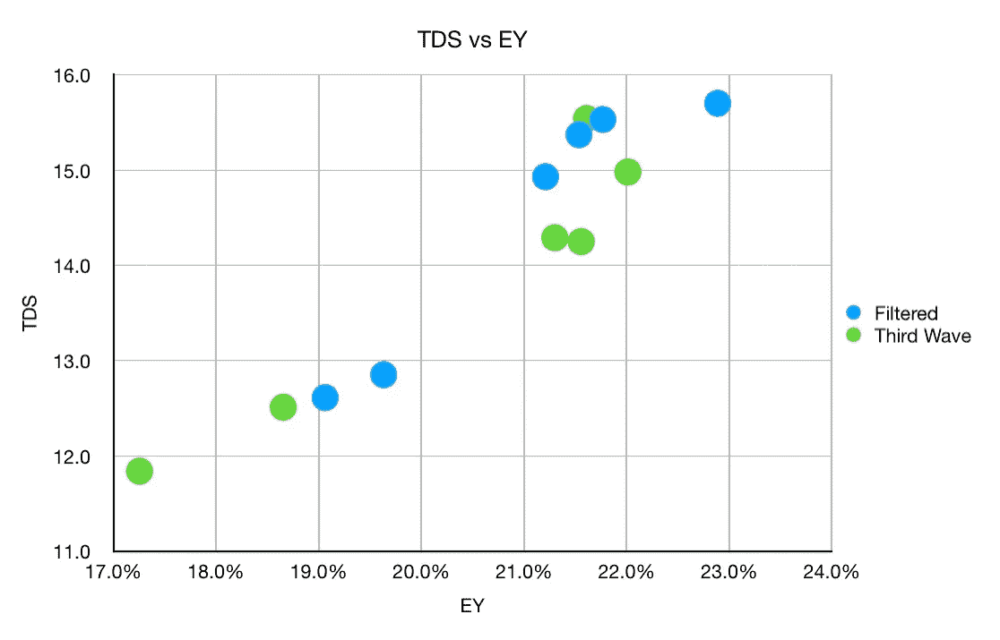
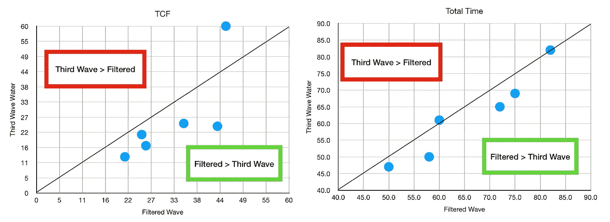

# 水中的绊脚石:浓缩咖啡水实验

> 原文：<https://towardsdatascience.com/stumbling-in-water-espresso-water-experiment-6e3e78b03b5e?source=collection_archive---------53----------------------->

## 咖啡数据科学

## 在酿造用水中的第一组实验

酿造水食谱的想法当然不是新的，也不是没有至少一些关于人们喜欢的食谱的文件。目前还没有一个合适的食谱对比，我也不打算在短期内填补这个空白。然而，随着詹姆斯·霍夫曼的世界咖啡品尝会，我有机会看到 T2 的第三波水。

第三波水生产不同的矿物质配方与蒸馏水混合，詹姆斯发出了一种类型，以帮助每个人在咖啡品尝期间拥有相同的水配方。考虑到人们在世界各地使用各种水源，这一点非常重要。

后来，我想开始看看酿造水，所以我用我剩下的一加仑水开始了一些配对拍摄。综上所述，我在六个配对镜头中发现了一个负面效应。我知道这只是一个小样本，我写这些不是作为一些结论性的陈述，而是初步的结果。我停止收集数据，因为我更感兴趣的是什么可以提高我的投篮，我只是没有看到一个很大的改进前进的道路。我

很有可能第三波水的经典配置不适合浓缩咖啡，或者我的水已经很好了。我仍然愿意尝试其他的酿造水，但同时我又进行了其他的实验，希望能回到过去。

所有图片由作者提供

# 基线水设置

为了比较，我用的是水龙头的过滤水，所以水是来自加州的圣克拉拉县。然后，在将水倒入我的 Kim Express 之前，我会使用 Brita 过滤器。我在家里的 [Kim Express](https://medium.com/overthinking-life/kim-express-reborn-64472f5ded1e) 上没有遇到我在工作中遇到的水垢问题，可能是 Brita 过滤器的问题。

# 镜头性能指标

我将这些定义放在这里，因为在这一节之后，我将使用这些指标评估不同数量的纸质过滤器。

我使用了两个指标来评估镜头之间的差异:[最终得分](https://link.medium.com/uzbzVt7Db7)和[咖啡萃取](https://link.medium.com/EhlakB9Db7)。

最终得分是 7 个指标(强烈、浓郁、糖浆、甜味、酸味、苦味和余味)记分卡的平均值。当然，这些分数是主观的，但它们符合我的口味，帮助我提高了我的拍摄水平。分数有一些变化。我的目标是保持每个指标的一致性，但有时粒度很难，会影响最终得分。

使用折射仪测量总溶解固体(TDS ),该数字用于确定提取到杯中的咖啡的百分比，并结合一杯咖啡的输出重量和咖啡的输入重量，称为提取率(EY)。

# 数据

我用我的金快车在两次烧烤中收集了六对照片。一般来说，我的镜头有 1.5 的输出输入比，而且大部分都在提取的高端。这些镜头都是用[纸过滤器在中间](/the-impact-of-paper-filters-on-espresso-cfaf6e047456)的[断奏篡改过的](/staccato-tamping-improving-espresso-without-a-sifter-b22de5db28f6)镜头。

对于味道得分(最终得分)，第三波仅在很大程度上好于一次，而它差了 3 倍。对于提取率(EY)，第三波仅与过滤水一样好或更差。

在研究 TDS 与 EY 时，我没有看到任何第三波明显模式，除了被过滤水所表现出来。

我还查看了时间指标，TCF 和总时间。TCF 是覆盖过滤器的时间，我发现这是何时结束预输注的良好指标(3*TCF 似乎是结束预输注的最佳时间)。总时间包括预输注时间和输注时间，并且每对预输注时间是恒定的。

第三波拍摄运行较慢，我不知道为什么。奇怪的是，尽管花的时间更长，他们提取的却更少。

出于数据的目的，最好记住 6 个配对样本只是一个探索性研究。它没有统计学意义。如果有什么不同的话，这个小研究建议我应该同时尝试几个 brew 食谱，以缩小需要更深入研究的食谱范围。

我肯定有一个制作浓缩咖啡的最佳配方，但不是这个。我也确信有比我的过滤水更好的配方，我会继续寻找。

如果你愿意，请在 [Twitter](https://mobile.twitter.com/espressofun?source=post_page---------------------------) 和 [YouTube](https://m.youtube.com/channel/UClgcmAtBMTmVVGANjtntXTw?source=post_page---------------------------) 上关注我，我会在那里发布不同机器上的浓缩咖啡照片和浓缩咖啡相关的视频。你也可以在 [LinkedIn](https://www.linkedin.com/in/robert-mckeon-aloe-01581595?source=post_page---------------------------) 上找到我。也可以在[中](https://towardsdatascience.com/@rmckeon/follow)关注我。

# 我的进一步阅读:

[使用模式识别比较咖啡](/comparing-coffee-using-pattern-recognition-35b92cca4502)

[咖啡数据回顾:等级和口味](https://link.medium.com/1lDMQUH0Hbb)

[按地区、工艺、等级和价格分类的咖啡](/coffees-by-region-process-grade-and-price-7e17c3c44baf)

家庭烘焙咖啡的经济效益

[咖啡豆脱气](/coffee-bean-degassing-d747c8a9d4c9)

[解构咖啡:分割烘焙、研磨和分层以获得更好的浓缩咖啡](/deconstructed-coffee-split-roasting-grinding-and-layering-for-better-espresso-fd408c1ac535)

[浓缩咖啡的预浸:更好的浓缩咖啡的视觉提示](/pre-infusion-for-espresso-visual-cues-for-better-espresso-c23b2542152e)

[咖啡的形状](/the-shape-of-coffee-fa87d3a67752)

[搅拌还是旋转:更好的浓缩咖啡体验](https://towardsdatascience.com/p/8cf623ea27ef)

[香辣浓缩咖啡:热磨，冷捣以获得更好的咖啡](/spicy-espresso-grind-hot-tamp-cold-36bb547211ef)

[断续浓缩咖啡:提升浓缩咖啡](https://link.medium.com/vmI2zVeQabb)

[用纸质过滤器改进浓缩咖啡](/the-impact-of-paper-filters-on-espresso-cfaf6e047456)

[浓缩咖啡中咖啡溶解度的初步研究](/coffee-solubility-in-espresso-an-initial-study-88f78a432e2c)

[断奏捣固:不用筛子改进浓缩咖啡](/staccato-tamping-improving-espresso-without-a-sifter-b22de5db28f6)

[浓缩咖啡模拟:计算机模型的第一步](https://towardsdatascience.com/@rmckeon/espresso-simulation-first-steps-in-computer-models-56e06fc9a13c)

[更好的浓缩咖啡压力脉动](/pressure-pulsing-for-better-espresso-62f09362211d)

[咖啡数据表](https://towardsdatascience.com/@rmckeon/coffee-data-sheet-d95fd241e7f6)