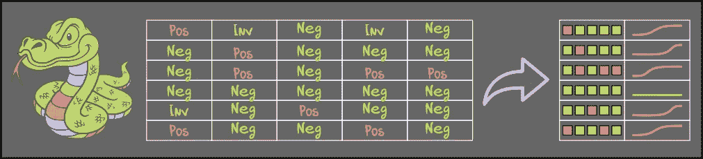
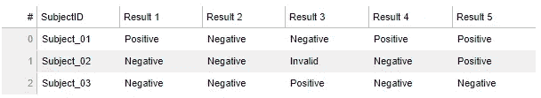
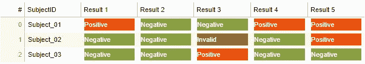
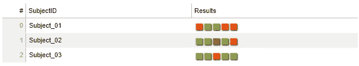
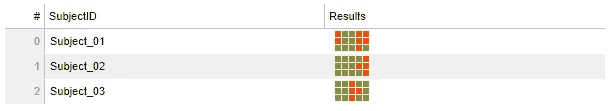
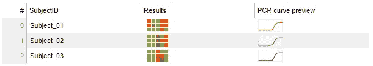

# 使用散景和 svg 惊艳表格

> 原文：<https://towardsdatascience.com/stunning-tables-using-bokeh-and-svg-e612a6f1c541?source=collection_archive---------8----------------------->

## 清晰简洁的数据展示

作者插图

你是否曾经处理过复杂的数据，却在简洁的可视化方面惨败？当然，这是我每天遇到的最大挑战之一，我也看到我的许多同事在展示数据时很吃力。

在这篇文章中，我想给你一个简短的例子，说明如何使用 Bokeh DataTable 小部件及其内置的 HTMLTemplateFormatter 将表格数据与预览可视化相结合。

## 简单散景数据表

我们将开始创建一个简单的散景数据表，它有六列，其中五列包含某个主题的结果。

没有任何格式的简单散景表格

您可能会意识到，即使只有三个结果，也很难识别结果模式。我们可以尝试的第一件事是添加单元格格式(例如字体颜色或背景颜色)。

## 颜色单元格格式

下面是根据值有条件地更改背景颜色的一些代码(灵感来自[https://stack overflow . com/questions/42740477/bokeh-datatable-with-conditionally-colored-cells/42742954 # 42742954](https://stackoverflow.com/questions/42740477/bokeh-datatable-with-conditionally-coloured-cells/42742954#42742954)):

应用值相关的 HTMLTemplateFormatter 后的表

这看起来好多了，但是让我们试着让它看起来更简洁。

## 使用 unicodes 汇总数据

为此，我们将创建一个新的 pandas 列，包含表示结果 1 到 5 的 html 代码，并使用“■”(■)字符来表示每个结果。

创建 HTML 摘要列后的表

这看起来很棒，而且不用把眼睛从一列移到另一列，也很容易识别结果模式。

## 使用 svg 的复杂结果模式

最后，让我们将数据变得更复杂(15 个结果列)，并绘制一些自定义 svg 来汇总数据。

使用 HTML 和 svg 的 3x5 结果可视化表

以 3x5 模式总结的 15 个结果。这比遍历 15 个单独的结果列要容易得多。

## 通过 svg 多段线预览 PCR 曲线

您可以进一步自定义散景数据表，创建小型 svg 图。让我们假设我们的结果是新型冠状病毒和其他病原体的 PCR 结果。得到一个小小的 PCR 曲线预览不是很好吗？这是如何实现的。

使用 HTML 和 svg 的 3x5 结果可视化和 PCR 曲线预览表

定制表格数据的可视化是一个很好的工具，可以用一种简单明了的方式呈现数据。散景数据表小部件是一个伟大的工具，让您可以自由定制。非常感谢散景团队。