# 如何设计熊猫图和图表的样式

> 原文：<https://towardsdatascience.com/styling-pandas-plots-and-charts-9b4721e9e597?source=collection_archive---------18----------------------->

## 用现成的样式表定制你的熊猫图——或者设计你自己的

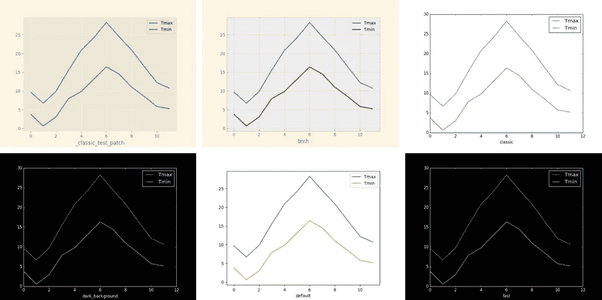

*mathplotlib* 样式—作者图片

网站、出版物和新闻来源都有自己的风格。看看英国广播公司(BBC)或《纽约时报》(NewYork Times)发布的金融数据。或者内特·西尔弗的 538 网站上的投票数据。它们每个都有清晰一致的外观。

我们将看看如何用我们的熊猫图表和情节实现类似的东西。首先，通过使用我们可用的内置样式，然后看看如何创建我们自己的定制。

默认样式呈现如下图所示的折线图。这是一个干净的图像，但如果你喜欢不同的东西，还有几个内置的风格。


默认样式—按作者分类的图像

要获得 Mathplotlib 中所有可用样式的列表，请使用以下命令。

```
plt.style.available
```

您将得到如下所示的列表(注意，不同版本的 mathplotlib 可能有不同的样式，这些样式包含在我的 matplotlib 3.3.4 系统中)

```
['Solarize_Light2',
 '_classic_test_patch',
 'bmh',
 'classic',
 'dark_background',
 'fast',
 'fivethirtyeight',
 'ggplot',
 'grayscale',
 'seaborn',
 'seaborn-bright',
 'seaborn-colorblind',
 'seaborn-dark',
 'seaborn-dark-palette',
 'seaborn-darkgrid',
 'seaborn-deep',
 'seaborn-muted',
 'seaborn-notebook',
 'seaborn-paper',
 'seaborn-pastel',
 'seaborn-poster',
 'seaborn-talk',
 'seaborn-ticks',
 'seaborn-white',
 'seaborn-whitegrid',
 'tableau-colorblind10']
```

在开始绘图之前，您可以通过执行这样的代码来更改特定的样式。

```
matplotlib.style.use('ggplot')
```

这将选择 *ggplot* 样式，它会给你一个类似下图的图形。

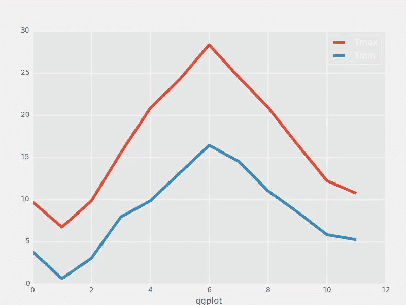

一个 ggplot 样式的图表—作者图片

已经为绘图包 Seaborn 创建了许多样式，但是您可以将它们用于任何基于 mathplotlib 的绘图库。

其他样式是对其他绘图系统或网站的模拟。 *ggplot* 样式基于 R 语言中常用的 *ggplot2* 库。

在本文的最后，我附上了一个图片列表，展示了上面列表中的所有风格。

这里有一些代码，您可以尝试不同的风格。

```
import pandas as pd
import matplotlib
import matplotlib.pyplot as plt
import numpy as np# Change 'default' to the style that you want to try out
matplotlib.style.use('default')df = pd.DataFrame(np.random.rand(100, 2), columns=['x', 'y'])
df.plot.scatter(x='x', y='y')
```

该代码只生成两列随机数据，并绘制一个散点图。下面是我把*默认*改成 *dark_background 得到的结果。*

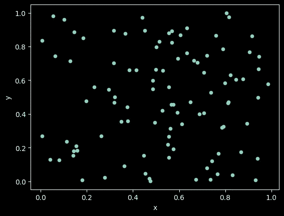

深色 _ 背景样式—按作者分类的图像

这是 *Solarize_Light2:*

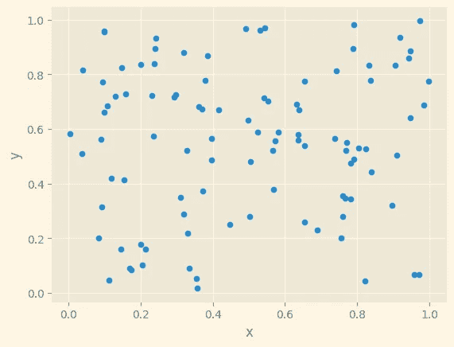

Solarize_Light2 样式-作者提供的图像

这就是我们如何改变到一个内置的风格，其中一个可能适合你的目的。或者你想更冒险一点。

## 更改单个属性

Matplotlib 图形的属性存储在名为 *rcParams* 的字典中。您可以通过在该字典中设置值来更改单个属性。因此，如果您想将字体大小从默认值 10 更改为更小的值，您可以这样做:

```
matplotlib.rcParams['font.size'] = 8
```

您所做的任何后续绘图的字体大小现在将为 8。

只需打印出来，就可以很容易地找到所有的 rcParams。

```
print(matplotlib.rcParams)
```

它们数量惊人，其中一些的目的并不明显，但这里有几个目的相当明确:

```
 'font.family': ['sans-serif'],
          'font.size': 10.0,
          'font.style': 'normal',
          'font.weight': 'normal',
          'lines.color': 'C0',
          'lines.linestyle': '-',
          'lines.linewidth': 1.5,
          'scatter.marker': 'o',
          'text.color': 'black',
```

下面是一个简短的程序，说明如何使用这些参数。我们将绘制一个散点图，如上图所示，但改变了一些参数。

```
matplotlib.rcParams['scatter.marker'] = '*'
matplotlib.rcParams['figure.facecolor'] = 'yellow'
matplotlib.rcParams['axes.facecolor'] = 'lightblue'
matplotlib.rcParams['font.family'] = 'serif'
matplotlib.rcParams['font.size'] = 8
matplotlib.rcParams['font.weight'] = 'bold'
matplotlib.rcParams['text.color'] = 'red'df.plot.scatter(x='x', y='y', title='Scatter graph')
plt.show()
```

这是结果:

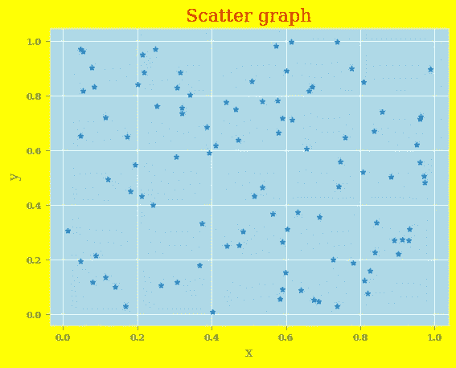

一种颇为可疑的定制风格——作者图片

您可以在生成的图表中看到每个参数的变化—这些参数的含义相当清楚。(顺便说一下，我并不是建议你采用这种特殊的配色方案！)

## 创建自己的样式表

你不必在你写的每个程序中都指定你想要的参数。您可以创建自己的样式表，并使用它来代替内置的样式表。

您所要做的就是创建一个文本文件，其中的 rcParams 按照您想要的方式进行设置，然后以类似于内置样式表的方式将它用作样式表，例如:

```
matplotlib.style.use('path-to-my-style-sheet')
```

当然，您不必指定所有的 rcParams，只需指定您想要更改的那些即可。

因此，如您所见，Matplotlib rcParams 允许您为熊猫图创建自己独特的、可重用的样式。

当然，这里的例子非常简单，但是您可以通过查看它们的源代码来探索如何在内置样式中使用这些参数。

## 样式库

你可以在 Matplotlib Github 库的 [Stylelib 文件夹](https://github.com/matplotlib/matplotlib/tree/master/lib/matplotlib/mpl-data/stylelib)中找到所有不同风格的代码。试着看看经典风格——这演示了设置几乎所有可能的参数，但你也应该看看其他一些。

最后，下面是与每个内置主题相关的图像。

一如既往，感谢阅读，我希望你发现这是有用的。如果你想知道我什么时候发表其他文章，请考虑订阅我的免费、不定期的简讯[这里](https://technofile.substack.com)。

## 内置主题

下面的三幅图像是在 *matplotlib* 版本 3.3.4 中使用内置主题渲染的相同图形。

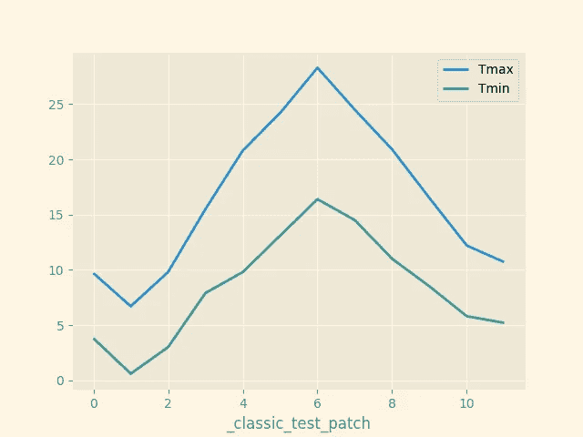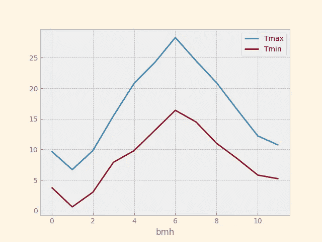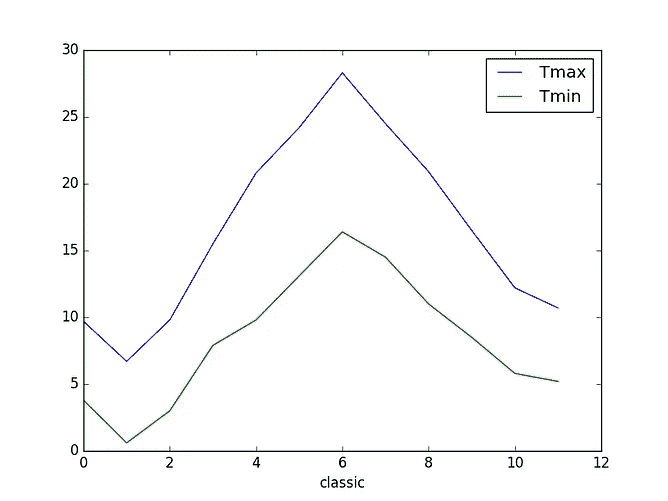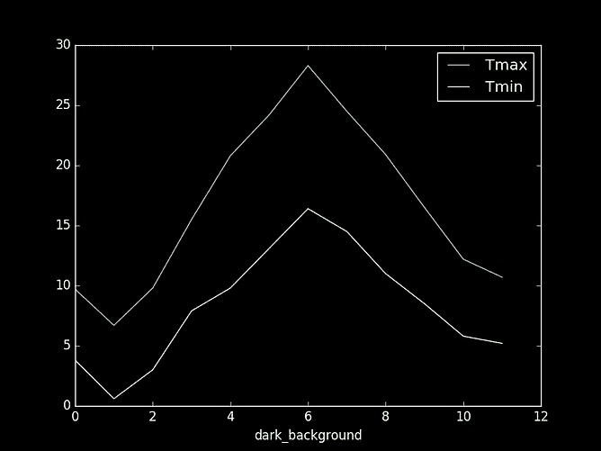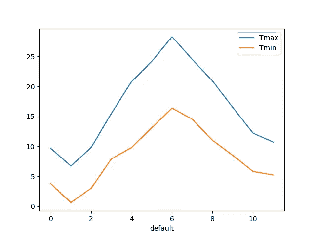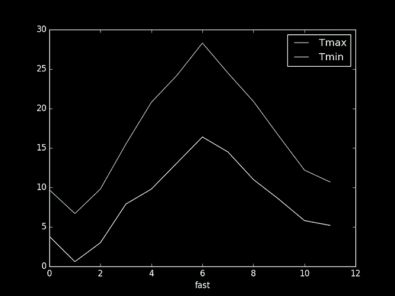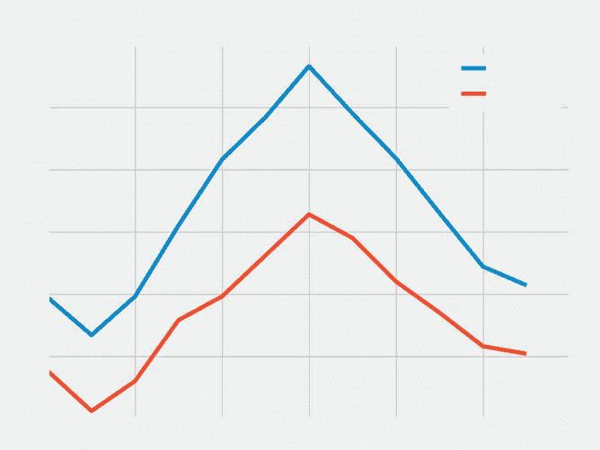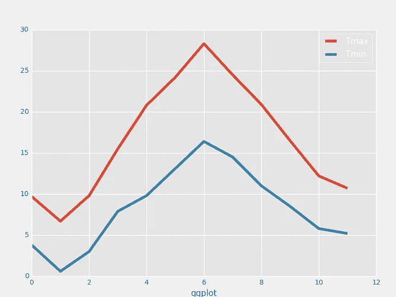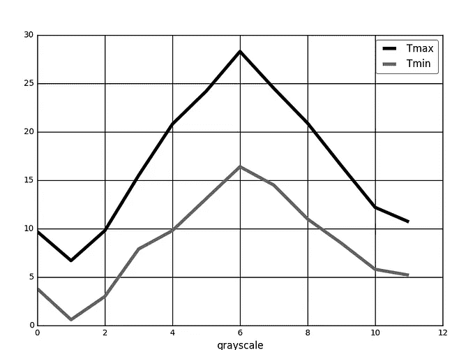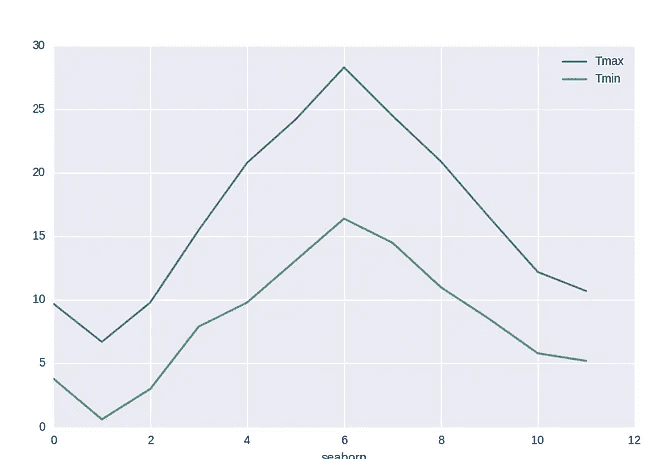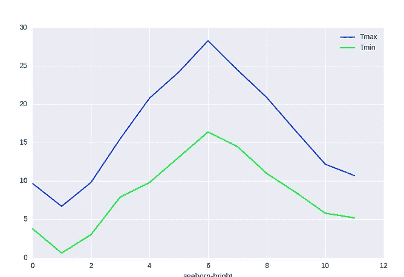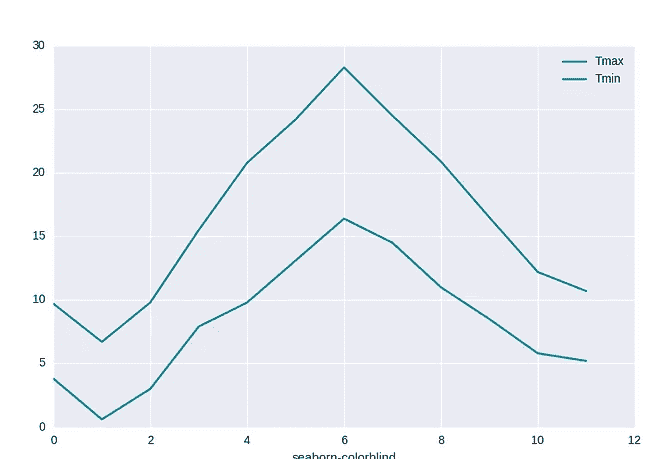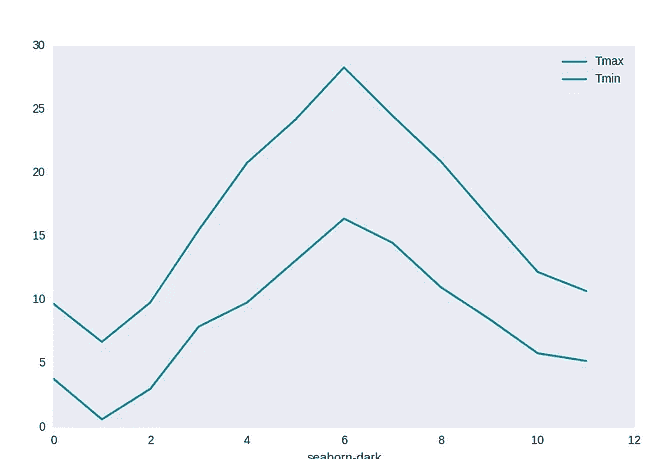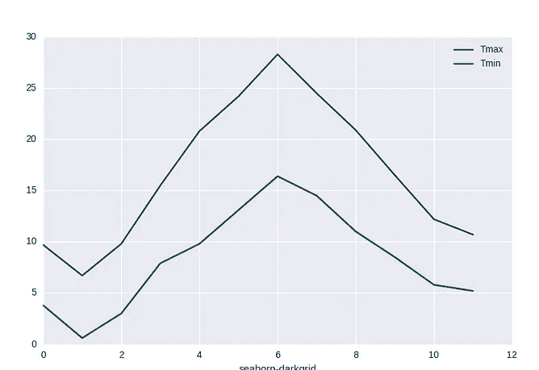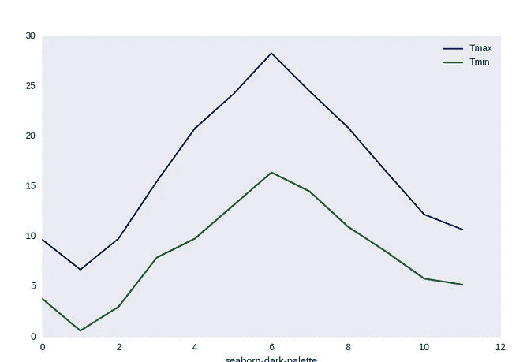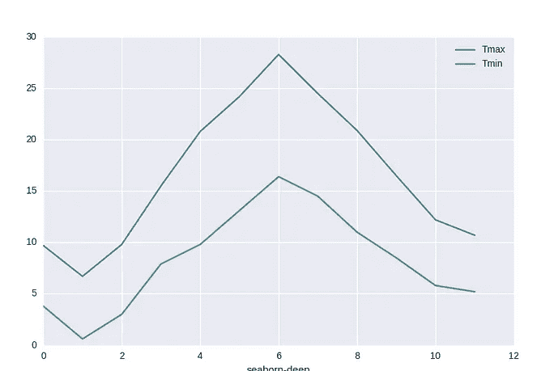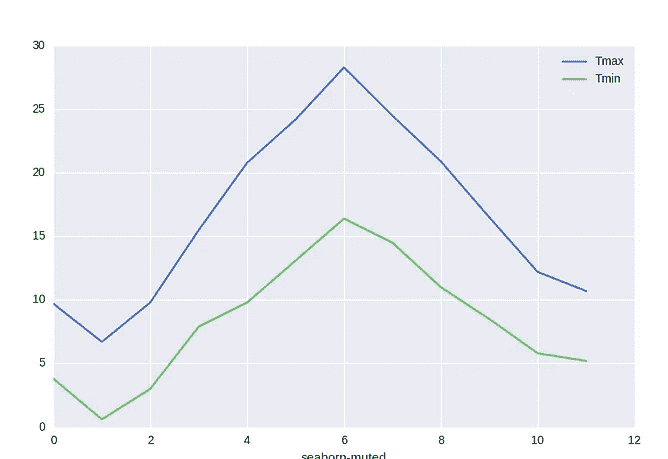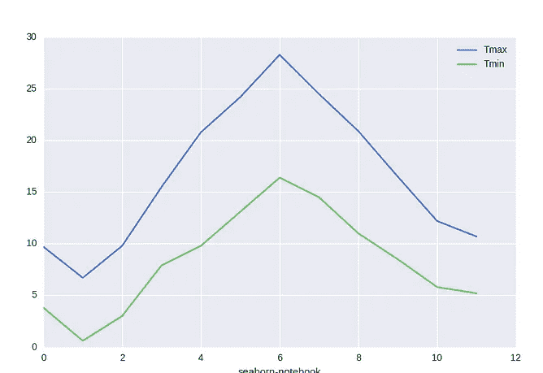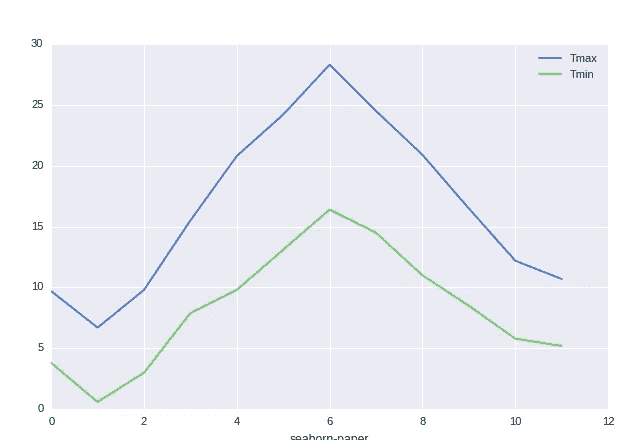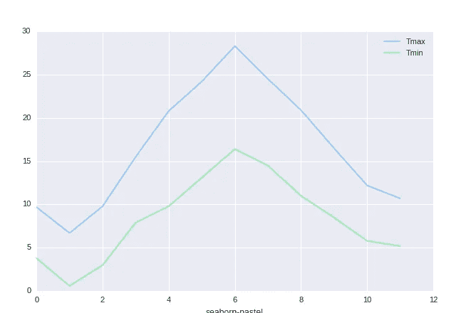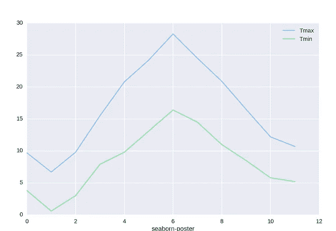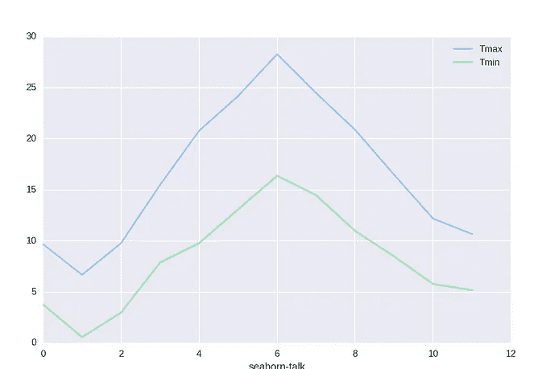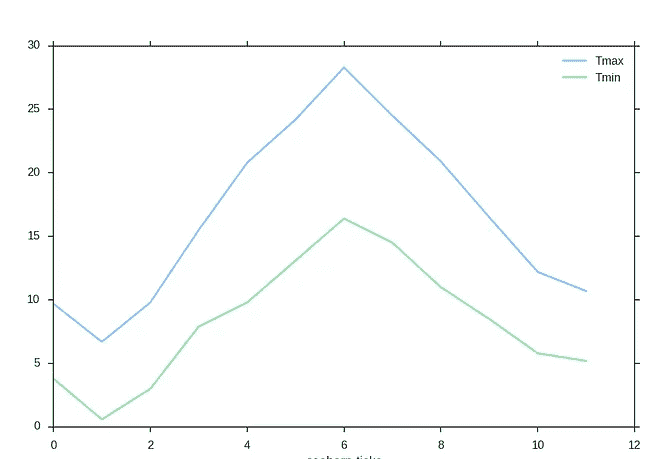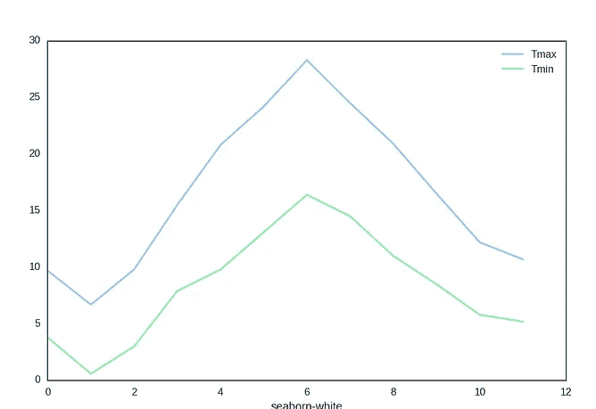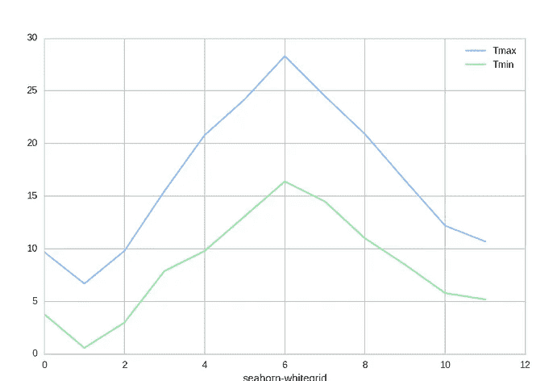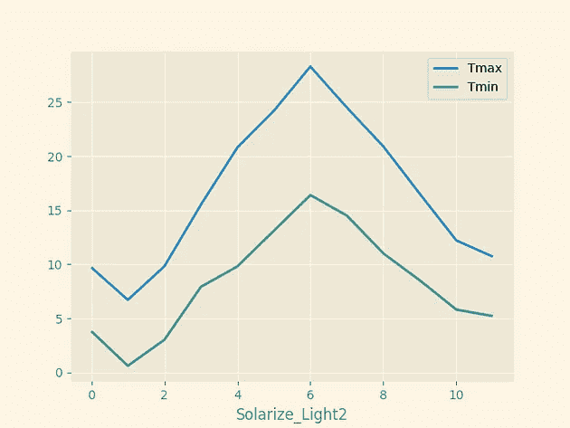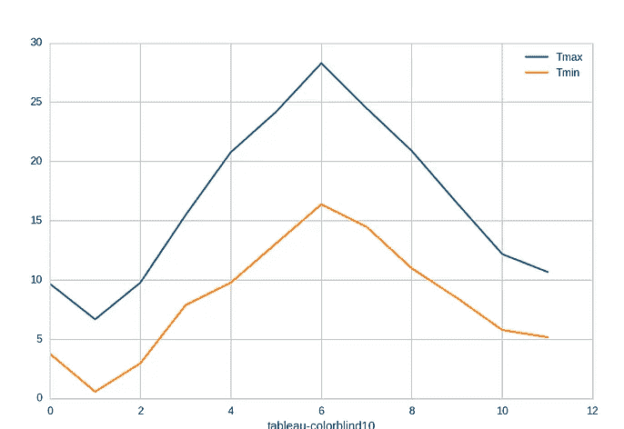

内置样式的图像—按作者分类的图像