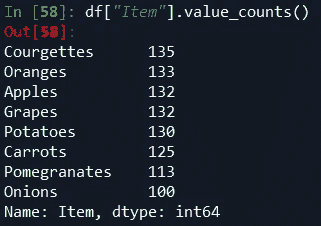
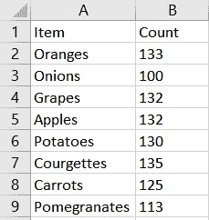
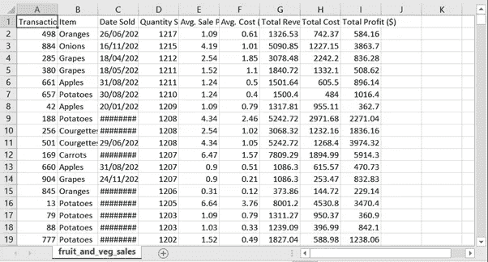
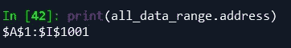
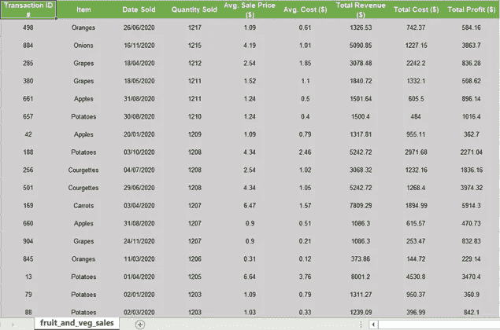
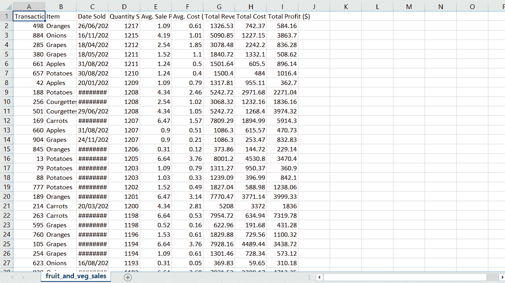

# 使用 Python 风格化和自动化您的 Excel 文件

> 原文：<https://towardsdatascience.com/stylize-and-automate-your-excel-files-with-python-cab49b57b25a?source=collection_archive---------1----------------------->

## Python + Excel

## 如何利用 Python 创建风格化的 Excel 报表使用 xlwings，初学者入门 Python 的一种方式。


在 [Unsplash](https://unsplash.com?utm_source=medium&utm_medium=referral) 上[的照片](https://unsplash.com/@ffstop?utm_source=medium&utm_medium=referral)

# 介绍

当您第一次踏上 Python 领域的旅程时，没有默认的网关可供选择。这种语言的典型应用范围从数据科学到机器学习到人工智能，以及其他许多流行词汇。虽然这些都是可以快速实现 Python 的很好的领域，但是对于大多数公司的绝大多数员工来说，它们并没有一个用例。金融服务以及其他行业仍然使用并严重依赖 Excel 进行基本的数据操作。考虑到 Python 多年来与这些复杂的主题建立的联系，任何以这种方式工作的人可能都不会考虑将 Python 作为一个潜在的解决方案。

我接触 Python 是因为需要最大限度地减少我在手工 Microsoft Excel 工作上投入的时间。重复性任务的自动化可以节省大量的工作时间，让您专注于手头更复杂的问题。VBA 似乎是加快这一工作流程的理想解决方案。

我花了几个月时间才学会并掌握了 VBA。但是，即使达到了这一能力点，仍然感觉有一个严格定义和限制这种方法的效率和效果的不灵活的上限。就在那时，我将注意力转向了 Python，没过多久，很明显 Python 就是我所需要的。

如果您发现自己每天都在使用 Excel，正在研究这些任务的自动化，并且现在正在尝试学习 VBA，这篇文章可能会改变您的行动方针。

# 为什么要用 Python 而不是 VBA Excel？

Python 包含大量内置于标准库中的强大包。此外，您还可以利用易于安装的第三方模块。与 VBA 相比，这些技术的结合可以显著减少所需的代码量以及执行代码所需的时间。一个简单的例子是证明这一点的最好方式。

您可以很容易地比较如何使用 VBA、Python 和 Pandas 来计算数据集中一列的每个唯一值。以下两种方法都是初学者可以实现的。

## **VBA**

这段代码利用了 Excel 的`=COUNTIF()`函数并将结果粘贴到一个新的工作簿中。

```
Sub Macro()Workbooks("Book1").Activate
    Workbooks("Book1").Sheets("fruit_and_veg_sales").Activate
    Columns("B:B").Select
    Selection.Copy
    Workbooks.Add
    ActiveSheet.Paste
    Application.CutCopyMode = False
    ActiveSheet.Range("$A:$A").RemoveDuplicates Columns:=1,  Header:=xlNoRange("B1") = "Count"
    Range("B2").Formula = "=COUNTIF([Book1]fruit_and_veg_sales!$B:$B,A2)"
    Range("B2").Copy
    Range("B2:B" & ActiveSheet.UsedRange.Rows.Count).PasteSpecial xlPasteAll
    Calculate
    Range("B2:B" & ActiveSheet.UsedRange.Rows.Count).Copy
    Range("B2:B" & ActiveSheet.UsedRange.Rows.Count).PasteSpecial xlPasteValues
    Application.CutCopyMode = False

End Sub
```

## **Python**

在 Python 中使用熊猫是你所需要的。(它还将这些值作为额外的好处进行排序)



按作者分类的图像|唯一值计数输出:Python(左)、Excel(右)

利用 Python 中已经可用的包并将最终数据输出到 Excel 可以加快整个自动化过程，同时保持数据的所有常规用户的输出一致。这里节省的时间不仅是通过编写更少的代码行，而且是通过编写更容易理解的代码。

> 这可以为您和您代码的未来用户节省大量时间。

你现在可以看到，Python 对于初学者来说是一门更容易掌握的语言。对于那些仍然不愿冒险尝试的人来说，能够与 Excel 集成，使用自己熟悉的界面，是让自己轻松学习 Python 的最佳方式。

在您迈出 Python 和 Excel 的第一小步后，不久您就会大步迈向将该语言用于 SQL 数据库、从网站抓取数据和创建仪表板。所有这些都可以通过 Python 模块轻松实现。

开始学习 Python 是学习这些额外技能的一个很好的开端！

# xlwings

现在，我们如何开始创建这个报告呢？

*提示 xlwings…*

xlwings 是一个开源 Python 库，允许使用 Python 代码轻松操作和自动化 Excel。xlwings 能够利用 Python 的科学包(NumPy、Pandas、SciPy、scikit-learn 等。)，用 Python 代替 VBA 编写工具，用 Python 创建用户自定义函数在 Excel 中使用。您甚至可以创建仪表板来在线访问您的 Excel 数据！总之，xlwings 能够显著提升您当前的 Excel 工具包和工作流程！

如果您首选的 Python 安装方法是 Anaconda，那么从 2020 年 11 月的发行版开始，xlwings 0.20.8 已经内置在 Anaconda 的预安装包中。这意味着如果您通过 Anaconda 安装 Python，您将自动能够导入和使用 xlwings。

如果你还没有预装的话`pip install xlwings`会带你去那里。

xlwings 在基于 Excel 的工作自动化和报告创建方面对我非常有用。能够使用 Python 并与 Excel 交互使我能够将时间集中在学习更复杂的编码主题上，同时将 Excel 推向更次要的角色。

# 将数据格式化成可展示的报告

我创建了一个 csv 格式的水果和蔬菜销售测试数据集，用于本教程。

可以从 Github 下载数据:[链接](https://github.com/Nishan-Pradhan/xlwings_report)

## **创建报告的步骤！**

1.  进口熊猫和 xlwings。在本教程中，我们将重点关注 xlwings。Pandas 将仅用于将我们的数据快速导入 Python。

```
import pandas as pd
Import xlwings as xw
```

2.我们现在使用 Pandas 将 csv 文件作为数据帧导入。

```
df = pd.read_csv(r”path_to_csv/fruit_and_veg_sales.csv”)
```

**提示:**您也可以通过运行下面的代码行直接从 Github 读取 csv 文件`df = pd.read_csv(r"https://raw.githubusercontent.com/Nishan-Pradhan/xlwings_report/master/fruit_and_veg_sales.csv")`

现在我们有了 Python 中的数据，您可以自由地进行任何操作或进一步的计算。出于本教程的目的，我们将保持数据原样。

3.初始化 Excel 工作簿。

```
wb = xw.Book()
```

这里我们将我们的工作簿命名为`wb`，并使用 xlwings `Book()`来初始化我们的 Excel 工作簿。

4.接下来，我们将工作表引用设置为变量，并更改工作表的名称。

```
sht = wb.sheets["Sheet1"]
sht.name = "fruit_and_veg_sales"
```

这里，我们将对 Excel Sheet1 的引用设置为`sht`，并将 Sheet1 重命名为 fruit_and_veg_sales。

5.我们现在有了 Python 中的水果和蔬菜销售数据框架，并有了一个打开的 Excel 工作簿，其中有一个名为“fruit_and_veg_sales”的工作表。下一步是将我们的数据从 Python 导出并导入 Excel。我们通过调用:

```
sht.range("A1").options(index=False).value = df
```

如果你了解 VBA，你应该能认出熟悉的语法`sht.range("A1")`。这里，为了将我们的 DataFrame `df`放入我们的 Excel 文档，我们指定了放置数据的位置(在本例中是单元格“A1”)。

`.options(index=False)`避免复制不需要的索引。如果您需要数据帧的索引，您可以删除这部分行，因为默认情况下这是`True` ，即`sht.range("A1").value = df`。

**不要忘记包含** `.value`，如果不指定，你会得到一个类似于`SyntaxError: can't assign a function to a call`的语法错误。`.value`告诉 xlwings 您正在讨论 Excel 单元格中的值，而不是我们稍后将触及的任何其他属性。

6.现在，您应该看到一个 Excel 文件，其中包含完全无格式的数据。



作者图片|插入数据的 Excel 工作表

7.我们已经将数据从 Python 导入 Excel。现在我们将开始格式化！

在 Excel 中设置数据格式时，首先要做的是选择要设置格式的数据。为了在 xlwings 中做到这一点，我们将创建一个与工作表中的范围相关的变量。

```
all_data_range = sht.range("A1").expand('table')
```

这里使用`sht.range("A1").expand('table')`我们基本上是从单元格 A1 开始，然后按 CTRL + SHIFT + ↓(向下箭头)然后 CTRL + SHIFT + →(向右箭头)来选择我们的数据(窗口)。这将选择范围 A1:I1001，该范围引用被保存到名为`all_data_range`的变量中。

要检查 Python 中的变量引用了哪个范围，请运行`print(all_data_range.address)`。



按作者分类的图片| range.address 示例

8.设置好范围参考变量后，我们现在可以开始设计我们的报告了。我们将从数据的行高和列高开始。

```
all_data_range.row_height = 22.5
all_data_range.column_width = 12
```

22.5 和 12 指的是 Excel 的尺寸，根据微软文档，这是“默认字体的字符”。

9.接下来，我们将改变单元格的背景颜色。为此，我们将在元组中使用 RGB 颜色。

```
all_data_range.color = (208,206,206)
```

这将把我们产品系列的背景颜色变成浅灰色。

10.要编辑我们的文本，所需的函数略有不同。我们将使用 xlwings 来调用微软的 Excel api。这将几乎等同于使用 VBA。

```
all_data_range.api.Font.Name = 'Arial'
all_data_range.api.Font.Size = 8all_data_range.api.HorizontalAlignment = xw.constants.HAlign.xlHAlignCenterall_data_range.api.VerticalAlignment = xw.constants.HAlign.xlHAlignCenterall_data_range.api.WrapText = True
```

这里，我们将数据的字体更改为 Arial，将字体大小设置为 8，使我们的文本中心水平和垂直对齐，最后，打开 Wrap Text 以查看单元格中的所有文本。

11.为了让我们的表格看起来更有吸引力，我们将添加一些颜色并格式化我们的标题。

```
header_range = sht.range("A1").expand('right')
header_range.color = (112,173,71)
header_range.api.Font.Color = 0xFFFFFF
header_range.api.Font.Bold = True
header_range.api.Font.Size = 9
```

这个块像我们以前做的那样选择一个范围。这一选择的主要区别是我们使用`.expand('right')`只控制+ SHFT + →(右箭头)。这允许我们从单元格 A1 开始，选择“I1 ”,这只是我们在 Excel 中的标题列。

这里的另一个不同是，我们选择将字体颜色改为白色。为此，我们用十六进制代码`0xFFFFFF`指定了颜色。



作者图片|半格式化文档

12.我们现在将格式化我们的交易 ID 号列。我想把这个涂成浅绿色。我们可以使用前面提到的 RGB 方法来实现这一点。这次我们将从单元格 A2 中选择`expand('down')`。

```
id_column_range = sht.range("A2").expand('down')
id_column_range.color=(198,224,180)
```

13.下一步将只改变我们的数据的边框颜色(不是标题列或交易 ID#列)。微软的 api 在处理边框时有点笨拙，但是他们的文档[已经足够了。](https://docs.microsoft.com/en-us/office/vba/api/excel.xlbordersindex)

概括地说，上、下、左、右边界分别用数字 7、8、9、10 表示。

```
data_ex_headers_range = sht.range("A2").expand('table')for border_id in range(7,13):
    data_ex_headers_range.api.Borders(border_id).Weight = 2
    data_ex_headers_range.api.Borders(border_id).Color = 0xFFFFFF
```

14.最后一步是保存我们的报告。调用`wb.save()`，指定你想要保存的路径和想要的文件名。记得以文件类型结束文件名。在这种情况下，我们选择`.xlsx`来保留所有的格式。

```
wb.save(r"path_to_folder\fruit_and_veg_report.xlsx")
```

## 奖金！

作为一个额外的补充，我们也将改变标签颜色为绿色。

```
sht.api.Tab.Color = 0x70AD47
```



GIF by Author |使用 xlwings 格式化的 Excel 表格

# 结论

在几行简单的代码中，我们成功地为最终用户创建了一个格式简洁、可展示的 Excel 文档。本教程应该给你足够的 xlwings 构建块，让你得到创意，做出自己的美观的报告！尝试插入空白行，改变字体大小，背景颜色，边框粗细和边框颜色，使您的报告看起来更好！

这仅仅是使用 Python 和 xlwings 所能实现的开始！

本教程中使用的代码可以从 Github [这里](https://github.com/Nishan-Pradhan/xlwings_report/)获得

如果你被卡住了，查看 xlwings 文档[这里](https://docs.xlwings.org/en/stable/)

如果你还有任何问题，请在下面的评论区留言。

如果你想在这篇文章中学到的编码技巧的基础上再接再厉:

[](/automate-your-excel-report-by-creating-a-summary-sheet-using-python-6fdb26480c3b) [## 通过使用 Python 创建摘要表来自动化您的 Excel 报表

### 协调 Python 和 Excel，用可展示的专业格式总结您的数据。

towardsdatascience.com](/automate-your-excel-report-by-creating-a-summary-sheet-using-python-6fdb26480c3b) 

*注:本文仅代表个人观点和经验。*