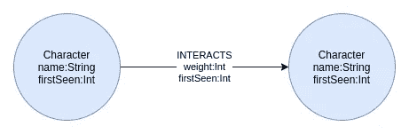

# Neo4j 图形数据科学库中的子图过滤

> 原文：<https://towardsdatascience.com/subgraph-filtering-in-neo4j-graph-data-science-library-f0676d8d6134?source=collection_archive---------6----------------------->

自从我在 [Neo4j 图形数据科学库](https://neo4j.com/docs/graph-data-science/current/) (GDS)中写了一篇关于新特性的文章已经有一段时间了。对于那些从未听说过 GDS 库的人来说，它有 50 多种图形算法，从社区检测到节点嵌入算法等等。在这篇博文中，我将展示[子图过滤](https://neo4j.com/docs/graph-data-science/current/management-ops/graph-catalog-ops/#catalog-graph-create-subgraph)，这是该库的新特性之一。为了快速概括 GDS 图书馆的工作方式，让我们看看下图:


投影图模型。经[许可添加图片 https://neo4j . com/docs/graph-data-science/current/common-usage/](https://neo4j.com/docs/graph-data-science/current/common-usage/)。

Neo4j 图形数据科学库使用图形加载器组件来投影内存中的图形。内存中的项目图形与 Neo4j 数据库中存储的图形是分开的。然后，GDS 库使用内存中的图形投影(针对拓扑和属性查找操作进行了优化)来执行图形算法。您可以使用[本机](https://neo4j.com/docs/graph-data-science/current/management-ops/native-projection/)或 [Cypher projections](https://neo4j.com/docs/graph-data-science/current/management-ops/cypher-projection/) 来投影内存中的图形。此外，**子图过滤**允许您基于现有的投影图创建新的投影内存图。例如，您可以投影一个图，确定该网络中弱连接的组件，然后使用子图过滤来创建一个新的投影图，该图只包含网络中最大的组件。这使您的图形数据科学工作流程更加顺畅，您不必将中间结果存储回数据库，然后使用 Graph Loader 来投影新的内存图形。

## 图形模型

在这篇博文中，我们将使用我在之前的[博文](https://medium.com/neo4j/turn-a-harry-potter-book-into-a-knowledge-graph-ffc1c45afcc8)中创建的哈利波特网络数据集。它由《哈利·波特与魔法石》中人物之间的互动组成。



图形模式。图片由作者提供。

图表模式相对简单。它由角色和他们的互动组成。我们知道人物的名字，以及他们第一次出现在书中的时间(firstSeen)。交互关系保存关于两个角色交互的次数(权重)和他们第一次交互的时间(第一次看到)的信息。如果你想继续这篇文章中的练习，我建议你使用 Neo4j 沙盒并选择一个*空白项目*。


选择一个空白项目。图片由作者提供。

[Neo4j 沙箱](https://neo4j.com/sandbox/)提供免费的 Neo4j 数据库云实例，预装 APOC 和 GDS 库。然而，如果你想要 Neo4j 数据库的本地设置，我有[的另一篇博文](/twitchverse-a-network-analysis-of-twitch-universe-using-neo4j-graph-data-science-d7218b4453ff)，在那里我描述了如何开始使用 Neo4j 桌面。

要导入 HP 交互网络，您需要执行以下两个 Cypher 查询。

导入字符:

```
LOAD CSV WITH HEADERS FROM "https://raw.githubusercontent.com/tomasonjo/blog-datasets/main/HP/character_first_seen.csv" as row
MERGE (c:Character{name:row.name})
SET c.firstSeen = toInteger(row.value)
```

导入交互:

```
LOAD CSV WITH HEADERS FROM "https://raw.githubusercontent.com/tomasonjo/blog-datasets/main/HP/HP_rels.csv" as row
MATCH (s:Character{name:row.source})
MATCH (t:Character{name:row.target})
MERGE (s)-[i:INTERACTS]->(t)
SET i.weight = toInteger(row.weight),
    i.firstSeen = toInteger(row.first_seen)
```

导入数据集后，可以使用以下查询检查样本子图:

```
MATCH p=(:Character)-[:INTERACTS]->(:Character)
RETURN p LIMIT 25
```

您应该会在 Neo4j 浏览器中看到类似的可视化效果:


哈利波特网络的样本子图。图片由作者提供。

## 子图过滤

如前所述，这篇博文的目的是展示子图过滤的威力。我们不会深入研究具体的算法以及它们是如何工作的。我们将从使用本机投影来投影内存中的图形开始。

```
CALL gds.graph.create('interactions',
  'Character',
  {INTERACTS : {orientation:'UNDIRECTED'}},
  {nodeProperties:['firstSeen'], 
   relationshipProperties: ['firstSeen', 'weight']})
```

我们在“交互”名称下投影了一个内存中的图形。投影的图形包括所有角色节点及其第一次看到的属性。我们还定义了我们希望将交互关系投影为无向的，并且包括 firstSeen 和 weight 属性。

现在我们已经有了投影的命名图，我们可以继续在它上面执行任何图算法。这里，我选择运行弱连通分量算法(WCC)。WCC 算法用于识别网络中断开的部分，也称为组件。

```
CALL gds.wcc.stats('interactions')
YIELD componentCount, componentDistribution
```

结果


WCC 结果。图片由作者提供。

当您只对结果的高级概述感兴趣，并且不希望将结果存储回 Neo4j 或投影图时，您可以使用算法的 *stats* 模式。我们可以观察到我们的网络中有四个组件，最大的有 110 个成员。现在，我们将从子图过滤开始。子图过滤过程的语法如下:

```
CALL gds.beta.graph.subgraph(
  graphName: String, -> name of the new projected graph
  fromGraphName: String, -> name of the existing projected graph
  nodeFilter: String, -> predicate used to filter nodes
  relationshipFilter: String -> predicate used to filter relationships
)
```

您可以使用 *nodeFilter* 参数根据节点属性或标签过滤节点。类似地，您可以使用 *relationshipFilter* 参数根据它们的属性和类型来过滤关系。在我们的惠普网络中只有一个节点标签和关系类型，因此我们将只关注按属性过滤。

首先，我们将使用子图过滤来创建一个新的投影内存图，该图只保存权重属性大于 1 的关系。

```
CALL gds.beta.graph.create.subgraph(
  'wgt1', // name of the new projected graph
  'interactions', // name of the existing projected graph
  '*', // node predicate filter
  'r.weight > 1' // relationship predicate filter
)
```

通配符操作符`*`用于定义我们不想应用任何过滤。在这种情况下，我们只过滤了关系，但保留了所有节点。谓词语法类似于 Cypher query。关系实体总是用`r`标识，节点实体用变量`n`标识。

我们可以继续对使用子图过滤创建的新内存图运行 WCC 算法。由于缺乏更好的命名法，它以`wgt1`的名字出现。

```
CALL gds.wcc.mutate('wgt1', {mutateProperty:'wcc'})
YIELD componentCount, componentDistribution
```

结果


WCC 算法的结果。图片由作者提供。

过滤后的投影图有 43 个分量。这是合理的，因为我们忽略了所有具有等于或小于 1 的*权重*属性的关系，但是保留了所有节点。我们已经使用算法的 *mutate* 模式将结果写回到投影的内存图形中。

假设我们现在只想在图的最大部分上运行特征向量中心性。首先，我们需要识别最大组件的 ID。WCC 算法的结果存储在投影的内存图中，所以我们需要使用`gds.graph.streamNodeProperties`过程来访问 WCC 结果并识别最大的组件。

```
CALL gds.graph.streamNodeProperties('wgt1', ['wcc']) 
YIELD propertyValue
RETURN propertyValue as component, count(*) as componentSize
ORDER BY componentSize DESC 
LIMIT 5
```

结果

正如我们之前看到的，最大的组件有 78 个成员，其 id 为 0。我们可以使用子图过滤特性来创建一个新的投影内存图，它只包含最大组件中的节点。

```
CALL gds.beta.graph.create.subgraph(
  'largest_community', 
  'wgt1',
  'n.wcc = 0', 
  '*'
)
```

现在，我们可以通过只对最大分量运行特征向量中心性来完成我们的任务。

```
CALL gds.eigenvector.stream('largest_community')
YIELD nodeId, score
RETURN gds.util.asNode(nodeId).name as character, score
ORDER BY score DESC
LIMIT 5
```

结果

在哈利波特的世界里，哈利波特很有可能永远独占鳌头。我们已经完成了两个子图过滤步骤，所以你可能会弄不清现在投影的是什么版本的网络。GDS 图书馆提供了一个`gds.graph.export`特性，允许您在同一个 Neo4j 服务器中将投影图导出为一个单独的数据库实例。

```
CALL gds.graph.export('largest_community', { dbName: 'lc1' });
```

在 Neo4j 浏览器中访问新的数据库实例之前，您需要运行以下命令:

```
CREATE DATABASE lc1;
```

现在您可以在数据库下拉菜单中选择`lc1`数据库并检查其内容。


数据库下拉菜单。图片由作者提供。

我不知道为什么，但是沙盒实例不能很好地处理图形导出，而本地桌面版本则可以。目前，您不能将字符串属性导出到单独的数据库中。然而，我通过小道消息得知，很快就会支持投影内存图中的字符串属性。

在最后一个例子中，我将展示如何使用*和*或*或*逻辑运算符组合多个节点和关系谓词。首先，我们将在交互网络上运行度中心性，并使用 mutate 模式将结果存储到投影图中。

```
CALL gds.degree.mutate('interactions',
  {mutateProperty:'degree'})
```

现在我们可以通过使用多个节点和关系谓词来过滤子图:

```
CALL gds.beta.graph.create.subgraph(
  'first_half', // new projected graph
  'interactions', // existing projected graph
  'n.firstSeen < 35583 AND n.degree > 2', // node predicates
  'r.weight > 5' // relationship predicates
)
```

在节点谓词中，我们选择了度数值大于 2 且第一次看到的属性小于 35583 的节点。对于关系谓词，我只选择了权重大于 5 的关系。我们可以在新过滤的内存子图上运行任何图形算法:

```
CALL gds.eigenvector.stream('first_half')
YIELD nodeId, score
RETURN gds.util.asNode(nodeId).name as character, score
ORDER BY score
DESC LIMIT 5
```

结果

最后，当您完成图形分析后，可以使用下面的 Cypher 查询删除所有投影的内存中图形:

```
CALL gds.graph.list() YIELD graphName
CALL gds.graph.drop(graphName)
YIELD database
RETURN 'dropped ' + graphName
```

## 结论

子图过滤是对 GDS 库的一个很好的补充，允许更平滑的工作流程。您可以使用子图过滤来过滤现有的内存图，而不必将 algoritm 结果存储回 Neo4j 并使用 Native 或 Cypher 投影来创建新的内存图。在 [Neo4j 沙盒](https://neo4j.com/sandbox/)上试试吧，让我知道效果如何！

和往常一样，代码可以在 [GitHub](https://github.com/tomasonjo/blogs/blob/master/subgraph_filtering/Subgraph%20filtering.ipynb) 上获得。