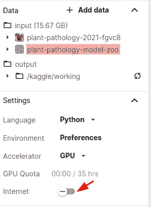
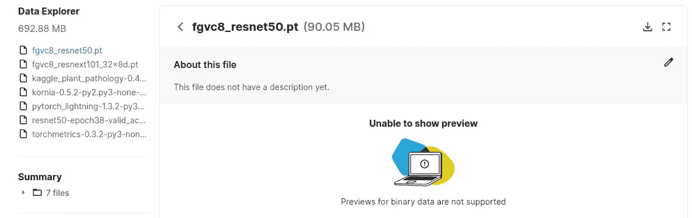
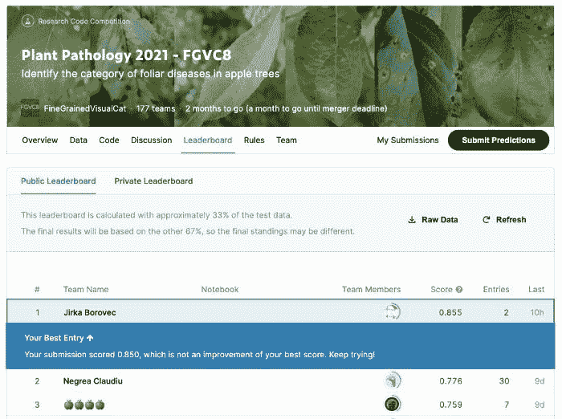

# 向 Kaggle 竞赛提交离线内核指南

> 原文：<https://towardsdatascience.com/submitting-model-predictions-to-kaggle-competition-ccb64b17132e?source=collection_archive---------18----------------------->


插图照片由[亚历克斯·安德鲁斯](https://www.pexels.com/@alex-andrews-271121?utm_content=attributionCopyText&utm_medium=referral&utm_source=pexels)从[派克斯](https://www.pexels.com/photo/three-men-riding-on-go-karts-861464/?utm_content=attributionCopyText&utm_medium=referral&utm_source=pexels)拍摄

## 这篇文章展示了如何为需要离线环境的竞赛提交创建一个简单的 Kaggle 内核

在[之前的帖子](/hyperparameter-optimization-with-grid-ai-and-no-code-change-b89218d4ff49)中，我们谈到了对超参数搜索的需求，我们已经运行了 walked throw Grid.ai，这简化了云中的微调。我们甚至可以在线监控我们的训练，并最终根据我们的选择终止一些默认配置。

[](/hyperparameter-optimization-with-grid-ai-and-no-code-change-b89218d4ff49) [## 使用 Grid.ai 进行超参数优化，无需更改代码

### 用 PyTorch 闪电和网格点实例在 Kaggle 上排名的最佳实践(第 4/5 部分)

towardsdatascience.com](/hyperparameter-optimization-with-grid-ai-and-no-code-change-b89218d4ff49) 

现在我们有了最好的模型，是时候提交我们的结果了。这个挑战和其他几个挑战限制了对测试数据的访问，这意味着真正的测试数据集只提供给没有任何外部连接的独立预测运行。

# 将我们的模型提交给 Kaggle 竞赛

在这个挑战中，要求用户准备一个笔记本，该笔记本读取一个包含测试图像的文件夹，并将其预测保存到一个特定的`submission.csv`文件中。您可以在提供一些测试图像时调试流程，并且可以在交互式会话中使用内核。在执行最终评估时，虚拟测试文件夹被真实测试文件夹替换。

也就是说，用户通常有两个选择——准备一个内核:
a)进行完整的训练，然后对测试图像进行预测；
b)使用保存的检查点并仅执行预测。

用 a)场景进行多次迭代是困难的，尤其是因为 Kaggle 内核运行时是有限的。b)选项允许我们将繁重的计算工作外包给任何其他平台，然后带着经过训练的模型甚至模型集合回来。

## 为模型和包创建私有 Kaggle 数据集

对于测试数据泄漏，这些评估内核需要离线运行，这意味着我们必须在 Kaggle 工作空间中包含所有需要的包和检查点。



内核必须离线，因此我们需要添加一个带有模型的私有数据集。

为此，我们创建了私有存储(Kaggle 称之为 dataset，即使您几乎可以在那里拥有任何东西),在那里我们上传所需的包(所有需要的 python 包都不包括在默认的 Kaggle 内核中)和我们训练的模型——check point。



创建的数据集的快照，包括包和模型。

要安装所有软件包，您可以调用:

```
! pip install /kaggle/input/my-storage-name/*.whl
```

## 管理更大的依赖关系树

Kaggle 内核有丰富的标准机器学习库，大多数都包含在基本配置中。但是，很可能你的任务需要一些其他的库，只是不同的版本。在这种情况下，尝试安装一个顶级依赖项(您直接使用的包)是非常烦人的，因为缺少较低的依赖项，您需要下载、更新私有数据存储并再次运行安装。假设我们有可以安装的包，并且我们已经在标准`requirements.txt`中列出了我们所有的依赖项，那么这个问题可以通过一种巧妙的方式来解决。

1.  在本地创建自己的包`python setup.py bdist_wheel`
2.  本地下载依赖项
    `pip download -r requirements.txt -d package_freeze`
3.  [可选]您可以移除一些您知道包含在 Kaggle 中的标准重包，例如`torch`或`tensorflow`
4.  将所有源包重命名为 Kaggle 对所有档案文件进行递归提取，从而产生中断包
    `import glob, os, shutil`
    `pkgs = glob.glob("package_freeze/*.tar.gz")`
    `[shutil.move(p, p.replace(".tar.gz", ".xyz")) for p **in** pkgs]`
5.  将此文件夹上传到带有先前创建的自己的包`kaggle_plantpatho`的数据集 other
6.  在 Kaggle 内核中，重新命名软件包，并通过将依赖项指向我们在 Kaggle 上的文件夹来安装我们的软件包

```
! cp -r /kaggle/input/plant-pathology/package_freeze package_freeze

import glob, os, shutil
# finad all packages
pkgs = glob.glob("package_freeze/*.xyz")
# rename them back to correct name format
[shutil.move(p, p.replace(".xyz", ".tar.gz")) for p **in** pkgs]

! pip install -q kaggle_plantpatho --no-index \
    --find-link /kaggle/working/package_freeze
```

[](/easy-kaggle-offline-submission-with-chaining-kernels-30bba5ea5c4d) [## 带链接内核的简单 Kaggle 离线提交

### 一个简单的指南，帮助您使用 Kaggle 提交受限互联网接入的比赛…

towardsdatascience.com](/easy-kaggle-offline-submission-with-chaining-kernels-30bba5ea5c4d) 

## 准备简单的预测笔记本。

预测内核很简单，你可以在[这里](https://www.kaggle.com/jirkaborovec/plant-pathology-with-lightning-predictions)检查它。两个主要步骤(除了从存储器安装所有需要的包)如下:
1)加载保存的检查点，
2)对测试图像执行预测，
3)将它们保存到标准 CSV 文件。

检查点加载由本机 PyTorch 方法执行，并由我们的 Lightning 模型用`load_state_dict`解析。对于加载，我们建议坚持使用 CPU，以避免任何最终的副作用。

```
ckpt = torch.load(
    '/kaggle/input/plant-pathology-model-zoo/epoch=4-step=119.ckpt',
    map_location=torch.device('cpu')
)
# this can be any model as we caal load from checkpoint jsut after
model = MultiPlantPathology("resnet18")
model.load_state_dict(ckpt['state_dict'])
```

值得一提的是，我们的`PlantPathologyDM`还实现了探索测试文件夹来收集其中的所有图像。与解析训练数据集相反，我们返回与图像名称配对的图像数据，而不是标签(反正是未知的)。该预测对来自`test_dataloader`的所有图像进行迭代。并保存测试标签。最后，导出所有配对的图像名称和标签。

对所有测试图像运行预测

就是这样，现在制作这个内核和提交内核，看看你在排行榜上的得分如何！祝你好运！



使用基本型号 ResNet50 提交我们的首个多标签，挑战快照。

上一篇文章介绍了如何准备提交内核，适合在完全隔离的环境中运行。**跟着我学我吧！**

[](https://devblog.pytorchlightning.ai/practical-tips-to-rank-on-kaggle-image-challenges-with-lightning-242e2e533429) [## 用闪电挑战 Kaggle 图像的实用技巧

### 这篇文章概述了一些 PyTorch 闪电的最佳做法，从最近的 Kaggle 植物病理学图像分类…

devblog.pytorchlightning.ai](https://devblog.pytorchlightning.ai/practical-tips-to-rank-on-kaggle-image-challenges-with-lightning-242e2e533429) 

**敬请关注，并跟随我了解更多！**

[](https://devblog.pytorchlightning.ai/best-practices-to-rank-on-kaggle-competition-with-pytorch-lightning-and-grid-ai-spot-instances-54aa5248aa8e) [## 使用 PyTorch Lightning 和 Grid.ai Spot 实例对 Kaggle 竞争进行排名的最佳实践

### 通过交互式会话、超参数解决图像分类挑战的完整数据科学周期…

devblog.pytorchlightning.ai](https://devblog.pytorchlightning.ai/best-practices-to-rank-on-kaggle-competition-with-pytorch-lightning-and-grid-ai-spot-instances-54aa5248aa8e) 

# 关于作者

[**Jirka boro vec**](https://medium.com/@jborovec)**已经在几家不同的 IT 公司从事机器学习和数据科学工作好几年了。特别是，他喜欢探索有趣的世界问题，并用最先进的技术解决它们。此外，他还开发了几个开源 python 包，并积极参与了其他知名项目。在 [*Grid.ai*](https://www.grid.ai/) 工作，担任研究工程师，是[*pytorchlightning . ai*](https://pytorchlightning.ai/)的主要撰稿人。**