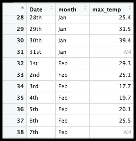
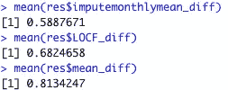

# 用群体平均值替代缺失数据:为什么要谨慎

> 原文：<https://towardsdatascience.com/substituting-missing-data-with-the-group-average-why-its-good-to-be-cautious-d64bead7a029?source=collection_archive---------19----------------------->

## 分类平均法可能比 LOCF 法或整体平均法更好，但这种方法有一些弱点，会影响你的结论。

休伊·费恩·泰

和格雷格·佩奇一起

约瑟芬·加塞在 [Unsplash](https://unsplash.com/s/photos/tennis?utm_source=unsplash&utm_medium=referral&utm_content=creditCopyText) 上的照片

网球巨星安德烈·阿加西已经习惯了炎热的天气。他在拉斯维加斯长大，那里的夏季平均气温高达 39 至 41 摄氏度(102 至 105 华氏度)。

因此，当一个适应了亚热带沙漠气候的人把澳大利亚墨尔本枯萎的夏天描述成一个“巨大的窑”时，这意味着一些事情。

在 2020 年澳大利亚网球公开赛期间，有一些惩罚的日子。例如，1 月 31 日，气温高达 42.9 摄氏度(109 华氏度)。但是，如果气象局的历史记录中没有这个值，并且没有其他方法可以找到，你就不会知道这一点。如果该年 2 月 7 日和其他 72 天的数据丢失，您将面临更多的问题。

虽然这是一个极不可能的场景，但是有几种方法可以用来对那些丢失的值进行最可能的猜测。

[**在之前的一篇文章**](https://hftdata.medium.com/when-a-crazy-wind-wipes-away-our-records-what-do-you-do-a9f2aab3dc17) 中，我介绍了另外两种插补方法:最后一次观察结转(LOCF)法，以及用整体数据集均值替换。在这里，我将演示另一种方法:用特定的组平均值来估算缺失值。

与使用整个数据集的平均值相比，使用特定组的平均值进行插补是一种更精确的方法。就像侦探在试图解决一个谜时会整合可用的线索一样，数据分析师可以使用组平均值来对替代 NAs 的可能价值做出更合理的估计。

例如，假设我们有大学学生的记录，这些记录的属性中包括“身高”和“性别”。还假设一些身高值缺失，而所有的性别值都是已知的。如果我们用每个性别类别的平均值估算缺失的身高值(男性 175 cm，女性 163 cm)，我们更有可能接近“真实”值，而不是用“一刀切”的方法估算整个数据集的平均值。

当然，范畴手段的运用还远远不够完善。正如上面描述的高度插补方法会遗漏异常值一样，使用这种方法计算每日高温也无法预测像 2020 年 1 月 31 日这样破坏图表的日子。但是通过用月平均值代替 NAs 特别是在一个气候季节性变化的地方——与年平均值相比，我们的替代值更有可能反映现实。

为了实现这一点，我使用 R 的 tidyverse 提供的 dplyr 包按月对数据进行分组。接下来，我用 mutate()函数将 *impute_monthlymean* 列添加到数据集。然后，我给出了 R 指令，说明在这个函数中要做什么，如下所示:

这种策略比用总体均值进行估计更准确。考虑一下:在整个数据集中，月平均插补值与观察值相差 0.59。与用全年平均温度代替所有缺失数据的生硬方法相比，这是 27.6% (.813-.589)/.813 的改进。

虽然基于类别的插补在上述三种方法中效果最好，但它并不总是理想的。例如，在某些情况下，研究人员旨在建立变量之间的相关性。简单地用该类别的平均值输入缺失值会改变相关分数，从而改变关于变量之间关系的结论。

此外，均值插补会扭曲该变量内的数值分布。即使使用类别平均值，它也会影响变量的标准差，以及从普通最小二乘回归等数学模型中得出的推论。同样，获得的见解也会有偏差，尤其是在原始数据集包含大量 NAs 的情况下。无论如何，对 NAs 进行任何形式的插补的研究者都应该清楚地说明这一点，以便所有的读者都能理解做了什么，为什么做，以及如何做。

医疗保健行业的许多研究人员避免均值估算，因为它可能对推断统计产生负面的“多米诺骨牌效应”(康，2013)。换句话说，在流程的某一步用平均值替换 NAs 的决定会影响后续步骤的结论。

因此，虽然缺失值会降低数据集的统计能力，从而导致令人头疼的问题，但在深入分析和建模之前，需要对缺失数据的处理进行深入思考。根据您分析的目的和数据的性质，默认使用简单的解决方案(如均值插补)可能会带来各种问题。

**参考:**

Kang，Hyun(2013 年 5 月 24 日)。*‘缺失数据的预防和处理’*。https://www.ncbi.nlm.nih.gov/pmc/articles/PMC3668100/[。韩国麻醉学杂志。](https://www.ncbi.nlm.nih.gov/pmc/articles/PMC3668100/)

数据来源:[澳大利亚气象局](http://www.bom.gov.au/climate/data/)