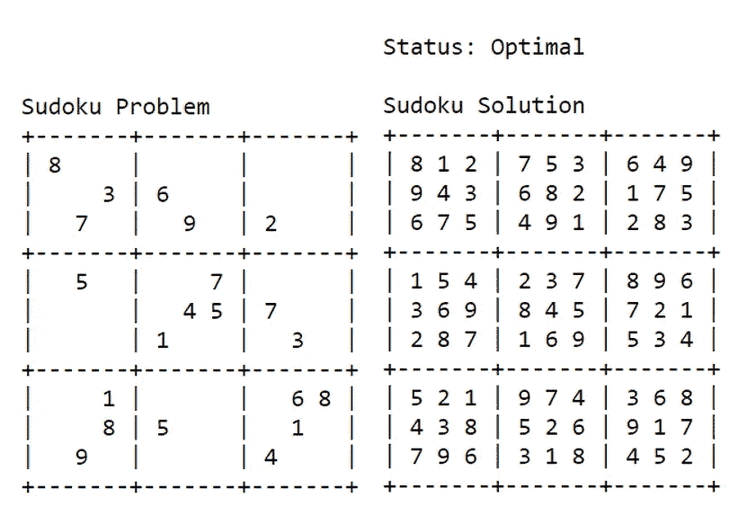

# 数独求解器:使用纸浆的线性规划方法

> 原文：<https://towardsdatascience.com/sudoku-solver-linear-programming-approach-using-pulp-c520cec2f8e8?source=collection_archive---------14----------------------->

## 用线性规划解决数独难题的完整指南(带代码！)

亚历山大·沙托夫在 [Unsplash](https://unsplash.com/) 上拍摄的照片。

数独是一种流行的日本益智游戏，它基于数字的逻辑排列。它不需要任何特殊的数学技能或计算。让我们来看一个来自维基百科的例子:

来源:[维基百科](https://en.wikipedia.org/wiki/Sudoku#/media/File:Sudoku_Puzzle_by_L2G-20050714_standardized_layout.svg)

它是一个 9x9 的格子拼图(81 个方块)。在游戏开始时，一些方格中充满了数字，而大多数方格是空的。数独的目标是用数字填充那些空白的方块，这样每一行、每一列和 3×3 部分都包含 1 到 9 之间的数字。玩家需要使用逻辑来填充缺失的数字并完成网格，以便满足所有的约束和规则。在以下情况下，移动是不正确的:

*   任何行都包含一个以上从 1 到 9 的相同数字。
*   任何列都包含多个从 1 到 9 的相同数字。
*   任何 3×3 网格都包含不止一个从 1 到 9 的相同数字。

在[上一篇文章](https://betterprogramming.pub/sudoku-solver-a-brute-force-approach-using-python-ee180b071346)中，我已经使用一个递归函数创建了一个数独解算器，类似于使用一个 81 级嵌套`for`循环。然而，解决**难数独**问题是非常低效的，因为它包含的起始数字比简单或中等数字要少得多。如果只有很少的起始数字，数独问题将会有大量的可行解，而不是只有一个。因此，如果我们使用蛮力方法来解决它，它增加了搜索空间并因此增加了计算成本。

在本文中，我将展示如何使用线性编程方法，这是一种创建数独求解器的更有效的方法。在此之前，让我分享一个小背景。

# 什么是线性规划？

线性规划是数学优化的一个分支。它是一种在给定一些约束条件的情况下寻找问题最优解的方法。线性规划由以下部分组成:

*   我们希望最大化或最小化的线性目标函数
*   xₙx₁,…的一组 n 个变量，用于控制目标函数
*   由线性不等式或等式表示的一组约束

因此，如果一个问题能够用一组线性不等式约束的线性目标函数来表达，那么线性规划就是寻找最佳最优解的一个强有力的工具。

# 数独求解器(线性规划方法)

我正在使用一个名为 [PuLP](https://github.com/coin-or/pulp) 的 Python 包来解决 LP 问题。现在，让我们为数独游戏定义 LP 的 3 个主要组成部分。

## 制定目标函数

与典型的线性规划问题不同，数独没有比另一个解决方案更好的解决方案。在数独游戏中，我们不是真的试图最小化或最大化任何东西，而是试图找到满足一组约束的变量的值。因此，目标函数的最小化或最大化并不重要，目标函数可以是任何值。在本文中，我将使用零作为目标函数。

## 确定一组决策变量

即使我们可以确保行或列或 3x3 网格中所有值的总和等于(1+2+3+4+5+6+7+8+9 = 45)，它仍然可以产生满足 45°约束的许多其他解决方案，但是在行或列或 3x3 网格中仍然有多于 1 个相同的数字，即(1+1+1+5+6+7+7+8+9 = 45)。因此，我们不能简单地为 81 个正方形中的每一个创建一个值在 1 到 9 之间的变量。

相反，我们必须创建一个 9 = 729 的(值、行和列)单个二进制(0–1)问题变量的组合。二进制变量指示正方形中的值或数字的存在是真还是假。例如，二进制值为 1 的**变量(5，4，6)意味着**值 5 出现在位于第 4 行第 6 列**的方块中。类似地，如果二进制值为 0，则意味着那里没有值 5。**

## 确定一组约束条件

1.任何方块中只能有一个数字。根据我上面提到的决策变量的定义，很明显，对于每个方块，9 个值中只能有 1 个为真(1)，其他 8 个必须为假(0)。

2.任何一行的方块中的值必须是 1 到 9
3 中的每一个。任何列中正方形内的值必须是 1 到 9
4 中的每一个。3x3 网格中的值必须是 1 到 9 中的每一个

5.起始数独数字必须在最终解决方案中的相同位置，因为这些数字是不可改变的

# 数独求解器解决方案

现在让我们结合以上的一切，解决数独难题。

代码的输出。图片由作者提供。

我们可以使用线性规划方法来解决一个问题，只要该问题可以用受一组**不等式约束**约束的**的 n 个变量**的线性**目标函数**来表示。LP 还可以用于其他有趣的优化应用，如成本最小化、运输、工作分配、健康饮食规划等。

# 推荐阅读

 [## 数独解算器:使用 Python 的蛮力方法

### 用递归方法解决数独难题的完整指南

better 编程. pub](https://betterprogramming.pub/sudoku-solver-a-brute-force-approach-using-python-ee180b071346) 

# 参考

[1]“数独——维基百科。”【在线】。可用:[https://en.wikipedia.org/wiki/Sudoku](https://en.wikipedia.org/wiki/Sudoku)

[2]“一个被公式化为 LP-PuLP 1 . 4 . 6 文档的数独问题。”【在线】。可用:[https://www . coin-or . org/PuLP/case studies/a _ sudoku _ problem . html](https://www.coin-or.org/PuLP/CaseStudies/a_sudoku_problem.html)