# 关于如何在聊天机器人中构建意图并收集有用反馈的建议

> 原文：<https://towardsdatascience.com/suggestions-on-how-to-structure-intents-in-chatbots-and-gather-useful-feedbacks-f72f7e552090?source=collection_archive---------11----------------------->

[万花筒](https://unsplash.com/@kaleidico?utm_source=medium&utm_medium=referral)在 [Unsplash](https://unsplash.com?utm_source=medium&utm_medium=referral) 上拍摄的照片

## [行业笔记](https://towardsdatascience.com/tagged/notes-from-industry)，聊天机器人设计

## 如何管理日益复杂的聊天机器人项目

我最近合作了几个涉及聊天机器人的项目，并有机会与行业专家讨论了这类项目中经常遇到的主要困难。虽然建立对话助手变得越来越容易，但随着聊天机器人的发展，由于没有适当的意图架构，看起来有一些问题系统地出现了。

恶意架构的一些症状是:

*   聊天机器人经常混淆两种意图，而这两种意图恰好有相似的训练短语。
*   聊天机器人似乎并不符合一些用户所说的正确意图，尽管它已经实现了，而且从大量收集的对话数据中提取更好的训练短语很麻烦。
*   即使匹配了正确的意图，聊天机器人也无法解决用户的问题，用户给出了负面反馈，并且不清楚如何改进服务。

在这篇文章中，我提出了一种设计意图的方法，目的是避免这些不好的症状。

# 聊天机器人输入:自由文本和多项选择答案

我将主要处理聊天机器人，其输入可能是自由文本或语音(因此涉及到意图分类)，以及多种选择。在聊天机器人中接受自由文本或语音有两个主要优点:

*   用户可以说出他/她想要什么，并得到适当的回答，而不必浏览一系列的多项选择问题。这意味着在对话开始时，有一个非常高的分支因子，也就是说，从对话的单个步骤中可以选择大量可能的对话路径。这是只有多项选择的聊天机器人无法实现的，因为多项选择的列表太长，无法容纳一个单一的响应，从而导致更深入的对话路径。然而，随着分支因子的增加，聊天机器人给出错误答案的概率也增加，因为有更多的意图可供选择。
*   我们可以看到用户真正想要的是什么，因为他/她可以自由地写或说。这意味着我们得到的数据可以分析，以便随着时间的推移改进聊天机器人，而不需要人工代理。

然而，与自由文本相比，多选输入也有重要的优势:

*   虽然聊天机器人可能没有完全理解用户想要什么，但它可以以多选答案的形式提出似乎合理的替代方案。提出更多可能的解决方案比只提出一个好得多，但是是错误的。
*   如果用户的反馈来自多项选择答案，就更容易理解。

好消息是，我们可以在同一个聊天机器人中使用两种输入模式，在正确的场合使用最好的一种。让我们看一个新的聊天机器人的例子。唯一的意图是 welcome 意图和 Fallback 意图，Welcome 意图包含聊天机器人在对话开始时向用户显示的欢迎消息，Fallback 意图在用户请求时没有其他意图匹配时匹配。

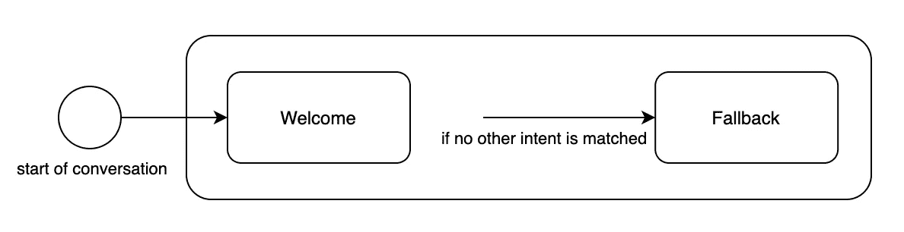

带有欢迎和回退意向的意向图表示例。图片由作者提供。

# 如何管理具有相似培训短语的意图

假设我们实现了续订意向，它用*回答“要续订您的订阅，请这样做[…]”*来回答类似*“我如何续订我的订阅？”*。我们可以区分以下内容的意图:

*   **系统意图**:每个聊天机器人都有的共同意图，比如欢迎和后退意图。
*   **响应意图**:其响应应该解决用户请求的意图。

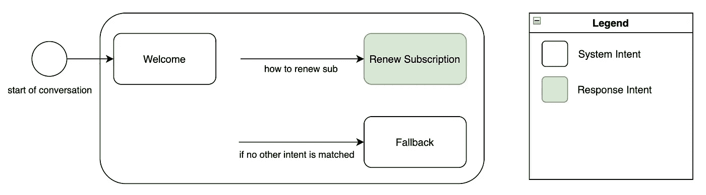

带有回应意向的意向图表示例。图片由作者提供。

后来，我们发现有两种不同的续订过程:一种是在订阅尚未过期的情况下，另一种是在订阅已经过期的情况下。天真的解决方案是创造第二个意图，并尽可能地区分这两个意图的训练短语。我们创建了续订过期订阅意向，该意向以*“要续订您的订阅，请执行此操作[…]”*来回答类似于*“我如何续订我的过期订阅”*的问题。然后，我们更新了“续订未过期的订阅”意向，用*“要续订您的订阅，请这样做[…]”*来回答类似于*“我如何续订尚未过期的订阅”*的问题。

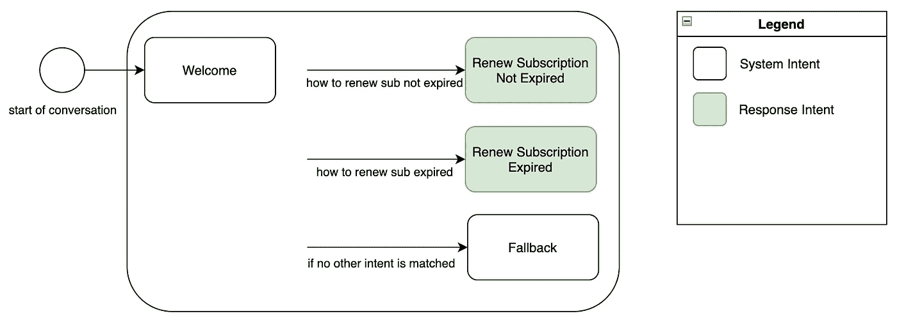

意向图表示例，包含具有相似培训短语的多个回应意向。图片由作者提供。

乍一看，这可能还不错。但是用户真的在他们的问题中指明他们的订阅是否已经过期了吗？用户想要的是更新他们的订阅，并且正确的过程取决于其他因素的事实并不意味着用户的意图不同。更好的管理方法是创建一个意图，其目的是消除用户的订阅是否过期的歧义，并导致正确的响应。让我们称这个新的意向更新订阅过期，它询问用户*“您的订阅过期了吗？”*。然后，我们应该将之前创建的响应意图的所有训练短语移到这个新的意图中。

这个新意图不是响应意图，因为它的响应不应该直接解决用户的请求。我们可以将其归类为**消歧意图**，其目的是从相似选项的短列表中找到正确的答案。由于它的目标与多项选择输入的优点非常相似，我们可以使它为用户提供多项选择答案，如*“是的，我的订阅到期了”*和*“不，我的订阅没有到期”*。

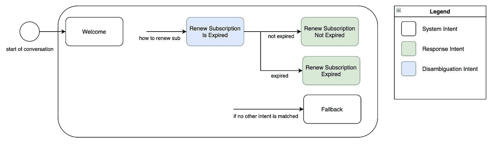

带有歧义消除意图的示例意图图表。图片由作者提供。

太好了！现在，用户不会再因为意图相似的训练短语而得到错误的答案，代价是多了一个必要的对话步骤。此外，如果系统已经知道用户的订阅是否过期，则可以自动消除歧义。一旦我们给聊天机器人添加了更多的意图，它的意图架构将会是这样的。

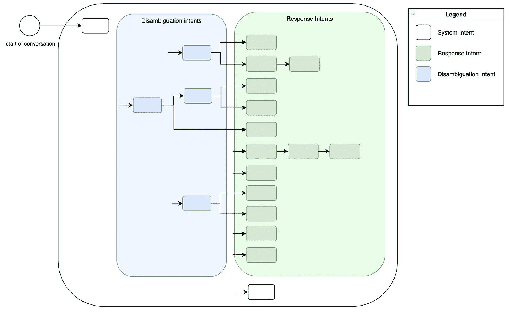

具有多种歧义和回应意图的示例意图图表。图片由作者提供。

可以链接多个歧义消除意图，以及多个响应意图。注意，通过多个歧义消除意图的对话流总是分叉成几个可能的路径。对于多个顺序响应意图来说，这并不总是正确的，因为它们可以在多个步骤中解决用户问题或者收集必要的用户数据。

我们已经看到了如何用具有歧义消除意图的相似训练短语来解决意图问题。现在让我们看看如何通过适当的反馈收集程序来改进意图分类。

# 如何构建反馈收集以改进意图分类

我们的聊天机器人可能仍然无法提供良好的客户支持，因为训练短语的意图没有充分涵盖用户可能提出的请求的范围。这种问题主要出现在我们有高分支因子的那部分会话流中，也就是在会话开始之后。

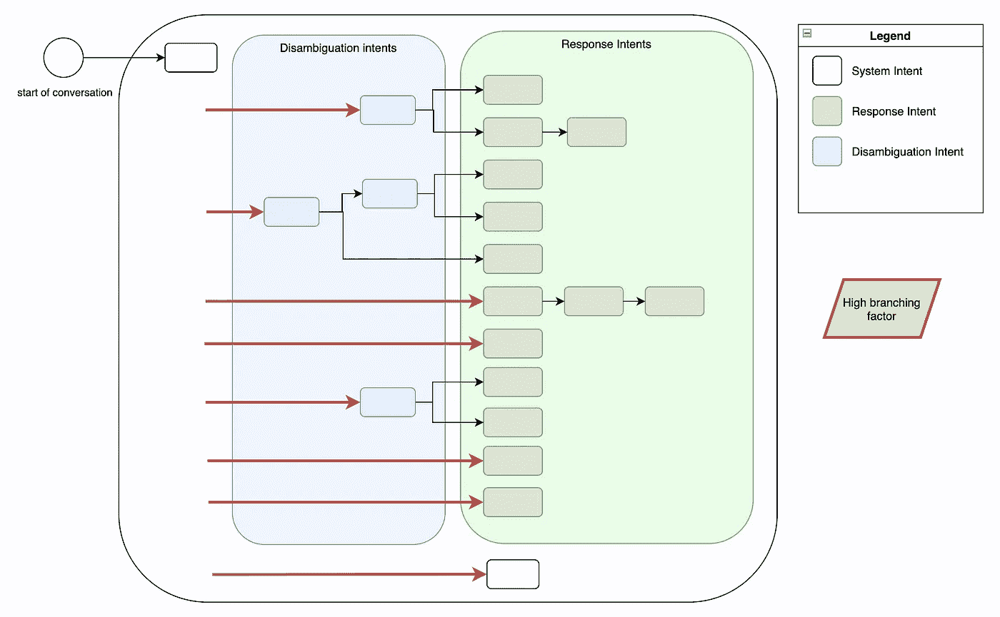

在对话开始时突出强调高分支因素的意图图表示例。图片由作者提供。

随着时间的推移，我们可以构建用户反馈的集合来解决这类问题，而且不费吹灰之力。让我们考虑这个更简单的场景，其中在对话开始时可用的意图是续订到期、密码恢复和回退。

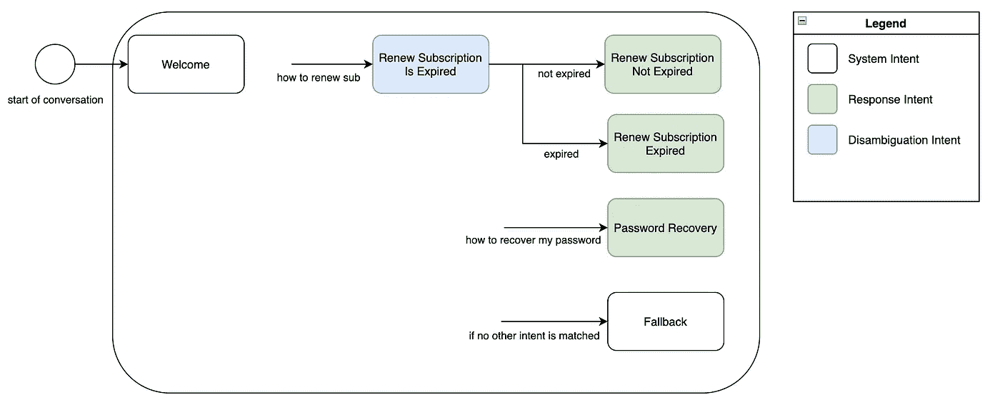

带有歧义消除和回应意图的意图图表示例。图片由作者提供。

当续订订阅中的一个意图过期并且密码恢复匹配时，聊天机器人应该提供相应的答案，然后询问用户是否是这个意思。例如，如果用户说*“我如何更新我的订阅”*，意向更新订阅的响应应该是类似于*“您要更新您的订阅吗？如果是，请选择最能描述您的情况的选项"*，并选择由*、*、*、*、*、【不，我不是这个意思】*组成的多项选择答案。如果用户选择前两个选项中的一个，我们可以推断出意图分类是成功的，并且连同用户的文本一起保存肯定的隐式反馈，这导致更新订阅是过期意图的匹配。如果用户选择第三个选项，聊天机器人应该触发一个新的意图来管理这些误解(或回退意图)，并保存一个负面的隐式反馈，以及用户以前的文本。通过以这种方式保存积极和消极的反馈，您将有一个按反馈意图和类型划分的有组织的反馈集合，其中您只能分析导致反馈的对话步骤，而不是整个对话。这将为任何分析反馈以改进意图分类的人节省大量时间和麻烦。

让我们看另一个例子。如果用户写*“我如何才能恢复我的密码”*，聊天机器人应该匹配意图密码恢复并回答*“要恢复你的密码，这样做[…]我解决了你的问题吗？”*可能的选择*“是”*(正反馈)和*“不，我是说别的”*(负反馈)。

导致正面反馈的用户句子是已经被验证的潜在的新训练短语。请记住，向一个意图添加太多的训练短语可能会提高其性能，但会降低其可维护性，因为检查 100 个句子比检查 30 个句子要慢。我建议考虑这两个方面的折衷:尽量保持不超过 40 个训练短语，同时充分覆盖具有不同训练短语的用户可能提出的请求的范围。

由于这种类型的反馈的目标是通过提供新的和更好的训练短语来改进意图分类，我们将称之为**意图分类反馈**。

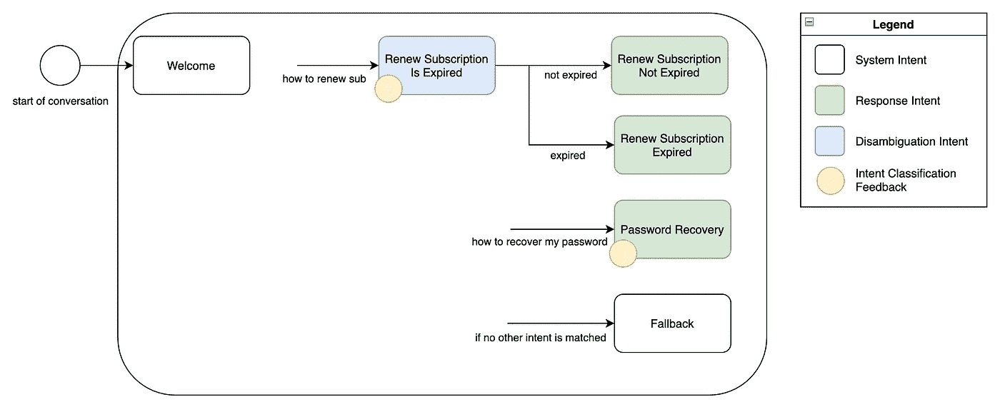

带有意向分类反馈的意向图表示例。图片由作者提供。

意图分类错误并不是唯一可以使用反馈来解决的错误，让我们来看看为什么。

# 如何组织反馈收集以改善意向反应

对于某些用户来说，提供有意图的响应可能不足以解决他们的问题，即使对于写意图答案的人来说这看起来很奇怪，因为他们试图尽可能清楚。这与产品可用性测试的情况类似:开发产品的人有时间开发一个概念模型，使之易于在其中执行任何操作，并努力与第一次看到产品的用户产生共鸣。这种情况也发生在那些需要写下聊天机器人将给出的答案的人身上:他们非常了解这项服务，以至于他们第一眼就能写出完整的答案，但新用户却无法确定自己的方向。

那么，我们如何收集关于聊天机器人回答质量的反馈并加以改进呢？同样，通过以适当的方式组织反馈。让我们回到之前的例子。

带有意向分类反馈的意向图表示例。图片由作者提供。

检查消歧意图的响应的质量没有什么意义，因为它们有简短的答案，并且是以问题的形式。我们将关注响应意图。

如果用户问*“我如何才能恢复我的密码”*，聊天机器人应该匹配密码恢复意图并回答*“要恢复你的密码，这样做[…]我解决你的问题了吗？”*有三种可能的选择:**【不，我无法用你的指令恢复我的密码】**【不，我是说别的】*。第一个回答既是一个积极的意图分类反馈，也是对回应文本质量的积极反馈。第二个答案是对回答质量的负面反馈，第三个答案是负面意图分类反馈。我们可以将**响应反馈**定义为与响应意图相关的答案质量反馈。*

*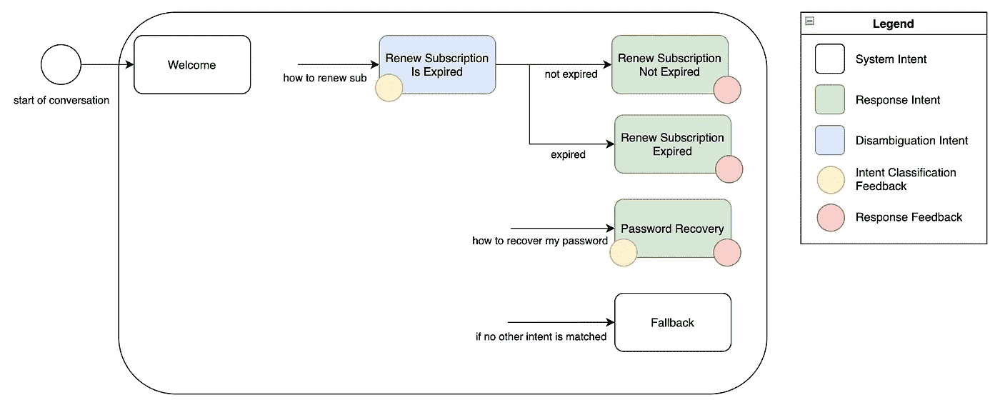*

*带有意向分类反馈和回应反馈的意向图表示例。图片由作者提供。*

*如果可能的话，负面的反应反馈应该总是导致移交给人类代理。然后必须对他们的对话进行分析，以了解为什么意向回应不够好。*

# *带有反馈收集的最终建议意向架构*

*总的来说，这就是我建议你的意图架构的样子。*

*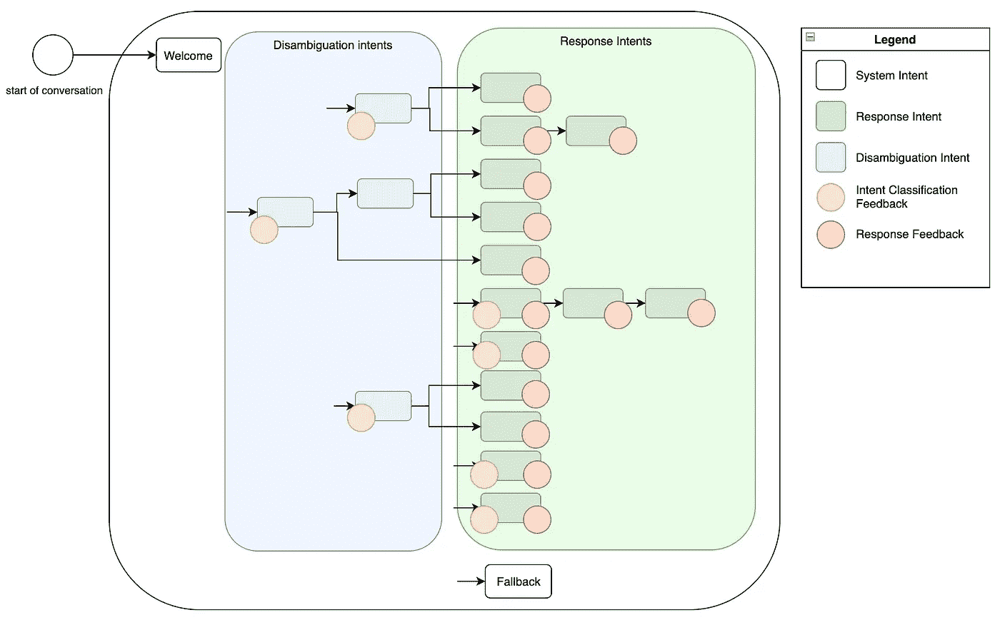*

*带有多种歧义和回应意图的示例意图图表，带有意图分类反馈和回应反馈。图片由作者提供。*

*概括一下:*

> ***自由文本输入**更适合于限制用户请求的合理正确响应的数量，并收集关于用户所提问题的数据。*
> 
> ***多项选择输入**更适合从候选答案列表中找到正确答案并收集反馈。*
> 
> ***响应意图**应该用响应直接解决用户的请求。他们可以分多个步骤完成，尤其是当他们需要向用户询问数据时。*
> 
> ***消歧意图**的目标是从相似选项的候选列表中找到正确的响应，这可以是响应意图或其他消歧意图。它们提供多项选择答案，并用相似的训练短语解决意图问题。*
> 
> ***欢迎意图**建议用户用自由文本说出他/她的请求。意图分类的目标是将用户的请求缩小到响应意图或消除歧义意图。*
> 
> ***意图分类反馈**的目标是通过收集提供新训练短语的有组织的简明反馈来改进意图分类。它们是在意图分类完成后立即收集的，包括歧义消除和回应意图。*
> 
> ***响应反馈**的目标是通过收集有组织的、简洁的反馈来改善与响应意图相关的响应，这些反馈提供了关于用户问题的新观点。它们是在响应意图匹配后立即收集的。*

# *额外提示*

*以下是一些在大多数聊天机器人项目中似乎有益的一般建议。这并不是一个完整的列表，因为它可以填充另一整篇文章。*

## *用聊天机器人无法管理 100%的联系人是完全正常的*

*有些交互太复杂，计算机无法处理，或者太少，不值得教它去做。在这些情况下，请交给人工代理。聊天机器人可以极大地提高效率，即使它只是处理对话的第一个、机械的部分。旨在让聊天机器人管理 70%的重复和简单的联系，而让人工代理管理剩余的 30%的复杂和罕见的联系(百分比可能因行业而异)。*

## *不要让聊天机器人重复自己*

*用户讨厌多次得到相同的回答，这让对话看起来没有进展。在你的意图图中尽可能避免循环，对同一意图实施不同的回应，以避免重复完全相同的句子。*

## *解决愤怒的用户*

*如果你有了解用户情绪的技术(例如，对文本的情感分析)，使用它，并对愤怒的用户说类似*“对不起，我不明白，你想和真人说话吗？”**

## *如果你开始一个新的聊天机器人项目:从小项目开始，测试，监控，调整，迭代*

*从实现不超过 15 个响应意图开始，执行用户测试，并投入使用。集中精力管理几个接触的理由，但是很好。然后，在您的仪表板上监控意向分类反馈和响应反馈，查看对最高量意向无效的用户查询(即，在您拥有最高 ROI 的地方工作)，并改进您的聊天机器人。通过数据驱动的决策来改进聊天机器人，不要只依靠你的直觉。*

# ***结论***

*像任何潜在规模和复杂性增长的项目一样，chatbot 项目中良好的意图架构对于保持其可维护性、清晰地监控其性能以及随着时间的推移系统地改进它是至关重要的。尽管我认为一个好的聊天机器人架构的概念模型即使在较小的项目中也可以省去很多麻烦，但是可以把这个指南看作是管理聊天机器人成长过程中出现的复杂性的辅助工具。*

*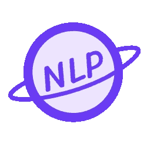*

*NLPlanet 标志。*

**在*[*LinkedIn*](https://www.linkedin.com/company/nlplanet)*[*Twitter*](https://twitter.com/nlplanet_)*[*脸书*](https://www.facebook.com/NLPlanet-113393687828458) *，以及*[*Telegram*](https://t.me/nlplanet)*上关注应用自然语言处理的最新故事并加入 NLPlanet 社区。****