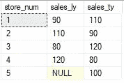

# 总和(A+B)与总和(A)+总和(B)

> 原文：<https://towardsdatascience.com/sum-a-b-vs-sum-a-sum-b-31fb094b786?source=collection_archive---------24----------------------->

## 粉碎 SQL Bug！

照片由[егоркамелев](https://unsplash.com/@ekamelev?utm_source=unsplash&utm_medium=referral&utm_content=creditCopyText)通过 Unsplash 拍摄

> 我需要你把去年的销售额加到今年的销售额上，然后把总数给我。—你工作的地方有很多人

从这篇文章的标题来看，这两个公式略有不同。这些相似的结构甚至可能在您工作的地方的 SQL 查询中很常见。让我们来看看这两者的区别，以及如何在未来避免一个微小的错误和大量的时间/信誉损失。

# 桌子

让我们看一下我们的小表，它有“sales_ly”和“sales_ty”列。在该数据中，商店 5 在今年开业，因此去年没有销售额:

作者照片

让我们来看看使用上面显示的每种技术对这些值求和时的结果:

作者照片

我们可以看到，' sales_ly' = 400 而' sales_ty' = 500。检查检查。等一下，伙计！求和成单个值时，一个过程显示 800？！？这是什么原始巫术？

这和一个很久以前的朋友有关，他叫秩序行动。让我们想象一下正在发生的事情:

作者照片

我们的 SUM(A + B)过程用蓝色突出显示。我们可以看到，这个过程的第一步是右边“总计”栏中显示的内部 A + B。嗯，第 5 行总计有一个空值！这是因为像'+'和'-'这样的操作数不能处理空值。所以，100 + Null = Null。

现在，我们看看橙色的 SUM(A) + SUM(B)朋友。这个过程从垂直方向开始，先对 A 求和，然后对 B 求和，然后水平移动，得出正确答案！

**解决方案 1:总和(A) +总和(B)**

# 你可能已经注意到了我们的粉色惊喜嘉宾…

在这种情况下，使用 ISNULL()函数也很有帮助。这将把空值替换为 0，然后使用“+”操作数将 0 与 100 相加。

**方案二:ISNULL( )**

# 第三种解决方案，包括潜在缺陷

说“用 0 替换所有的空值”是很容易的。这肯定会解决空值的问题，并且总和仍然有效。如果你使用平均值之类的东西，这可能会产生另一个错误。去年没有开业的第 5 家店将被包括在分母中，同时为分子贡献一个大鹅蛋。书呆子在桌子上！

正如在[之前的一篇文章](https://medium.com/geekculture/in-data-theres-almost-never-a-magic-silver-bullet-6cf30a5c70b4?sk=3a221694f078282e755130d87ed2833b)中提到的，使用这个问题，你应该像看一场 80 年代的游戏秀一样阅读它，观众齐声尖叫:“什么……会……打破这个吗？！？，在提出已知问题的解决方案时非常有用。

**暂定解决方案 3:用 0 替换表格中的所有空值**

# **快速查看代码差异**

让我们快速看一下执行聚合的代码:

作者照片

# 最后的想法

我关注的一个共同趋势似乎是，在数据世界中有很多工具和技术。找出什么有效，为什么有效。想想什么会打破它。不要认为相同的方法或工具在不同的应用中会产生相同的结果。可用数据取决于用例。

直到下一次，继续学习。