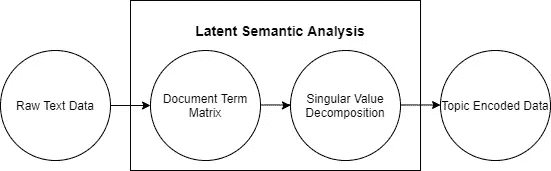
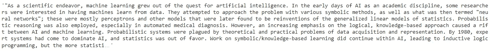
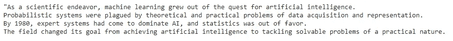
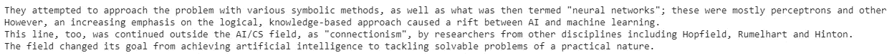

# 使用机器学习对长文本文档进行摘要

> 原文：<https://towardsdatascience.com/summarize-long-text-documents-using-machine-learning-d49aaf5fc99a?source=collection_archive---------16----------------------->

## 厌倦了阅读长文本文档，使用开源 python 库对它们进行总结


图片由 [SCY](https://pixabay.com/users/scy-1147075/?utm_source=link-attribution&amp;utm_medium=referral&amp;utm_campaign=image&amp;utm_content=819285) 来自 [Pixabay](https://pixabay.com/?utm_source=link-attribution&amp;utm_medium=referral&amp;utm_campaign=image&amp;utm_content=819285)

文本摘要是为长文本文档创建简短、准确和流畅摘要的过程。它是从文本文档中提取最重要信息的过程。文本摘要的目的是创建大型语料库的摘要，该摘要具有描述整个语料库的要点。

# 文本摘要的需要？

互联网上产生了大量的文本数据，如社交媒体文章、新闻文章等。手动创建摘要是耗时的，因此出现了对自动文本摘要的需求。自动摘要工具不仅速度快得多，而且比人类更不容易出错。

文本摘要在许多方面都有助于总结文本数据。文本摘要的一些用途包括:

*   减少长文档的阅读时间
*   在研究文档时，摘要使选择过程更容易。
*   文本摘要对于问答系统是有用的。

使用文本摘要系统使得商业摘要服务能够增加要处理的文本文档的数量。一些新闻门户网站，如 Google News、Inshorts 等，为他们的读者提供长新闻文章的简短摘要。

# 使用 Sumy 的文本摘要:

Sumy 是一个开源的 Python 库，用于从 HTML 页面和文本文件中提取摘要。该软件包还包含一个文本摘要的评估框架。Sumy 为文本摘要提供了几种算法和方法，其中一些是:

*   卢恩:启发式方法
*   潜在语义分析(LSA)
*   埃德蒙森启发式方法
*   LexRank
*   文本排名

还有很多。访问 [Sumy 文档页面](https://pypi.org/project/sumy/)了解更多关于 Sumy 提供的文本摘要算法。

在这篇文章中，我们将讨论和实现一些流行的文本摘要算法 Luhn，LexRank，LSA。

## 安装:

Sumy 是一个开源 Python 库，可以使用 PyPl 安装:

```
**pip install sumy**
```

要从字符串变量或文件中读取文本文档，我们可以使用 Sumy 包中的`**PlainTextParser**` 。

> 从文本字符串变量“document”中读取文本文档:

```
**parser = PlaintextParser.from_string(document, Tokenizer("english"))**
```

> 从位置为“file”的文本文件中读取文本文档:

```
**parser = PlaintextParser.from_file(file, Tokenizer("english"))**
```

在 Sumy 文本解析器中读取文本文档后，我们可以使用几种算法或方法对给定的文本文档进行摘要。

# LexRank 摘要生成器:

LexRank 算法是一种无监督的摘要方法，它受到 PageRank 算法的启发。LexRank 使用一个 **IDF 修改的余弦相似性分数**来提高文档摘要的 Pagerank 分数。它基于基于图的句子中心性评分对文本进行摘要。

如果一个句子与文本语料库中的其他句子非常相似，则该句子被认为非常重要。这样的句子可以推荐给用户。

## 使用 Sumy 实现 LexRank:

可以使用从 Sumy 包中调用的对象来实现 LexRank summarizer。创建一个对象`**LexRankSummarizer**`后，传递文本文档和行数以返回摘要。

# 使用 Sumy 的 LSA 汇总器:

潜在语义分析(LSA)基于**词频**技术和**奇异值分解**来概括文本。LSA 是一种无监督的自然语言处理技术，而 LSA 的目标是根据主题或潜在特征来创建文本数据的表示。

LSA 包括两个步骤:

*   以生成文档术语矩阵(或数字向量)。
*   对文档术语矩阵进行奇异值分解。奇异值分解通过用潜在特征对原始数据集进行编码来降低其维数。

对于 LSA，这些潜在特征代表原始数据中的主题。



(图片由作者提供)，LSA 的台阶

# 结果:

文本摘要器用于创建长文本文档的简短摘要。输入的长文本文档取自机器学习的维基百科页面。



(图片由作者提供)，输入摘要文本

> **使用 LexRank 算法的文本摘要的输出:**



(图片由作者提供)，使用 LexRank 算法生成的摘要

> **使用 LSA 算法的文本摘要的输出:**



(图片由作者提供)，摘要使用 LSA 算法生成

# 结论:

在本文中，我们讨论了如何使用开源 python 包 Sumy 总结长文本文档。Sumy 提供了诸如 LexRank、Luhn、LSA、TextRank、SumBasic 等各种算法来对文本文档进行摘要。Sumy 可以从字符串变量和磁盘上的文件中总结文本。

您还可以阅读 Text-summary，这是另一个用于总结文本文档的开源 python 库。

# 参考资料:

[1] Sumy 文档(2019 年 5 月 19 日):[https://pypi.org/project/sumy/](https://pypi.org/project/sumy/)

> 感谢您的阅读