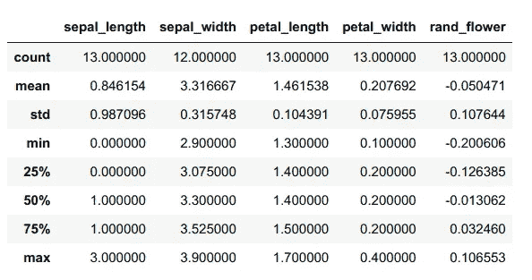
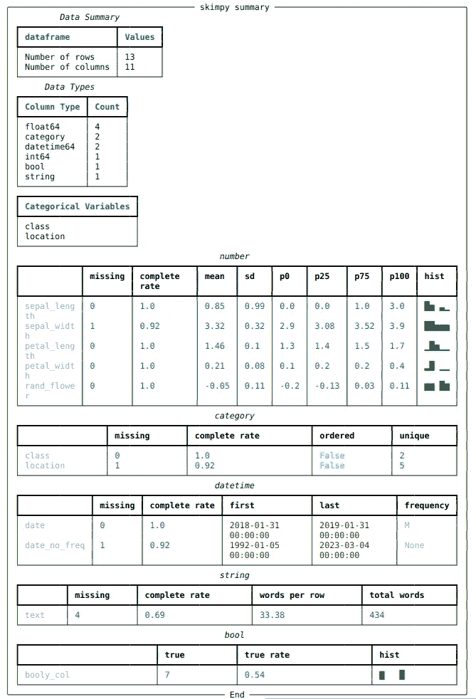

# 总结熊猫数据的更好方法。

> 原文：<https://towardsdatascience.com/summarize-pandas-data-frames-b9770567f940?source=collection_archive---------19----------------------->

## Skimpy 使得在笔记本和终端上汇总数据集变得非常容易。


总结一组数据—照片由 [Lukas](https://www.pexels.com/@goumbik?utm_content=attributionCopyText&utm_medium=referral&utm_source=pexels) 从 [Pexels](https://www.pexels.com/photo/person-writing-on-notebook-669615/?utm_content=attributionCopyText&utm_medium=referral&utm_source=pexels) 拍摄

**Describe** 是我在任何新数据集上尝试的第一个函数。但是我现在找到了一个更好的。

我把它换成了 Skimpy。这是一个小的 python 包，显示了数据集的一些扩展摘要结果。您也可以在终端窗口上运行它，而无需输入 Python shell。

您可以使用以下命令从 PyPI 安装它。

```
pip install skimpy
```

# 为什么这么少？

在之前的帖子中，我分享了三个 [Python 探索性数据分析工具](/how-to-do-a-ton-of-analysis-in-the-blink-of-an-eye-16fa9affce06)。有了它们，您可以在瞬间生成关于数据集的更完整的报告。

但是如果你需要更简单的切割呢？

如果我必须从数据集开始，我几乎会一直运行`df.describe()`。它给你一个重要数字的漂亮的表格视图。



熊猫描述功能结果—作者截图[。](https://thuwarakesh.medium.com)

但是为了更仔细地研究数据集，我必须创建直方图和其他一些摘要。

这就是 Skimpy 帮助我们的地方。只需一个命令，它就可以生成更多关于数据集的矩阵和直方图。

```
from skimpy import skim
skim(df)
```



摘要结果来自 skippy—作者[截图。](https://thuwarakesh.medium.com)

上面的总结以一种视觉组织的方式包含了更多的信息。

每一节总结了相同类型的变量。数字变量也包括直方图。我发现关于日期时间变量的首末日期和频率的细节很方便。

# 你不需要 Python 环境来运行 Skimpy。

你不必每次都进入 Python 回复或 Jupyter 笔记本来使用 skimpy。您可以对数据集使用 Skimpy CLI 进行总结。

```
$ skimpy iris.csv
```

在终端上运行上述命令将在窗口中打印相同的结果并返回。

这样，Skimpy 是一种生成任何数据集的快速摘要的便捷方式，甚至无需编写任何代码。

# **最终想法**

Skimpy 是 Python 生态系统中的一个新工具，可以帮助我们更轻松地处理数据。然而，它已经通过生成扩展的汇总结果解决了一个奇妙的问题。

你可以从他们的 [GitHub 页面](https://github.com/aeturrell/skimpy)了解更多。您也可以为改进该工具做出贡献。

> 朋友，感谢你的阅读！看来你和我有许多共同的兴趣。我很乐意在[*LinkedIn*](https://www.linkedin.com/in/thuwarakesh/)*[*Twitter*](https://twitter.com/Thuwarakesh)*和 Medium* 上与您联系*

*还不是中等会员？请使用此链接 [**成为会员**](https://thuwarakesh.medium.com/membership) 因为，不需要你额外付费，我为你引荐赚取一小笔佣金。*