# 用熊猫交叉表汇总数据

> 原文：<https://towardsdatascience.com/summarizing-data-with-pandas-crosstab-efc8b9abecf?source=collection_archive---------14----------------------->

## 有效使用 Pandas 交叉表进行数据汇总的 7 个实用技巧


照片由[印尼 UX](https://unsplash.com/@uxindo?utm_source=unsplash&utm_medium=referral&utm_content=creditCopyText)在 [Unsplash](https://unsplash.com/s/photos/data-analysis?utm_source=unsplash&utm_medium=referral&utm_content=creditCopyText) 上拍摄

> 汇总数据最直接的效果是获取大量的数据，并将其缩减为几个可以查看的关键汇总值，通常在表格或图表中。
> 
> 来源于数据科学导论[1]

数据汇总是以易于理解和信息丰富的方式呈现生成数据的汇总的过程。Pandas 提供了几个汇总数据的选项:`groupby`、`pivot_table`、`crosstab`。

我们之前已经介绍了熊猫`[pivot_table()](/a-practical-introduction-to-pandas-pivot-table-function-3e1002dcd4eb)`和`[groupby()](https://bindichen.medium.com/all-pandas-groupby-you-should-know-for-grouping-data-and-performing-operations-2a8ec1327b5)`，本文将探讨熊猫`crosstab()`以及如何使用它进行数据分析。这篇文章的结构如下:

1.  最简单的交叉表
2.  显示多行和多列
3.  显示带边距的合计
4.  使用 normalize 获取发生的百分比
5.  指定值并执行聚合
6.  处理缺失值
7.  Seaborn 热图的可视化

> 请查看[笔记本](https://github.com/BindiChen/machine-learning/blob/master/data-analysis/045-pandas-crosstab/pandas-crosstab.ipynb)获取源代码。更多教程可从 [Github Repo](https://github.com/BindiChen/machine-learning) 获得。

为了进行演示，我们将处理咖啡销售数据。让我们导入一些库并加载数据来开始:

```
import pandas as pd**def load_data():
    return pd.read_csv('coffee_sales.csv', parse_dates=['order_date'])**df = load_data()
df.head()
```

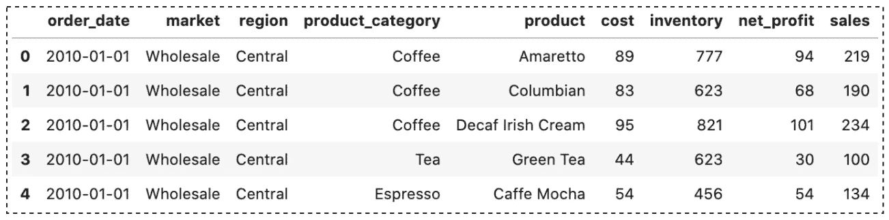

咖啡销售数据集(图片由作者提供)

# 1.最简单的交叉表

创建交叉表时，需要指定行的内容以及如何拆分列。默认情况下，它会计算每个组合中的观察次数。在我们的例子中，让我们使用`region`作为我们的行索引，并用`product_category`分割列。

```
pd.crosstab(**df['region']**, **df['product_category']**)
```

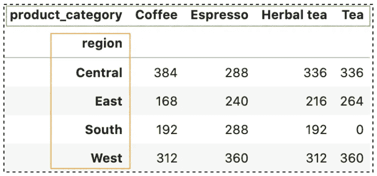

简单的交叉表示例(图片由作者提供)

在某些情况下，出于显示目的，您可能更喜欢自定义标签。为此，我们可以包含特定的`rownames`和`colnames`:

```
pd.crosstab(
    df['region'], 
    df['product_category'], 
    **rownames=['US Region'],** 
    **colnames=['Product Category']**
)
```

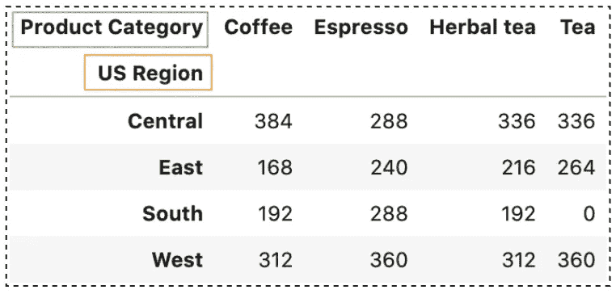

带有自定义名称的简单交叉表示例(图片由作者提供)

# 2.显示多行和多列

交叉表最有用的特性之一是可以传入多个索引和列，它为我们完成所有的分组工作。例如，如果我们想要查看数据是如何按**市场**分布的，我们可以通过将**市场**列包含在一个列表中来包含它:

```
pd.crosstab(
    df['region'], 
    **[df['product_category'], df['market']]**
)
```

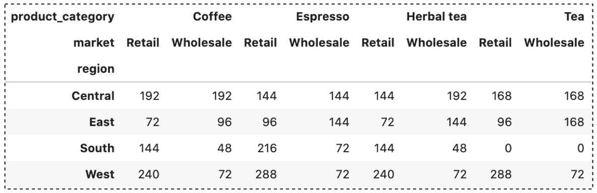

多列交叉表示例(作者图片)

类似地，我们可以指定一个自定义标签用于显示目的。`rownames`和`colnames`都接受一个标签列表，每个标签对应一行和一列。

```
pd.crosstab(
    df['region'], 
    [df['product_category'], df['market']],
    rownames=['US Region'], 
    colnames=**['Product Category', 'Market']**
)
```

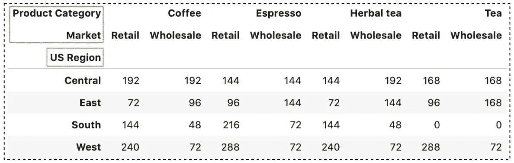

多重交叉表示例(作者图片)

# 3.显示行/列小计

交叉表中另一种常见的显示方式是显示每行和每列的小计。我们可以通过设置`margins=True`参数来添加它们:

```
pd.crosstab(df['region'], df['product_category'], **margins = True**)
```

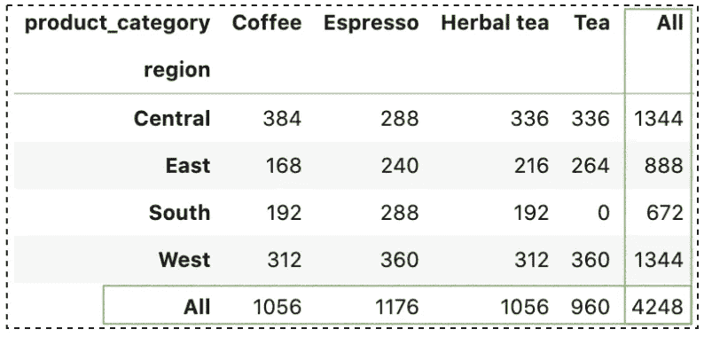

带有分类汇总的交叉表示例(作者图片)

默认情况下，分类汇总显示有标签“**全部**”。我们可以使用`margins_name`参数指定一个自定义标签:

```
pd.crosstab(
    df['region'], df['product_category'], 
    margins = True, 
    **margins_name = 'Subtotals'**
)
```

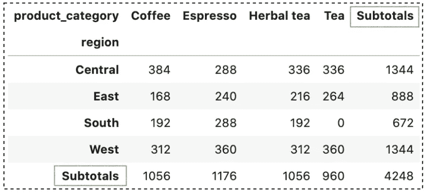

带小计的简单交叉表(作者图片)

# 4.使用 normalize 获取发生的百分比

数据分析中的一个常见任务是了解发生的百分比。这可以通过将`normalize`参数设置为`True`来实现:

```
pd.crosstab(df['region'], df['product_category'], **normalize = True**)
```

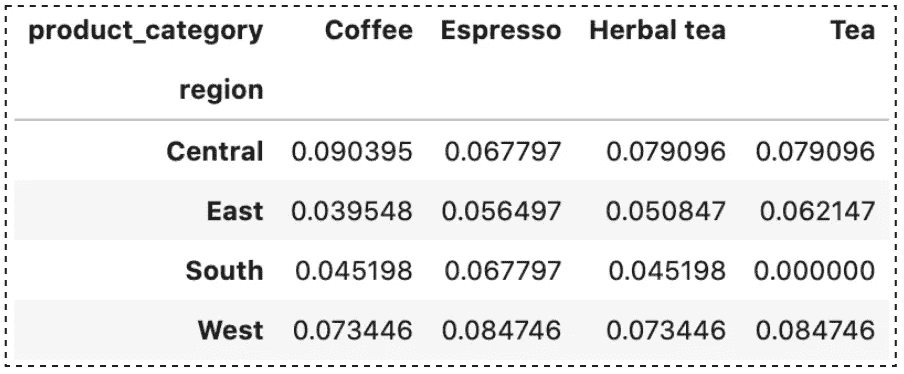

带规格化的简单交叉表(作者图片)

如果我们希望结果用百分号(%)格式化，我们可以如下调用`style.format('{:.2%}')`:

```
pd.crosstab(
    df['region'], 
    df['product_category'], 
    normalize = True
)**.style.format('{:.2%}')**
```

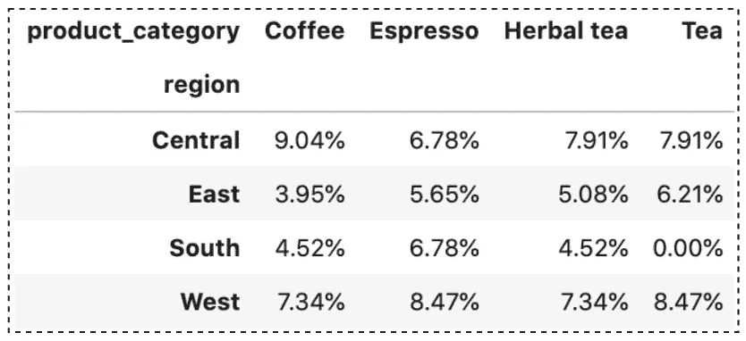

带规格化的简单交叉表(作者图片)

此外，当`margins`为`True`时，该计算适用于小计:

```
pd.crosstab(
    df['region'], 
    df['product_category'], 
    **margins = True, 
    normalize = True**
).style.format('{:.2%}')
```

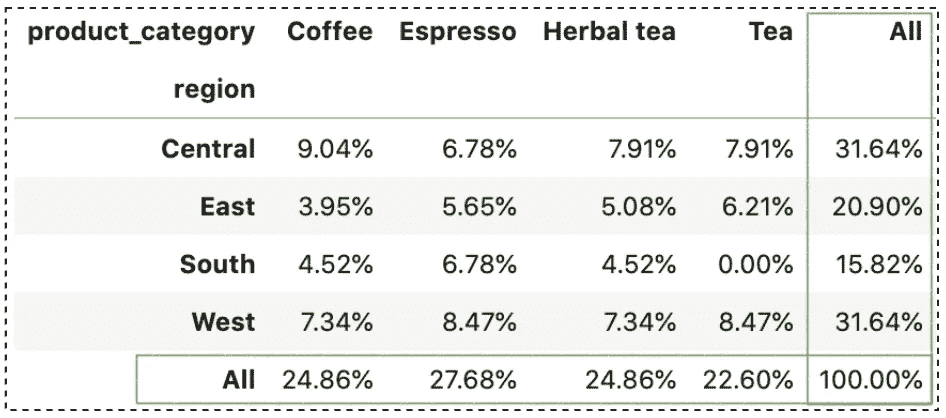

带规格化的交叉表(作者图片)

`normalize`参数接受另外两个值`'index'`和`'columns'`:

*   如果给定了`'index'`，它将对每行进行归一化。
*   如果给定了`'columns'`，它将对每一列进行归一化。

```
pd.crosstab(
    df['region'], 
    df['product_category'], 
    margins = True, 
    **normalize = 'columns'**
).style.format('{:.2%}')
```

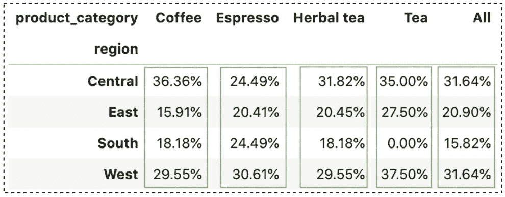

normalize=columns 的交叉表(按作者分类的图片)

```
pd.crosstab(
    df['region'], 
    df['product_category'], 
    margins = True, 
    **normalize = 'index'**
).style.format('{:.2%}')
```

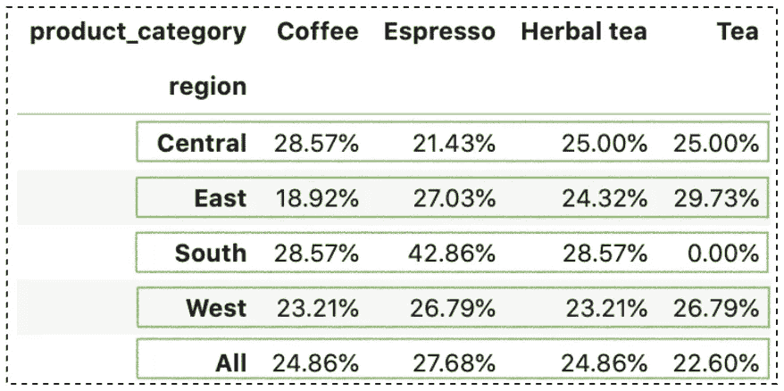

normalize=index 的交叉表(作者图片)

# 5.指定值并执行聚合

默认情况下，`crosstab`对所有数字列执行`count`聚合函数，并返回结果。要显式指定我们关心的列并执行聚合，可以使用`values`和`aggfunc`参数。

```
pd.crosstab(
    df['region'], 
    df['product_category'], 
    **values = df['cost'],**
    **aggfunc = 'mean'**
)
```

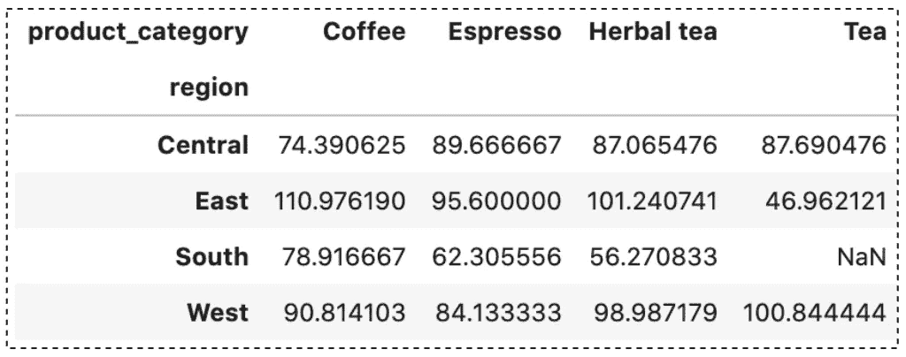

带聚集的交叉表(按作者分类的图片)

通过指定`values = df['cost']`和`aggfunc = 'mean'`，我们告诉熊猫将`mean`函数应用于所有数据组合的成本。

默认情况下，结果将保留 6 位小数。为了舍入结果，我们可以调用`round()`:

```
pd.crosstab(
    df['region'], 
    df['product_category'], 
    values = df['cost'],
    aggfunc = 'mean'
)**.round(2)**
```

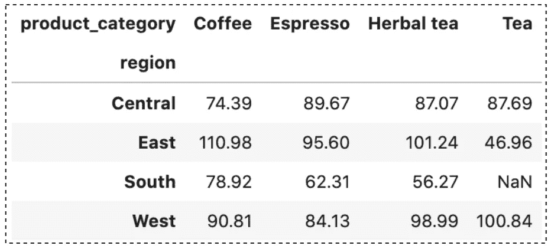

带聚集的交叉表(按作者分类的图片)

# 6.处理缺失值

您可能会注意到前面输出中的一个`NaN`值。我们之所以有这种产品，是因为在南方没有茶叶销售。

不像`privot_table`有内置的`fill_value`参数来替换任何丢失的值，`crosstab`不支持它。我们必须使用其他方法来处理缺失值，例如:

```
pd.crosstab(
    df['region'], 
    df['product_category'], 
    values = df['cost'],
    aggfunc = 'mean',
).**fillna(0)**
```

然而，如果`crosstab`输出包含条目都是`NaN`的行或列，我们可以使用参数`drop_na=True`来删除它们。

# 7.Seaborn 热图的可视化

老实说，我是看了 [**熊猫交叉表解说**](https://pbpython.com/pandas-crosstab.html) 文章[2]才知道这些的。有时候，一个图表胜过一千个单词，这是一个非常方便的功能，可以直观地总结交叉表的输出。我们需要做的只是将交叉表输出传递给 seaborn 热图:

```
import pandas as pd
import numpy as np
import matplotlib.pyplot as plt
import seaborn as snsplt.figure(figsize=(8, 6))
sns.heatmap(
 **pd.crosstab(
        df['region'], 
        [df['product_category'], df['market']],
        rownames=['US Region'], 
        colnames=['Product Category', 'Market'],
        values = df['cost'],
        aggfunc = 'mean'
    ),** 
    annot = True
)
plt.show()
```

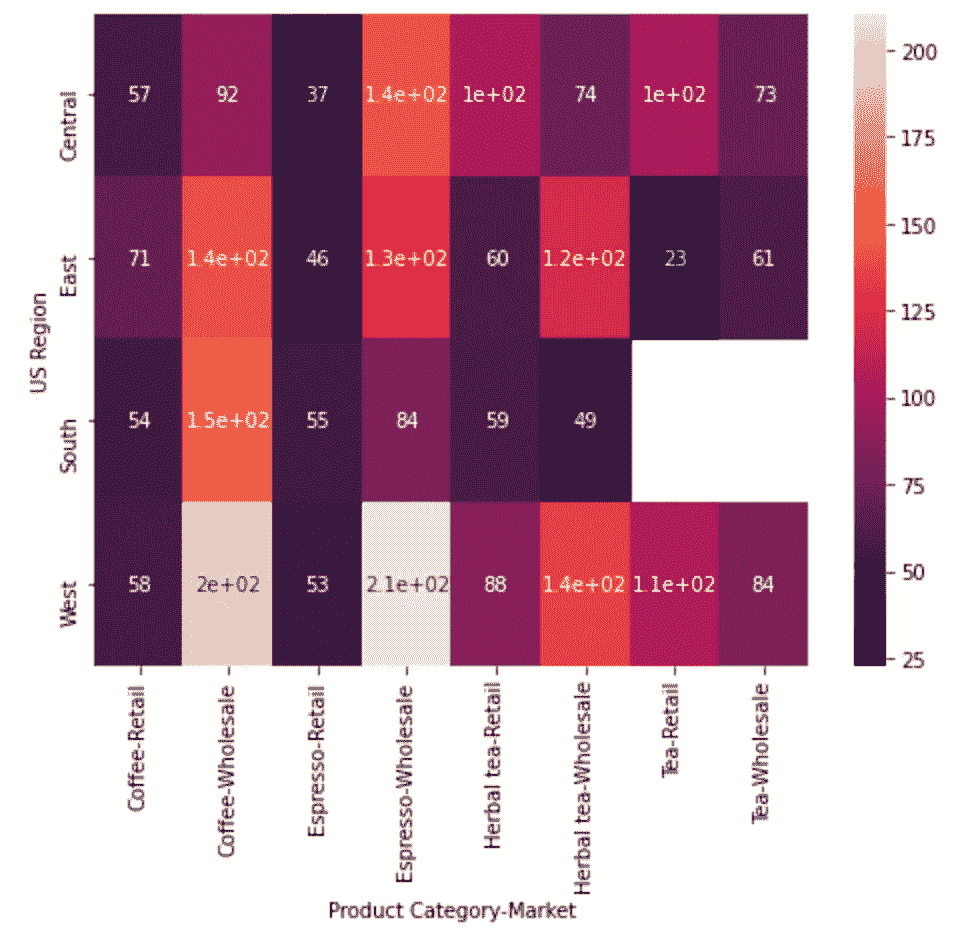

# 结论

在本文中，我们已经讨论了 7 个关于用 Pandas `crosstab()`方法汇总数据的用例。这是一个非常有用的工具，也是探索性数据分析中最受欢迎的数据汇总方法之一。

读完这篇文章后，你应该能够将它纳入你自己的数据分析。我希望你喜欢这篇文章，并学到一些新的有用的东西。

感谢阅读。请查看[笔记本](https://github.com/BindiChen/machine-learning/blob/master/data-analysis/045-pandas-crosstab/pandas-crosstab.ipynb)获取源代码，如果您对机器学习的实用方面感兴趣，请继续关注。更多教程可从 [Github Repo](https://github.com/BindiChen/machine-learning) 获得。

## 参考

*   [1] [数据科学简介](http://dept.stat.lsa.umich.edu/~kshedden/introds/topics/data_summaries/):数据汇总
*   [2] [熊猫相声解说](https://pbpython.com/pandas-crosstab.html)来自 pbpython.com