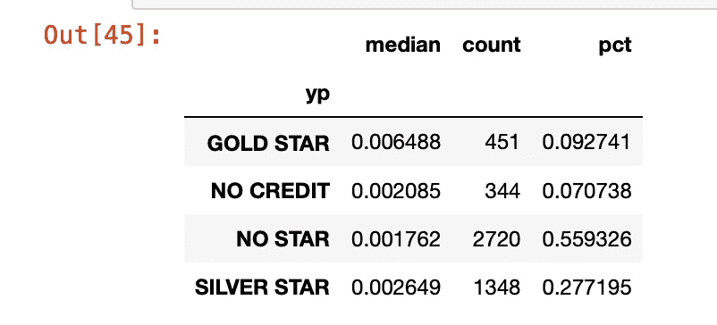

# 将来自多个机器学习模型的洞察/预测汇总成客户、潜在客户或其他实体的完整视图

> 原文：<https://towardsdatascience.com/summarizing-insights-predictions-from-multiple-machine-learning-models-into-a-complete-view-of-a-45a473783f8f?source=collection_archive---------53----------------------->

## 利用多种见解提出现实世界的建议


作者图片

<https://github.com/shadgriffin/profile_of_1>  

# 介绍

数据科学的核心是理解实体。什么是实体？嗯，一个实体是你试图理解的“东西”。例如，实体可以是商店、客户、机器或员工。数据科学让我们能够洞察一个实体在做什么或想什么。

大多数实体都很复杂。他们有多种倾向，是典型的移动目标。假设你是一名在电信公司工作的数据科学家，消费者是你的实体。电信消费者可以做很多事情。他们可以取消、增加、减少或维持他们的支出。他们可以购买产品 x，取消产品 y，或者，他们可以取消产品 x 和 y，但增加产品 z。

或者想象你是一个在线零售商。当一位顾客进入您的门户网站搜索一件新毛衣时，您应该推荐什么颜色？你还应该提供一件夹克、一条裤子、一双鞋或一顶帽子吗？

当你深入研究一个实体的行为和倾向，检查他们能做的所有事情时，事情变得令人毛骨悚然。本文处理将这些倾向组合成最有可能与实体相关的消息。这些都不是新的。我做这种事情已经有二十多年了，从来不会声称是我发明的。

随着我学习一些技巧，我想你会发现这样做可能会变得很棘手。这是因为你经常试图管理多个目标。最佳解决方案总是取决于问题的背景和你希望达到的目标。

据我所知，大多数现实世界的解决方案比这些例子更复杂，但它们使用相似的逻辑，并在核心上面临相似的问题。

此外，我正在处理这个用例中的[倾向模型](https://medium.com/the-official-integrate-ai-blog/heres-what-you-need-to-know-about-propensity-modeling-521ab660cb43)输出。您可以很容易地将它改编为一个[协会](https://en.wikipedia.org/wiki/Association_rule_learning)类型的模型输出。基本过程是一样的。

# 用例

在本文中，我将探索一家向小型企业销售广告的公司。小企业包括餐馆、油漆承包商和律师。在这个例子中，数据 100%是假的。我创造了它，它属于我。虽然是假的，但我觉得它准确地反映了我过去经历过的几个“真实世界”的例子。用例应该给你一种方式，你可以结合关于一个实体的多种见解。它并不意味着全面或包含您遇到的所有情况。它旨在提供一个框架，说明如何解决您将面临的具体问题。

我们的用例有三种类型的广告(产品),可以提供给小企业客户群。第一种是直邮。第二个是黄页。第三是线上/互联网。

[直邮](https://en.wikipedia.org/wiki/Advertising_mail):通过邮政服务发送给消费者(家庭)的传统印刷广告。

[黄页](https://en.wikipedia.org/wiki/Yellow_pages):传统平面广告。每年发行一次的企业名录。

[在线/互联网](https://en.wikipedia.org/wiki/Online_advertising):包括所有数字广告，如付费搜索、横幅广告和优先搜索位置。

在我们的第一个例子中，我们将假设我们的目标是为每个小企业客户提供一种产品。如果您通过[账单插页或账单信息](https://en.wikipedia.org/wiki/Insert_%28print_advertising%29)提供优惠，您可能会看到这一点。

对于账单插页或计费消息，空间有限。通常，只有向客户提供一个报价的空间。数据科学家必须决定向每个客户提供哪种产品。

其他情况下，你只限于一个报价是与互联网横幅广告或电子邮件广告。

在所有这些情况下，与最终客户的互动是最少的。你需要快速简洁地表达观点。

在我们的第二个例子中，我们将看一个场景，其中多个报价被扩展到一个小企业客户。这在有直销渠道的地方很常见。直销渠道意味着人们通过电话或亲自拜访客户。

在本例中，我们创建了小型企业客户的完整视图，快速总结了客户可能购买的产品。这给了每个销售人员一个如何接近每个客户的指南。第二个例子强调了与小型企业客户进行广泛互动，并且有更多时间来探索小型企业客户的需求的情况。

# 获取设置

第一步是导入 python 库。

```
import types
import pandas as pd
from botocore.client import Config
import ibm_boto3
import numpy as np
import numpy.dual as dualimport types
import pandas as pd
from botocore.client import Config
import ibm_boto3def __iter__(self): return 0
```

从 GitHub 导入数据。

```
!rm leads_for_humans.csv
!wget [https://raw.githubusercontent.com/shadgriffin/profile_of_1/main/leads_for_humans.csv](https://raw.githubusercontent.com/shadgriffin/profile_of_1/main/leads_for_humans.csv)df_datax = pd.read_csv("leads_for_humans.csv", sep=",", header=0)
```

探索数据。

```
df_datax.head()
```


以下是我们数据集中字段的描述。

cust_id:客户的唯一标识符。在这种情况下，客户是一个小企业实体。

yp_probability:这来自于一个机器学习/预测模型。表示客户购买黄页广告的可能性。

predicted_yp_revenue:这来自于一个机器学习/预测模型。表明客户购买黄页广告的可能收入。

internet_probability:这来自于一个机器学习/预测模型。表明客户购买互联网广告的可能性。

predicted_internet_rev:这来自于一个机器学习/预测模型。表明客户购买互联网广告的收入。

dm_probability:这来自于一个机器学习/预测模型。表明客户购买直邮广告的可能性。

predicted_dm_rev:这来自于一个机器学习/预测模型。表明客户购买直邮广告的收入。

credit_flag:表示客户是否有信用问题，是否有拖欠风险。

# 给每位顾客分配一种产品。

在我们的第一个场景中，我们希望将产品与客户相匹配。每位顾客只能接受一次优惠。有许多不同的方法可以为每位顾客找到最好的产品。这里有几个例子。

## 技巧一——赢家通吃

赢家通吃的方法是最简单化的。我们的数据包含每个小企业客户购买每个产品的概率。最显而易见的解决方案是给每位顾客分配他们最有可能购买的产品。

创建一个名为“LEAD_PRODUCT”的新字段，其中包含每个客户最有可能购买的产品，基于他们的概率得分。

```
df1=df_datax.copy()df1["BEST"] = df1[["yp_probability", "internet_probability","dm_probability"]].max(axis=1)df1['LEAD_PRODUCT']=np.where((df1.yp_probability==df1.BEST),'YP',
                                      (np.where((df1.internet_probability==df1.BEST),'INTERNET',
                                                (np.where((df1.dm_probability==df1.BEST),'DM','DOODOO')))))
```

按产品统计优惠数量。

```
df_sum = pd.DataFrame(df1.groupby(['LEAD_PRODUCT'])['BEST'].agg(['mean','count', 'std']))
df_sum['pct']=(df_sum['count'])/df_sum['count'].sum()df_sum
```


从上表中，我们可以看到，根据我们的“赢家通吃”方法，将有 4 个直邮优惠、2，216 个互联网优惠和 2，643 个黄页优惠。

呃？这有点麻烦，是吧？5000 个优惠中，只有 4 个是直邮？这通常是行不通的。

实际上，这完全说得通。如果您查看上表中的“平均”一栏，购买 DM 的平均概率大大低于其他产品。

原来，直邮是一个新的战略产品，该组织只是在最近几年才开始销售媒体。因为这是新产品，很少有人购买。因为历史上很少有人购买，所以从机器学习模型购买的概率会很低。

这是一个普遍的问题。如果你是一个在线零售商，有一件新的花哨的毛衣，没有办法使用机器模型来预测购买概率，因为没有新产品的销售数据。对在线零售商来说，问题变成了，当你不知道谁最有可能购买时，你如何向顾客展示新产品？显然，有几种方法可以做到这一点。下面是一个适用于这个用例的方法。

现在，回到我们当前的用例。我们如何保持真实的购买概率，同时增加直邮优惠的数量？

## 技巧二——赢家通吃

在我们的第二个场景中，我们将使用相同的数据。然而，这一次，我们将设置一个限制，即至少有 15%的小企业前景获得直邮优惠。

有几种方法可以做到这一点。在下面的代码中，我以下面的方式实现了 15%的限制。

1.  向 15%最有可能购买直邮广告的潜在客户提供直邮广告。
2.  对于剩余的 85%的潜在客户，分配可能性最高的报价(互联网或黄页)。

```
df3=df_datax.copy()
```

对数据进行排序，让最有可能购买直邮的客户排在最后。这将确保那些分配了直邮优惠的人最有可能购买直邮，即使他们更有可能购买 YP 或互联网广告。

```
df3=df3.sort_values(by=['dm_probability'])
```

运用“赢家通吃”的方法。

```
df3["BEST"] = df3[["yp_probability", "internet_probability","dm_probability"]].max(axis=1)df3['LEAD_PRODUCTX']=np.where((df3.yp_probability==df3.BEST),'YELLOW_PAGES',
                              (np.where((df3.internet_probability==df3.BEST),'INTERNET',
                                        (np.where((df3.dm_probability==df3.BEST),'DM','DOODOO')))))
```

为了简单起见，限制字段的数量。

```
df3=df3[['yp_probability','internet_probability', 'dm_probability', 'LEAD_PRODUCTX']]
```

将 LEAD_PRODUCT 字段转换成三个不同的虚拟变量。我们将使用这些新字段来计算累计和。

```
df_dv = pd.get_dummies(df3['LEAD_PRODUCTX'])
df_dv = pd.get_dummies(df3['LEAD_PRODUCTX'])
df3= pd.concat([df3, df_dv], axis=1)
```

统计数据框中的记录总数。

```
total_n=df3['DM'].count()
```

计算每次报价的累计记录百分比。

```
df3['dm_cuml']=pd.DataFrame((df3.DM.cumsum())/total_n)
df3['internet_cuml']=pd.DataFrame((df3.INTERNET.cumsum())/total_n)
df3['yp_cuml']=pd.DataFrame((df3.YELLOW_PAGES.cumsum())/total_n)
```

如果黄页和互联网/在线报价的累计数量少于总数的 85%，使用“赢家通吃”方法，否则提供直邮。

```
df3["BEST"] = df3[["yp_probability", "internet_probability","dm_probability"]].max(axis=1)df3['LEAD_PRODUCT'] = np.where((df3.yp_cuml+df3.internet_cuml<0.85), df3.LEAD_PRODUCTX, 'DM')
df3=df3[['yp_probability','internet_probability', 'dm_probability', 'LEAD_PRODUCT','BEST']]df_sum = pd.DataFrame(df3.groupby(['LEAD_PRODUCT'])['BEST'].agg(['mean','count', 'std','sum']))
df_sum['total']=df_sum['count'].sum()
df_sum['pct']=df_sum['count']/df_sum['total']
df_sum
```


现在，15%的企业客户将获得直邮优惠。其他人将获得互联网或黄页报价。

## 技巧三—将每个概率标准化，这样每个概率都在一个共同的尺度上进行测量(平均值为 0.5，标准偏差为 0.01)

这项技术将在一个共同的尺度上标准化三个产品概率(平均值为 0.5，标准偏差为 0.01)。在我们将三个预测标准化后，我们将使用标准化的值来分配产品报价。

```
df2=df_datax.copy()
```

计算每个指标的平均值和标准偏差。

```
df2['YP_STD']=df2['yp_probability'].std()
df2['YP_MEAN']=df2['yp_probability'].mean()
df2['DM_STD']=df2['dm_probability'].std()
df2['DM_MEAN']=df2['dm_probability'].mean()
df2['INTERNET_STD']=df2['internet_probability'].std()
df2['INTERNET_MEAN']=df2['internet_probability'].mean()
```

使用平均值和标准差来标准化指标。

```
df2['S_yp_probability']=(50+(df2['yp_probability']-df2['YP_MEAN'])*(10/df2['YP_STD']))/100
df2['S_dm_probability']=(50+(df2['dm_probability']-df2['DM_MEAN'])*(10/df2['DM_STD']))/100
df2['S_internet_probability']=(50+(df2['internet_probability']-df2['INTERNET_MEAN'])*(10/df2['INTERNET_STD']))/100
```

对标准化变量应用“赢家通吃”方法。

```
df2["BEST"] = df2[["S_yp_probability", "S_internet_probability","S_dm_probability"]].max(axis=1)
df2['LEAD_PRODUCT']=np.where((df2.S_yp_probability==df2.BEST),'YELLOW PAGES',
                                      (np.where((df2.S_internet_probability==df2.BEST),'INTERNET',
                                                (np.where((df2.S_dm_probability==df2.BEST),'DM','DOODOO')))))df_sum = pd.DataFrame(df2.groupby(['LEAD_PRODUCT'])['BEST'].agg(['mean','count', 'std','sum']))df_sum['pct']=(df_sum['count'])/df_sum['count'].sum()df_sum
```


请注意，在我们将变量标准化后，收到直邮优惠的小型企业客户数量大幅增加。这是有充分理由的。如果你深入研究这些数据，你会发现直邮的客户群与互联网广告和黄页的客户群有很大的不同。换句话说，最有可能购买直邮的客户通常不同于那些很有可能购买互联网和黄页的客户。

## 技巧四——将预期产品收入和购买可能性结合起来。

使用预测收入为每个小型企业客户分配产品可能是一个好主意。在这个技巧中，我们用预期收入来衡量每个购买的可能性。
在这个例子中，我们只是简单地用预期收入乘以购买概率的乘积。

预期收入' * '购买概率'

还有很多其他方法可以将两者结合起来；什么是最好的取决于您的业务问题的背景。

```
df4=df_datax.copy()
```

将预测收入乘以购买概率。

```
df4['wgt_yp']=df4['yp_probability']*df4['predicted_yp_revenue']
df4['wgt_internet']=df4['internet_probability']*df4['predicted_internet_rev']
df4['wgt_dm']=df4['dm_probability']*df4['predicted_dm_rev']
```

对新变量使用“赢家通吃”方法并检查结果。

```
df4["BEST"] = df4[["wgt_yp", "wgt_internet","wgt_dm"]].max(axis=1)df4['LEAD_PRODUCT']=np.where((df4.wgt_yp==df4.BEST),'YELLOW_PAGES',
                                      (np.where((df4.wgt_internet==df4.BEST),'INTERNET',
                                                (np.where((df4.wgt_dm==df4.BEST),'DM','DOODOO')))))df_sum = pd.DataFrame(df4.groupby(['LEAD_PRODUCT'])['BEST'].agg(['median','count']))
df_sum['pct']=(df_sum['count'])/df_sum['count'].sum()
df_sum
```


# 使用购买概率和收入预测来总结每个小型企业客户。

在前面的示例中，我们的目标是只选择一种产品提供给每个小型企业客户。正如我前面提到的，当您与最终客户的互动很少时，这通常很有用。在第二个例子中，我将总结机器学习模型输出，并呈现一个客户的完整视图。就像我之前说的，有很多方法可以做到这一点。我将只强调两个。没有“正确”的答案。最佳答案取决于您业务问题的背景。希望这能给你一些启发。

## 技巧五—将潜在客户总结为金星和银星客户

```
df5=df_datax
```

创建一个非常小的随机数。在我们创建十分位数之前，我们会将它添加到我们的加权值中。这是为了确保我们十分之一的边缘是干净的。

```
df5['wookie'] = (np.random.randint(0, 1000, df5.shape[0]))/100000000000000000
```

将预测收入乘以购买概率。

```
df5['wgt_yp']=(df5['yp_probability']*df5['predicted_yp_revenue'])+df5['wookie']
df5['wgt_internet']=(df5['internet_probability']*df5['predicted_internet_rev'])+df5['wookie']
df5['wgt_dm']=(df5['dm_probability']*df5['predicted_dm_rev'])+df5['wookie']
```

创建最高权重值在十分位数 100，最低权重值在十分位数 10 的十分位数。

```
df5['internet_decile'] = pd.to_numeric(pd.qcut(df5['wgt_internet'], 10, labels=False))df5['dm_decile'] = pd.to_numeric(pd.qcut(df5['wgt_dm'], 10, labels=False))
df5['yp_decile'] = pd.to_numeric(pd.qcut(df5['wgt_yp'], 10, labels=False))
df5['yp_decile']=(df5['yp_decile']+1)*10
df5['dm_decile']=(df5['dm_decile']+1)*10
df5['internet_decile']=(df5['internet_decile']+1)*10
```

简化数据框，仅保留您需要的记录。

```
df_one=df5[['cust_id','internet_decile','dm_decile','yp_decile']].copy()
```

现在我们将十分位数归纳为三个不同的组。

第一组是“金星”这个群体是你的产品的 A+++客户。如果有人获得了网络广告的金星，他们很可能会购买，我们需要花费资源让小企业客户介绍和销售产品。转化的几率很高。

第二组是“银星”这个群体包含第二层潜在客户。购买该产品的可能性很大，但不是非常大。

第三组是“NO_STAR”这个群体购买该产品的可能性很小。

请注意，我将“GOLD_STAR”归类为前十分之一，“SILVER_STAR”归类为接下来的三十分之一。“NO_STAR”是最后六个十分位数。如何将数据分组，分组数量取决于您的业务问题以及您联系每个小型企业客户所需的资源量。例如，如果你只有足够的销售人员去接触 5%的潜在客户，这种细分就没有什么意义。

```
df_one['internet']=np.where((df_one.internet_decile>90),'GOLD STAR', 
                         np.where(((df_one.internet_decile<=90) & (df_one.internet_decile>=70)),'SILVER STAR', 
                                  np.where(((df_one.internet_decile<=60)),'NO STAR', 'POOPY')))df_one['yp']=np.where((df_one.yp_decile>90),'GOLD STAR', 
                         np.where(((df_one.yp_decile<=90) & (df_one.yp_decile>=70)),'SILVER STAR', 
                                  np.where(((df_one.yp_decile<=60)),'NO STAR', 'POOPY')))df_one['dm']=np.where((df_one.dm_decile>90),'GOLD STAR', 
                         np.where(((df_one.dm_decile<=90) & (df_one.dm_decile>=70)),'SILVER STAR', 
                                  np.where(((df_one.dm_decile<=60)),'NO STAR', 'POOPY')))df_one.head()
```


汇总以查看每个类别中的客户数量。

```
df_sum = pd.DataFrame(df_one.groupby(['internet'])['yp_decile'].agg(['median','count']))
df_sum['pct']=(df_sum['count'])/df_sum['count'].sum()
df_sum
```


简化数据集。

```
df_one=df_one[['cust_id','yp','dm', 'internet']]
```

现在，让我们看一些记录，看看该档案如何推荐您应该向每个小型企业客户提供什么。

```
sample=df_one[df_one['cust_id']==516211000001]
sample
```


这是一个 A++++++的前景。他们很有可能购买所有三种广告产品。我们应该优先考虑这一前景。在这个小型企业客户身上使用许多资源是有意义的。也许我们带他们出去吃饭。也许我们可以将客户分配给我们最好的销售代表。这个潜在客户非常好。

```
sample=df_one[df_one['cust_id']==516211000042]
sample
```


这种前景并不乐观。花费大量资源来转化这种前景是没有意义的，因为他们购买任何产品的概率都很低。

```
sample=df_one[df_one['cust_id']==516211000010]
sample
```


这种前景应该通过互联网广告和黄页来实现。考虑到购买的可能性很小，花费资源销售直邮毫无意义。

## 技巧六—将潜在客户概括为金星和银星客户，同时覆盖其他业务特征。

有时，除了机器学习模型之外，加入关于潜在客户的信息也是有意义的。信用风险通常是一个需要考虑的重要因素。如果一个小企业前景有不良信用，你可能想确保你得到你的钱。如果这是不可能的，你可能应该跳过他们，把你的资源卖给其他人。

在下面的代码中，我给每个潜在客户分配了一个“星级”类别，但是如果一个潜在客户有信用标志，我将他们归类为“无信用”

```
df_one=df5.copy()df_one['internet']=np.where((df_one.internet_decile>90 ) & (df_one.credit_flag==0),'GOLD STAR', 
                         np.where(((df_one.internet_decile<=90) & (df_one.internet_decile>=70) & (df_one.credit_flag==0)),'SILVER STAR', 
                                  np.where(((df_one.internet_decile<=60) & (df_one.credit_flag==0)),'NO STAR', 'NO CREDIT')))df_one['dm']=np.where((df_one.dm_decile>90 ) & (df_one.credit_flag==0),'GOLD STAR', 
                         np.where(((df_one.dm_decile<=90) & (df_one.dm_decile>=70) & (df_one.credit_flag==0)),'SILVER STAR', 
                                  np.where(((df_one.dm_decile<=60) & (df_one.credit_flag==0)),'NO STAR', 'NO CREDIT')))df_one['yp']=np.where((df_one.yp_decile>90 ) & (df_one.credit_flag==0),'GOLD STAR', 
                         np.where(((df_one.yp_decile<=90) & (df_one.yp_decile>=70) & (df_one.credit_flag==0)),'SILVER STAR', 
                                  np.where(((df_one.yp_decile<=60) & (df_one.credit_flag==0)),'NO STAR', 'NO CREDIT')))
```

344 个前景有不良信用，应该避免。

```
df_sum = pd.DataFrame(df_one.groupby(['yp'])['internet_probability'].agg(['median','count']))
df_sum['pct']=(df_sum['count'])/df_sum['count'].sum()
df_sum
```



最后，让我们从上面看一下我们的一个客户。以前，这种前景是有希望的。然而，当你考虑信用因素时，你可能应该远离。

```
df_one=df_one[[‘cust_id’,’yp’,’dm’, ‘internet’]]sample=df_one[df_one[‘cust_id’]==516211000010]
sample
```


这个例子处理向小企业客户销售广告，但是基本思想也适用于其他情况。

比方说，你试图在一个电子商务网站(一个推荐引擎)上为消费者匹配产品。产品的数量可能会更多，所以您可能希望向消费者展示多种产品。基本思路是一样的。你会选择顶级 X 产品而不是顶级产品。

# 结论

正如我上面提到的。这绝不意味着是针对特定实体总结机器学习模型这一主题的全面解决方案。相反，我只是想给你一些关于什么是可能的想法。特定问题的最佳解决方案总是取决于上下文。

我希望这有所帮助。