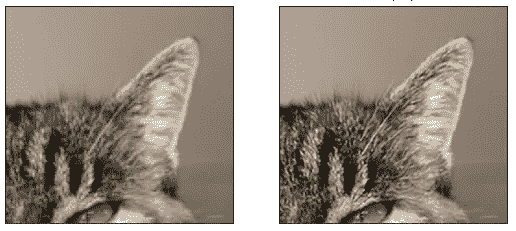
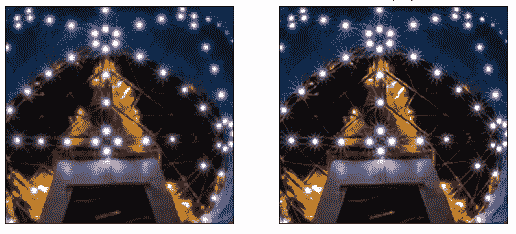
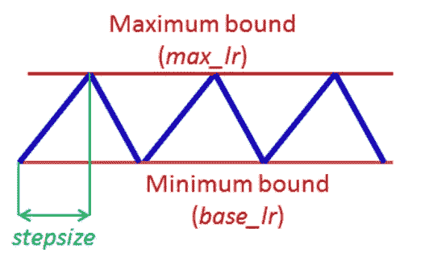

# 张量流中具有循环学习率的超收敛性

> 原文：<https://towardsdatascience.com/super-convergence-with-cyclical-learning-rates-in-tensorflow-c1932b858252?source=collection_archive---------15----------------------->

使用循环学习速率表的超收敛是深度学习中最有用的技术之一，但经常被忽略。它允许网络架构、损失函数工程、数据扩充实验和训练生产就绪模型的快速原型制作，在数量级上减少训练时间和时期。


美国宇航局在 [Unsplash](https://unsplash.com/s/photos/cyclone?utm_source=unsplash&utm_medium=referral&utm_content=creditCopyText) 拍摄的照片

这篇文章和附带的代码表明，可以在几分钟内根据初始化的权重(即，未预训练或转移)训练深度神经网络模型以完成复杂任务，例如超分辨率。

以这种方式训练的技术来自几年前的研究。2015 年，Leslie Smith 发表了一篇题为[训练神经网络的循环学习率](https://arxiv.org/abs/1506.01186)的论文，概述了通过循环达到非常高的学习率来更快(用更少的时期)训练深度神经网络模型的方法。可悲的是，大多数深度学习实践者都没有注意到这一点。

这种技术是如此有效，以至于在不使用预训练模型的情况下，从初始化开始大约 4 分钟内，可以在低至 16 个时期内训练现有技术的超分辨率模型。取得了如下令人印象深刻的结果。

## 对来自 DIV2K 验证集的图像的裁剪执行的示例超分辨率

从 IDN 深度神经网络架构生成图像，该架构基于[通过信息提取网络](https://arxiv.org/abs/1803.09454)的快速准确的单幅图像超分辨率论文，其模型仅在 DIV2K 训练集中的 800 幅图像的训练集上训练了 16 个时期。这不是使用迁移学习训练的模型。

用于培训的学习率在 7e-3 和 7e-4 之间循环，最后一个周期在 7e-5 和 7e-6 之间。

7e-3 比传统上用于训练这些深度神经网络的学习速率高得多，后者通常可能是 2e-4，然后分段衰减。



12 个时期后的 2 倍超分辨率，左低分辨率，右高分辨率。来自 [DIV2K 数据集](https://data.vision.ee.ethz.ch/cvl/DIV2K/)的图像。


12 个时期后的 2 倍超分辨率，左低分辨率，右高分辨率。来自 [DIV2K 数据集](https://data.vision.ee.ethz.ch/cvl/DIV2K/)的图像。



12 个时期后的 2 倍超分辨率，左低分辨率，右高分辨率。来自 [DIV2K 数据集](https://data.vision.ee.ethz.ch/cvl/DIV2K/)的图像。


12 个时期后的 2x 超分辨率，来自 [DIV2K 数据集](https://data.vision.ee.ethz.ch/cvl/DIV2K/)的低分辨率左图像和改进的右图像。


12 个时期后的 2 倍超分辨率，左低分辨率，右高分辨率。图片来自 [DIV2K 数据集](https://data.vision.ee.ethz.ch/cvl/DIV2K/)。

训练时间确实取决于硬件，这项研究是使用 NVidia 3080RTX 进行的，4 分钟的训练时间数字。

## 学习率高，训练不稳定

通常，高学习率会导致不稳定的训练，并导致模型偏离且无法被训练。小的学习率可能永远不会收敛，或者可能卡在次优模型上。因此，中等的学习速率被选择并用于许多时期，例如 10，000 个时期并不少见。步进式学习率并不少见，在训练过程中有几个降低学习率的步骤，如分段常数衰减学习率计划。

利用循环学习率时间表，高学习率仅维持很短的时间，并且有助于避免训练变得不稳定、爆发梯度和模型发散。即使是短时间的较高学习率也允许在相对较短的时期内训练和找到接近最优的模型。

## 实验

还有其他因素，如具有可以快速训练的深度神经网络架构，找到并使用最佳初始化。使用超级收敛可以让您轻松快速地找到并测试这些。

研究中多少实验都不会有结果，能够在更短的时间内进行越来越多不同的实验对研究人员来说是无价的。

如果你在云基础设施上进行培训，那么更快的培训和更少的能源使用可以节省成本，当云数据中心占世界能源使用的 1%以上时，这不是一件坏事。

## 张量流和 PyTorch

杰瑞米·霍华德在他的 Fastai 图书馆和课程中使用 PyTorch 向一些从业者和学生推广了循环学习率计划，特别是使用迁移学习和重新训练修改的现有(预训练)模型。在与 PyTorch 一起在 TensorFlow 中实现深度学习后，我发现令人惊讶的是，在 TensorFlow 2 中没有找到太多超级收敛的证据，也没有太多实际例子，因此有了写这篇文章的灵感，并希望能帮助其他人。

## 深度神经网络架构

通过使用循环学习率计划来实现超级收敛，可以快速试验测试更多架构，改变它们并调整它们的超参数。

## 损失函数

工程有效损失函数可能很复杂，尤其是在我的文章中概述的混合和加权值，能够在几分钟内评估调整，而不是几小时或几天，可以提高生产率，并允许实验更加多样化和更加详细。

## 数据扩充

数据扩充是另一个非常有效的工具，许多深度学习实践者没有充分利用它。使用循环学习速率表来实现超级收敛允许快速测试不同的数据增强，以查看每种增强技术的有效性，并调整增强的超参数。例如，为随机亮度增加找到合适的增量。

# TensorFlow 2 中的循环学习率计划

这相当于 [TensorFlow 2 的循环学习率](https://www.tensorflow.org/addons/api_docs/python/tfa/optimizers/CyclicalLearningRate)时间表的文档范围。这是很好的实现，并可在 TensorFlow 插件。

如果您知道参数是什么以及要指定什么，那么实现就不会太复杂，而文档在这方面有所欠缺。

你需要安装 TensorFlow 插件与 pip 或其他。

```
pip install tensorflow-addons
```

然后在代码中导入循环学习率

```
from tensorflow_addons.optimizers import CyclicalLearningRate
```

然后创建一个循环学习率计划，每个参数将在下面详细介绍。我相信，这些参数的不明确可能是 TensorFlow 学习率计划没有被广泛使用的原因之一。

```
cyclical_learning_rate = CyclicalLearningRate(
 initial_learning_rate=3e-7,
 maximal_learning_rate=3e-5,
 step_size=2360,
 scale_fn=lambda x: 1 / (2.0 ** (x - 1)),
 scale_mode='cycle')
```

然后将其指定为优化器，例如使用 Adam 算法(在 TF . keras . optimizer . Adam 中实现)进行训练。

```
tf.train.Checkpoint(
 model = model,
 optimizer = Adam(learning_rate=cyclical_learning_rate))
```

## **初始学习率**

初始学习率是基础或最低的学习率，是每个训练周期开始时的学习率。

## **最大学习率**

最大学习率是最高的学习率，是第一个训练周期中间的学习率，随后取决于你的尺度函数。

## **步长**

步长是半个周期。步长是每步使用的迭代次数，一个循环由两个这样的步骤组成:一个步骤中学习速率增加，另一个步骤中学习速率减少。在论文中，Leslie Smith 建议实验表明步长等于一个时期中迭代次数的 2 到 10 倍是好的。

因此，步长应设置为每个时段内的*次迭代(在 TensorFlow 2 中，训练集中的项目数除以批量大小)乘以 2 到 10 之间的因子。*



来源:[训练神经网络的循环学习率](https://arxiv.org/abs/1506.01186)

## 标度函数

比例函数是控制从初始学习速率到最大学习速率再回到初始学习速率的变化的函数。在本文中，这是三角形、三角形 2 或指数范围之一。在我自己的实验中，我发现三角形 2 是最有效的。

**三角**:基本三角循环，无幅度缩放；

```
lambda x: 1.0
```

**三角 2** :基本三角周期，每个周期将初始振幅减半；

```
lambda x: 1 / (2.0 ** (x — 1))
```

**指数范围**:将初始振幅按γ缩放至每个周期的循环迭代次数的循环；

```
lambda x: gamma ** x
```

## 培训步骤

莱斯利·史密斯在论文中指出:

> 实验表明，用至少 3 个周期来替换恒定学习速率的每一步，可以在大部分时间内训练网络权重，并且运行 4 个或更多周期将获得甚至更好的性能。

因此，训练步数应该是步长乘以 2(一个周期中的两步)，然后乘以 3 或更多(周期)。这导致至少 12 个时期的训练。

有趣的是，通过我的实验，我经常发现 3 个周期比 4 个周期训练出更高性能的模型，更多周期的训练在精度/性能上有小的增加。

这个参数应该由相对于较长的训练时间，精确度的非常小的增加有多重要来确定。

此外，莱斯利·史密斯在论文中指出:

> 此外，最好在一个周期结束时停止训练，这是学习率处于最小值和准确性达到峰值的时候。

正确计算以确保列车在一个周期结束时停止非常重要。

**步长**

Leslie Smith 在论文中观察到，在实验中，每步中的 8 或 10 个时期在 2 个时期内通常只有边际改善。这个参数应该由精确度的微小增加的重要性来决定。

## 选择初始和最大学习率

2017 年，Leslie Smith 和 Nicholay Topin 发表了一篇题为“超级收敛:[使用大学习率非常快速地训练神经网络](https://arxiv.org/abs/1708.07120)”的论文。本文描述了如何使用学习率范围测试来检查模型是否可能超收敛，以及选择初始和最大学习率的方法。可悲的是，大多数深度学习实践者都没有注意到这一点。

在论文中它建议(CLR 是循环学习率):

> 当以小的学习速率开始时，网络开始收敛，并且随着学习速率的增加，它最终变得太大，并且导致训练/测试精度降低。当使用 CLR 时，该峰值处的学习率是用作最大学习率界限的最大值。最小学习率可以通过将最大学习率除以因子 3 或 4 来选择。

在我自己的实验和研究中，我发现将学习速度降低一个数量级，因此降低 10 倍会更有效。

有许多方法可以实现一个学习率查找器，通常是检查 Tensorboard 的图形来找到最佳的最大学习率。通常，学习率会随着每批训练量的增加而缓慢增加，直到损失停止改善且模型发散。则最大学习率被选择为稍小于该值的值。

## 1 个周期

在论文中，它建议使用一个学习率低几个数量级的最终周期，因此可能低 100 或 1000 倍。

来自报纸:

> 这里，我们建议对超收敛的循环学习率策略稍加修改；始终使用小于迭代/历元总数的一个周期，并允许剩余迭代的学习率比初始学习率降低几个数量级。我们将这种学习率策略命名为“1cycle ”,在我们的实验中，这种策略可以提高精确度。

这以先前的 12 个训练时期到 16 个时期的例子为例，这仍然是非常少的训练时期。

## 足够好的模型

用超收敛训练的模型可能并不比对更多时期执行数千次的传统分段训练更好。从我的实验和研究中，我发现模型最好接近分段训练的模型。

然而，在许多情况下，它们可能足够接近。在如此短的训练时间内达到接近 99%的准确率可能就足够了，并且实际结果可能与能够更好地概括的模型不那么过度拟合。

## 一个示例实现

下面是我的示例实现，演示了使用循环学习率计划的超收敛:

[https://github.com/chris-thomas/idn-superresolution-tf2](https://github.com/chris-thomas/idn-superresolution-tf2)

这是 IDN 深度神经网络的改进版本，来自郑辉、王秀梅和高新波的论文[通过信息提炼网络](https://arxiv.org/abs/1803.09454)快速准确的单幅图像超分辨率。

我使用 SSIM 来衡量质量，因为我不相信跨图像的 PSNR 平均值是准确的，因为它是基于对数的度量。比较多幅图像中的 PSNR 可能没什么意义。

这个 IDN 的修改/改进版本是我正在进行的研究的结果，将在另一篇未来的文章中详细介绍。