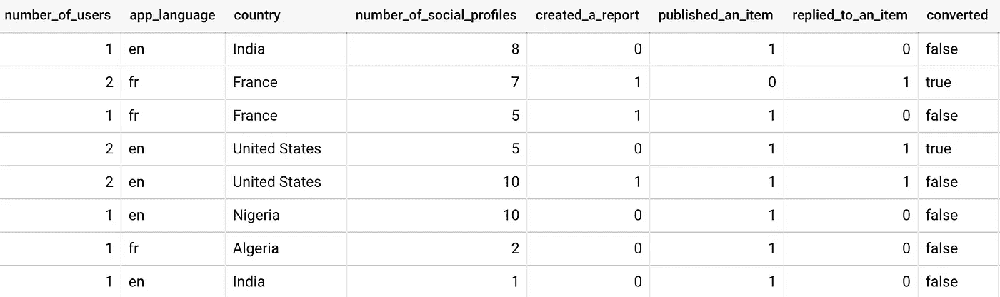
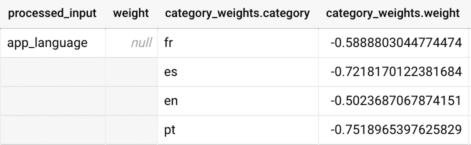
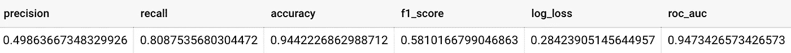
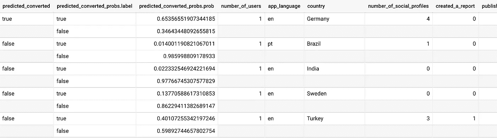

# 使用 BigQuery ML 实现超快速的机器学习

> 原文：<https://towardsdatascience.com/super-fast-machine-learning-to-production-with-bigquery-ml-53c43b3825a3?source=collection_archive---------19----------------------->

## 如何使用 Bigquery ML 快速部署您的模型，并专注于真正重要的事情。


Patrick Federi 在 [Unsplash](https://unsplash.com/) 上的照片

几个月前，在 Agorapulse，我们启动了两个新的基于机器学习的项目。因为我们已经使用 BigQuery 将近 2 年了，所以我们必须尝试一下 BQML。这是我们所学到的，以及你可以从中学到的！

# 最大的挑战可能不是你想的那样

作为一名机器学习工程师，你通常会考虑*如何创建性能最佳的模型*、*使用什么算法*，或者*如何优化模型，以从 94%的准确率提高到 96%* 。

但如果你的公司正处于机器学习之旅的开始，这可能不是这个过程中最重要的部分。至少现在还没有。如果你正在训练一辆自动驾驶汽车，并处理人类的生活，这当然是正确的，但对我们其他人来说却不是。

首先，你将不得不面对机器学习中的两个下述挑战。

## 1.采纳和文化转变

在《哈佛商业评论》2019 年发表的这篇文章中，作者说“技术不是最大的挑战。文化是。”

当你的营销或产品团队要求具体的见解或分析时，你可以自由地专注于技术部分(例如:数据分析)。既然你是在回答他们已经有的问题，领养应该不是问题。

但对于不习惯机器学习的人来说，机器学习被视为一个“黑匣子”:引擎盖下是什么？它能为我做什么？
当启动一个机器学习项目时，你可能会与用户来回沟通，以帮助采用、提高可解释性，或者迭代算法本身来改善结果。采用 ML 需要时间。

> 在我们的一项调查中，近 90%从事成功扩展实践的公司将超过一半的分析预算用于推动采用的活动，如工作流重新设计、沟通和培训。
> —《哈佛商业评论》——构建人工智能驱动的组织

## 2.部署和可用性

朱庇特笔记本只是一个开始。虽然大多数机器学习课程似乎都专注于笔记本内部发生的事情，但如果你就此止步，你的公司将永远无法使用你的工作。

在我们的案例中，我们希望在我们团队使用的一些工具(CRM、销售工具等)中，在我们的仪表板、数据仓库和核心产品数据库中提供我们的预测。此外，我们需要自动化训练、测试、部署和执行我们的模型的 ML 工作流。

朱庇特笔记本之后还有一段路要走！

# BigqueryML 进场

BigQuery ML 是一个通过使用标准 SQL 查询，直接在 BigQuery 中创建、执行和服务机器学习模型的工具。

我们使用 BigQuery 已经快 2 年了，它从未停止改进。尤其是 BigQuery ML，在过去的几年里[已经发布了大量的特性和模型](https://cloud.google.com/bigquery-ml/docs/release-notes)。

这绝对值得一试。以下是我们的发现！

## BigQuery ML 的优点

*   BQML 正在使用 SQL。您不需要使用多种语言，每个曾经与 SQL 数据库交互的人都应该能够使用它。
*   您可以直接从 BigQuery 为您的模型提供服务。无需管理为外部系统提供信息、培训和服务的工作流程。这省了很多情报部门的工作。
    *在 Agorapulse，我们使用 Cloud Composer (GCP 的 Apache Airflow)来管理我们的 SQL 工作流，同时更新和服务 BQML 模型。*
*   测试起来又快又简单。您不必将数据提取到您的本地机器来尝试。也不是为了执行模型并获得好的结果而成为专家机器学习工程师。
*   文档真的很好。一切都很详细，它包含了大量的例子:[https://cloud.google.com/bigquery-ml/docs](https://cloud.google.com/bigquery-ml/docs)

## 大查询 ML 的缺点

*   BQML 可能有点像黑箱。很难知道它在引擎盖下做什么——希望它们有检查功能来获得一些见解。这使得在将数据集注入 Bigquery ML 之前很难对其进行优化，也很难使用各种选项对模型进行微调。
*   不太灵活。如果您是一位经验丰富的数据科学家，曾经使用过 Python(或 R)和它的大量库，您可能会感到受限。有这么多的 ML 模型是 BQML 上没有的，还有大量的库可以优化你的模型。这是一种权衡，因为自己想出和部署某些东西会花费更多的时间。
    *注意，您仍然可以用 TensorFlow 创建一个模型，然后用 BigqueryML* 导入并服务它
*   显然，它有其局限性。您的数据必须在 BigQuery 中。而且你只能通过批处理来提供你的结果:例如，如果你想公开一个 API 端点来动态地执行一个模型，它是不适合的。[即使可以导出一个模型](https://cloud.google.com/bigquery-ml/docs/exporting-models)。

BigQuery ML 发展如此之快，我发现它的缺点可能会在未来几个月内得到极大的改进。

## 值得吗？

好吧，对于已经在使用 BigQuery 并希望尽快关注业务价值的我们来说:我们肯定要尝试一下 BQML！

# 它是如何工作的？

让我们以一个我们在 Agorapulse 做过的真实项目为例。出于示例的考虑，我们将使用一个简化的数据集和一个基本的 BQML 模型(没有复杂的选项和微调)。

给一些必要的背景，Agorapulse 是一个 Saas 工具，帮助企业管理他们在 Twitter、LinkedIn、Instagram、脸书和 YouTube 上的社交媒体。基于机器学习，我们想知道一家在免费试用期测试我们的 SaaS 的公司是否有可能转化为付费客户。

## 创建您的模型

对于每一个 ML 项目，你将从准备数据开始。这可能是整个过程中最耗时的部分。在我们的例子中，我们使用 Airflow (Cloud Composer)来创建数据准备工作流。

下面是我们将使用的简单数据集:



对于每一家尝试我们产品的公司，我们都有使用我们 Saas 的人数、产品内部使用的语言、国家、连接了多少个社交简档，以及一个布尔值(0 或 1)来判断该公司是否测试了我们的一些主要功能:在社交网络上发布、管理收件箱、创建/导出关于你的社交账户的报告。
最后，要预测的值:公司转化了没有？

然后，你必须选择一个模型。正如文档中所写的[，BQML 支持以下类型的模型:](https://cloud.google.com/bigquery-ml/docs/introduction#supported_models_in)

*   线性回归
*   二元和多类逻辑回归
*   k 均值聚类
*   矩阵分解
*   时间序列
*   提升树(基于 XGBoost 的模型)
*   深度神经网络(DNN)
*   [AutoML 表格](https://cloud.google.com/automl-tables/)
*   张量流模型导入

测试几个模型来解决我们的示例问题是很有趣的，包括逻辑回归、增强树，甚至用于分类的 DNN。
让我们继续一个**二元逻辑回归**。

```
CREATE OR REPLACE MODEL `medium.trial_to_paid_prediction_model`
OPTIONS 
(
    model_type='LOGISTIC_REG', 
    input_label_cols=['converted'], 
    auto_class_weights=TRUE
)
AS
SELECT
 *
FROM
`medium.trial_to_paid_prediction_dataset`
```

这就是创建我们的模型所需要的一切！

## 一些外卖

*   唯一的强制选项是 *model_type，*选择一个模型。和 *input_label_cols* 来选择要预测的值——尽管如果您将数据集中的列命名为预测“label ”,它也会做同样的工作。
*   *auto_class_weights* 用于使用权重平衡分类标签。它默认为 false，但由于我们有一个非常不平衡的数据集(6%的公司已经转化)，默认值可能会导致模型总是预测为 false，这实际上会导致 94%的“准确性”😉
*   几十个[选项](https://cloud.google.com/bigquery-ml/docs/reference/standard-sql/bigqueryml-syntax-create)可用于优化你的模型。您甚至可以在模型创建期间使用 [transform](https://cloud.google.com/bigquery-ml/docs/reference/standard-sql/bigqueryml-syntax-create#transform) 对数据进行预处理。
*   检查功能，如`ML.FEATURE_INFO`或`ML.TRAINING_INFO`将为您提供关于您的模型及其特征的更多信息。
*   BQML 用简单的一键编码处理非数值。



通过使用以下命令，您可以看到它是如何处理不同的特性的:

```
SELECT *
FROM ML.WEIGHTS(MODEL `medium.trial_to_paid_prediction_model`)
```

## 评估您的模型

现在，您可以通过以下方式访问评估指标:

```
SELECT
 *
FROM
ML.EVALUATE(MODEL `medium.trial_to_paid_prediction_model`)
```

或者如果您想要指定一个阈值或一些输入数据:

```
SELECT
 *
FROM
 ML.EVALUATE (MODEL `medium.trial_to_paid_prediction_model`,
 (
   SELECT
    *
   FROM
   `medium.trial_to_paid_prediction_dataset`
 ),
 STRUCT(0.55 AS threshold)
)
```



根据您选择的模型，评估指标可能会有所变化。

乍一看，对于用几个 SQL 命令创建的模型来说，结果看起来相当不错！*请记住，在这个例子中，我们只使用了 7 个特征来支持我们的模型。*

## 一些外卖

*   评估指标本身不足以解决问题。这取决于问题本身:在我们的案例中，如果我们想要识别出最有可能转化的前 5%的免费试用用户，并将其提供给我们的销售团队，我们可能会提高我们的阈值，这将机械地提高精确度并降低召回率。如果我们想要的是识别那些即使有微小机会转化的人，我们可以降低我们的阈值，这将导致降低精确度和增加召回。
*   根据您使用的模型，评估指标可能会有所不同。在逻辑回归的情况下，你也可以使用`ML.CONFUSION_MATRIX`来检查混淆矩阵

## 执行您的模型

现在你的模型已经准备好了，是时候执行和服务它了！
使用 BigQuery ML，您只需要一个命令:

```
SELECT *
FROM
 ML.PREDICT(MODEL `medium.trial_to_paid_prediction_model`,
 (
   SELECT
   *
   FROM
   `medium.trial_to_paid_prediction_new_data`
 ),
 STRUCT(0.55 AS threshold)  #Optional - Default to 0.5
)
```

就是这样！下面是 BigQuery 显示结果的方式:



输出使用 BigQuery 数组。使用 UNNEST()函数访问嵌套值。

由于我们使用了逻辑回归模型，BigQuery ML 根据我们选择的阈值给出了预测值。还有每个值的概率，你也可能会用到。

## 向世界展示你的模型

我们已经准备好向全世界展示这个模型。由于技术上没有额外的步骤来“部署”它，您可以专注于最重要的事情:用 ML 授权您的团队，并为业务提供价值。

在 Agorapulse，我们使用气流来执行 ML 工作流程，包括:

*   定期用最新数据重新训练我们的模型
*   每天对新数据执行我们的模型，并将结果发送到我们需要的不同地方— CRM、销售工具等…

# 结论

如果像我们一样，您已经在使用 BigQuery，并且想要启动您的第一个机器学习项目，毫无疑问，您应该尝试使用 BQML。

您将在几天内而不是几周内建立并运行您的第一个模型，并能够快速关注该阶段的重要内容:向您的团队展示 ML 的价值，为其采用进行必要的文化转变，并开发技术工作流以将 ML 纳入您的“系统”。

一旦 ML 被采用并且第一批结果已经出来，你仍然有足够的时间来改进模型本身，也许在某个时候，没有 BQML。

在我写这篇文章的时候，我们现在专注于下一步:推动我们的团队采用我们推出的几个基于机器学习的项目。创造良性循环，根据反馈改进我们的模型。为每个工具和团队提供我们模型的结果。基于这些结果触发自动化—以及更多功能。