# 超分辨率:Adobe Photoshop 与领先的深度神经网络

> 原文：<https://towardsdatascience.com/super-resolution-adobe-photoshop-versus-leading-deep-neural-networks-9758796fcd72?source=collection_archive---------18----------------------->

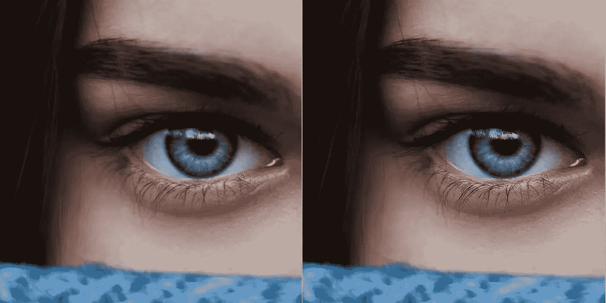

利用 Adobe 的超分辨率算法对 Unsplash 图像进行超分辨率处理

与领先的超分辨率深度神经网络模型相比，Adobe 的超分辨率效果如何？本文试图对此进行评估，Adobe 的超分辨率效果令人印象深刻。

# 超分辨率

超分辨率是通过提高图像的表观分辨率来改善图像质量的过程。具有有效地想象如果图像处于更高分辨率时将呈现的细节的算法。

有很多正面评价描述 Adobe Photoshop 的超级分辨率有多好，比如*“让我下巴撞到地板”*。经过几年对超分辨率的研究和实验，我想提出一个更具经验性的图像分辨率增强和实际图像质量指标的比较。在这篇文章中，我比较了:

*   双三次插值方法放大
*   Adobe Camera Raw 的超高分辨率
*   信息提炼网络超分辨率

## 双三次插值

[双三次插值](https://en.wikipedia.org/wiki/Bicubic_interpolation)是放大图像最常用的方法，通常会导致放大后的图像外观模糊。几乎每个图像编辑器都允许双三次插值，事实上大多数互联网浏览器使用双三次插值来显示比实际尺寸大的图像。

## Adobe Camera Raw 的超高分辨率

Adobe Camera Raw Super Resolution 或等效的 Photoshop Camera Raw 滤镜是最近推出的一种非常快速且易于使用的超分辨率方法，只需在 Adobe 的 Camera Raw 产品中单击“增强”即可实现。

Adobe 表示，这是一种先进的机器学习模型，对数百万张照片进行了训练，但没有给出更多细节。更多信息来自 [Adobe 的博客](https://blog.adobe.com/en/publish/2021/03/10/from-the-acr-team-super-resolution.html#gs.wbuyi0)。

该算法似乎很可能是一个深度神经网络，Adobe 从推理速度、性能和处理非常大分辨率图像的能力方面取得了显著的成果。

## 信息蒸馏网络(IDN)超分辨率

通过[信息提取网络](https://arxiv.org/abs/1803.09454)实现快速准确的单幅图像超分辨率展示了一个由郑辉、王秀梅和高新波的研究人员在深度卷积神经网络架构上训练的模型。

信息提炼网络(IDN)被选为比较对象，因为它的超分辨率性能仍然是最先进的，而且它的通用性很好。

研究人员还评估了他们在相对高分辨率图像上的超分辨率结果，而不是早期基于深度神经网络的超分辨率中常用的典型“邮票”大小的图像。

# 质量(和损失)指标

哪种质量度量是最好的是一个有争议的话题，不同的研究者有不同的看法。我个人认为 SSIM 和 MAE 是质量的最佳指标，尽管 PSNR 是在超分辨率模型和算法的学术研究评估中最常见的度量。

PSNR 和 MSE 缺乏捕捉感知或特征差异的能力，例如高纹理细节。这些度量非常有限，因为它们是基于逐像素的图像差异来定义的。最高的 PSNR 不一定反映感觉上更好的超分辨率改善。

已经包括双三次插值的度量用于比较，并且在这些分辨率下，双三次放大产生相对高质量的图像。

## 峰值信噪比定义(PSNR)

峰值信噪比定义(PSNR)非常常用于评估图像增强技术，例如超分辨率，其中信号是地面真实/原始图像，噪声是模型未恢复的误差。尽管 PSNR 是基于对数的指标，但它是基于 MSE 的。作为质量度量，较高的值表示较高的质量。

## 结构相似指数(SSIM)

结构相似性指数(SSIM)是一个感知指标。SSIM 是基于图像中可见的结构。使用 SSIM 进行图像增强评估是因为对于一些研究人员来说，PSNR 不再被认为是图像质量退化的可靠指标。这是一个感知指标，用于量化由处理导致的图像质量下降。作为质量度量，较高的值表示较高的质量。

## 均方误差

均方误差(MSE)用于比较地面真实/原始图像的像素与预测/生成图像的像素有多远。取每个像素差值的平均值，然后平方。作为损失或误差度量，较低的值表示较高的质量。

## 平均绝对误差

平均绝对误差(MAE)是地面真实/原始图像和预测/生成图像之间的绝对差异之和。作为损失或误差度量，较低的值表示较高的质量。

# Unsplash 的例子

这些是对高质量和高分辨率图像进行超分辨率处理的各种例子，这些图像来自流行的 [Unsplash](https://unsplash.com/) 免版税摄影网站。

在每个示例中,**左图像**是**双三次**插值放大,**中间图像**是 **Adobe 的**超分辨率，而**右图像**是 **IDN** 深度神经网络的超分辨率。

如上所述，度量是将每个放大/超分辨率方法的输出与原始地面真实图像进行比较。

对于这些高分辨率图像，来自双三次插值的度量通常非常高，因为通过有效地单独使用模糊滤波器进行放大可以产生高质量的度量，特别是对于 MSE。

从 Adobe 的超分辨率来看，大多数图像的分辨率和质量的视觉改善非常明显，尽管引入或夸大了 IDN 深度神经网络超分辨率中不存在的伪像。

## 示例 1

左图:双三次放大，中图:Adobe 的超分辨率，右图:IDN 的超分辨率。

**分辨率**:从 816x1020 像素升级到 1632x2040 像素

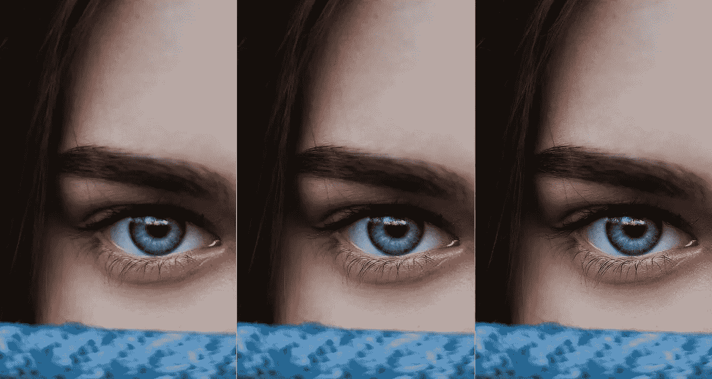

来自 [Unsplash](https://unsplash.com/) 的图像的超分辨率比较。左:双三次放大。中心:Adobe 的超级分辨率。右图:IDN 超分辨率。

从 Adobe 的超分辨率中，大多数图像的分辨率和质量的视觉改善是显而易见的，尽管仔细观察会发现引入或夸大了 IDN 深度神经网络超分辨率中不存在的伪像。

**左:双三次放大**
PSNR 双三次:38.3776
SSIM 双三次:0.9331
MSE 双三次:9.4475
MAE 双三次:0.0122

**中心:Adobe 的超分辨率** PSNR:31.8368
SSIM:0.8905
MSE:42.5988
MAE:0.0358

**右:IDN 超分辨率** PSNR:38.9078
SSIM:0.9400
均方误差:8.3619
平均误差:0.0122

下面的另一个比较也包括超分辨率算法试图重建的原始(地面真实)图像。左上图:双三次放大。右上图:Adobe 的超级分辨率。左下:IDN 超分辨率。右下:原图/地面真相图。

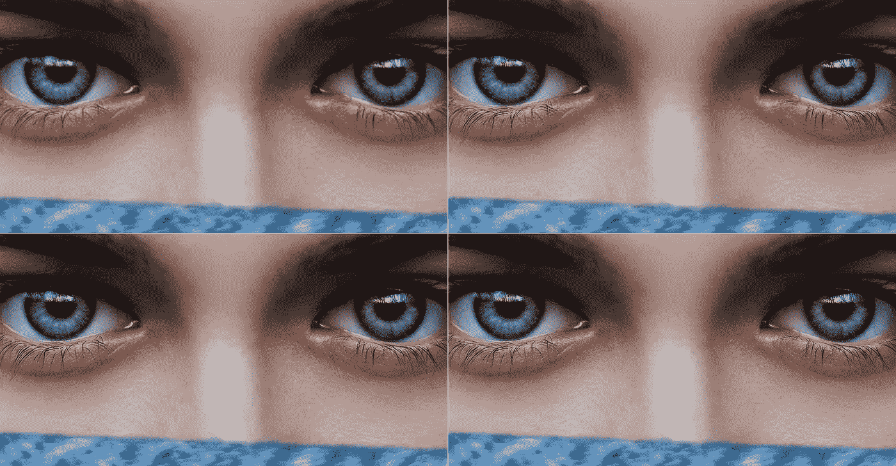

来自 [Unsplash](https://unsplash.com/) 的图像的超分辨率比较。左上:双三次放大。右上:Adobe 的超级分辨率。左下:IDN 超分辨率。右下方:原始/地面真实图像

## 示例 2

左图:双三次放大，中图:Adobe 的超分辨率，右图:IDN 的超分辨率。

**分辨率**:从 845x1020 像素升级到 1690x2040 像素

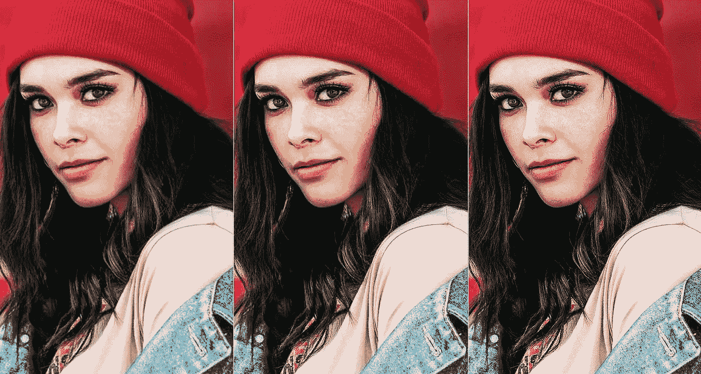

来自 [Unsplash](https://unsplash.com/) 的图像的超分辨率比较。左:双三次放大。中心:Adobe 的超级分辨率。右图:IDN 超分辨率。

即使度量标准没有指出这一点，从人类视觉的角度来看，Adobe 的超分辨率的改进优于双三次插值。IDN 模型的超分辨率带来的改进更大。

**左:双三次放大** PSNR:28.0634
SSIM:0.8128
均方误差:101.5632
平均误差:0.0278

**中心:Adobe 的超分辨率** PSNR:26.6016
SSIM:0.7796
MSE:142.2055
MAE:0.0384

**右图:IDN 超分辨率** PSNR:29.0446
SSIM:0.8541
均方误差:81.0245
平均误差:0.0254

下面的另一个比较也包括超分辨率算法试图重建的原始(地面真实)图像。左上图:双三次放大。右上图:Adobe 的超级分辨率。左下:IDN 超分辨率。右下:原图/地面真相图。

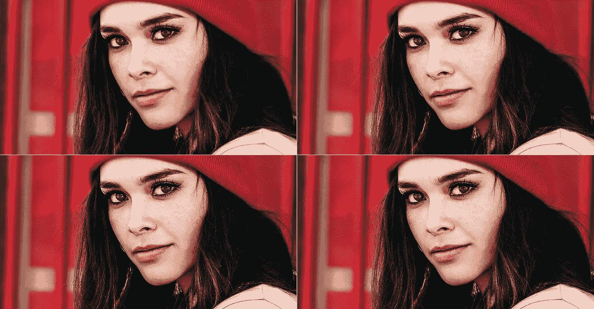

来自 [Unsplash](https://unsplash.com/) 的图像的超分辨率对比。左上:双三次放大。右上:Adobe 的超级分辨率。左下:IDN 超分辨率。右下方:原始/地面真实图像

## 示例 3

左图:双三次放大，中图:Adobe 的超分辨率，右图:IDN 的超分辨率。

**分辨率**:从 785x1020 像素升级到 1530x2040 像素

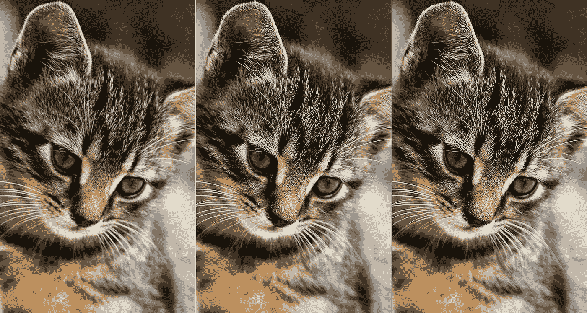

来自 [Unsplash](https://unsplash.com/) 的图像的超分辨率比较。左:双三次放大。中心:Adobe 的超级分辨率。右图:IDN 超分辨率。

通过这张图片，Adobe 的超分辨率和 IDN 模型之间的改进非常相似。IDN 款的皮毛和猫须看起来更加分明和锐利。

**左:双三次放大** PSNR:31.5566
SSIM:0.9564
均方误差:45.4386
平均误差:0.0091

**中心:Adobe 的超分辨率** PSNR:31.1871
SSIM:0.9319
MSE:49.4732
MAE:0.0147

**右图:IDN 超分辨率** PSNR:34.1575
SSIM:0.9712
均方误差:24.9650
平均误差:0.0077

下面的另一个比较也包括超分辨率算法试图重建的原始(地面真实)图像。左上图:双三次放大。右上图:Adobe 的超级分辨率。左下:IDN 超分辨率。右下:原图/地面真相图。

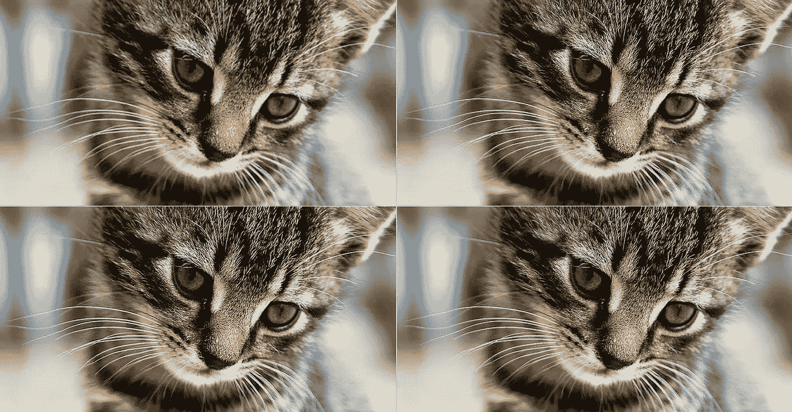

Unsplash 图像的超分辨率比较。左上:双三次放大。右上:Adobe 的超级分辨率。左下:IDN 超分辨率。右下方:原始/地面真实图像

## 实例 4

左图:双三次放大，中图:Adobe 的超分辨率，右图:IDN 的超分辨率。

**分辨率**:从 816x1020 像素升级到 1632x2040 像素

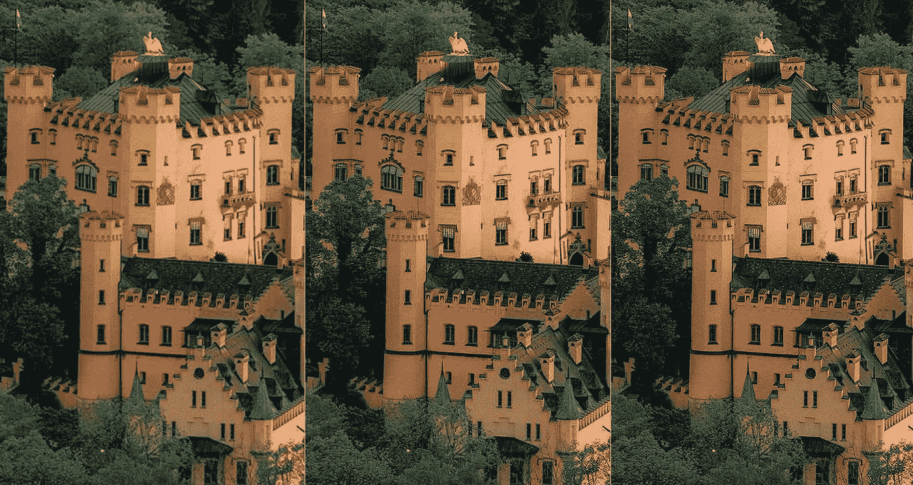

来自 [Unsplash](https://unsplash.com/) 的图像超分辨率对比。左:双三次放大。中心:Adobe 的超级分辨率。右图:IDN 超分辨率。

Adobe 的超分辨率增强了分辨率，将一些细节和特征恢复到图像中，尽管夸大了图像中的许多伪像，并且 IDN 模型再次产生了分辨率大大增强的图像。

**左:双三次放大** PSNR:28.5939
SSIM:0.7417
均方误差:89.8862
平均误差:0.0559

**中心:Adobe 的超分辨率** PSNR:26.5685
SSIM:0.6350
MSE:143.2957
MAE:0.0747

**右图:IDN 超分辨率** PSNR:29.4697
SSIM:0.8064
均方误差:73.4695
平均误差:0.0513

下面的另一个比较也包括超分辨率算法试图重建的原始(地面真实)图像。左上图:双三次放大。右上图:Adobe 的超级分辨率。左下:IDN 超分辨率。右下:原图/地面真相图。

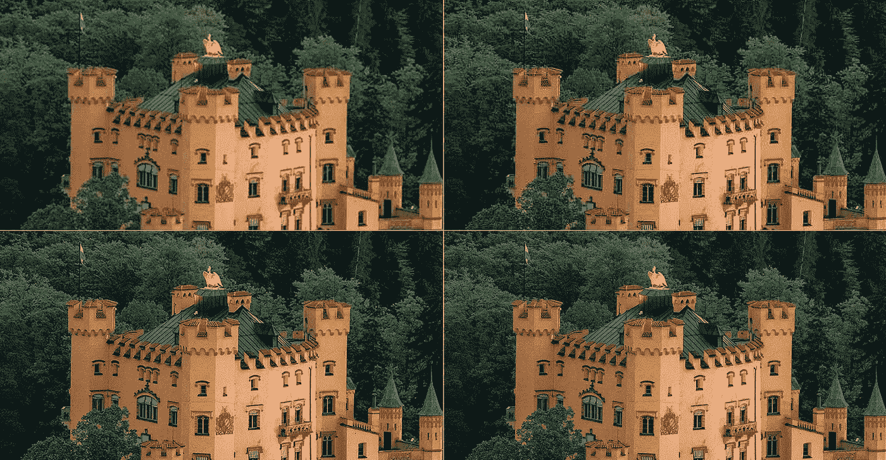

Unsplash 图像的超分辨率比较。左上:双三次放大。右上:Adobe 的超级分辨率。左下:IDN 超分辨率。右下方:原始/地面真实图像

## 实例 5

左图:双三次放大，中图:Adobe 的超分辨率，右图:IDN 的超分辨率。

**分辨率**:从 680x1020 像素升级到 1360x2040 像素

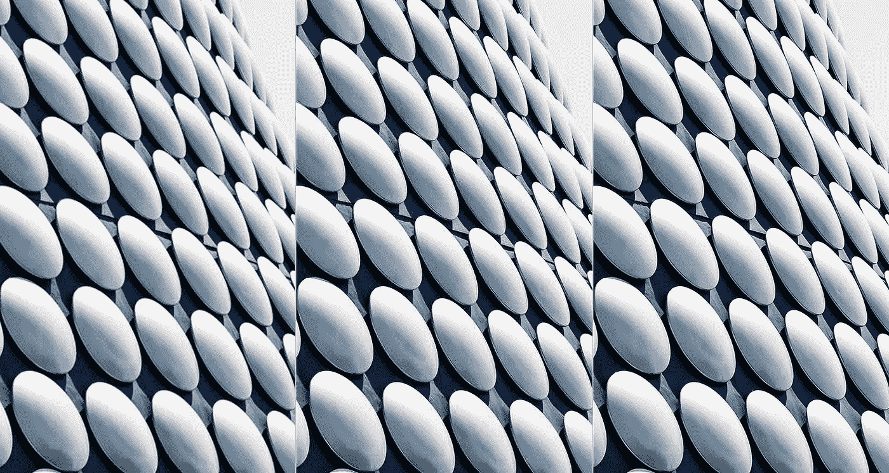

来自 [Unsplash](https://unsplash.com/) 的图像的超分辨率比较。左:双三次放大。中心:Adobe 的超级分辨率。右图:IDN 超分辨率。

有了这张图片，Adobe 的超分辨率和 IDN 模型的度量都得到了改善。视觉上，分辨率的增强在具有更平滑细节的 IDN 模型中表现得更好。

**左:双三次放大** PSNR:31.8182
SSIM:0.9673
均方误差:42.7823
平均误差:0.0062

**中心:Adobe 的超分辨率** PSNR:32.6134
SSIM:0.9356
MSE:35.6236
MAE:0.0086

**右图:IDN 超分辨率** PSNR:39.0521
SSIM:0.9861
均方误差:8.0886
平均误差:0.0038

下面的另一个比较也包括超分辨率算法试图重建的原始(地面真实)图像。左上图:双三次放大。右上图:Adobe 的超级分辨率。左下:IDN 超分辨率。右下:原图/地面真相图。

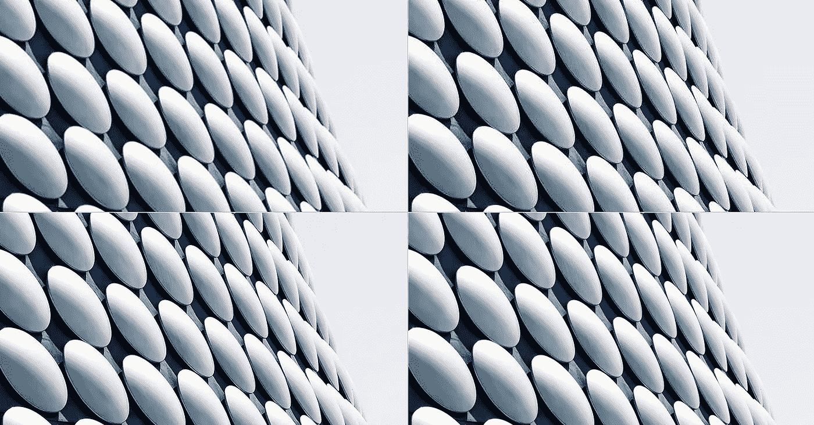

Unsplash 图像的超分辨率比较。左上:双三次放大。右上:Adobe 的超级分辨率。左下:IDN 超分辨率。右下方:原始/地面真实图像

## 实例 6

左图:双三次放大，中图:Adobe 的超分辨率，右图:IDN 的超分辨率。

**分辨率**:从 680x1020 像素升级到 1360x2040 像素

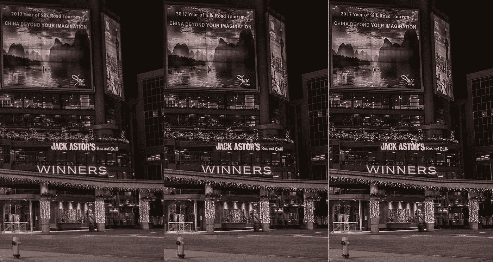

来自 [Unsplash](https://unsplash.com/) 的图像超分辨率对比。左:双三次放大。中心:Adobe 的超级分辨率。右图:IDN 超分辨率。

这是一个非常复杂的图像，需要用交互式广告牌和不同类型的照明来增强。Adobe 的超分辨率增强了分辨率，恢复了图像中的重要细节和特征，IDN 模型再次产生了分辨率大大增强的图像。

**左:双三次放大** PSNR:28.0320
SSIM:0.8890
均方误差:102.3008
平均误差:0.0405

**中心:Adobe 的超分辨率** PSNR:27.4427
SSIM:0.8495
MSE:117.1681
MAE:0.0591

**右:IDN 超分辨率** PSNR:30.6234
SSIM:0.9383
均方误差:56.3300
平均误差:0.0308

下面的另一个比较也包括超分辨率算法试图重建的原始(地面真实)图像。左上图:双三次放大。右上图:Adobe 的超级分辨率。左下:IDN 超分辨率。右下:原图/地面真相图。

Unsplash 图像的超分辨率比较。左上:双三次放大。右上:Adobe 的超级分辨率。左下:IDN 超分辨率。右下方:原始/地面真实图像

## 例 7

左图:双三次放大，中图:Adobe 的超分辨率，右图:IDN 的超分辨率。

**分辨率**:从 680x1020 像素升级到 1360x2040 像素

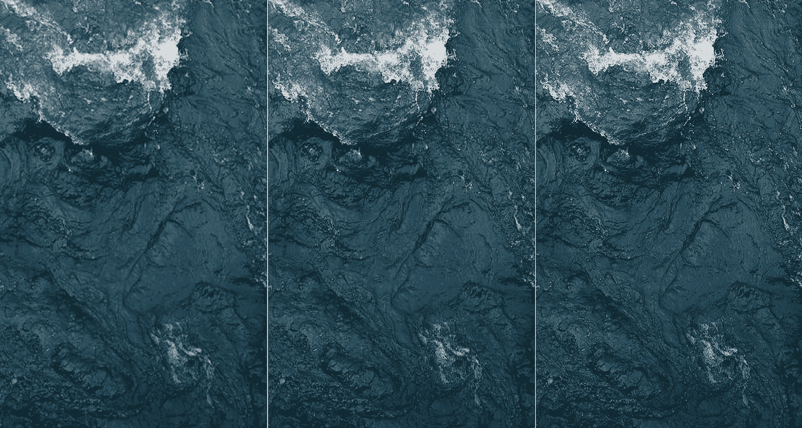

来自 [Unsplash](https://unsplash.com/) 的图像的超分辨率比较。左:双三次放大。中心:Adobe 的超级分辨率。右图:IDN 超分辨率。

Adobe 的超分辨率增强了分辨率，将细节和特征恢复到图像中的波浪中，尽管 IDN 模型再次产生了分辨率增强的图像。

**左:双三次放大** PSNR:30.8357
SSIM:0.8405
均方误差:53.6426
平均误差:0.0307

**中心:Adobe 的超分辨率** PSNR:28.0416
SSIM:0.7269
MSE:102.0751
MAE:0.0449

**右图:IDN 超分辨率** PSNR:31.9297
SSIM:0.8853
均方误差:41.6971
平均误差:0.0277

下面的另一个比较也包括超分辨率算法试图重建的原始(地面真实)图像。左上图:双三次放大。右上图:Adobe 的超级分辨率。左下:IDN 超分辨率。右下:原图/地面真相图。

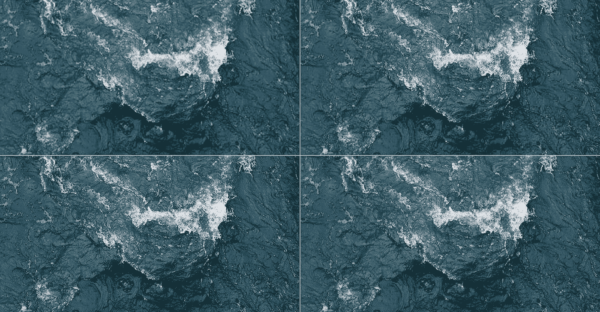

Unsplash 图像的超分辨率比较。左上:双三次放大。右上:Adobe 的超级分辨率。左下:IDN 超分辨率。右下方:原始/地面真实图像

## 实施例 8

左图:双三次放大，中图:Adobe 的超分辨率，右图:IDN 的超分辨率。

**分辨率**:从 1020x680 像素升级到 2040x1360 像素

来自 [Unsplash](https://unsplash.com/) 的图像超分辨率对比。左:双三次放大。中心:Adobe 的超级分辨率。右图:IDN 超分辨率。

一个复杂的图像，Adobe 的超分辨率通过图像中的一些细节和特征，尤其是标志/标语牌，很好地增强了分辨率，尽管 IDN 模型导致整个图像的分辨率增强。

**左:双三次放大** PSNR:26.3684
SSIM:0.8523
均方误差:150.0509
平均误差:0.0413

**中心:Adobe 的超分辨率** PSNR:26.2458
SSIM:0.7969
MSE:154.3489
MAE:0.0503

**右图:IDN 超分辨率** PSNR:29.0718
SSIM:0.9179
均方误差:80.5191
平均误差:0.0305

下面的另一个比较也包括超分辨率算法试图重建的原始(地面真实)图像。左上图:双三次放大。右上图:Adobe 的超级分辨率。左下:IDN 超分辨率。右下:原图/地面真相图。

Unsplash 图像的超分辨率比较。左上:双三次放大。右上:Adobe 的超级分辨率。左下:IDN 超分辨率。右下方:原始/地面真实图像

## 示例 9

左图:双三次放大，中图:Adobe 的超分辨率，右图:IDN 的超分辨率。

**分辨率**:从 1020x632 像素升级到 2040x1264 像素

来自 [Unsplash](https://unsplash.com/) 的图像的超分辨率比较。左:双三次放大。中心:Adobe 的超级分辨率。右图:IDN 超分辨率。

在这些图片比较中，有一些新天鹅堡(Schwangau，德国)的图片变化。这是一个很好的例子，说明通过这些超分辨率方法，分辨率的视觉改善是多么显著。此外，在不同视角和质量的同一主题的不同图像之间，分辨率的提高会如何变化。

**左:双三次放大** PSNR:30.0251
SSIM:0.8722
均方误差:64.6507
平均误差:0.0181

**中心:Adobe 的超分辨率** PSNR:28.4533
SSIM:0.8154
MSE:92.8427
MAE:0.0234

**右:IDN 超分辨率** PSNR:31.3335
SSIM:0.9158
均方误差:47.8331
平均误差:0.0159

下面的另一个比较也包括超分辨率算法试图重建的原始(地面真实)图像。左上图:双三次放大。右上图:Adobe 的超级分辨率。左下:IDN 超分辨率。右下:原图/地面真相图。

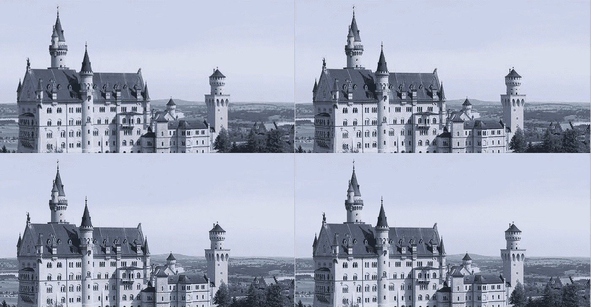

Unsplash 图像的超分辨率比较。左上:双三次放大。右上:Adobe 的超级分辨率。左下:IDN 超分辨率。右下方:原始/地面真实图像

## 实例 10

左图:双三次放大，中图:Adobe 的超分辨率，右图:IDN 的超分辨率。

**分辨率**:从 680x1020 像素升级到 1360x2040 像素

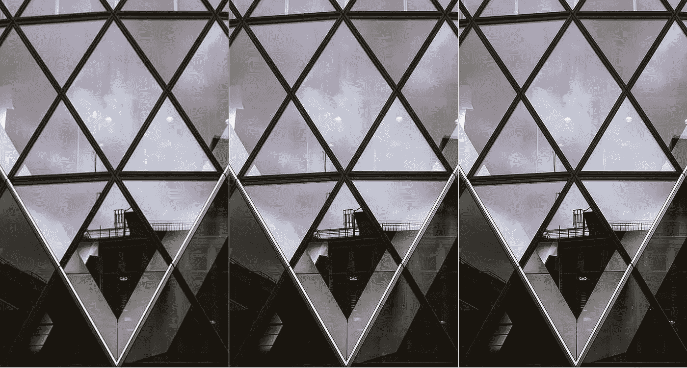

来自 [Unsplash](https://unsplash.com/) 的图像的超分辨率比较。左:双三次放大。中心:Adobe 的超级分辨率。右图:IDN 超分辨率。

一个带有边缘和反射的复杂图像，Adobe 的超级分辨率通过图像中的一些细节和特征很好地增强了分辨率，尽管夸大了图像中的一些伪像。IDN 模型提高了整个图像的分辨率。

**左:双三次放大** PSNR:32.0612
SSIM:0.9570
均方误差:40.4542
平均误差:0.0149

**中心:Adobe 的超分辨率** PSNR:31.7344
SSIM:0.9239
MSE:43.6156
MAE:0.0338

**右:IDN 超分辨率** PSNR:38.9284
SSIM:0.9804
均方误差:8.3223
平均误差:0.0099

下面的另一个比较也包括超分辨率算法试图重建的原始(地面真实)图像。左上图:双三次放大。右上图:Adobe 的超级分辨率。左下:IDN 超分辨率。右下:原图/地面真相图。

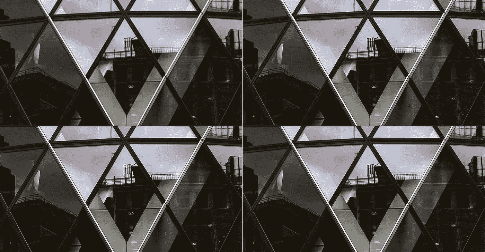

Unsplash 图像的超分辨率比较。左上:双三次放大。右上:Adobe 的超级分辨率。左下:IDN 超分辨率。右下方:原始/地面真实图像

## 实施例 11

左图:双三次放大，中图:Adobe 的超分辨率，右图:IDN 的超分辨率。

**分辨率**:从 680x1020 像素升级到 1360x2040 像素

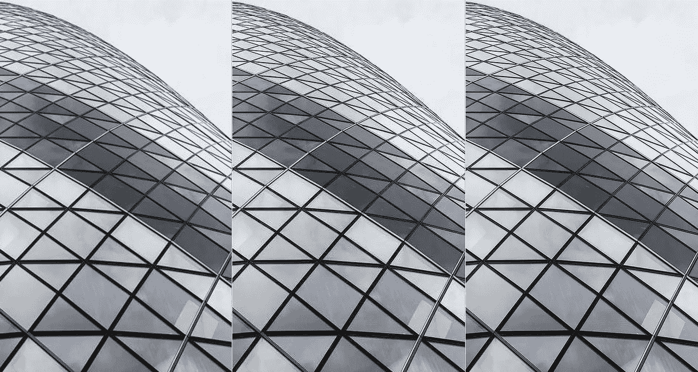

来自 [Unsplash](https://unsplash.com/) 的图像的超分辨率比较。左:双三次放大。中心:Adobe 的超级分辨率。右图:IDN 超分辨率。

这又是一个有边缘和反射的复杂图像，Adobe 的超级分辨率通过图像中的一些细节和特征很好地增强了分辨率，尽管夸大了图像中的一些伪像。IDN 模型提高了整个图像的分辨率。

**左:双三次放大** PSNR:26.6965
SSIM:0.9350
均方误差:139.1342
平均误差:0.0156

**中心:Adobe 的超分辨率** PSNR:28.8793
SSIM:0.9115
MSE:84.1695
MAE:0.0161

**右图:IDN 超分辨率** PSNR:32.3578
SSIM:0.9759
均方误差:37.7836
平均误差:0.0091

## 实例 12

左图:双三次放大，中图:Adobe 的超分辨率，右图:IDN 的超分辨率。

**分辨率**:从 785x1020 像素升级到 1530x2040 像素

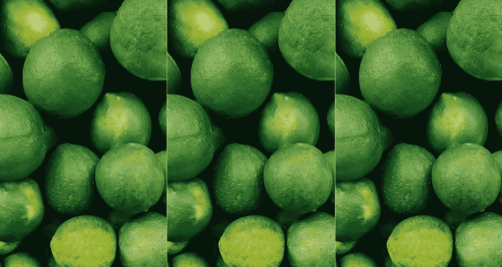

来自 [Unsplash](https://unsplash.com/) 的图像的超分辨率对比。左:双三次放大。中心:Adobe 的超级分辨率。右图:IDN 超分辨率。

即使度量标准没有指出这一点，从人类视觉的角度来看，Adobe 的超分辨率的改进优于双三次插值。来自 IDN 模型的超分辨率的改进更大。

**左:双三次放大** PSNR:37.3767
SSIM:0.9313
均方误差:11.8964
平均误差:0.0106

**中心:Adobe 的超分辨率** PSNR:30.3778
SSIM:0.8495
MSE:59.6077
MAE:0.0302

**右:IDN 超分辨率** PSNR:38.4426
SSIM:0.9476
均方误差:9.3072
平均误差:0.0099

## 实施例 13

左图:双三次放大，中图:Adobe 的超分辨率，右图:IDN 的超分辨率。

**分辨率**:从 1020x744 像素升级到 2040x1488 像素

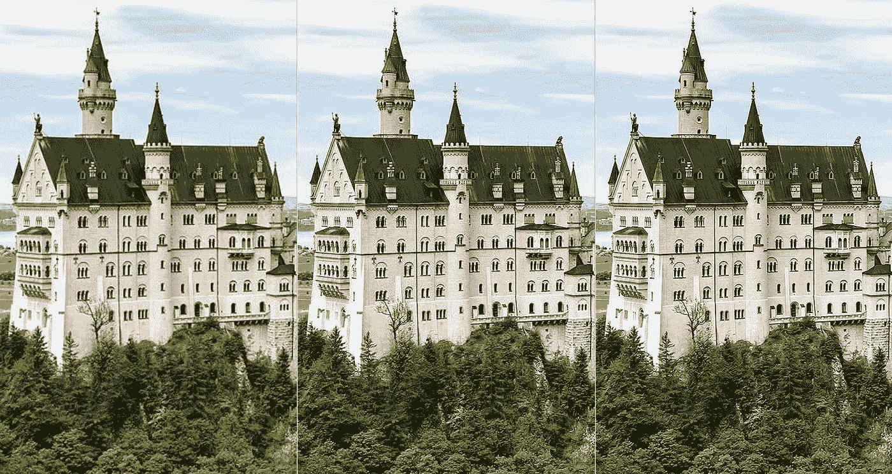

来自 [Unsplash](https://unsplash.com/) 的图像超分辨率对比。左:双三次放大。中心:Adobe 的超级分辨率。右图:IDN 超分辨率。

新天鹅堡图像的另一个例子显示了分辨率的提高，同一主题的不同图像在不同的视角和质量下会有所不同。

**左:双三次放大** PSNR:25.1374
SSIM:0.8437
均方误差:199.2213
平均误差:0.0258

**中心:Adobe 的超分辨率** PSNR:24.8581
SSIM:0.8193
MSE:212.4563
MAE:0.0285

**右:IDN 超分辨率
PSNR:27.3212
SSIM:0.9104
MSE:120.4940
MAE:0.0203**

## 实施例 14

左图:双三次放大，中图:Adobe 的超分辨率，右图:IDN 的超分辨率。

**分辨率**:从 1020x785 像素升级到 2040x1530 像素

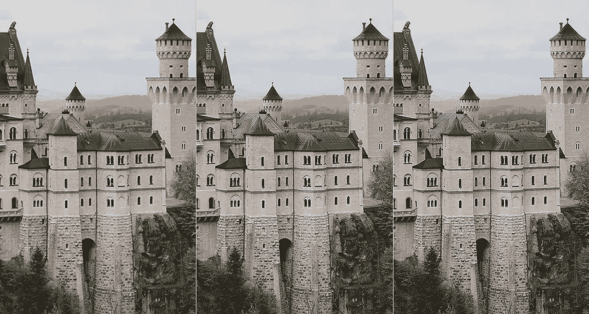

来自 [Unsplash](https://unsplash.com/) 的图像的超分辨率比较。左:双三次放大。中心:Adobe 的超级分辨率。右图:IDN 超分辨率。

新天鹅堡图像的另一个例子显示了分辨率的提高，同一主题的不同图像在不同的视角和质量下会有所不同。

**左:双三次放大** PSNR:29.3615
SSIM:0.8898
均方误差:75.3227
平均误差:0.0139

**中心:Adobe 的超分辨率** PSNR:29.0122
SSIM:0.8530
MSE:81.6319
MAE:0.0170

**右图:IDN 超分辨率** PSNR:31.7219
SSIM:0.9300
均方误差:43.7407
平均误差:0.0116

## 实施例 15

左图:双三次放大，中图:Adobe 的超分辨率，右图:IDN 的超分辨率。

**分辨率**:从 1020x680 像素升级到 2040x1360 像素

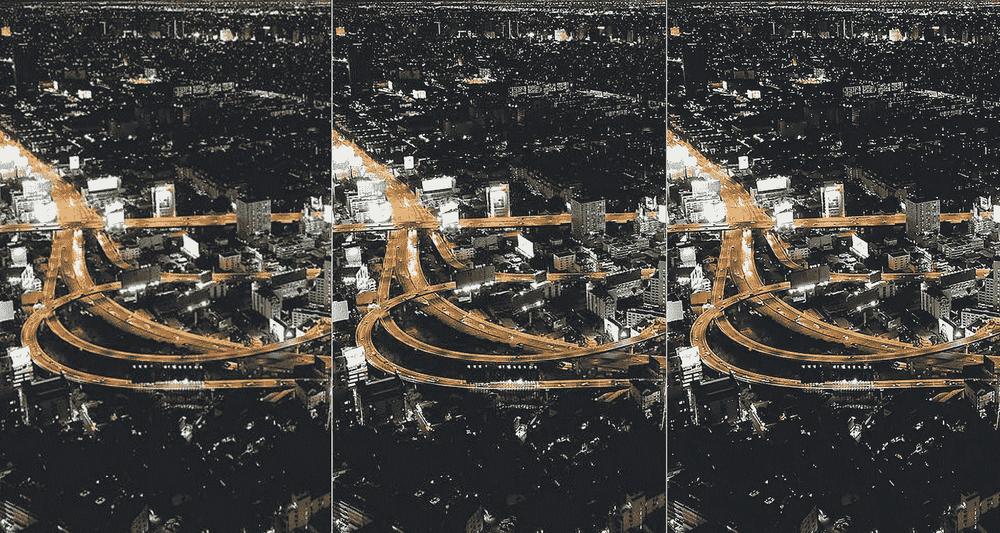

来自 [Unsplash](https://unsplash.com/) 的图像的超分辨率比较。左:双三次放大。中心:Adobe 的超级分辨率。右图:IDN 超分辨率。

曼谷夜晚的复杂图像，Adobe 的超级分辨率通过图像中的一些细节和特征很好地增强了分辨率，尽管 IDN 模型导致整个图像的分辨率大大增强。

**左:双三次放大** PSNR:25.2616
SSIM:0.8842
均方误差:193.6065
平均误差:0.0452

**中心:Adobe 的超分辨率** PSNR:25.5575
SSIM:0.8539
MSE:180.8530
MAE:0.0608

**右:IDN 超分辨率** PSNR:29.0846
SSIM:0.9545
均方误差:80.2820
平均误差:0.0304

## 实施例 16

左图:双三次放大，中图:Adobe 的超分辨率，右图:IDN 的超分辨率。

**分辨率**:从 680x1020 像素升级到 1360x2040 像素

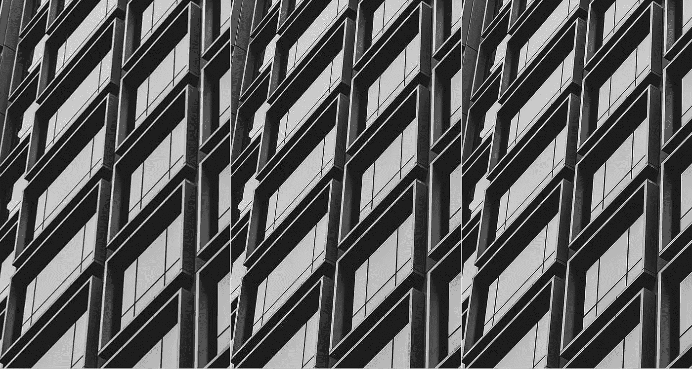

来自 [Unsplash](https://unsplash.com/) 的图像的超分辨率比较。左:双三次放大。中心:Adobe 的超级分辨率。右图:IDN 超分辨率。

这又是一个有边缘和反射的复杂图像，Adobe 的超级分辨率通过图像中的一些细节和特征很好地增强了分辨率，尽管夸大了图像中的一些伪像。IDN 模型提高了整个图像的分辨率。

**左:双三次放大** PSNR:27.7844
SSIM:0.9332
均方误差:108.3041
平均误差:0.0244

**中心:Adobe 的超分辨率** PSNR:29.2190
SSIM:0.8874
MSE:77.8356
MAE:0.0321

**右:IDN 超分辨率
PSNR:34.6705
SSIM:0.9767
MSE:22.1834
MAE:0.0126**

## 实例 17

左图:双三次放大，中图:Adobe 的超分辨率，右图:IDN 的超分辨率。

**分辨率**:从 601x1020 像素升级到 1202x2040 像素

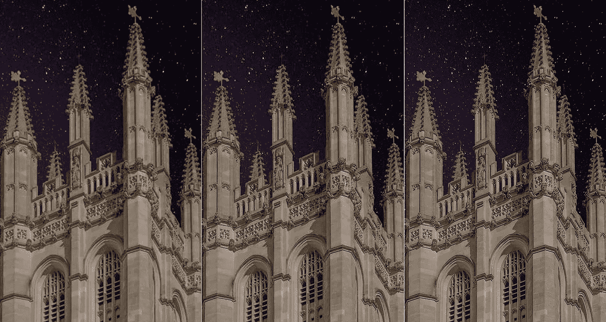

来自 [Unsplash](https://unsplash.com/) 的图像超分辨率对比。左:双三次放大。中心:Adobe 的超级分辨率。右图:IDN 超分辨率。

Adobe 的超分辨率增强了分辨率，将一些细节和特征恢复到图像中，尽管夸大了图像中的伪像，并且 IDN 模型再次产生了分辨率大大增强的图像。

**左:双三次升阶** PSNR 双三次:32.3341
SSIM 双三次:0.8897
MSE 双三次:37.9897
MAE 双三次:0.0251

**中心:Adobe 的超分辨率** PSNR:29.5855
SSIM:0.7945
MSE:71.5363
MAE:0.0438

**右:IDN 超分辨率** PSNR:35.6721
SSIM:0.9354
均方误差:17.6143
平均误差:0.0195

## 实施例 18

左图:双三次放大，中图:Adobe 的超分辨率，右图:IDN 的超分辨率。

**分辨率**:从 1020x680 像素升级到 2040x1360 像素

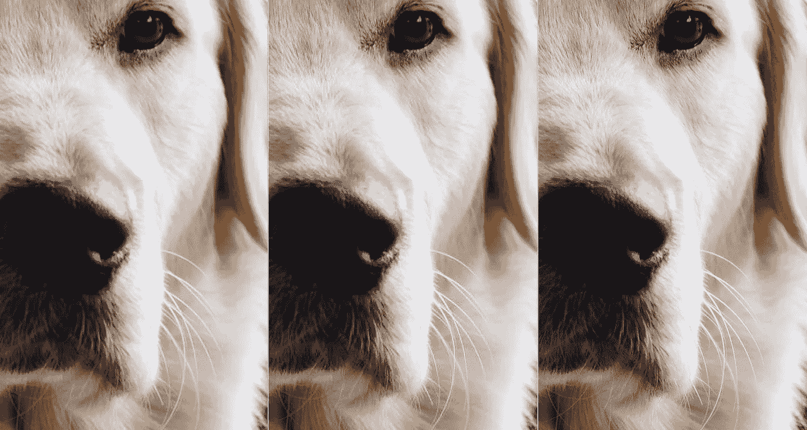

来自 [Unsplash](https://unsplash.com/) 的图像的超分辨率比较。左:双三次放大。中心:Adobe 的超级分辨率。右图:IDN 超分辨率。

Adobe 的超分辨率夸大了图像中的许多伪像，一些特征如眼睛的分辨率比双三次插值有所提高。IDN 模型的皮毛和狗须看起来更加清晰。

**左:双三次放大** PSNR 双三次:40.8572
SSIM 双三次:0.9486
MSE 双三次:5.3378
MAE 双三次:0.0067

**中心:Adobe 的超分辨率** PSNR:35.5768
SSIM:0.9001
MSE:18.0053
MAE:0.0140

**右图:IDN 超分辨率** PSNR:41.5297
SSIM:0.9559
均方误差:4.5720
平均误差:0.0066

## 实施例 19

左图:双三次放大，中图:Adobe 的超分辨率，右图:IDN 的超分辨率。

**分辨率**:从 823x1020 像素升级到 1646x2040 像素

来自 [Unsplash](https://unsplash.com/) 的图像的超分辨率比较。左:双三次放大。中心:Adobe 的超级分辨率。右图:IDN 超分辨率。

Adobe 的超分辨率增强了分辨率，将一些细节和特征恢复到图像中，尽管夸大了图像中的伪像，并且 IDN 模型再次产生了分辨率大大增强的图像。

**左:双三次放大** PSNR:37.0134
SSIM:0.9717
均方误差:12.9344
平均误差:0.0056

**中心:Adobe 的超分辨率** PSNR:34.0506
SSIM:0.9461
MSE:25.5872
MAE:0.0123

**右:IDN 超分辨率** PSNR:39.1880
SSIM:0.9792
均方误差:7.8393
平均误差:0.0052

## 实施例 20

左图:双三次放大，中图:Adobe 的超分辨率，右图:IDN 的超分辨率。

**分辨率**:从 1020x680 像素升级到 2040x1360 像素

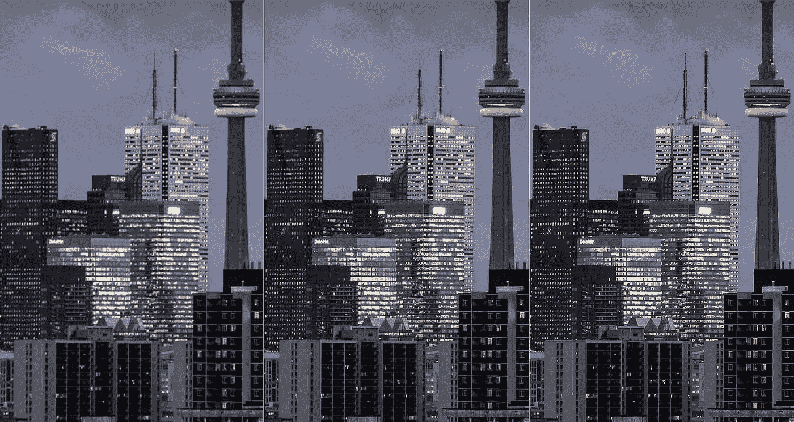

来自 [Unsplash](https://unsplash.com/) 的图像的超分辨率比较。左:双三次放大。中心:Adobe 的超级分辨率。右图:IDN 超分辨率。

一张多伦多夜晚地平线的复杂图像，Adobe 的超分辨率增强了图像的分辨率，恢复了图像的细节和特征，IDN 模型再次产生了分辨率大大增强的图像。

**左:双三次放大** PSNR:29.9861
SSIM:0.8897
均方误差:65.2330
平均误差:0.0269

**中心:Adobe 的超分辨率** PSNR:29.2766
SSIM:0.8433
MSE:76.8107
MAE:0.0349

**右:IDN 超分辨率
PSNR:32.5325
SSIM:0.9231
MSE:36.2939
MAE:0.0213**

# 来自我自己照片的例子

一张来自我厨房的非典型照片，用来测试超分辨率能力。

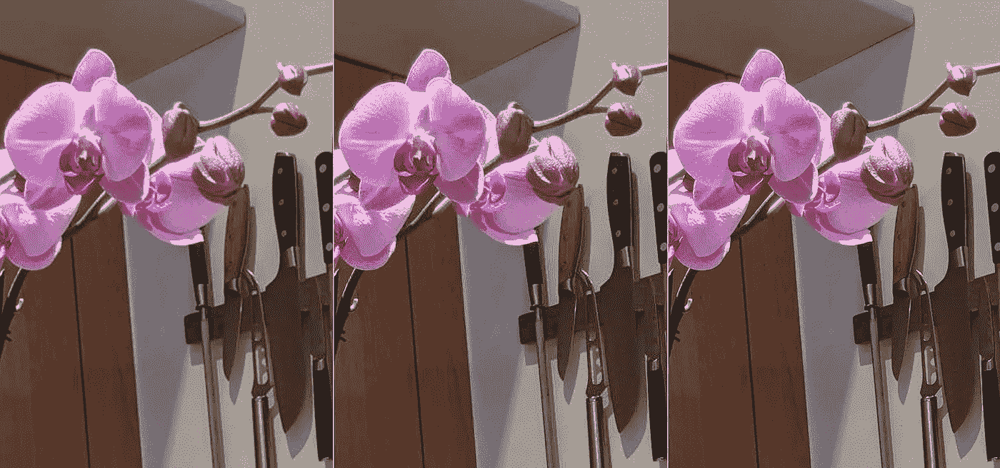

克里斯托弗托马斯图像的超分辨率比较。左:双三次放大。中心:Adobe 的超级分辨率。右图:IDN 超分辨率。

从度量的角度来看，Adobe 的超分辨率比双三次插值要差得多，但从视觉上看，它确实比双三次插值好，尽管只是略微好一点。

**左:双三次放大** PSNR:37.2630
SSIM:0.9419
均方误差:12.2117
平均误差:0.0101

**中心:Adobe 的超分辨率
T42 PSNR:34.1691
SSIM:0.8990
MSE:24.8983
MAE:0.0167**

**右图:IDN 超分辨率** PSNR:39.3837
SSIM:0.9528
均方误差:7.4939
平均误差:0.0089

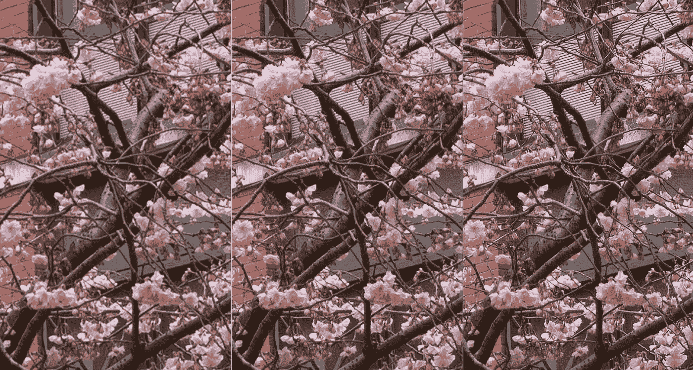

左:双三次放大。中心:Adobe 的超级分辨率。右图:IDN 超分辨率。照片来自克里斯托弗·托马斯

作为一个额外的比较，这张 Oozells 广场(英国伯明翰)的樱花树照片的超分辨率是对源图像执行超分辨率的一个例子，而不是源图像的低分辨率缩小版本。这种比较是为了将用于创建较低分辨率输入的双三次缩减从任何考虑中去除。

在这里，原始输入图像的分辨率比原始图像的分辨率高，因此没有比较度量的基础事实。从人类视觉的角度来看，与 Adobe 的超分辨率相比，IDN 模型的分辨率增强更大。例如，砌砖、树枝、窗户覆层明显变得更加锐利。

请注意，adobe 超分辨率是在原始相机图像上进行的，以使 Adobe 的算法具有潜在的优势。

这个例子包括在内，因为有研究人员认为缩小图像以用作比较不是真实世界的测试，双三次缩小不等同于最初以较低分辨率捕获的图像。例如，微软研究院的论文[image pairs:Realistic Super Resolution Dataset via Beam Splitter Camera Rig](https://www.microsoft.com/en-us/research/publication/imagepairs-realistic-super-resolution-dataset-via-beam-splitter-camera-rig/),其中数据集是使用具有较低和较高分辨率相机传感器的相机装备拍摄的，从而产生真正的低分辨率和高分辨率图像对。

# Set 5 数据集的示例

这些是著名的 set 5 中的图像，非常常用于超分辨率评估:

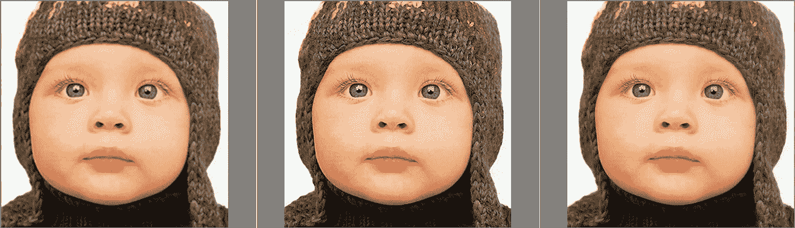

Set5 数据集:左边双三次，中间 Adobe 超分辨率，右边 IDN 深度神经网络超分辨率。

从度量的角度来看，Adobe 的超分辨率是分辨率的最低增强。然而，从人的视觉角度来看，它与帽子的材料的改进使它可能出现最高的质量。仔细观察 IDN 模型可以更好地增强一些特征，比如睫毛和眼睛。正如我经常提到的，什么是更重要的度量标准或人类感知。

**左:双三次放大** PSNR:37.4317
SSIM:0.9554
均方误差:11.7465
平均误差:0.0075

**中心:Adobe 的超分辨率** PSNR:32.7958
SSIM:0.9313
MSE:34.1584
MAE:0.0128

**右图:IDN 超分辨率**

PSNR:38.4256
SSIM:0.9658
均方差:9.3438
均方差:0.0069

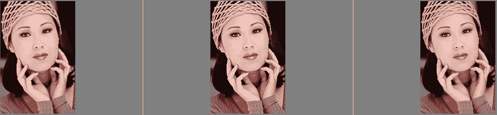

Set5 数据集:左边双三次，中间 Adobe 超分辨率，右边 IDN 深度神经网络超分辨率。

对于这个小图像，Adobe 的超级分辨率确实提高了图像的分辨率，尽管 IDN 的超级分辨率进一步提高了分辨率。

**左:双三次放大**

PSNR:32.6560
SSIM:0.9514
均方差:35.2763
均方差:0.0129

**中心:Adobe 的超级分辨率**

PSNR 30.5751
SSIM:0.9483
均方误差:56.9603
平均误差:0.0177

**右图:IDN 超分辨率**

PSNR:35.3274
SSIM:0.9707
均方差:19.0694
均方差:0.0101

# **来自 Urban 100 数据集的示例:**

这是一张来自 Urban 100 数据集的图像，对于超分辨率评估来说，它被认为是相当复杂的。

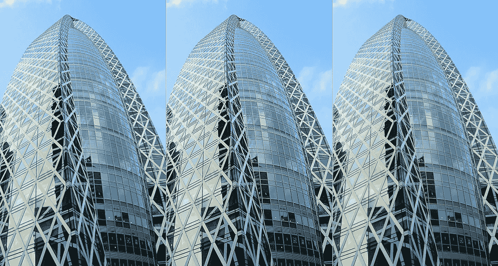

Urban100 数据集图像:左边双三次，中间 Adobe 超分辨率，右边 IDN 深度神经网络超分辨率。

在增强这个复杂图像的分辨率方面，IDN 模型明显优于 Adobe 的 Super Resolution。

**左:双三次放大** PSNR:23.4326
SSIM:0.7692
均方误差:294.9959
平均误差:0.0344

**中心:Adobe 的超分辨率** PSNR:24.8960
SSIM:0.8612
MSE:210.6105
MAE:0.0305

**右图:IDN 超分辨率** PSNR:27.7919
SSIM:0.9119
均方误差:108.1152
平均误差:0.0210

# 结论

Adobe 在增强图像分辨率方面的超分辨率性能是内置于图像处理和编辑软件套件中的一项特殊功能。

对于更高分辨率的图像，一些图像的分辨率改善接近于先进的深度神经网络，尽管与 IDN 模型的差异是显著的。改进的变化表明该算法可能不能很好地推广。

从度量的角度来看，Adobe 的 Super Resolution 是本文中许多测试中分辨率提高最低的。然而，从人类视觉的角度来看，它的改进远远优于双三次插值。很有可能它的算法是用更感性的度量标准训练出来的。正如我经常提到的，什么更重要:度量还是人类对质量的感知？

Adobe 的超分辨率对图像中的噪声或伪像的容忍度要低得多，通常在质量较低的图像上表现较差。

Adobe 的超级分辨率只能对图像分辨率进行 2 倍的增强，而许多深度神经网络模型已经被训练对图像分辨率进行 4 倍的增强。

还对 DIV2K 验证数据集进行了评估，该数据集是为超分辨率竞赛和研究而整理的。由于 DIV2K 数据集只被许可用于学术用途，所以不能在这里使用。Adobe 的超分辨率在 DIV2K 验证数据集上表现异常出色。与这里的结果相比，这可能是因为 Adobe 的超分辨率的训练过程包括了这些图像，这不是一个公平的评估。

# 极高分辨率

Adobe 的超分辨率突出的特点是图像的巨大尺寸，它可以对令人难以置信的 11，205×8，404 像素图像执行超分辨率增强，放大到 22，409×16，807 像素。大多数深度学习模型在较小的分辨率下会导致内存不足的问题。

# 如何使用 Adobe 的超级分辨率

这似乎是隐藏的，要使用 Adobe 的超级分辨率，从 Adobe Bridge 中选择一个图像并在 Camera Raw 中打开它，然后右键单击该图像时，上下文菜单中会出现“增强”。

# 超分辨率成为一个常用术语

一个脚注是，我自己的超分辨率文章曾经在谷歌搜索结果中排名前两位，并且是“超分辨率”的特色谷歌片段，现在在搜索引擎排名中直线下降，被关于 Adobe Photoshop 超分辨率的博客和文章超越。当一个技术领域变得更加主流和容易接近时，这是不可避免的。