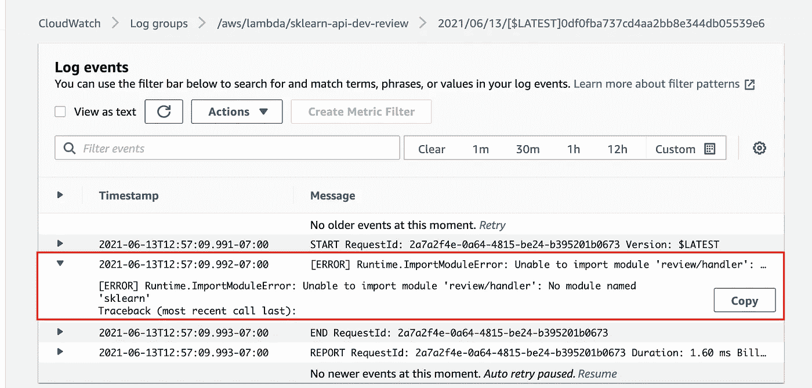

# 超级简单的 sci kit——学习 AWS 中的 API

> 原文：<https://towardsdatascience.com/super-simple-scikit-learn-apis-in-aws-301c4f3b5629?source=collection_archive---------18----------------------->

## 使用 Lambda、API Gateway 和 AWS 让你的模型变得便宜，便于他人大规模使用


里卡尔多·贝托洛的照片

# 介绍

云是一个神奇的地方！你可以用很少的代码花几分钱创办一家拥有世界一流基础设施的公司。这似乎好得难以置信，但这就是今天的世界。也就是说，这不全是☀️&的问题🌈。我发现每当我尝试在云中做一些事情时，我总是要花比我预期更长的时间才能弄明白。我的意思是，文档是存在的，这没什么，但我经常求助于 blog-o-sphere。如果 blog-o-sphere 没有我的确切用例，那么…很难💩。以一种使开发和部署变得容易的方式来组织项目是困难的。

今天，我希望通过讨论如何立即为您的一个机器学习项目构建 Scikit-Learn API 来帮助解决这个问题。我们将介绍如何:

1.  使用无服务器来设置和保护 API。
2.  以合理且可维护的方式创建多个端点。
3.  将 Scikit-Learn 图层附加到您的 Lambda。
4.  将本地 python 模块导入您的 Lambdas。

我不打算介绍如何建立一个 AWS 帐户，也不打算详细介绍无服务器。我的目标是让你在最短的时间内从零开始运行到一个你不讨厌的全功能 API。

# 无服务器

无服务器是一个超载的术语。这通常意味着在按需配置的服务器上运行代码，而不是一直运行。在本教程中，我将使用这个词来指代[无服务器](https://www.serverless.com/)框架。我喜欢把这个框架看作是 AWS 云形成模板的包装器。它提供了将基础设施视为代码的能力，以及一些部署代码的便利工具。

确保你的电脑上有 [Node.js](https://nodejs.org/en/) 。完成后，您可以通过运行以下命令来安装无服务器:

```
npm install -g serverless
```

这将使您能够通过一些简单的命令行操作来部署应用程序。您需要为 AWS 设置权限，无服务器文档很好地帮助您完成了这个[这里的](https://www.serverless.com/framework/docs/providers/aws/guide/credentials/)。

TLDR 版本是，为无服务器创建一个 IAM 角色，并赋予它管理员权限。然后使用该角色的键来运行:

```
serverless config credentials --provider aws --key <YOUR_KEY> --secret <YOUR_SECRET>
```

# Lambda 和无服务器

我们将从返回健康检查的简单 lambda 函数开始。让我们用下面的目录结构和文件创建一个项目。


这将构成项目其余部分的基础。我们有一个根文件夹，里面存放着所有叫做`sklearn-api.`的东西，我们还有另一个叫做`aws`的文件夹，我们会把所有的云代码放在那里。我们只构建了一个 API，所以 API 的基础设施将在这个文件夹中。API 只由 lambda 组成，所以我们创建了一个名为`lambdas`的目录，该文件夹中的每个子目录将保存一个单独的 lambda。

`handler.py`很简单。它包含一个名为`lambda_handler`的函数，该函数返回一个状态码 200 和一个表示健康的字符串。您会注意到处理程序接受的两个变量`event`和`context.`事件是一个 JSON 格式的文档，其中包含 lambda 函数要处理的数据。我们以后会更多地使用这个。Context 是一个包含 lambda 调用环境信息的对象，比如运行时环境、谁调用了它等等。

```
def lambda_handler(event, context):

    response = {
        "statusCode": 200,
        "body": "healthy"
    }

    return response
```

我们的`serverless.yml`文件同样简单。

```
service: sklearn-api

provider:
  name: aws
  runtime: python3.8
  region: us-west-1
  *# Set the stage to develop unless the --stage option is passed* stage: dev

functions:
  *# Holds the lambda for health checks and status reports* health:
    handler: health/handler.lambda_handler
    events:
      - http:
          path: health
          method: GET
```

让我们一步一步来。

1.  `service`定义服务的名称，您将在 AWS 控制台中看到该名称。
2.  `provider`描述我们将使用哪种云。在这种情况下，它是 AWS。我们将运行时设置为 python3.8，将我们的区域设置为 us-west-1，并将 API 网关阶段命名为`dev`
3.  `functions`是我们定义所有 lambda 函数的地方。在本例中，我们正在创建一个名为`health`的文件，其处理程序位于路径`health/handler.lambda_handler`处。我们在路径`/health`中寻找一个`http`事件，您可以通过 GET 请求访问它。这个事件部分是我们定义 API Gateway 如何与 lambda 函数交互的地方。

我们可以使用以下命令从根目录部署所有这些:

```
cd aws/api/lambdas && sls deploy
```

这将提供我们上面列出的所有必需资源。查看 AWS 控制台，我们可以看到有一个名为 sklearn-api-dev-health 的 Lambda。


如果您单击它，您可以看到 API Gateway 被设置为触发器。


如果您单击 API Gateway，您可以看到我们有一个健康端点，它接受 GET 请求。


单击左侧的阶段链接。这将显示您已经部署的所有阶段。对于本教程，我们将只部署一个开发阶段。对于一个真正的项目，您可能需要一个开发和生产阶段。您可以快速试验的产品，以及对您的客户来说更稳定的产品。


点击舞台从顶部抓取 API URL。我们需要它来使用我们的 API。


相当整洁！现在我们可以使用 curl 达到终点，看看它是否工作。

```
curl -X GET https://gbi16yga18.execute-api.us-west-1.amazonaws.com/dev/health
```

我们得到了 200 条回复，正文有效载荷为“健康”！就这样，我们的 API 正在进行中！

# 添加 API 密钥

现在任何人都可以访问我们的 API。总的来说，我们不希望那样:)。添加 API 键很简单。我们只是用几个新行更新了我们的`serverless.yml`文件。

```
service: sklearn-api

provider:
  name: aws
  *# Link this function to our API Gateway
***apiGateway:
    *# Setup a basic API key with no usage plan* apiKeys:
      - name: ${self:service}-dev-free
        value: abcdefghijklmnopqrstuvwxyz**
  runtime: python3.8
  region: us-west-1
  *# Set the stage to develop unless the --stage option is passed* stage: dev

functions:
  *# Holds the lambda for health checks and status reports* health:
    handler: health/handler.lambda_handler
    events:
      - http:
          path: health
          method: GET
          *# This indicates that the api endpoint requires a key.* **private: true**
```

在 provider 下，我们添加了一个带有 apiKeys 列表的 apiGateway 部分。你会注意到一个奇怪的`${self:service}`这是一个无服务器的注释，它说从我这里获取服务值并放在这里。这使得 API 键的名称成为`sklearn-api-dev-free`。

我们还在健康功能 HTTP 事件下添加了`private: true`。这告诉 serverless 该端点是私有的，需要密钥才能被访问。

如果我们重新部署并运行上面的 curl 命令，我们会得到:


要解决这个问题，我们需要用适当的 API 键更新 curl 命令，如下所示:

```
*curl -X GET -H "x-api-key:* abcdefghijklmnopqrstuvwxyz*"* https://gbi16yga18.execute-api.us-west-1.amazonaws.com/dev/health
```

又成功了！很好，现在我们的 API 安全了！

# 添加第二个λ

我们的 API 在这一点上没有做任何有趣的事情，所以是时候添加一些功能了。我们来做一个 lambda，预测一个影评的情绪是正面的还是负面的。我们将调用这个端点`review`并创建第二个 Lambda 函数来完成这项工作。我们添加了另一个名为`review` 的文件夹，它有自己的处理程序，所以我们的目录结构现在看起来像这样:


首先，让我们的处理程序获取一些数据，并将其发送给我们。

```
import json
def lambda_handler(event, context):
    event_body = event["body"]
    if event_body is None:
        return {"statusCode": 400, "body": "body cannot be empty"}

    req_body = json.loads(event_body)

    return {"statusCode": 200, "body": json.dumps(req_body)}
```

我们读取来自 curl 请求的事件体的值，然后将其发送回调用者。

更新 serverless.yml 文件以包含一个名为 review 的附加函数，如下所示。你可以把它粘贴在函数部分下面。确保所有的缩进都是正确的。

```
**review:**
  handler: **review**/handler.lambda_handler
  events:
    - http:
        path: review
        **method: POST**
        *# This indicates that the api endpoint requires a key.* private: true
```

运行状况检查端点有三个不同之处。在 YAML，我们把这个叫做**回顾**。我们在处理程序 URL 中称之为 **review** (这需要与我们之前创建的目录名相匹配。看看你的 lambda 函数，你会发现它导入了文件夹。).我们把方法改成了 POST。这个端点将接收一些数据，所以我们希望使用 POST 请求。我们重新部署一下，再用 curl 打一下！

```
curl -X POST -H "x-api-key: abcdefghijklmnopqrstuvwxyz" https://gbi16yga18.execute-api.us-west-1.amazonaws.com/dev/review -d '{"movie_text": "I hate this movie"}'
```

您应该会在命令行中看到您发送的数据返回给您！我们的 post 请求正在运行。

# 添加 Sklearn 依赖项

让我们从添加开始

```
import sklearn
```

到 lamda_handler 的顶部进行检查。重新部署，然后向该端点发出 curl 请求。您将看到以下响应:

```
{"message": "Internal server error"}
```

让我们探索一下。在控制台中进入 Lambda 查看，并点击**监视器**选项卡。


在 monitor 选项卡中，您可以访问 CloudWatch 中的日志。点击最新日志。


这将让您了解 lambda 失败时发生了什么。您会很快注意到错误行，如果再深入一点，它会显示导入失败。正如我们所料:)。



查看这些日志是调试 Lambdas 的最好方法之一。当我试图创建一个新函数时，我总是来这里。

要添加 SKlearn 依赖项，我们需要创建一个 Lambda 层，或者更准确地说，使用别人已经创建的 Lambda 层😅。层基本上是您的依赖关系的自包含版本。对于 Python 来说，它的核心是所有需要用以下目录结构压缩的已安装库:

```
python/lib/python<3.x>/site-packages
```

我不打算谈论如何创建层，有很多关于这个主题的教程。在本教程中，我们将使用来自 [modelzoo](https://github.com/model-zoo/scikit-learn-lambda/blob/master/layers.csv) 的优秀人员的预制 SKlearn 图层。我们不自己做的原因是。Lambdas 可能很挑剔，对内存要求有很多规定。这使得安装 Python 库时会有许多依赖项、二进制文件等。有点挑战性。

看一下 [CSV](https://github.com/model-zoo/scikit-learn-lambda/blob/master/layers.csv) ，有很多层，每层都与不同的 AWS 区域相关联。我们正在使用 **Python3.8** 在 **us-west-1** 中部署我们的项目，因此我们需要获取他们支持的最新版本 SKlearn，在撰写本文时该版本为 0.23.1。

将这一层的 arn 复制到 serverless.yml 中我们的 review 函数中

```
review:
  handler: review/handler.lambda_handler
 **layers:
    - arn:aws:lambda:us-west-1:446751924810:layer:python-3-8-scikit-learn-0-23-1:2**
  events:
    - http:
        path: review
        method: POST
        *# This indicates that the api endpoint requires a key.* private: true
```

现在，如果我们重新部署和重新卷曲一切工作！我们已经成功地将 SKlearn 导入到我们的 lambda 中。

# **训练一个模型**

让我们在 IMDB 数据集上训练一个快速模型。我们需要在本地安装三个库:

```
python3 -m pip install scikit-learn==0.23.1 pandas datasets
```

为了简化数据，我们将使用[拥抱面部数据集库](https://github.com/huggingface/datasets)。它内置了大量数据集，因此使用传统基准数据非常容易。对于这个项目，我们将使用`imdb`数据集，但如果你想看看还有什么可用的运行`datasets.list_datasets()`。

我们只需几行代码就可以获得数据并训练我们的模型。

```
import datasets
import pandas as pd
import pickle
from sklearn.pipeline import Pipeline
from sklearn.feature_extraction.text import TfidfVectorizer
from sklearn.svm import LinearSVC# Load in the data
data = datasets.load_dataset("imdb", split="train")
df = pd.DataFrame(data)# Train the model
model = Pipeline([
    ("tfidf", TfidfVectorizer()),
    ("classifier", LinearSVC())
])
model.fit(df["text"], df["label"])# Save off the model
with open("review_model.p", "wb") as f:
    pickle.dump(model, f)
```

详细描述这里发生的事情超出了本教程的范围。如果你好奇，可以看看我的另一篇关于与 SKlearn 合作的博文。基本上，我们只是训练了一个模型，从文本的一些统计属性来预测好的和坏的电影评论，并将其保存为一个腌文件。

# 将模型添加到我们的 Lambda 中

## 上传我们的模型到 S3

拼图的最后一块！创建一个 S3 桶。


我把我的命名为`nic-sklearn-models.`,这是我们放置腌制模型的地方。


将`review_model.p`上传到那个桶。这是我们将存储模型以供 Lambda 访问的地方。

## 将我们的模型加载到 Lambda 中

我们需要更新我们的 lambda_handler 来下载我们的模型并运行预测:

让我们来看看新代码:

*   第 19–23 行—检查并确保将 review_text 参数传递给了 POST 请求。
*   第 25–30 行——检查我们的 Lambda 是否已经从 S3 下载了模型。如果没有，我们下载它。这加快了 Lambda 的速度，因为我们只有在冷启动时才会呼叫 S3。然而，这里有一个错误，如果我们在 S3 更新模型，这个 Lambda 是活的，它不会抓取新的。我们真的应该检查文件是否存在，S3 哈希是否没有改变。
*   第 32–37 行—加载酸洗模型并进行预测。

我们还需要在 serverless.yml 文件中添加几行代码。AWS 对安全性要求非常严格，所以你的 Lambda 函数不能访问 S3，除非你明确授权它们这样做。

```
provider:
  name: aws
  *# Link this function to our API Gateway* apiGateway:
    *# Setup a basic API key with no usage plan* apiKeys:
      - name: ${self:service}-dev-free
        value: abcdefghijklmnopqrstuvwxyz
 ***# Provide additional permissions to access S3* iamRoleStatements:
    - Effect: "Allow"
      Action:
        - s3:GetObject
      Resource: arn:aws:s3:::nic-sklearn-models/***
  runtime: python3.8
  lambdaHashingVersion: 20201221
  region: us-west-1
  *# Set the stage to develop unless the --stage option is passed* stage: dev
```

重新部署模型，再次用 curl 打！


TADA！！！我们得到了一个关于我们评论的预测！在这种情况下，它是 0，因为审查是负面的。

# **额外:导入本地 python 模块**

制作这个 API 不是一件容易的事，但是开发具有许多功能和可重用部分的大型 API 可能是一件痛苦的事情。这条道路上的一小步是将本地 Python 模块导入到您的 lambdas 中。我喜欢让 lambda_handlers 尽可能不涉及逻辑。为此，我试着把我所有真正的工作代码放在别的地方。让我们快点做那件事。在资源库的底部创建一个名为`sklearn_api`的新文件夹，并在其中创建一个名为`utils.py`的新 python 模块。我们将在这里存储所有可重用的 python 代码，我们的项目看起来应该是这样的:


让我们创建一个非常简单的实用函数，以一种更易于阅读的方式格式化我们的响应。与其返回“[0]”和“[1]”作为预测，不如让我们创建一个函数，将它们转换为“负面评价”和“正面评价”在我们刚刚创建的`utils.py`模块中添加以下函数:

```
from typing import Iterable

def convert_prediction(prediction: Iterable[int]) -> str:
    if prediction[0] == 0:
        return "Negative Review"
    else:
        return "Positive Review"
```

现在将下面一行添加到`handler.py`的顶部:

```
from sklearn_api.utils import convert_predictions
```

这将导入我们刚刚创建函数。现在将`handler.py`的返回语句改为:

```
return {"statusCode": 200, "body": convert_prediction(pred)}
```

我们的代码都设置好了。我们需要做的最后一件事是告诉 serverless 我们想要将`sklearn_api`模块上传到我们的 Lambda。将以下内容添加到我们的 serverless.yml 文件中的 **review** 函数下。

```
package:
  exclude:
    - ./**
  include:
    - review/handler.py
    - ../../../sklearn_api/utils.py
```

这是告诉 serverless，“当你打包它时，排除当前文件夹中的所有内容，包括 review/handler.py 和 sklearn_api/utils.py。”

另外，将这一行添加到 serverless.yml 的基本级别:

```
package:
  individually: true
```

这告诉 Serverless 每个函数应该单独打包。重新部署，看看你的 Lambda，你会看到额外的代码。


使用 curl 后，我们得到:


我们的功能成功了！

# 包扎

我们现在有一个运行在云中的 SKlearn API。只要没有人点击它，它就不会花我们一分钱，而且它会扩展到互联网可以发出的所有请求:)。这个 API 很容易使用，我们可以分离出每个 Lambda 和每个 API 端点，我们可以在它们之间共享可重用的代码段。快乐大厦！