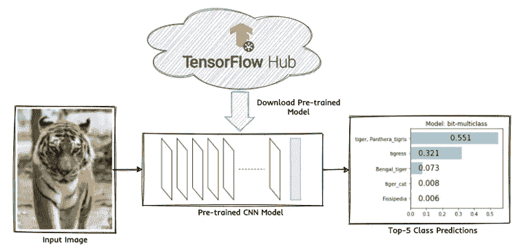
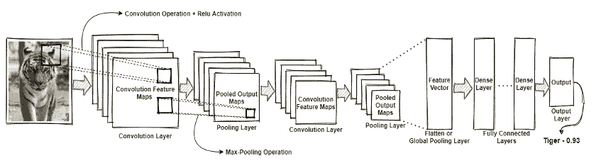
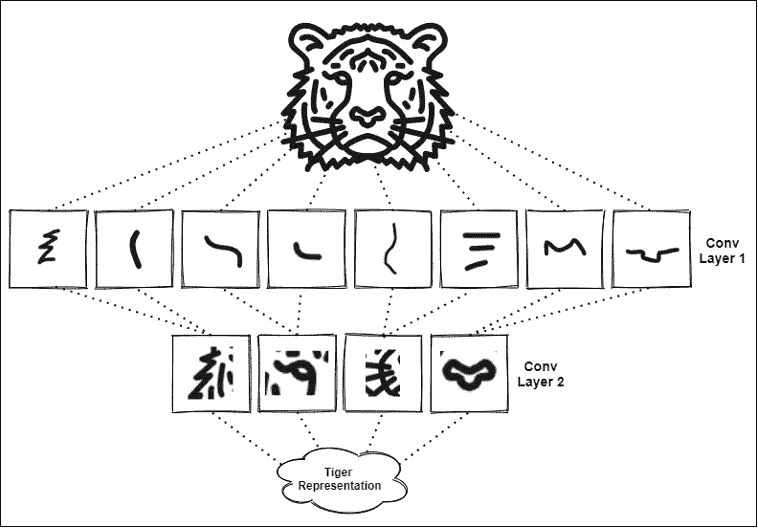
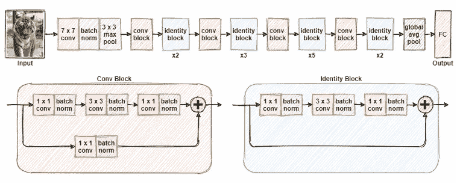
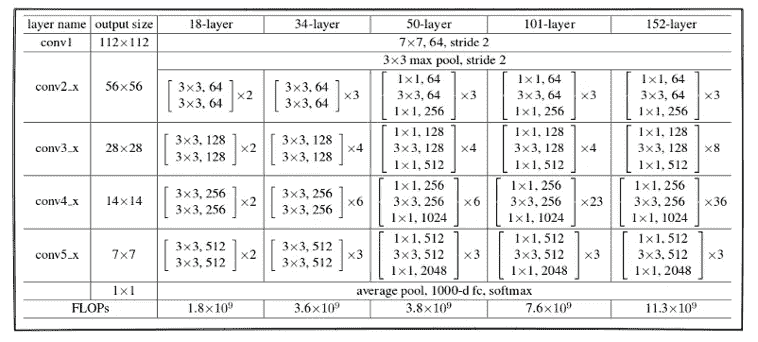
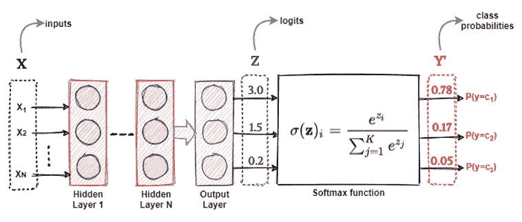
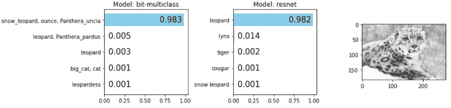
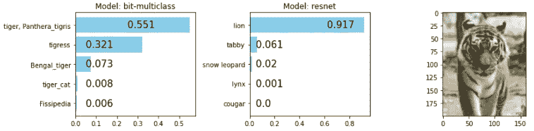
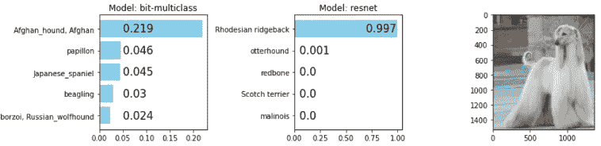

# 基于迁移学习的增压图像分类

> 原文：<https://towardsdatascience.com/supercharge-image-classification-with-transfer-learning-4b8c52e69c0c?source=collection_archive---------17----------------------->

## 使用位模型的图像分类

内森·杜姆劳在 [Unsplash](https://unsplash.com?utm_source=medium&utm_medium=referral) 上的照片

计算机视觉领域本身可能从 20 世纪 60 年代就已经存在，最初的主要目标是建立一个模拟人类视觉能力的人工系统。像 CNN 这样的深度学习模型在过去十年中引起了复兴，这是由于一些因素，包括更好的算法，更快的计算(GPU)，易于使用的软件和工具(TensorFlow，PyTorch)和更多的数据可用性。

CNN 逐渐变得庞大而复杂，但也足以成为大多数与计算机视觉(尤其是分类)相关的任务的 goto 解决方案。然而，并不是每个人(或每个项目)都有资源(或可行性)利用大型 GPU 集群来利用这些*最先进的*巨型模型。进入 ***转移学习*** *！*

在不偏离太多的情况下，迁移学习是一种利用这种先进模型(在大型数据集上预先训练)的方法，用于特定的用例，而无需担心准备大型数据集或访问地球上最新的 GPU 设置的麻烦。要深入了解迁移学习，请查看[ [1](#a3c1) 和[ [2](#a3c1) ]

让我们深入到一个展示图像分类或归类背景下的迁移学习的实际例子中。这里的目标是拍摄一些动物的样本图像，看看一些预先训练好的固定模型如何对这些图像进行分类。我们将挑选几个基于复杂性的预训练的最先进的模型，比较和对比它们如何解释输入图像的真实类别。

# 方法学

这里的关键目标是采用现成的预训练模型，并直接使用它来预测输入图像的类别。我们在这里着重于推理，以使事情简单，而不是深入研究如何训练或微调这些模型。我们解决图像分类关键目标的方法集中于获取输入图像，从 TensorFlow Hub 加载 Python 中的预训练模型，并对输入图像的前 5 个可能类别进行分类。这个工作流程如图 1 所示。

图 1 用预训练的 CNN 进行图像分类。该图描述了使用预先训练的 CNN 模型的给定输入图像的前 5 类概率。图片来源:作者

# 预先训练的模型架构

在我们的实验中，我们将利用两个最先进的预训练卷积神经网络(CNN)模型，即:

*   **ResNet-50:** 这是一个残差深度卷积神经网络(CNN)，共有 50 层，集中在标准卷积层和池层，这是一个典型的 CNN，带有用于正则化的批量归一化层。这些模型的新颖性包括剩余或跳过连接。该模型在总共具有 1000 个不同类别的标准 ImageNet-1K 数据集上进行训练。
*   **BiT multi class ResNet-152 4x:**这是谷歌在计算机视觉领域的最新(SOTA)发明，名为 Big Transfer，发表于 2020 年 5 月。在这里，他们建立了他们的旗舰模型架构，一个预训练的 ResNet-152 模型(152 层)，但比原始模型宽 4 倍。该模型使用分组归一化层而不是批量归一化来进行正则化。该模型在总共具有 21843 个类的 ImageNet-21K 数据集[ [3](#a3c1) 上训练。

这两种模型背后的基础架构是卷积神经网络(CNN)，其工作原理是利用具有非线性激活函数的若干卷积和池层的多层分层架构。

# 卷积神经网络

让我们看看 CNN 模型的基本组件。通常，卷积神经网络(更普遍地称为 CNN 模型)由几个层的分层结构组成，除了输入和输出层之外，还包括卷积、汇集和密集层。典型的架构如图 2 所示。

图 2 典型卷积神经网络的架构。这通常包括卷积和池层的堆叠层次。图片来源:作者

CNN 模型利用卷积和池层来自动提取不同层次的特征，从边缘和拐角等非常普通的特征到如图 3 中输入图像所示的老虎的面部结构、胡须和耳朵等非常具体的特征。通常使用展平或全局池操作符来展平特征图，以获得一维特征向量。然后，该向量作为输入通过几个完全连接的密集层发送，最后使用 *softmax* 输出层预测输出类。

这种多阶段层次结构的关键目标是学习模式的空间层次，这些模式也是平移不变的。这可以通过 CNN 架构中的两个主要层来实现:卷积层和池层。

**卷积层:**CNN 的秘制酱就是它的卷积层！这些层是通过将多个滤波器或内核与输入图像的面片进行卷积而创建的，这有助于从输入图像中自动提取特定特征。使用堆叠卷积图层的分层架构有助于学习具有特定等级的空间要素，如图 3 所示。

图 3 从卷积层提取的层次特征图。每一层提取输入图像的相关特征。较浅的层提取更多的一般特征，而较深的层提取属于给定输入图像的特定特征。图片来源:作者

虽然图 3 提供了 CNN 的简化视图，但核心方法在某种意义上是真实的，即在初始卷积层中提取边缘和拐角等粗糙和一般特征(以给出特征图)。这些特征在更深的卷积层中的组合有助于 CNN 学习更复杂的视觉特征，如鬃毛、眼睛、脸颊和鼻子。最后，使用这些特征的组合来构建老虎的整体视觉表现和概念。

**汇集层:**我们通常使用像 max、min 或 mean 这样的聚合操作，从汇集层中的卷积层向下采样特征图。通常最大池是首选，这意味着我们接受图像像素的补丁(例如 2x2 补丁)并将其减少到最大值(给一个像素最大值)。最大池是优选的，因为它的计算时间更短，并且能够编码特征图的增强方面(通过取图像块的最大像素值而不是平均值)。池也有助于减少过度拟合，减少计算时间，并使 CNN 能够学习平移不变的特征。

# ResNet 架构

我们前面提到的两个预训练模型都是 ResNet CNN 架构的不同变体。ResNet 代表残差网络，它引入了一个新概念，即使用残差或跳过连接来建立更深的神经网络模型，而不会面临消失梯度和模型泛化能力的问题。ResNet-50 的典型架构已经过简化，如图 4 所示。

图 4 ResNet-50 CNN 架构及其组件。关键组件包括具有剩余(跳过)连接的卷积和单位块。图片来源:作者

很明显，ResNet-50 架构由几个堆叠的卷积和池层组成，后面是最终的全局平均池和一个具有 1000 个单元的全连接层，以进行最终的类预测。该模型还引入了批量标准化层的概念，这些层散布在各层之间，以帮助标准化。堆叠的 *conv* 和标识块是在 ResNet 架构中引入的新概念，其利用了如图 4 中的详细框图所示的剩余或跳过连接。

跳过连接(也称为剩余或快捷连接)的整体思想是不仅堆叠层，而且直接将原始输入连接到几个堆叠层的输出，如图 5 所示，其中原始输入被添加到来自 *conv* 或标识块的输出。使用跳过连接的目的是通过允许梯度的替代路径流过网络，能够构建更深的网络，而不会面临梯度消失和性能饱和等问题。我们在图 5 中看到 ResNet 架构的不同变体。

图 5 各种 ResNet 架构。该图显示了基于模型中存在的总层数的各种 ResNet 模型。图片来源:作者

对于我们的第一个预训练模型，我们将使用 ResNet-50 模型，该模型已经在 ImageNet-1k 数据集上通过多类分类任务进行了训练。我们的第二个预训练模型使用 Google 的预训练大转移模型进行多标签分类(BitM ),该模型具有基于 ResNet 50、101 和 152 的变体。我们使用的模型基于 ResNet-152 架构的变体，其宽度是 ResNet-152 架构的 4 倍。

# 大转移(BiT)预训练模型

谷歌于 2020 年 5 月训练并发布了大转移模型，作为其开创性研究论文[ [4](#a3c1) ]的一部分。这些预先训练好的模型建立在我们在上一节中讨论的基本 ResNet 架构之上，其中包含一些技巧和增强功能。大转移模型的重点包括以下内容:

*   **上游训练:**在这里，我们在大数据集(例如 ImageNet-21k)上训练大模型架构(例如 ResNet ),使用长预训练时间，并使用像带权重标准化的组标准化这样的概念，而不是批量标准化。一般的观察结果是，与 BatchNorm 相比，具有重量标准化的 GroupNorm 可以很好地适应更大的批量。
*   **下游微调:**一旦模型经过预训练，它就可以进行微调，并“适应”任何样本数量相对较少的新数据集。Google 使用一种称为 BiT-HyperRule 的超参数启发式方法，其中使用随机梯度下降(SGD ),初始学习率为 0.003，衰减因子为 10，在 30%、60%和 90%的训练步骤中。

在我们接下来的实验中，我们将使用 BiTM-R152x4 模型，这是一个预训练的大传输模型，基于 Google 的旗舰 CNN 模型架构 ResNet-152，其宽度是 ResNet-152 的四倍，经过训练可以在 ImageNet-21k 数据集上执行多标签分类。

# 履行

现在，让我们使用这些预训练的模型来解决我们预测输入图像的前 5 类的目标。

> **提示:**在位于[https://github.com/dipanjanS/transfer-learning-in-action](https://github.com/dipanjanS/transfer-learning-in-action)的 GitHub 资源库中可以获得支持代码笔记本

我们首先加载图像处理、建模和推理的特定依赖项。

代码清单:导入 tensorflow 和 tensorflowhub

请注意，我们在这里使用 TensorFlow 2.x，这是撰写本文时的最新版本。由于我们将直接使用预先训练的模型进行推理，因此我们需要知道 ResNet-50 和 BiTM-R152x4 模型的原始 ImageNet-1K 和 ImageNet-21K 数据集的类标签，如清单 1 所示。

代码清单 1:查看 ImageNet 1k 和 ImageNet21k 数据集的样本类标签

下一步是从 TensorFlow Hub 加载我们之前讨论过的两个预训练模型。

代码清单:加载预训练的 resnet 和 bit 模型

一旦我们准备好了预先训练好的模型，下一步将集中于构建一些特定的实用函数，您可以从本文的笔记本中访问这些函数。只是为了获得一些观点，

*   `preprocess_image(…)`功能帮助我们在 0-1 的范围内对输入图像像素值进行预处理、整形和缩放。
*   `visualize_predictions(...)`函数将预训练模型、类别标签映射、模型类型和输入图像作为输入，以条形图的形式显示前 5 个预测。

ResNet-50 模型直接给出类别概率作为输入，但是 BiTM-R152x4 模型给出类别逻辑作为输出，其需要被转换成类别概率。我们可以看看清单 2，它展示了`visualize_predictions(...)`函数的一部分，可以帮助我们实现这一点。

代码清单 2: visualize_prediction 函数，它获取前 5 个预测的模型概率

请记住，logit 基本上是对数优势或非标准化类别概率，因此您需要计算这些 logit 的 softmax，以获得总和为 1 的标准化类别概率，如图 6 所示，该图显示了一个示例神经网络架构，其中包含一个假设的 3 类分类问题的 logit 和类别概率。

图 6 神经网络中的 Logits 和 Softmax 值。图片来源:作者

softmax 函数基本上使用图 6 中描述的变换来压缩逻辑，从而为我们提供标准化的类概率。现在让我们将代码付诸行动吧！使用清单 3 中描述的步骤序列，您可以在任何下载的图像上利用这些函数来可视化我们的两个预训练模型的前 5 个预测。

代码清单 3:分析输入图像并可视化模型预测

瞧啊。我们有来自两个预训练模型的前 5 个预测，如图 7 所示。

图 7 雪豹图像的预测结果。图片来源:作者

看起来我们的两个模型都表现得很好，正如预期的那样，BitM 模型非常具体，并且更加准确，因为它已经在超过 21K 个具有非常具体的动物物种和品种的类上进行了训练。

如图 8 所示，与 BiTM 模型相比，ResNet-50 模型在预测相似属但略有不同物种的动物(如老虎和狮子)时有更多的不一致性。

图 BitM 和 ResNet-50 模型的正确与错误预测。图片来源:作者

# 局限性和可能的改进

需要记住的另一个方面是，这些模型并不详尽。它们并没有覆盖这个星球上的每一个实体。考虑到这项任务本身的数据收集需要几个世纪，如果不是永远的话，这是不可能做到的！图 9 展示了一个例子，我们的模型试图从给定的图像中预测一个非常特殊的狗品种，阿富汗猎犬。

图 9 我们的两个模型都很难预测阿富汗猎犬。图片来源:作者

根据图 9 中的前 5 个预测，您可以看到，虽然我们的 BiTM 模型实际上获得了正确的预测，但预测概率非常低，表明我们的模型不太自信(鉴于它可能在预训练阶段的训练数据中没有看到太多该犬种的例子)。在这里，我们可以微调和调整我们的模型，使它们更适合我们的特定数据集和输出标签和结果。这形成了许多应用的基础，在这些应用中，我们可以利用预先训练的模型，并使这些模型适应非常不同和新颖的问题。文章“ [*用迁移学习增强你的图像搜索”*](/supercharge-your-image-search-with-transfer-learning-75dfb5d29ceb) 中介绍了这样一个有趣的用例

# 摘要

*   图像分类是深度学习和迁移学习最流行和研究最多的应用之一
*   卷积神经网络或 CNN 在从图像输入中提取特征时非常强大。
*   ResNets 或残差神经网络及其变体已经在大型多类数据集(如 ImageNet)上证明了性能。
*   Google 的最新 ResNet 变体 BiT model 非常强大，为图像分类任务提供了最先进的性能
*   我们很容易利用 Tensorflow-Hub 的预训练结果来了解这些模型在新数据集上进行迁移学习/微调的能力

如果你想更多地了解这些有趣的话题，可以看看由[迪潘然(DJ)萨卡尔](https://medium.com/u/6278d12b0682?source=post_page-----4b8c52e69c0c--------------------------------)和[拉格哈夫巴里](https://raghavbali.github.io/)与[曼宁出版社](https://medium.com/u/bd9671589b55?source=post_page-----4b8c52e69c0c--------------------------------)合作的《**迁移学习在行动中**》。你可以在曼宁的 liveBook 平台[这里](https://livebook.manning.com/book/transfer-learning-in-action?origin=product-look-inside&utm_source=blog&utm_medium=organic&utm_campaign=book_sarkar_transfer_06_18_21&utm_content=tdd)查看一下。

在[manning.com](https://www.manning.com/?utm_source=blog&utm_medium=organic&utm_campaign=book_sarkar_transfer_06_18_21&utm_content=tdd)结账时，将 **fccsarkar** 输入折扣代码框，即可享受 40%的折扣 [*转移学习行动*](https://www.manning.com/books/transfer-learning-in-action?utm_source=blog&utm_medium=organic&utm_campaign=book_sarkar_transfer_06_18_21&utm_content=tdd) 。

# 参考

*   [1] [迁移学习的基础，迁移学习在行动](https://livebook.manning.com/book/transfer-learning-in-action/chapter-1/v-1/)
*   [2] [一项关于迁移学习的调查](https://ieeexplore.ieee.org/document/5288526)
*   [3]关于 ImageNet:[http://www.image-net.org/about-stats](http://www.image-net.org/about-stats)
*   [4]大迁移(BiT):一般视觉表征学习，科列斯尼科夫等。铝