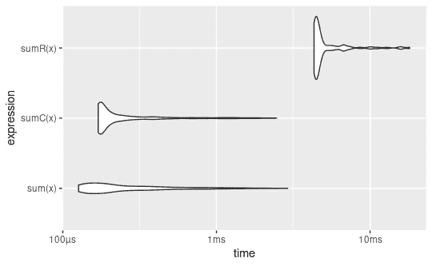
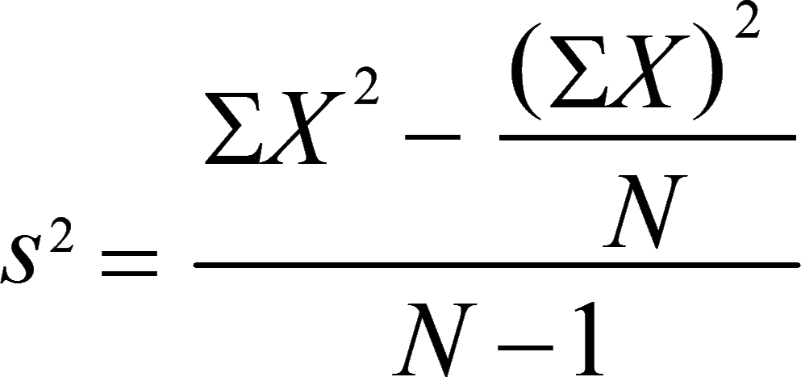
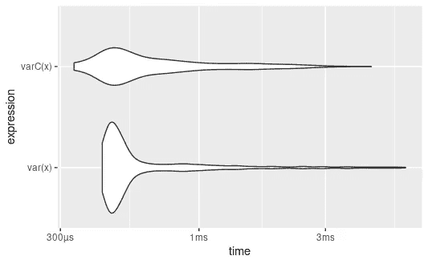

# 用 C++增强 R 函数

> 原文：<https://towardsdatascience.com/supercharge-r-functions-with-c-dcc951128027?source=collection_archive---------36----------------------->

## 利用 C++将代码速度提高一倍以上。

照片由 [Patrick](https://unsplash.com/@macpukpro?utm_source=medium&utm_medium=referral) 在 [Unsplash](https://unsplash.com?utm_source=medium&utm_medium=referral) 拍摄

对于统计学家来说，R 一直是一门非常引人注目的语言，因为它已经根据统计数据进行了优化。随着数据变得越来越复杂和庞大，R 开始变得越来越重要，即使 Python 接管了编程领域的“市场份额”,直到今天，R 仍然坚持自己的许多统计范式，需要今天解决。在本文中，我将概述如何在 R 中利用 C++让您能够使用 Rcpp 将代码提高几个数量级。

## Rcpp 是什么？

顾名思义，Rcpp 充当 R 和 C++之间的接口。它不仅允许 R 用户使用他们已经在纯 R 中构建的函数，并在 C++中构建它以获得更快的结果，而且它还使您的 C++函数能够很容易地导出并在 R 脚本中使用。

如果您在 R Markdown 笔记本中工作，这可以简单到将 Rcpp 代码块添加到您的项目中并继续您的工作。但是，如果您决定在项目中简单地使用 C++文件，这也很容易做到。

在本文中，我将向您展示一些如何在 R 代码中使用 C++并使其比以前更快的例子。我不会教你 C++的语法，我会假设你知道这篇文章的语言基础。这些例子不会太严格，因为我假设您以前从未在 R 中使用过 C++，所以通过提供简单的例子，您将能够更全面地了解这有多么强大，尤其是当问题需要大量循环时。

考虑到这一点，我们开始吧！

***注:无出处图片均为作者。***

# 示例 1 —求一个向量的和

这个例子将寻找长度为`n`的向量的和。虽然这个例子看起来很乏味，但它是将 C++集成到 R 中的最佳第一个例子。我们将比较 R 中的本机`sum`函数和我们将在 R 中自己构建的另一个`sum`函数`sumR`的性能。

在定义函数之前，第 1–4 行很重要，因为它允许您使用某些数据类型，如`NumericVector`。如果您在 R-Markdown 文件中使用它，您可以简单地按原样运行代码块。然而，如果您在自己的`.cpp`文件中定义了函数，您可以简单地使用`Rcpp::sourceCpp('path/to/file')`来测试和利用该函数。

现在是 R 代码:

我们将使用库`bench`来比较速度，并通过`ggplot2`来绘制。

正如我们所见，原生 R 函数执行速度最快。这并不奇怪，这就是为什么它是本机函数的原因。该图的主要目的是比较`sumR`和`sumC`，因为您构建的大多数东西都没有为您构建的本机函数。

在 C++中循环所花费的时间比在 r 中实现相同的循环要快几个数量级。这是在 r 中利用 C++的主要好处。此外，在 C++中的实现几乎与本机函数本身一样快。

让我们看另一个例子。

# 示例 2 —寻找方差

我们将继续寻找给定向量`x`的方差。我们将在 C++中创建自己的函数，并将其与基 R 函数`var`进行比较。请注意，我们将使用标准差的计算公式，如下所示:

[来自统计指南的等式](https://www.statisticshowto.com/probability-and-statistics/descriptive-statistics/sample-variance/)

在这种情况下，方差的 C++实现与内置函数大致相同，其最快的性能稍快一些。

到目前为止，您应该对 C++和 R 如何很好地结合有了很好的了解。

如果您的 R 代码的某些方面需要大量的 for 循环，我强烈建议您利用 C++来完成手头的任务，因为这将显著提高代码的性能。此外，请随意询问关于本文的任何问题，我将很乐意回答您可能有的任何困惑。

> 感谢您的阅读