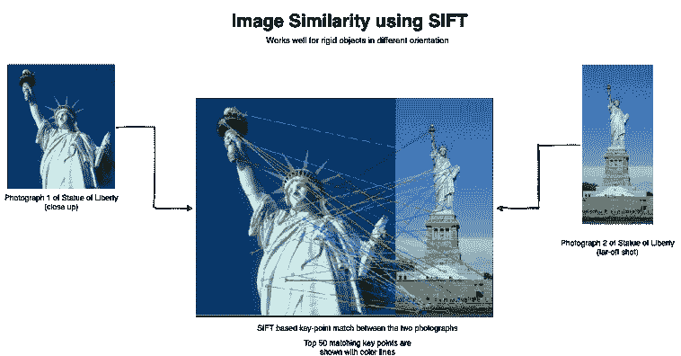
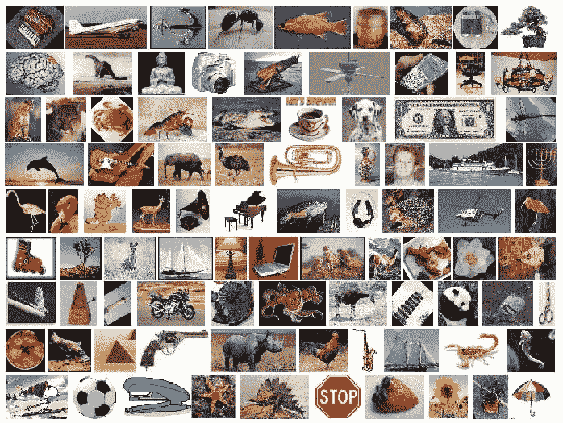
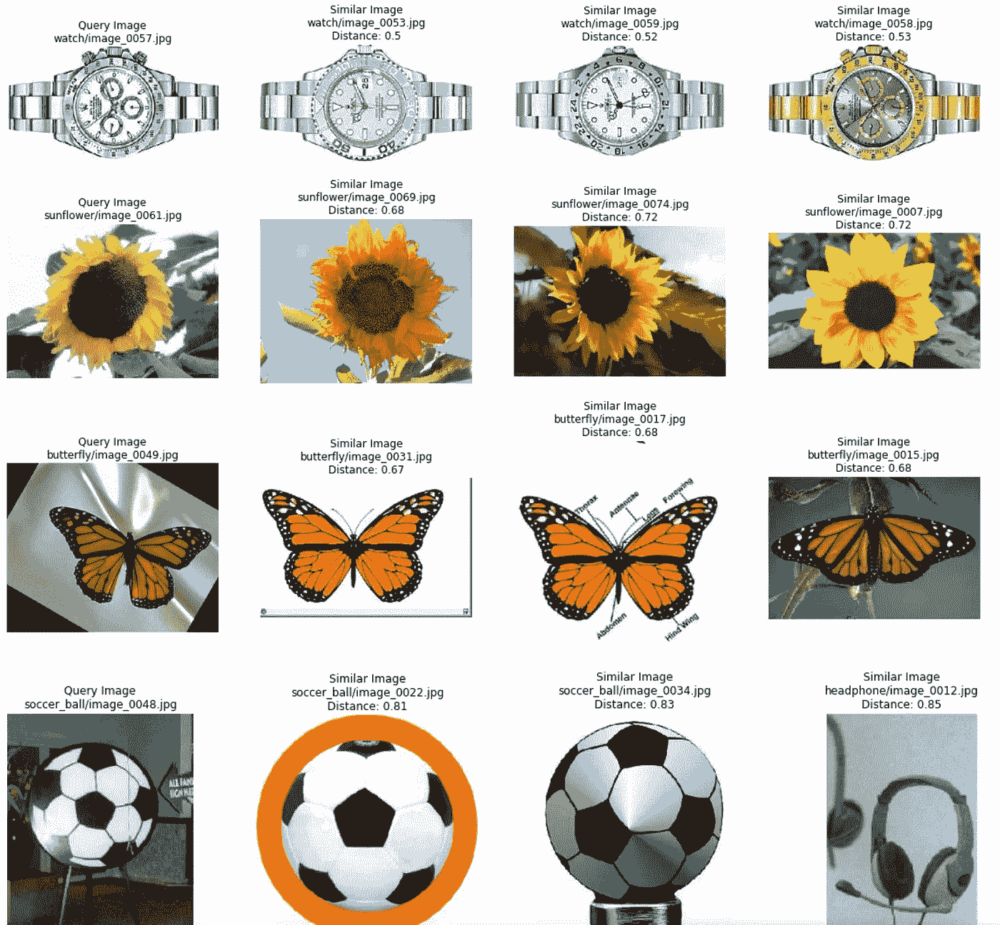
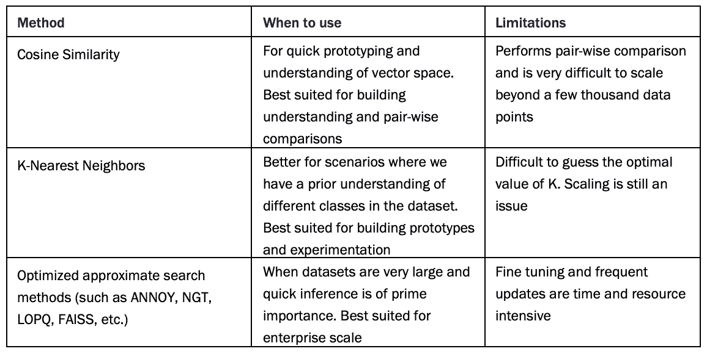

# 通过迁移学习增强您的图像搜索能力

> 原文：<https://towardsdatascience.com/supercharge-your-image-search-with-transfer-learning-75dfb5d29ceb?source=collection_archive---------21----------------------->

## 使用迁移学习和近似最近邻的反向图像搜索


图片来源:[贝卡·泰普特](https://unsplash.com/@beccatapert)在 [Unsplash](https://unsplash.com/photos/GnY_mW1Q6Xc?utm_source=unsplash&utm_medium=referral&utm_content=creditShareLink)

# 图像相似度

正如你可能知道的，逆向图像搜索的问题是找到相似的图像。但是如何定义图像相似性呢？给定两幅样本图像，从视觉上我们可以很容易地确定它们是否相似。我们如何以编程方式做到这一点？

一种非常幼稚的方法是基于与图像相关联的元数据。换句话说，我们可以将图像大小、RGB 值、类别标签等元数据信息与每张图像相关联。许多 web 应用程序仍在利用这种方式进行反向图像搜索。此类应用程序通常将此类元数据存储在优化的文本搜索平台中，如 ElasticSearch 或 Solr。这种方法很简单，但有许多缺陷。最明显的一个问题是标记每张图片需要大量的人工劳动。

一种更复杂的基于计算机视觉的技术是从图像本身提取不同的特征。传统的计算机视觉算法，如**比例不变特征变换** (SIFT)和**加速稳健特征** (SURF)在提取特征方面非常稳健，可以通过比较来识别相似的图像。SIFT、SURF 和许多其他这样的传统方法擅长从输入图像中提取关键特征。*图 1* 描绘了如何利用基于 SIFT 的特征来寻找相似图像。SIFT 识别每个候选人身上突出显示为彩色圆圈的关键特征，然后比较它们以找到相似的特征。



图 1:基于 SIFT 的图像相似性特征。它非常适用于刚性或不变的对象。这个例子展示了两张从不同角度拍摄的自由女神像的照片。两幅图像之间的前 50 个匹配特征已经用彩色线示出。图片来源:作者

这些是快速而强大的方法，在我们有刚性物体的情况下非常有用。例如，用矩形盒子(如包装纸盒)或圆形圆盘(如表盘)来识别图像，这种方法非常有效。另一方面，不太坚硬的物体很难匹配。例如，两个不同的人体模特以不同的姿势展示同一件衬衫/连衣裙，这对于传统技术来说可能是难以处理的。

您可能知道，可以尝试使用基于元数据的方法，甚至使用传统的基于计算机视觉的技术来识别相似的图像。两者都有各自的优势和缺陷。现在让我们从深度学习的角度来探索图像相似性。

# 图像特征与迁移学习

可以在特征提取、微调和预训练设置中利用迁移学习。在 CNN 的情况下，重新回顾特征提取，我们知道来自预训练模型的初始层集合如何变得善于理解图像。在迁移学习的帮助下，我们可以训练高性能的分类器，它由一个预先训练好的网络作为特征提取器，再加上几个浅层组成。

> 反向图像搜索用例是对预训练模型(迁移学习)的特征提取属性的巧妙利用。

反向图像搜索用例是对这种特征提取特性本身的巧妙利用。让我们利用预先训练的 ResNet-50 将图像转换为特征。这种特征通常是密集的一维向量。这个将输入转换成矢量的过程也被称为 ***矢量化*** 。我们首先需要准备一个预训练的 ResNet-50 模型的实例。接下来，我们需要一个效用函数来预处理输入图像并获得矢量输出。*代码清单 1* 展示了相同的实现。

代码清单 1:使用预先训练的 ResNet-50 将图像转换成特征向量

如果我们仔细观察代码清单 1，高级的`tensorflow.keras` API 使得准备预训练模型的实例并将其用于我们预期的特征提取变得非常容易。如图所示，该函数将图像输入转换为 2048 维的密集矢量输出。2048 维向量是从 ResNet 模型的平均池层获得的，该模型在没有顶级分类层的情况下被实例化。

> **注意:**我们利用`ResNet-50`获得图像向量，但我们可以自由使用任何其他预训练模型。我们只需要记住一些方面，例如预训练网络的域、用于反向图像搜索的数据集以及输出向量的维度。例如，如果我们用`VGG-16`代替`ResNet-50`，特征向量将会减少到 512 维。当我们在接下来的小节中讨论一些高级的反向图像搜索方法时，我们将进一步讨论这些选择的影响。

在我们进入反向图像搜索的实际任务之前，我们需要一个数据集。为了便于说明，我们将使用**加州理工学院 101** 数据集。这个数据集是由费-李非和他的团队在 2003 年收集的，包含 101 个不同物体类别的大约 40 到 800 张图像。该数据集具有相当高质量的图像，非常适合我们的理解目的。



Caltech-101 数据集中的样本图像

我们已经准备了一个实用程序来将图像转换为矢量，让我们利用相同的函数来获得参考数据集中图像的矢量表示。这也有助于形象化这些向量来更好地理解它们。想法是，相似的物体/图像应该有邻近的向量。但是一个人如何想象一个 2048 维的空间呢？为此，我们将采用一种叫做**t-分布式随机邻居**或 t-SNE 的降维技术。无需深入细节，可以将 t-SNE 视为将高维向量转换到低维空间，同时保留重要特征的一种方式。一个非常简单的例子是一个很长的购物清单作为我们的起点(高维向量)。将清单上的单个项目分成几类，如蔬菜、水果、奶制品等。可以被看作是向低维空间的转换，同时仍然保持重要的特征。在我们目前的情况下，我们将使用 t-SNE 变换 2048 维向量到 2 或 3 维。通过减少维度，我们可以很容易地将它们可视化。*代码清单 2* 展示了我们的参考数据集到向量的转换，然后为了可视化的目的对它们进行降维。

代码清单 2:矢量化 Caltech-101 数据集和基于 t-SNE 的降维

```
# output
Num images   =  9144
Shape of feature_list =  (9144, 2048)
Time taken in sec =  30.623387098312378
```

我们正在为反向图像搜索准备一个解决方案。下一步使用这些特征来识别相似的图像。

# 讨厌:超快的邻居搜索

骚扰或**近似最近邻哦是的**是一个高度优化的超快速实现最近邻搜索从 Spotify⁴.asury 由 Spotify 开发，用于为用户提供音乐推荐。因为每天有数百万用户在他们的手机和网络上使用它，所以实现的重点是速度和准确性。用 Python 包装器在 C++中开发，是一种基于树的向量相似性搜索方法，它有效地利用了内存和并行处理。它提供了许多距离度量选项，如欧几里德、余弦、汉明等。让我们看一下在*代码清单 3* 中使用 ANNOY 的反向图像搜索的快速实现。

代码清单 3 (a):基于骚扰的反向图像搜索

```
# output
1000 loops, best of 3: 770 µs per loop
```

代码清单 3 (b):测试更大样本的基于骚扰的反向图像搜索的性能

```
# output
CPU times: user 139 ms, sys: 0 ns, total: 139 ms
Wall time: 142 ms
```

如清单 3 所示，使用 ANNOY 非常简单。效率高，搜索时间快得惊人。搜索结果也相当可观，如图*图 2* 所示。



图 2:基于恼人的反向图像搜索。每行代表一个搜索查询。最左边的列表示查询图像，搜索结果(相似度递减)放在右边。每个匹配结果都用其与查询图像的欧几里德距离来标记。图片来源:作者

ANNOY 在很大程度上克服了与搜索速度和内存需求相关的限制。它还提供了一些额外的选项来进一步提高性能。其中之一与特征向量的大小有关。这也很明显。如果我们减少向量的大小，将直接减少寻找邻居所需的内存量。我们利用了输出 2048 维向量的`ResNet-50`。如果我们使用像`VGG-16`、`VGG-19`甚至`MobileNet`这样的模型，VGG 模型的特征向量将减少到 512，MobileNet 将减少到 1024(几乎减少了 50%)。除此之外，我们甚至可以利用典型的降维技术，如主成分分析(PCA)或 t-SNE，这是一些最广泛使用的技术。这种技术可以帮助我们大幅减少特征向量的大小，从而减少整体计算和内存需求(尽管会有搜索性能的折衷)。

对优化的近似搜索方法的需求如此之大，以至于多年来已经开发了许多可扩展的解决方案。不赘述细节，雅虎的**局部优化产品量化** (LOPQ)⁵和**邻域图和树** (NGT) *⁶* 等实现已经为 Flickr 等拥有超过 10 亿个数据点的庞大数据集的商业应用开发出来。同样， **Facebook 人工智能相似性搜索**或 FAISS *⁷* 是一个 GPU 优化的实现，速度快得惊人，即使在 Facebook 的规模下使用也非常简单。

我们在本节中讨论的反向图像搜索的不同方法和实现基于这样的核心思想:首先将图像转换为特征向量，然后是相似性搜索算法。优化的实现更进一步，它关注内存的最佳利用，同时返回结果的速度也非常快。

从这一部分可以明显看出，反向图像搜索是一个活跃的研究领域，研究人员正在利用这种技术不断拓展新的领域。这些方法的成功开辟了越来越多的使用案例，其中反向图像搜索是一个重要方面。

既然我们对反向图像搜索有了相当好的理解，我们可以利用这些知识轻松地从电子商务网站上找到类似的产品，甚至从一组照片中删除重复的照片。同样，反向图片搜索也被 Flickr 等服务广泛用于建议相似的图片，谷歌购物，Pinterest 的“相似图钉”功能，亚马逊的产品扫描仪，甚至被专业摄影师用于识别抄袭的作品。不同的场景需要不同的技术，本节讨论的每种方法的快速总结在*表 1* 中提供，以供快速参考。



表 1:各种邻域搜索方法的总结

如果你想更多地了解这些有趣的话题，可以看看[迪潘詹·萨卡尔](https://www.linkedin.com/in/dipanzan/?originalSubdomain=in)和[拉格哈夫·巴厘](https://raghavbali.github.io)的《**迁移学习在行动**》。你可以在曼宁的 liveBook 平台[这里](https://livebook.manning.com/book/transfer-learning-in-action?origin=product-look-inside&utm_source=blog&utm_medium=organic&utm_campaign=book_sarkar_transfer_06_18_21&utm_content=tdd)查看一下。

在[manning.com](https://www.manning.com/?utm_source=blog&utm_medium=organic&utm_campaign=book_sarkar_transfer_06_18_21&utm_content=tdd)结账时，将 **fccsarkar** 输入折扣代码框，即可享受 40%的折扣 [*转移学习行动*](https://www.manning.com/books/transfer-learning-in-action?utm_source=blog&utm_medium=organic&utm_campaign=book_sarkar_transfer_06_18_21&utm_content=tdd) 。

# 参考

[【1】](#_ftnref1)弹性搜索:[https://www.elastic.co/what-is/elasticsearch](https://www.elastic.co/what-is/elasticsearch)

[【2】](#_ftnref2)索尔:[https://lucene.apache.org/solr/](https://lucene.apache.org/solr/)

[【3】](#_ftnref1)加州理工学院-101 数据集:【http://www.vision.caltech.edu/Image_Datasets/Caltech101/ 

LOPQ:[http://image.ntua.gr/iva/files/lopq.pdf](http://image.ntua.gr/iva/files/lopq.pdf)

[【5】](#_ftnref2)NGT 代码:[https://github . com/Yahoo Japan/NGT/blob/master/readme . MD # publications](https://github.com/yahoojapan/NGT/blob/master/README.md#publications)

[【6】](#_ftnref3)https://arxiv.org/abs/1702.08734[NGT 论文](https://arxiv.org/abs/1702.08734)

[【7】](#_ftnref1)惹怒:[https://github.com/spotify/annoy](https://github.com/spotify/annoy)