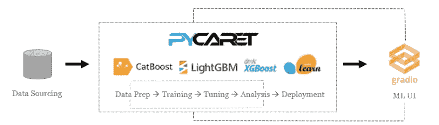
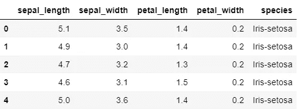
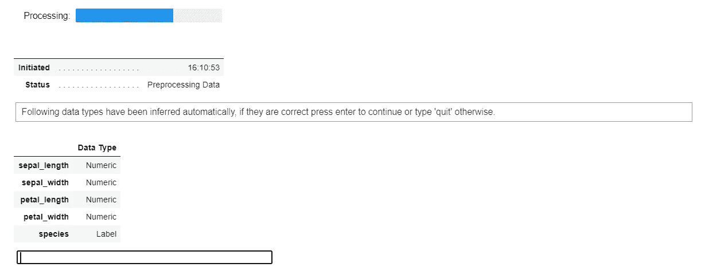
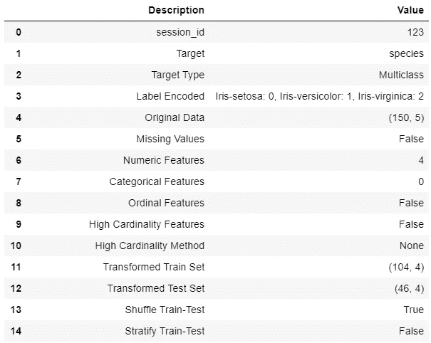
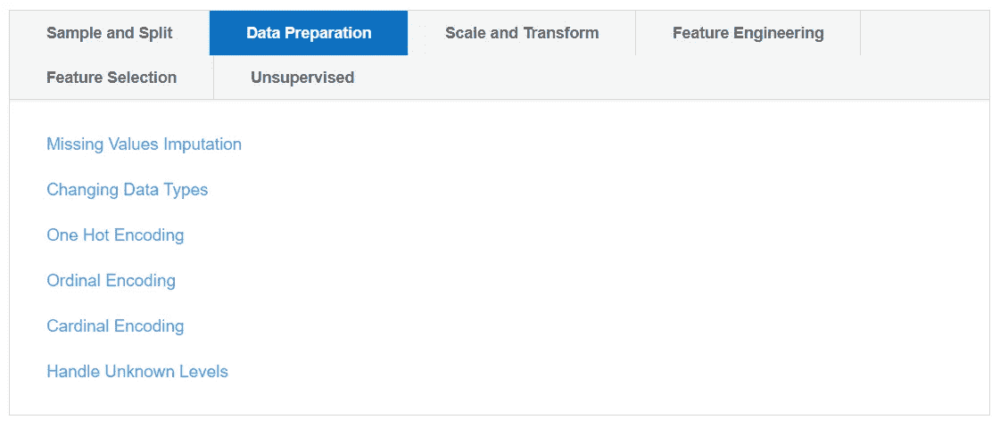
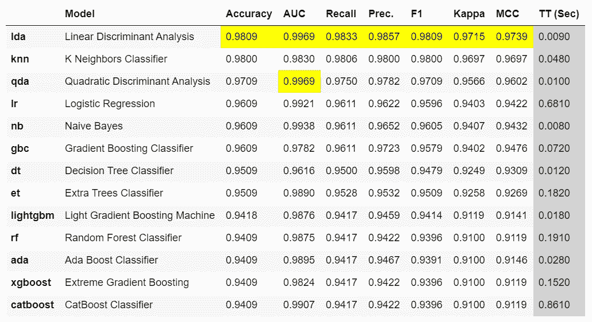
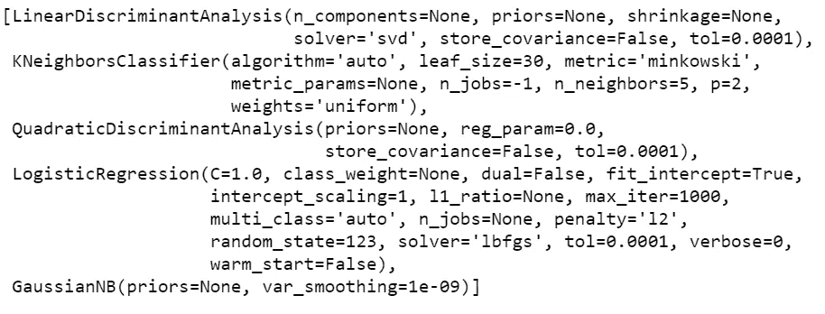
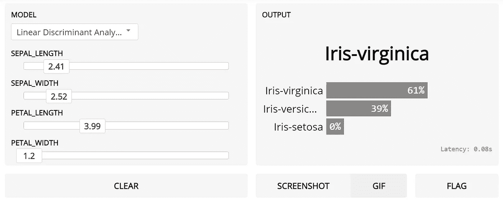

# 使用 PyCaret 和 Gradio 增强您的机器学习实验

> 原文：<https://towardsdatascience.com/supercharge-your-machine-learning-experiments-with-pycaret-and-gradio-5932c61f80d9?source=collection_archive---------12----------------------->

## 快速开发机器学习管道并与之交互的循序渐进教程


亨特·哈里特在 [Unsplash](https://unsplash.com?utm_source=medium&utm_medium=referral) 上的照片

# 👉介绍

本教程是一个循序渐进、初学者友好的解释，说明如何集成 Python 中两个强大的开源库 [PyCaret](https://www.pycaret.org) 和 [Gradio](https://www.gradio.app/) ，并在几分钟内增强您的机器学习实验。

本教程是一个“hello world”示例，我使用了来自 UCI 的[鸢尾数据集](https://archive.ics.uci.edu/ml/datasets/iris)，这是一个多分类问题，目标是预测鸢尾植物的类别。本例中给出的代码可以在任何其他数据集上复制，无需任何重大修改。

# 👉PyCaret

PyCaret 是一个开源的低代码机器学习库和端到端的模型管理工具，内置于 Python 中，用于自动化机器学习工作流。它因其易用性、简单性以及快速有效地构建和部署端到端 ML 原型的能力而广受欢迎。

PyCaret 是一个替代的低代码库，可以用来用几行代码替换数百行代码。这使得实验周期成倍地快速和有效。

py caret**简单** **好用**。PyCaret 中执行的所有操作都顺序存储在一个**管道**中，该管道对于**部署是完全自动化的。**无论是输入缺失值、一键编码、转换分类数据、特征工程，甚至是超参数调整，PyCaret 都能实现自动化。

要了解更多关于 PyCaret 的信息，请查看他们的 GitHub。

# 👉格拉迪欧

Gradio 是一个开源 Python 库，用于围绕机器学习模型创建可定制的 UI 组件。Gradio 可以让您轻松地在浏览器中“摆弄”您的模型，方法是拖放您自己的图像、粘贴您自己的文本、录制您自己的声音等。，并查看模型输出的内容。

Gradio 适用于:

*   围绕您训练有素的 ML 渠道创建快速演示
*   获得关于模型性能的实时反馈
*   在开发过程中交互式调试您的模型

要了解更多关于 Gradio 的信息，请查看他们的 [GitHub](https://github.com/gradio-app/gradio) 。



PyCaret 和 Gradio 的工作流

# 👉正在安装 PyCaret

安装 PyCaret 非常容易，只需要几分钟。我们强烈建议使用虚拟环境来避免与其他库的潜在冲突。

PyCaret 的默认安装是 pycaret 的精简版本，它只安装这里列出的[的硬依赖项。](https://github.com/pycaret/pycaret/blob/master/requirements.txt)

```
**# install slim version (default)** pip install pycaret**# install the full version**
pip install pycaret[full]
```

当您安装 pycaret 的完整版本时，这里列出的所有可选依赖项[也会被安装。](https://github.com/pycaret/pycaret/blob/master/requirements-optional.txt)

# 👉安装 Gradio

您可以从 pip 安装 gradio。

```
pip install gradio
```

# 👉我们开始吧

```
**# load the iris dataset from pycaret repo**
from pycaret.datasets import get_data
data = get_data('iris')
```



iris 数据集中的样本行

# 👉初始化设置

```
**# initialize setup**
from pycaret.classification import *
s = setup(data, target = 'species', session_id = 123)
```



每当在 PyCaret 中初始化`setup`函数时，它都会分析数据集并推断所有输入要素的数据类型。在这种情况下，您可以看到所有四个特征( *sepal_length、sepal_width、petal_length 和 petal_width* )都被正确地识别为数字数据类型。您可以按 enter 键继续。



设置的输出—为显示而截断

对于 PyCaret 中的所有模块来说，`setup`函数是在 PyCaret 中开始任何机器学习实验的第一个也是唯一一个强制步骤。除了默认执行一些基本的处理任务，PyCaret 还提供了一系列预处理功能，如[缩放和变换](https://pycaret.org/normalization/)、[特征工程](https://pycaret.org/feature-interaction/)、[特征选择](https://pycaret.org/feature-importance/)，以及几个关键的数据准备步骤，如[一次热编码](https://pycaret.org/one-hot-encoding/)、[缺失值插补](https://pycaret.org/missing-values/)、[过采样/欠采样](https://pycaret.org/fix-imbalance/)等。要了解 PyCaret 中所有预处理功能的更多信息，您可以查看这个[链接](https://pycaret.org/preprocessing/)。



[https://pycaret.org/preprocessing/](https://pycaret.org/preprocessing/)

# 👉比较模型

这是我们在 PyCaret 中推荐的 *any* 监督实验工作流程的第一步。此函数使用默认超参数训练模型库中所有可用的模型，并使用交叉验证评估性能指标。

该函数的输出是一个表格，显示所有模型的平均交叉验证分数。可使用`fold`参数定义折叠次数(默认= 10 次折叠)。该表按照选择的度量标准排序(从最高到最低)，该度量标准可以使用`sort`参数定义(默认=‘Accuracy’)。

```
best = compare_models(n_select = 15)
compare_model_results = pull()
```

`n_select`设置功能中的参数控制已训练模型的返回。在本例中，我将它设置为 15，这意味着以列表的形式返回前 15 个模型。第二行的`pull`函数将`compare_models`的输出存储为`pd.DataFrame`。



compare_models 的输出

```
len(best)
>>> 15print(best[:5])
```



打印输出(最佳[:5])

# 👉格拉迪欧

现在我们已经完成了建模过程，让我们使用 Gradio 创建一个简单的 UI 来与我们的模型进行交互。我将分两部分来做，首先，我将创建一个使用 PyCaret 的`predict_model`功能来生成和返回预测的函数，第二部分将把该函数输入 Gradio 并设计一个简单的交互输入表单。

# **第一部分—创建内部函数**

代码的前两行获取输入要素并将其转换为 pandas 数据帧。第 7 行创建了一个显示在`compare_models`输出中的模型名称的唯一列表(这将在 UI 中用作下拉列表)。第 8 行根据列表的索引值(将通过 UI 传入)选择最佳模型，第 9 行使用 PyCaret 的`predict_model`功能对数据集进行评分。

[https://gist . github . com/moe zali 1/2a 383489 a 08757 df 93572676d 20635 e 0](https://gist.github.com/moezali1/2a383489a08757df93572676d20635e0)

# 第二部分——用 Gradio 创建 UI

下面代码中的第 3 行为模型名称创建了一个下拉列表，第 4–7 行为每个输入特性创建了一个滑块，我将默认值设置为每个特性的平均值。第 9 行启动一个 UI(在笔记本和您的本地主机上，因此您可以在浏览器中查看它)。

[https://gist . github . com/moe zali 1/a 1d 83 FB 61 e 0 ce 14 adcf 4 dffa 784 b 1643](https://gist.github.com/moezali1/a1d83fb61e0ce14adcf4dffa784b1643)



运行 Gradio 界面的输出

您可以在这里看到这个快速视频，了解无需编写数百行代码或开发成熟的前端，与管道交互和查询模型是多么容易。

使用 PyCaret 和 Gradio 增强您的机器学习实验

我希望你会喜欢 PyCaret 和 Gradio 的易用性和简单性。在不到 25 行代码和几分钟的实验中，我使用 PyCaret 训练和评估了多个模型，并开发了一个轻量级 UI 来与笔记本中的模型进行交互。

# 即将推出！

下周我将写一篇关于使用 [PyCaret 异常检测模块](https://pycaret.readthedocs.io/en/latest/api/anomaly.html)对时间序列数据进行无监督异常检测的教程。请关注我的[媒体](https://medium.com/@moez-62905)、 [LinkedIn](https://www.linkedin.com/in/profile-moez/) 和 [Twitter](https://twitter.com/moezpycaretorg1) 以获取更多更新。

使用 Python 中的这个轻量级工作流自动化库，您可以实现的目标是无限的。如果你觉得这很有用，请不要忘记给我们 GitHub 库上的⭐️。

要了解更多关于 PyCaret 的信息，请关注我们的 LinkedIn 和 Youtube。

加入我们的休闲频道。此处邀请链接[。](https://join.slack.com/t/pycaret/shared_invite/zt-p7aaexnl-EqdTfZ9U~mF0CwNcltffHg)

# 您可能还对以下内容感兴趣:

[使用 PyCaret 2.0](/build-your-own-automl-in-power-bi-using-pycaret-8291b64181d)
[在 Power BI 中构建您自己的 AutoML 使用 Docker](/deploy-machine-learning-pipeline-on-cloud-using-docker-container-bec64458dc01)
[在 Azure 上部署机器学习管道在 Google Kubernetes 引擎上部署机器学习管道](/deploy-machine-learning-model-on-google-kubernetes-engine-94daac85108b)
[在 AWS Fargate 上部署机器学习管道](/deploy-machine-learning-pipeline-on-aws-fargate-eb6e1c50507)
[构建和部署您的第一个机器学习 web 应用](/build-and-deploy-your-first-machine-learning-web-app-e020db344a99)
[使用 AWS Fargate 无服务器](/deploy-pycaret-and-streamlit-app-using-aws-fargate-serverless-infrastructure-8b7d7c0584c2)
[构建和部署机器](/build-and-deploy-machine-learning-web-app-using-pycaret-and-streamlit-28883a569104)

# 重要链接

[文档](https://pycaret.readthedocs.io/en/latest/installation.html)
[博客](https://medium.com/@moez_62905)
[GitHub](http://www.github.com/pycaret/pycaret)
[stack overflow](https://stackoverflow.com/questions/tagged/pycaret)
[安装 PyCaret](https://pycaret.readthedocs.io/en/latest/installation.html) [笔记本教程](https://pycaret.readthedocs.io/en/latest/tutorials.html) [投稿于 PyCaret](https://pycaret.readthedocs.io/en/latest/contribute.html)

# 想了解某个特定模块？

单击下面的链接查看文档和工作示例。

[分类](https://pycaret.readthedocs.io/en/latest/api/classification.html) 回归 聚类
[异常检测](https://pycaret.readthedocs.io/en/latest/api/anomaly.html)
[自然语言处理](https://pycaret.readthedocs.io/en/latest/api/nlp.html) [关联规则挖掘](https://pycaret.readthedocs.io/en/latest/api/arules.html)