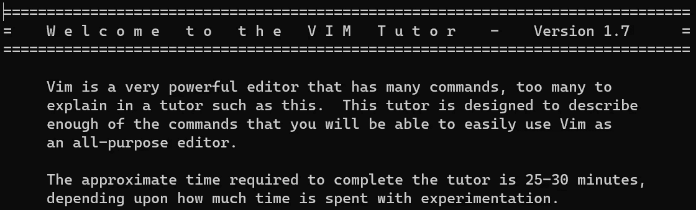

# 加速您的编辑速度

> 原文：<https://towardsdatascience.com/supercharge-your-vim-skills-f5bb4fe33036?source=collection_archive---------24----------------------->

## 快速编辑文件的 8 个 Vim 技巧。


(图片由作者提供)

Vim 是一个文本编辑器，在一个熟练的用户手中，可以实现接近思维速度的极快编辑*——比传统文本编辑器通常可以实现的速度快得多。*

对于我们在计算机上做的每一件事，在我们打算执行一个动作和观察到这个动作完成之间有一个时间延迟。编辑文本只是需要时间，如果这种时间延迟太长，就会妨碍我们的注意力。为了解决这个问题，学习一些花哨的 Vim 操作可以更快地将我们的编辑从大脑印到屏幕上。

我们来看一个编辑例子。

```
url = "https://www.google.com"
```

假设我们想改变我们的 URL 来显示`localhost`。

在传统的文本编辑器中，我们可能会做一些事情，比如将光标拖到引号括起来的 URL 上，然后开始键入新的 URL。将我们的手移到鼠标上，精确地高亮显示引号括起来的部分([菲特定律](https://en.wikipedia.org/wiki/Fitts%27s_law)告诉我们，这是一件很难快速完成的事情，因为它是如此精确的移动)，然后将我们的手移回到键盘上重新开始键入。


在记事本中更改 URL。将光标准确地放在引号之间是很困难的，我需要在快结束时放慢速度以获得精确度。(图片由作者提供)

在 Vim 中，我们可以将光标移动到引号内的任何地方，键入`ci”`(这将删除引号内的所有内容并进入插入模式)，然后立即开始键入我们的新 URL。


在 Vim 中更改 URL。一旦我把光标放在引号之间的任何地方，我就盲目地发出命令并开始输入。(图片由作者提供)

请注意，与使用传统的文本编辑器完成这项任务相比，Vim 节省了我们大量的时间。在传统的文本编辑器中，我们浪费了大量的时间在键盘和鼠标之间转换我们的手——Vim 保持我们的手在键盘上的风格减少了一些延迟，希望我们在忘记我们正在看什么之前，可以在编辑器中打印更多的大脑转储。

既然您已经看到了 Vim 如何加快编辑速度的实际例子，那么我将向您提供我的最有用的技巧，让您充分利用 Vim 的生产力。

## **1。开始学习基础知识。**

如果您是 Vim 的新手，或者可以重新熟悉一些基础知识，可以在命令行上运行`vimtutor`来开始。



(图片由作者提供)

## 2.最好退出插入模式

您可以使用`Ctrl-C`退出插入模式。escape 键也可以做同样的事情，但是为什么要做那么多的 reaching 呢？

## 3.升级 vimrc

文件`~/.vimrc`存储了我们每次打开 Vim 时的配置设置。

这些是一些明智的设置，大多数人都会从启用这些设置中受益。

```
" Enable mouse usage
set mouse=a" Turn on line numbers
set number" Enable syntax highlighting
syntax on
```

这些是我个人使用的一些快捷方式设置，但对你来说是有用的例子，让你看看如何制作自己的快捷方式添加到`~/.vimrc`中。

```
" Map Ctrl-C, Ctrl-C -> force quit
nmap <C-C><C-C> :q!" Map w, w -> force write
nmap ww :w!" Map Ctrl-W, Ctrl-W -> force write and quit
nmap <C-W><C-W> :wq!
```

当你感觉到你喜欢什么的时候调整这些设置，并把它们推送到 Github repo。由于 Vim 无处不在，并且几乎在任何 Linux 服务器中都作为一个选项存在，所以您可以将您的设置克隆到您正在使用的任何新机器上，并在相同的熟悉的文本编辑环境中开始。

## 3.四处跳跃

只用箭头键滚动一个长文件可能会很乏味。学会这些命令，你就不用花那么多时间去滚动了。

**在正常模式下:**

`gg` —跳转到文件的顶部

`G` —跳到文件的底部

`<line-num>G` —跳到<行号>，例如 7G 跳到 7 行

**从命令行:**

`vim <filename> +<line-num>` —打开文件，跳转到<行号>

## 4.猛拉(复制)、删除(剪切)和粘贴

需要记住的是:猛拉命令包含字母`y`，删除命令包含字母`d`，粘贴命令包含字母`d`。

我们将不得不使用视觉模式(我们可以在正常模式下使用`v`或`Shift-V`进入)来选择我们想要编辑的文本。文本在可视模式下高亮显示:

`y` —猛拉

`d` —删除

然后我们将回到正常模式，我们可以键入`p`进行粘贴。

一些其他有用的正常模式命令:

`yy` —猛拉当前行

`dd` —删除并拉当前行

`p` —粘贴在光标或行后

`P` —粘贴在光标或行之前

## 5.撤消和重做

每个人都会犯错。

在正常模式下，用`u`撤销编辑，用`Ctrl-R`重做编辑。

## 6.搜索

要在当前文件中搜索字符串，请在正常模式下键入`/<SEARCH_TERM>`。你甚至可以在`<SEARCH_TERM>`中使用 regex。

按回车键，光标将跳转到第一次出现的查询。

要循环浏览所有事件，键入`n`前进，键入`N`后退。

## 7.复合命令

在文章的最开始，我们演示了一个复合命令。复合命令可能非常强大，一旦你把它们记下来，你将会以令人难以置信的精确度进行编辑。

要理解 Vim 中的复合命令，您需要一些上下文:

*   动作按动词分类，如*改变*和*删除*。
*   动作可以有修饰词，如 in 和 around。
*   文本按单词、行、句子和段落分类。

这有助于一些非常酷和方便的复合命令——可组合和容易重复的命令。

例如，本文开头使用的复合命令是`ci"`(“引号中的变化”)，它删除了引号中的所有内容，并将我们置于插入模式。

`c`告诉 Vim 我们想要的动作——change——当命令完成时，我们将进入插入模式。

`i"`告诉 Vim 我们想要的动作修饰符——在引号中——它将在一对匹配的引号中执行我们想要的动作，并保持引号不变。

一旦你尝试了几个例子，你会很直观地发现，所以这里有一些例子供你参考。

**在正常模式下**:

`cip`(“段落变更”)—删除光标所在的段落，进入插入模式

`ciw` —删除光标所在的单词，进入插入模式

`cw` —删除光标上和光标后的单词，进入插入模式

`diw`(“删除单词”)—删除光标所在的单词

`dis` —删除光标所在的句子

`ctX`(“更改为 X”)—删除下一个“X”并进入插入模式

`dtZ` —删除“Z”的下一次出现

`da)`(“删除括号”)—删除括号内的文本

`ci]` —删除括号中的文本并进入插入模式

## 8.重复上一次编辑

所有编辑在您进入插入模式时开始，在您切换回正常模式时结束。无论是手动启动编辑，还是复合命令为您完成编辑，这些离散编辑都是可重复的。

只需在正常模式下键入`.`即可重复上一次编辑。

## 结论

Vim 可以做很多事情来加速我们的文本编辑。还有很多我没有提到的。

所以，走出去，开始使用 Vim 来编辑您的文件吧！唯一的方法是练习并坚持使用 Vim，直到命令成为第二天性。想想你将来要编辑的所有文件。现在想想你将来编辑这些文件可以节省多少时间。


(图片由作者提供)

请在评论中告诉我一些你最喜欢的 Vim 技巧和窍门！很期待听听大家的想法。