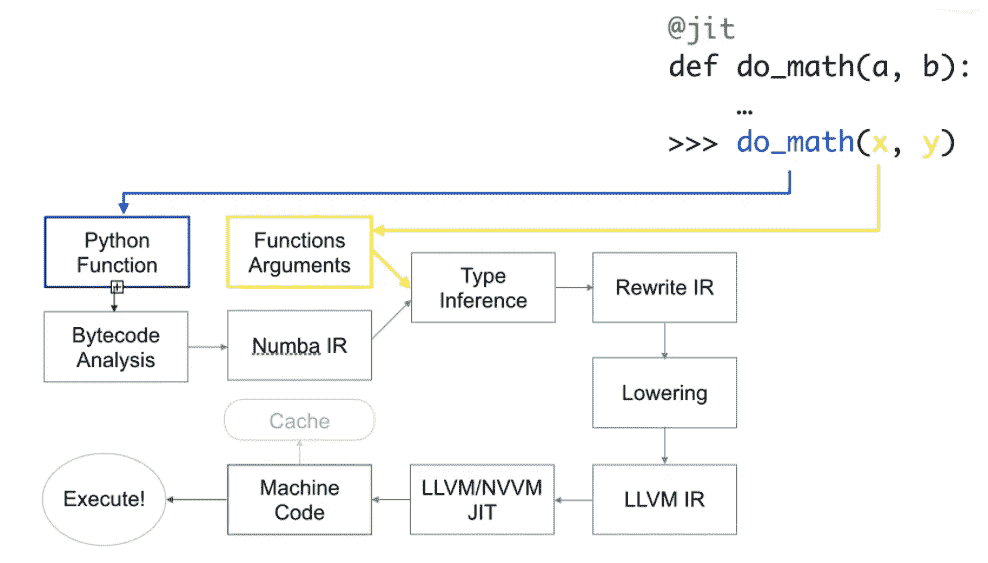
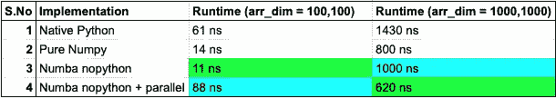
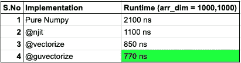
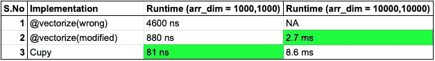

# 用 Numba 增压 NumPy

> 原文：<https://towardsdatascience.com/supercharging-numpy-with-numba-77ed5b169240?source=collection_archive---------12----------------------->

## 以 C/FORTRAN 速度运行循环/数字代码

# 介绍

对于外行来说，Numba 是一个开源的 ***JIT*** 编译器，它使用 LLVM ***编译器*** 库将 Python/NumPy 代码的子集翻译成优化的机器代码。

简而言之，Numba 使 Python/NumPy 代码运行得更快。它通过将 Python 代码编译成本机代码来实现这一点。

在深入 Numba 细节之前，让我们先了解 NumPy 有什么问题，以及 Numba 是如何解决这些问题的。

1.  NumPy 不并行运行。另一方面，Numba 充分利用了计算机的并行执行能力。
2.  NumPy 函数不会使用多个 CPU 内核，更不用说 GPU 了。
3.  你会变得依赖 NumPy 函数，因为很难编写最佳的自定义 NumPy ufuncs(通用函数)。另一种选择是用原生 Python 编写它们，但是用 Python 循环遍历单个数组元素非常慢。

## 什么时候用 Numba？

如果你的代码是面向数字的，使用 NumPy，并且有很多循环。

## Numba 怎么用？

1.  添加 decorators 来指导 Numba JIT 编译你的函数
2.  在 Numba 需要的地方添加带注释的类型
3.  用支持的函数替换不支持的 NumPy 函数

## Numba 怎么安装？

```
conda install numba # anaconda
pip install numba  # pip
```

## Numba 修饰函数是如何工作的？

*第一步*
第一次调用时，Numba 对函数进行 JIT 编译，并进行类型推断

*第二步*
Numba 在推断参数类型后缓存编译好的机器码

*步骤 3*
在后续的函数调用中，Numba 使用缓存的版本

# Numba 是如何工作的？



[来源](https://github.com/numba/pydata-amsterdam2019-numba/blob/master/1%20-%20NumPy%20and%20Numba%20on%20the%20CPU.ipynb)

让我们暂时停止理论，转到代码上来。

# 示例 1: @jit、nopython 和并行模式

在这个例子中，我们计算一个数组的对角线元素的和，并将其添加到数组中。

下面的代码包含 4 个等价的函数:

`*trace_normal*`:原生 Python 实现
`*pure_numpy_trace*`:trace 的纯 NumPy 实现
`*trace_numba*`:nopython 模式下的 Numba JIT 实现
`*trace_numba_parallel*` : NUMBA nopython +并行模式

## 代码片段中使用的 Numba 概念

1.  ***nopython 模式*** 【推荐和最佳实践模式】
    在 nopython 模式下，修饰函数将完全在不涉及 python 解释器的情况下运行。为此，必须用 Numba 支持的数据结构/类型替换原生 python 对象。
    使用`@njit`和`@jit(nopython=True)`decorator 来 Numba JIT 编译你的函数
2.  ***对象模式***在对象模式下，Numba 识别出只有 nopython 操作的循环，并编译成机器码。剩下的代码将使用 Python 解释器运行。使用`@jit`调用对象模型编译
3.  ***并行运行代码*** 通过在`@njit`、`@jit`装饰器中添加`parallel=True`来调用。Numba 允许您通过使用`prange the the` 关键字显式地并行运行代码。并行运行时，Numba 会自动优化您的代码。
    这些优化可以通过使用`numba_func.paralllel_diagnostics(level=4)` 级别来查看，级别是指细节的级别。1 代表最小值，4 代表最大值。

我用两种数组大小运行了上面的代码，100*100 和 1000*1000。



运行时间

绿色阴影单元是最快的实现方式。

对于大小为 100*100 的数组，Numba(nopython + parallel)花费的时间最长。这是因为并行设置任务是有开销的。对于较大的阵列，相同的实现速度最快。

对于大小为 1000*1000 的数组，Numba(nopython)比纯 NumPy 实现花费更多的时间。在某些情况下，NumPy 实现本身是最佳的。在这些情况下，Numba nopython 模式会比较慢，因为它只是增加了额外的开销。

总而言之，在某些情况下，NumPy 的实现可能比 Numba 更快，但在大多数情况下，Numba 会让您的代码运行得更快。

# 示例 2

在下一个示例中，我将介绍 numba 的`@vectorize/@guvectorize` decorator，并将它的性能与`@njit`和原生 numpy 实现进行比较。

`@vectorize` decorator 对于优化 numpy 数组上的元素操作特别有用。Numba 可以将一个纯 Python 函数编译成一个 ufunc，它对 NumPy 数组的操作和用 c 编写的传统 u func 一样快。

`@guvectorize`处理任意数量的输入数组元素，并获取和返回不同维度的数组。

与`vectorize()`函数相反，`guvectorize()`函数不返回结果值:它们将结果值作为数组参数，该参数必须由函数填充。

如果提供了输入类型签名，`vectors`将创建一个 ufunc(通用函数)，否则创建一个 dufunc(动态通用函数)。

用`@vectorise/@guvectorise`修饰的函数可以进行归约、累加和广播操作。

绿色单元是最快的实现方式



运行时间

# 示例 3

我正在扩展示例 2，以便在 gpu 上运行矢量化/guvectorize。

在第一个截图中，我使用了示例 2 中的`@vectorize`和附加属性`target='cuda'`。这将导致以下三个问题

***错误 1:***
输入数组在 CPU 上，而代码要在 gpu 上运行。这不会抛出任何错误，但 cpu - > gpu - > cpu 数据传输会使代码运行速度变慢。

***错误 2:***
Numba 修饰函数需要传递一个显式的空输出数组

***错误三:***
我正在做的数组只有 1000 * 1000，只有 2 次运算。GPU 非常适合较大的阵列或较重的操作。

> 坚持 CPU，直到你的运行时间保持在 1 ms 以下。

这是在 cuda 上运行`@vectorize`的正确实现

CPU 和 GPU 的比较是不公平的，因为我使用 cupy 作为 Numba cuda 实现的基准。

对于较小的阵列，cupy 更快，但是对于较大的阵列，cuda 功能更快。



运行时间

# 进一步阅读

1.  Numba 也支持 cupy/cuda，但是支持的函数集比 numpy 小。
2.  `@stencil`:定位方式操作

# 词汇表

1.  JIT:在执行时编译一个函数。
2.  **编译器:** *将高级编程语言代码(C/C++)转换为机器专用代码。*
3.  ***类型推断***:Numba 确定正在编译的函数内所有值的专用类型的过程。
4.  ***AOT —提前***
    函数的编译在代码执行产生磁盘上的二进制对象之前单独发生。
5.  ***循环 Jitting***
    运行在对象模式下的函数的子集可以被优化，如果该子集包含只有 nopython 支持的操作的循环。
    该子集在 nopython 模式下自动编译，可以提供显著的性能提升。
6.  ***反射***no python 模式的编译不支持 Python 对象。当一个 nopython 函数用 python 对象号传递给 Numba 时，将其转换成 Numba 对象。当代码转换回 Python 解释器时，Numba 将 Numba 对象转换回 Python 对象。
    这样做是为了确保 Python/Numba 之间的语义匹配。这个过程称为反射，对所有原生 Python 数据结构都是如此。
7.  ***通用函数(***[***ufunc***](https://numpy.org/doc/stable/reference/ufuncs.html)***)*** 通用函数(或简称 uf unc)是一个以逐个元素的方式对`**ndarrays**`进行操作的函数，支持数组广播、类型转换和其他几个标准特性。

# 摘要

Numba 可以增强基于 NumPy 的操作，并以最小的代码变化提供显著的速度。它通过 gu vector se/vector se/njit 支持大量的 NumPy 操作。Numba 也支持基于 gpu 的操作，但与基于 cpu 的操作相比，它要小得多。