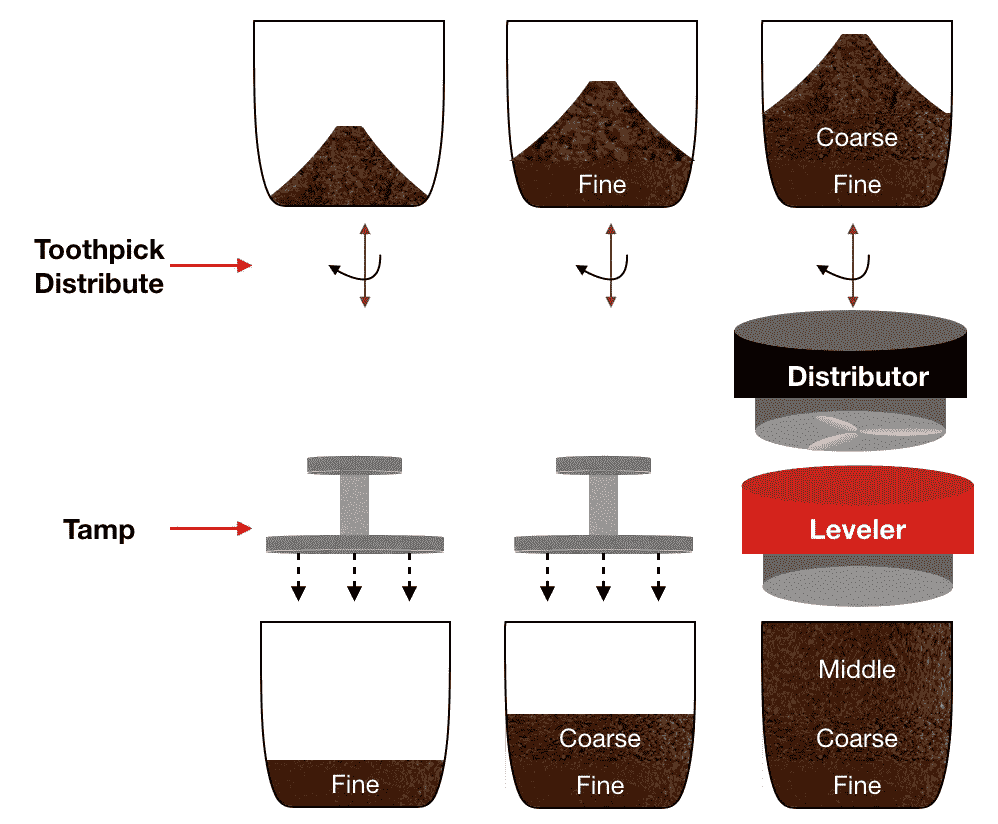
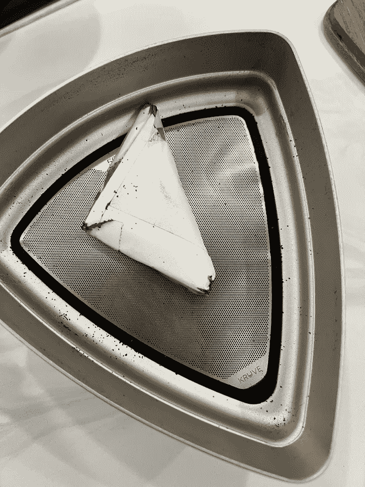
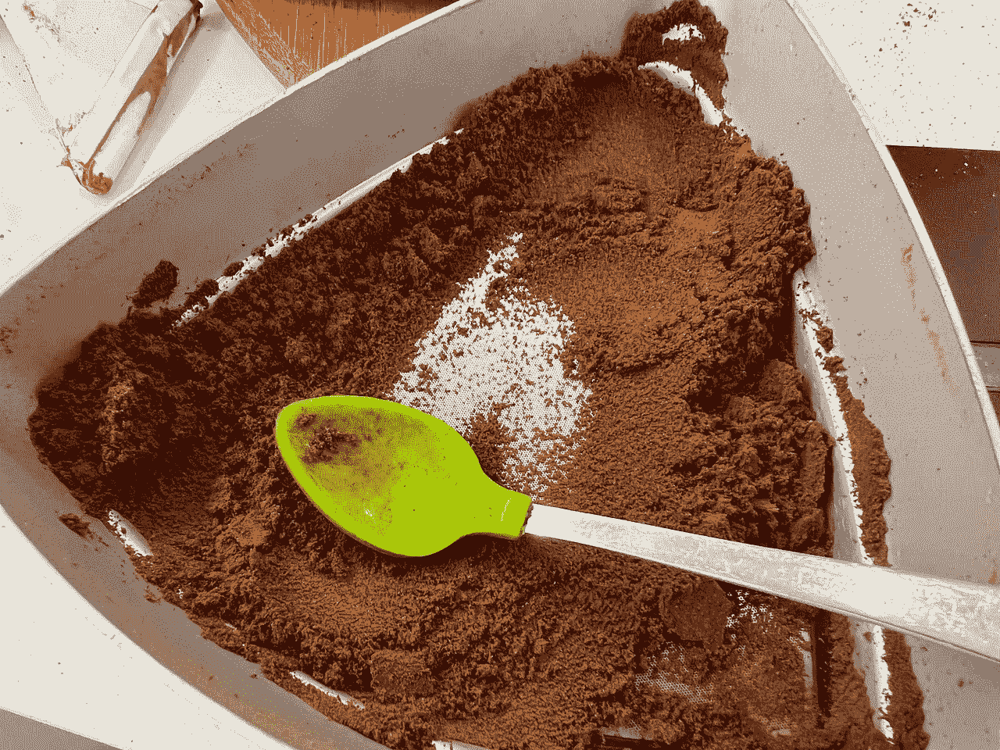
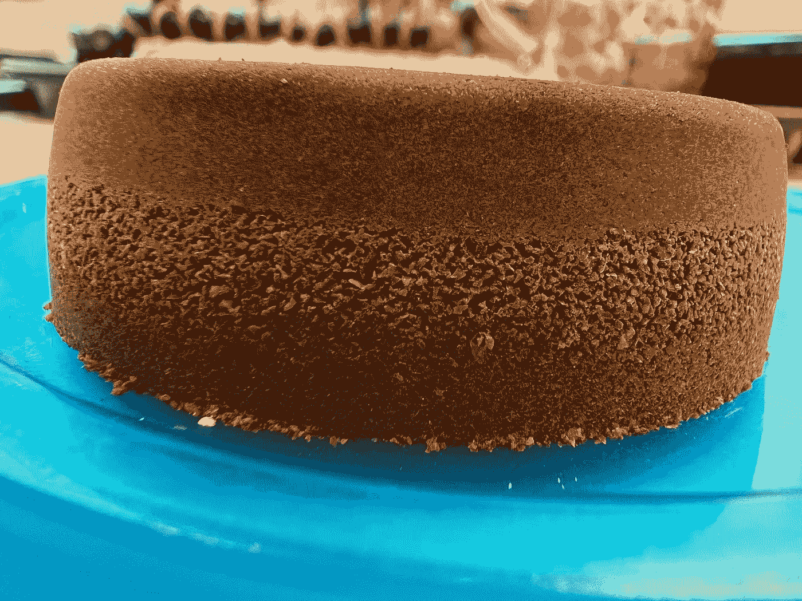
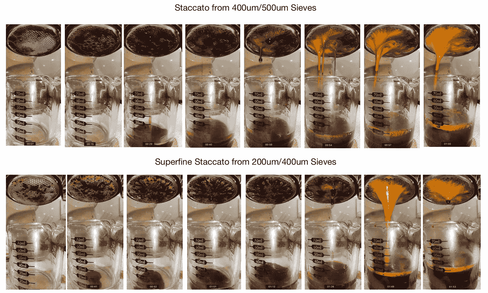
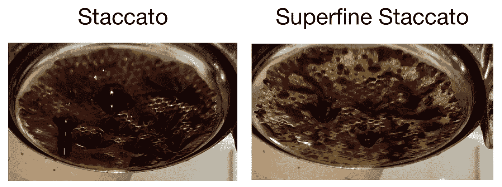
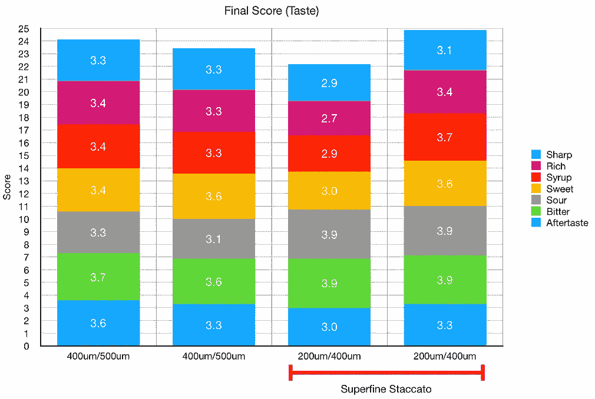
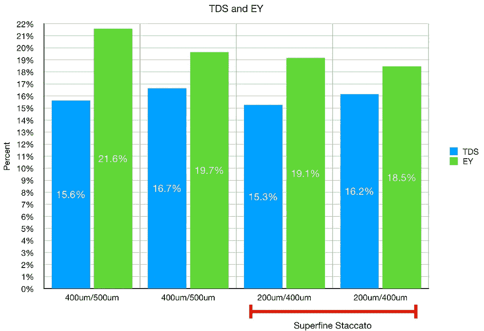
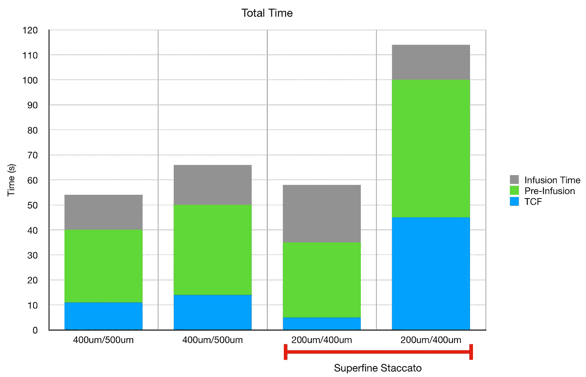

# 特级断续浓缩咖啡

> 原文：<https://towardsdatascience.com/superfine-staccato-espresso-46dca7316222?source=collection_archive---------8----------------------->

## 咖啡数据科学

## 向月亮射击

意式浓缩咖啡开启了一个充满可能性的世界。分层喷射能够研磨得更细，而不会产生大的沟流。我想把这个概念发挥到极致，并在利基零上设置为 0。

最初的断奏是筛过的咖啡，然后分层。我开始在利基市场上设置 8 到 14 之间的研磨值。然后我用了两个筛网:400 微米和 500 微米。然后这些被适当地排序:

底部:<400um (~40% of the grounds)

Middle: >500 微米(约占地面的 30%)

顶部:介于 400 微米和 500 微米之间(约占地面的 30%)

所有图片由作者提供

为了达到超细，我使用了 200 微米和 400 微米的屏幕。洞的大小差别相当大。筛孔的面积是直径的平方函数。因此，200 微米屏幕的孔只有 400 微米屏幕的 1/4 大小，这使它的难度达到了一个新的水平。

左图:搅拌器原型，右图:勺子

搅拌器加快了 400 微米筛的研磨速度，但这对 200 微米筛没有太大帮助。让粉末通过 200 微米筛的唯一方法是用勺子或抹刀将它们推过。筛选 400 微米的筛网需要大约 4 分钟，使用勺子筛选 200 微米的筛网需要 15 分钟。

我喜欢克鲁夫筛，但需要更多关注的是小范围。筛子的厚度为 200 微米，所以当直径达到 200 微米时，通过筛子的距离比更大的筛子大得多。

**然后**我分层使用<200 微米在底部，>400 微米在中间，200 微米和 400 微米之间在顶部。我不得不非常轻地夯实，用天平称只有 200 克或 300 克。然后我就用了很长时间的预输液来减少通灵的机会。

击球后冰球的倒置视图

# 绩效指标

我使用两个指标来评估技术之间的差异:最终得分和咖啡萃取。

[**最终得分**](https://towardsdatascience.com/@rmckeon/coffee-data-sheet-d95fd241e7f6) 是评分卡上 7 个指标(尖锐、浓郁、糖浆、甜味、酸味、苦味和余味)的平均值。当然，这些分数是主观的，但它们符合我的口味，帮助我提高了我的拍摄水平。分数有一些变化。我的目标是保持每个指标的一致性，但有时粒度很难确定。

**用折射仪测量总溶解固体量(TDS)，这个数字结合弹丸的输出重量和咖啡的输入重量用来确定提取到杯中的咖啡的百分比，称为**提取率(EY)** 。**

# **设备/技术**

**浓缩咖啡机:[金特快](/taxonomy-of-lever-espresso-machines-f32d111688f1)**

**咖啡研磨机:[小生零](/rok-beats-niche-zero-part-1-7957ec49840d)**

**咖啡:[家庭烘焙咖啡](https://rmckeon.medium.com/coffee-roasting-splash-page-780b0c3242ea)，中杯(第一口+ 1 分钟)**

**镜头准备:[筛选断奏](https://medium.com/overthinking-life/staccato-espresso-leveling-up-espresso-70b68144f94)**

**输液:[压力脉动](/pressure-pulsing-for-better-espresso-62f09362211d)**

**[过滤篮](/espresso-filter-comparison-pesado-vs-vst-18a1321e62d) : 20g VST**

**其他设备:Atago TDS 计、 [Acaia Pyxis](/data-review-acaia-scale-pyxis-for-espresso-457782bafa5d) 秤**

# **看着视频**

**我会记录我所有的镜头，所以让我们来看看镜头是什么样子的:**

****

**我用了更长时间的预灌注来进行超细注射。主要区别在于预输注的开始。超细的好像一开始就把油挤出来了。看起来没什么意思。**

****

# **投篮表现**

**我拉了两个正常的断奏镜头和两个超细镜头。在味道方面，超细镜头的味道评分相似，但味道不同。提取了不同的东西。我不认为它一定更好，但肯定是不同的。**

********

**在提取方面，他们也有相似的提取。仅仅因为你走得更细并不意味着你的提取上升，但是我也能够避免主要的通灵。**

**拍摄时间非常不同。我考虑到最后一针的预输注时间较长，因为它的流速较慢。我的目标是拍出最好的照片。**

****

**TCF 是时候盖上过滤器了**

**总的来说，我真的很高兴我花时间拍了这些照片。我知道很多人只想在早上喝咖啡，但我想获得一些知识。我想把它推到极限。当然，这个超精细的断奏镜头并不实用，但很有趣。**

**如果你愿意，可以在推特、 [YouTube](https://m.youtube.com/channel/UClgcmAtBMTmVVGANjtntXTw?source=post_page---------------------------) 和 [Instagram](https://www.instagram.com/espressofun/) 上关注我，我会在那里发布不同机器上的浓缩咖啡照片和浓缩咖啡相关的视频。你也可以在 [LinkedIn](https://www.linkedin.com/in/robert-mckeon-aloe-01581595?source=post_page---------------------------) 上找到我。也可以关注我在[中](https://towardsdatascience.com/@rmckeon/follow)和[订阅](https://rmckeon.medium.com/subscribe)。**

# **[我的进一步阅读](https://rmckeon.medium.com/story-collection-splash-page-e15025710347):**

**[我未来的书](https://www.kickstarter.com/projects/espressofun/engineering-better-espresso-data-driven-coffee)**

**[浓缩咖啡系列文章](https://rmckeon.medium.com/a-collection-of-espresso-articles-de8a3abf9917?postPublishedType=repub)**

**[工作和学校故事集](https://rmckeon.medium.com/a-collection-of-work-and-school-stories-6b7ca5a58318?source=your_stories_page-------------------------------------)**

**个人故事和关注点**

**[乐高故事启动页面](https://rmckeon.medium.com/lego-story-splash-page-b91ba4f56bc7?source=your_stories_page-------------------------------------)**

**[摄影飞溅页面](https://rmckeon.medium.com/photography-splash-page-fe93297abc06?source=your_stories_page-------------------------------------)**

**[使用图像处理测量咖啡研磨颗粒分布](https://link.medium.com/9Az9gAfWXdb)**

**[改进浓缩咖啡](https://rmckeon.medium.com/improving-espresso-splash-page-576c70e64d0d?source=your_stories_page-------------------------------------)**

**[断奏生活方式概述](https://rmckeon.medium.com/a-summary-of-the-staccato-lifestyle-dd1dc6d4b861?source=your_stories_page-------------------------------------)**

**[测量咖啡磨粒分布](https://rmckeon.medium.com/measuring-coffee-grind-distribution-d37a39ffc215?source=your_stories_page-------------------------------------)**

**[咖啡萃取](https://rmckeon.medium.com/coffee-extraction-splash-page-3e568df003ac?source=your_stories_page-------------------------------------)**

**[咖啡烘焙](https://rmckeon.medium.com/coffee-roasting-splash-page-780b0c3242ea?source=your_stories_page-------------------------------------)**

**[咖啡豆](https://rmckeon.medium.com/coffee-beans-splash-page-e52e1993274f?source=your_stories_page-------------------------------------)**

**[浓缩咖啡用纸质过滤器](https://rmckeon.medium.com/paper-filters-for-espresso-splash-page-f55fc553e98?source=your_stories_page-------------------------------------)**

**[浓缩咖啡篮及相关主题](https://rmckeon.medium.com/espresso-baskets-and-related-topics-splash-page-ff10f690a738?source=your_stories_page-------------------------------------)**

**[意式咖啡观点](https://rmckeon.medium.com/espresso-opinions-splash-page-5a89856d74da?source=your_stories_page-------------------------------------)**

**[透明 Portafilter 实验](https://rmckeon.medium.com/transparent-portafilter-experiments-splash-page-8fd3ae3a286d?source=your_stories_page-------------------------------------)**

**[杠杆机维护](https://rmckeon.medium.com/lever-machine-maintenance-splash-page-72c1e3102ff?source=your_stories_page-------------------------------------)**

**[咖啡评论和想法](https://rmckeon.medium.com/coffee-reviews-and-thoughts-splash-page-ca6840eb04f7?source=your_stories_page-------------------------------------)**

**[咖啡实验](https://rmckeon.medium.com/coffee-experiments-splash-page-671a77ba4d42?source=your_stories_page-------------------------------------)**