# 强力胶——血统、数据可观察性和数据管道之旅

> 原文：<https://towardsdatascience.com/superglue-journey-of-lineage-data-observability-data-pipelines-23ffb2990b30?source=collection_archive---------13----------------------->

## 使用自助式数据平台工具实现数据民主化

图片来自 shutterstock

数据在商业决策、人工智能/人工智能、产品进化等方面发挥着至关重要的作用。及时性、准确性和可靠性是每个组织的关键基础数据要求。对于数据驱动型组织，让数据工程师、分析师和数据科学家等用户能够轻松地发现、探索、处理、管理和使用数据非常重要。这需要在为数据用户构建数据民主化平台工具方面进行大量投资。

我们在 Intuit 的数据民主化之旅始于两个目标:

1)减少用户在构建数据管道上花费的时间(构建时间)

2)减少用户花费在检测/解决数据问题上的时间(调试时间)

我们在 **Intuit** 建立了**强力胶**来帮助用户建立、管理和监控数据管道。我将在这篇博客中介绍强力胶的四个核心方面——**血统、可观察性、管道和个性化**。如果你是数据领导者、架构师或平台工程师，这篇博客将帮助你学习大规模构建谱系的模式，以及如何借助谱系监控数据和管道。在我们深入探讨之前，让我提供一些背景知识。

# **数 Pb 的多样化数据、成千上万的工作和多层依赖关系**

Intuit 从其产品、应用程序和第三方收集了数 Pb 的各种数据。成千上万的 Hive、Spark 和大规模并行处理(MPP)作业每天都使用这些数据集来生成数百份报告，提供运营和业务见解。类似地，ML 工作流使用这些数据集进行特征工程和模型训练。

使用由多个团队拥有和管理的框架，通过多个摄取、处理和分析层生成见解或功能。例如，一个关键报告依赖于来自 18 个不同数据源的数据，这些数据经过 20 多级处理。

鉴于这种规模和复杂性，当存在度量不准确时(如下所示)，确定根本原因变得极具挑战性。

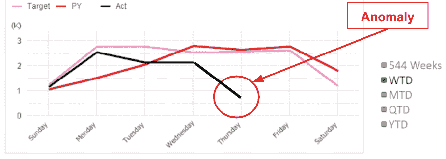

用户会花费几个小时，有时甚至几天去寻找问题的根源。此外，导致此类数据问题的原因可能有很多。

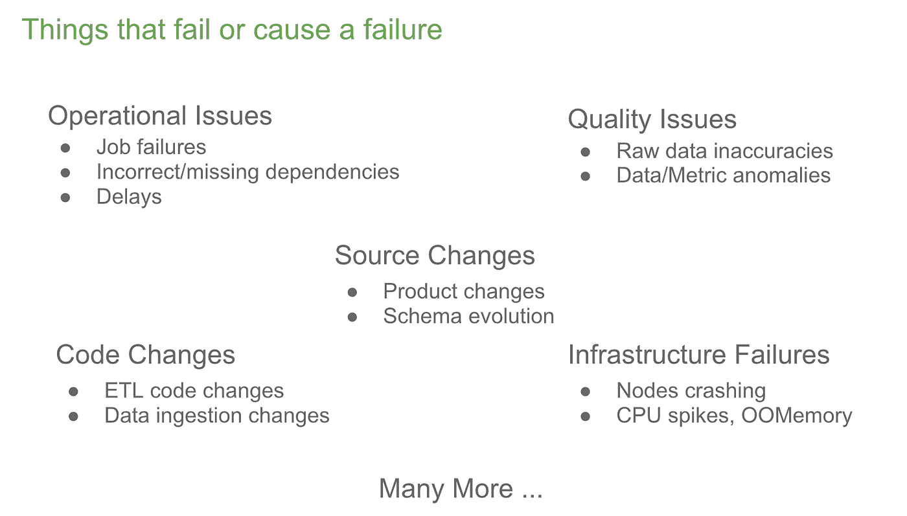

当报告问题时，您从哪里开始寻找故障？您看到的是数百个用户拥有的数千个正在运行的作业。这些工作使用成千上万的表，这些表通过多个团队拥有的许多框架进行处理。这就是 Superglue 的自助式调试体验(构建在沿袭和可观察性的基础上)发挥作用的地方，它有助于检测数据问题的根本原因。

# 血统

为了找到上游数据管道中可能出现的故障的根本原因，我们必须首先了解端到端的沿袭。企业调度程序为我们提供了用户在调度作业时指定的依赖关系。有趣的是，90%的分析作业是在没有任何作业依赖性的情况下安排的。因此，任何上游延迟或故障都不会阻止下游作业运行；这些工作仍然继续进行，并导致了操作问题、指标不一致和数据漏洞。

我们确定需要在 Git 中基于源代码为运行 Hive、Spark 和 MPP 工作负载的数据处理和数据移动框架构建沿袭跟踪。我们使用开源和定制的 SQL 解析器来导出作业、脚本和输入/输出表之间的关系。对 BI 报告和自主开发的数据移动框架进行类似的解析，以找到相关的表。

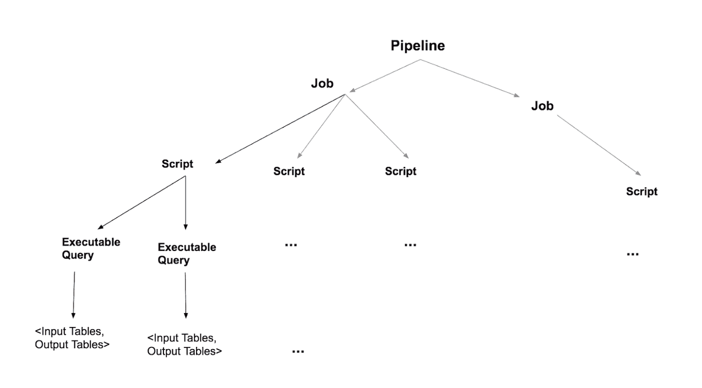

使用这些元数据，我们“粘合”了端到端的沿袭，其中包括三个关键的实体类型:作业、表和报告(也称为仪表板)。用户可以搜索这些实体并进入他们的沿袭视图。

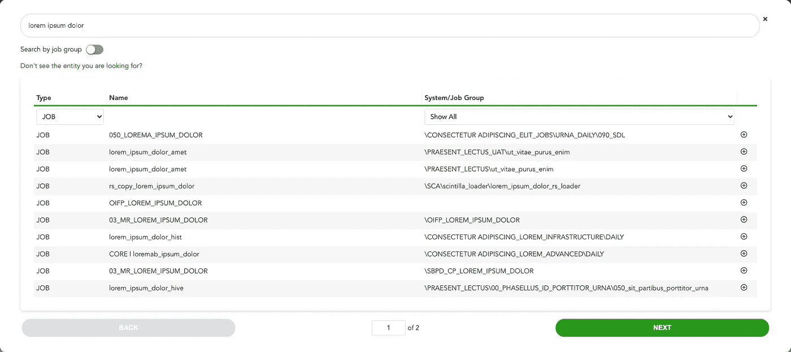

用户可以搜索表、作业或报告

以下是从搜索页面中选择的作业的表沿袭示例。作业用椭圆形表示，表用矩形表示。作业的颜色表示作业是失败(红色)、成功完成(绿色)还是处于活动状态(浅绿色)。

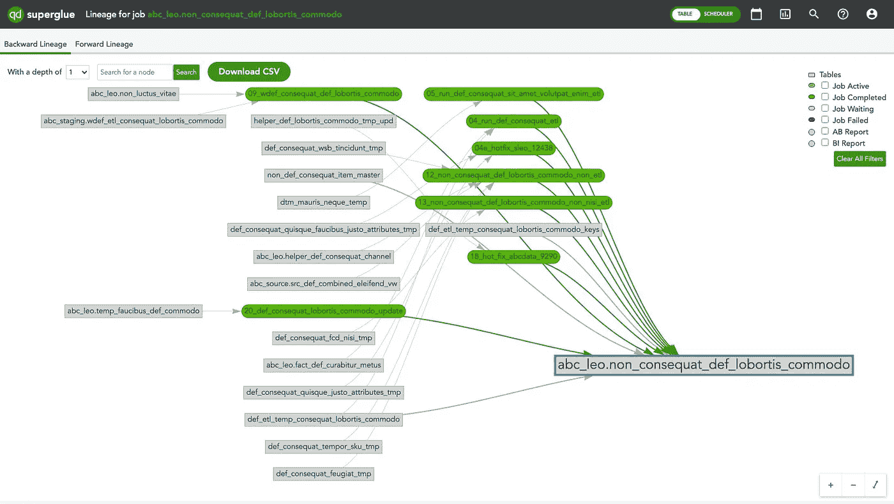

表谱系

这是基于企业调度程序中用户指定的作业相关性的同一作业的调度程序沿袭。

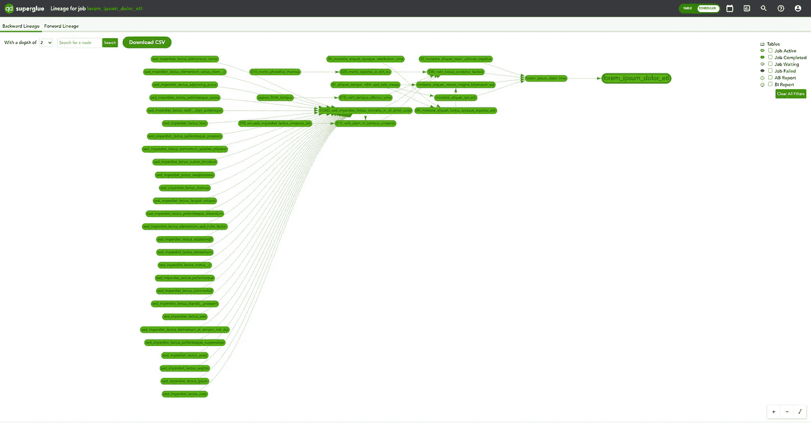

调度程序沿袭

这是一个报告的谱系示例，用圆圈表示。

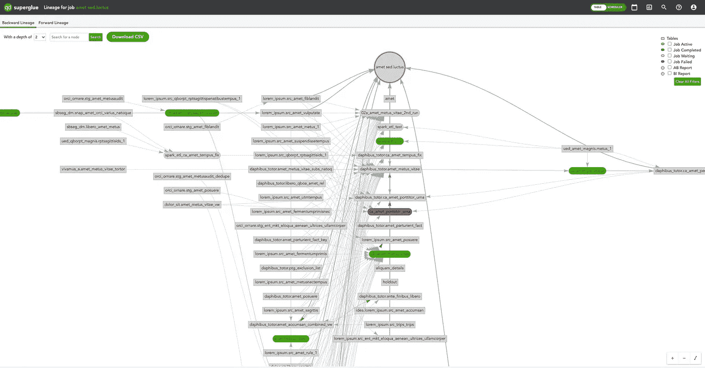

报告沿袭

**依赖推荐**

有了基于源代码的表沿袭和基于企业调度器中指定的依赖关系的作业沿袭，我们就可以了解哪些表提供给哪些作业，哪些表由哪些作业生成，以及哪些作业依赖于哪些其他作业。这帮助我们在 Superglue 中将依赖推荐构建为一个特性。使用此功能，我们能够查明缺少的作业依赖关系。这就像说— *“这个作业依赖于这两个表，这两个表是从另外两个作业创建的，但是你没有将另外两个作业指定为依赖项。请将它们作为依赖项添加到计划程序中。*

**血统 API**

除了向后沿袭，我们还提供了向前沿袭。前向沿袭有助于需要评估源和模式更改对下游管道和/或报表的影响的用例。沿袭 API 使得工程自动化能够检测这些变化的影响。

当我们将数以千计的分析管道、表格和报告迁移到公共云中时，沿袭 API 和数据质量框架也发挥了关键作用。使用前向沿袭 API，当原始源数据在云中就绪时，我们能够检测哪些管道和报告可以被测试。类似地，当我们在迁移期间在云报告中发现度量问题时，我们可以使用向后沿袭 API 来识别原始表中数据问题的来源。

# 数据可观察性

我们的下一步是为用户构建调试体验，目标是将平均检测时间和平均恢复数据时间从几小时减少到几分钟(调试时间指标)。以沿袭为基础，我们覆盖了以下特性以实现数据的可观察性

*   作业执行统计和日志:与调度程序集成以捕获开始时间、结束时间、运行时间、执行尝试、失败、日志和作业依赖性
*   Table stats:与定制数据接收框架和大规模并行处理(MPP)平台集成，以捕获行数和表大小。在某些情况下，我们能够利用 MPP 系统表来获得丰富的表/列分析统计数据。
*   报告统计:与商业智能(BI)工具集成，以捕获报告 SQL、执行统计和刷新日志
*   变更跟踪细节:与 Git 集成以捕获对 Hive、Spark 和 MPP 作业的变更

启用这些功能可以作为沿袭和调试的单一平台。下面是一个作业详细信息页面的示例，当单击沿袭画布上的作业时会出现该页面。

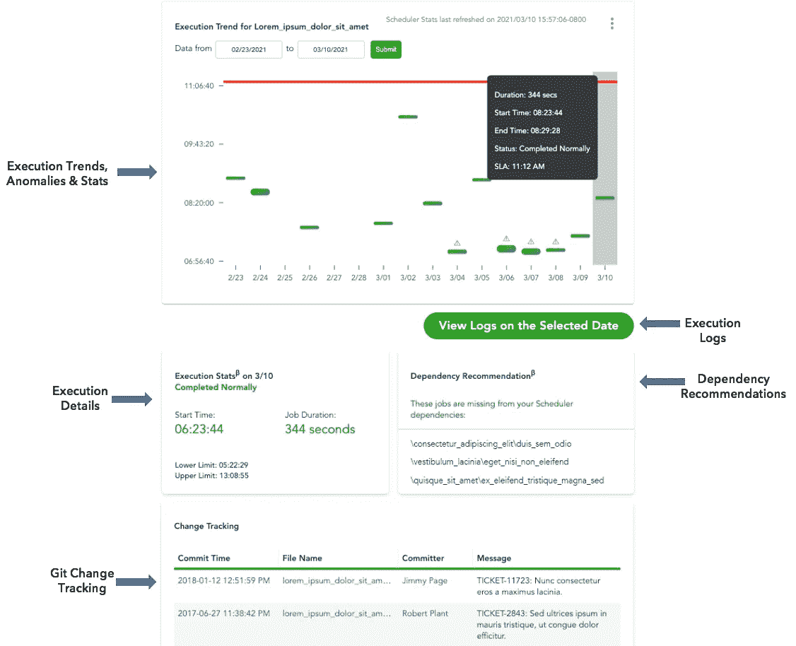

作业统计页面

类似的详细信息/视图也可用于表格和报告。

**异常现象**

有了作业统计数据和表统计数据，我们就能够添加异常检测，主动检测异常作业运行(如下例)和表中的数据变化。我们还引入了针对异常的警报订阅/通知，以及针对失败和延迟运行的警报(更多详细信息请参见下面的个性化部分)。

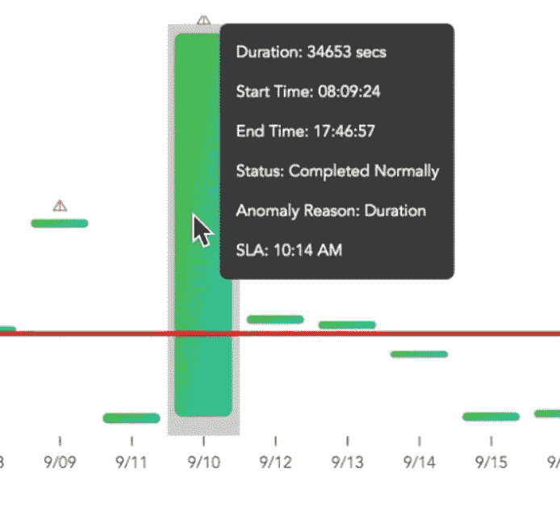

**工作 ETA 服务**

我们引入的另一个重要功能是 ETA 服务。有了沿袭和作业执行统计数据(开始时间、结束时间、持续时间)，它使我们能够主动估计 SLA 绑定作业的预计到达时间。我们将这个特性称为 ETA 服务，它与 Slack 集成在一起，为高度关键的管道提供频繁的 ETA(如下例)。

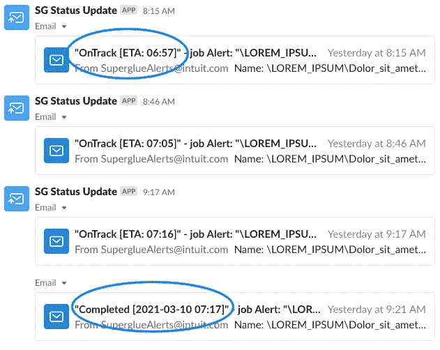

# 数据管道

改进了调试时间指标后，我们的下一个目标是将用户构建和测试管道的时间从几小时减少到几分钟(构建时间指标)。我们实现数据管道的目标是多方面的:

*   构建简化的用户体验
*   提供现成的沿袭和数据可观察性
*   通过 QuickETL 在 Spark 运行时支持数据处理，quick ETL 是一个自行开发的配置驱动框架，用于定义和执行 Spark ETL 工作流。它提供了依赖关系链、查询级别度量、监控，以及在工作流的每个步骤之前和之后应用断路器的能力。丰富的管道定义语法以快速、一致的方式定义转换逻辑和依赖关系。
*   从数据分析师手中抽象出数据工程的复杂性。这包括设置沙盒环境以支持管道可测试性。
*   支持从数据湖到 MPP 平台的数据移动，MPP 平台用作 BI 的数据服务层
*   与 BI 工具集成，使报告刷新成为管道的一部分
*   通过与企业调度程序集成，改善用户的调度和编排体验

这使用户能够构建数据管道来运行 Hive & Spark 数据处理作业，将数据移动到 MPP 平台，刷新 BI 报告，以及在沙盒环境中测试这些管道，并在调度程序上对它们进行调度。一旦管道建立并安排好，用户就可以使用 Superglue 的数据观察能力来管理他们的日常数据操作。

以下是管道开发流程的一些快照:

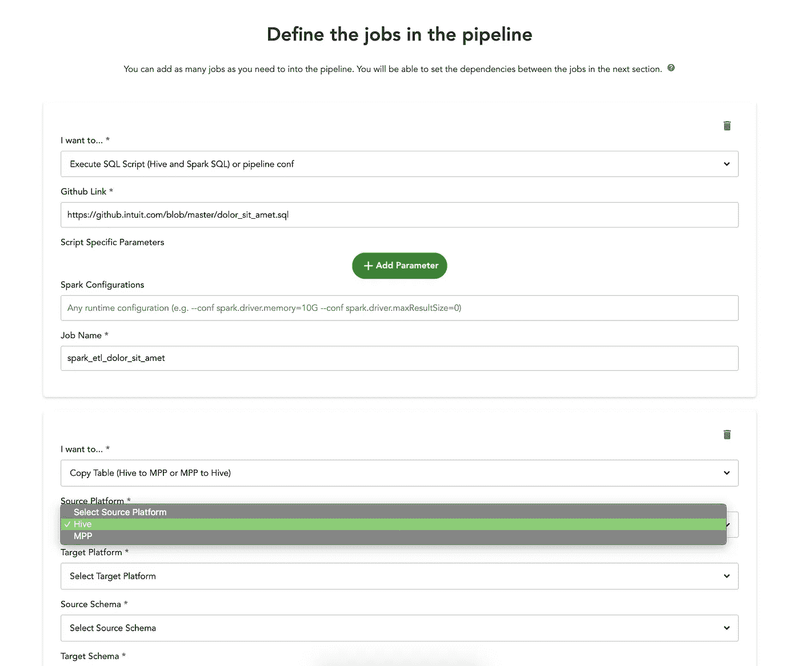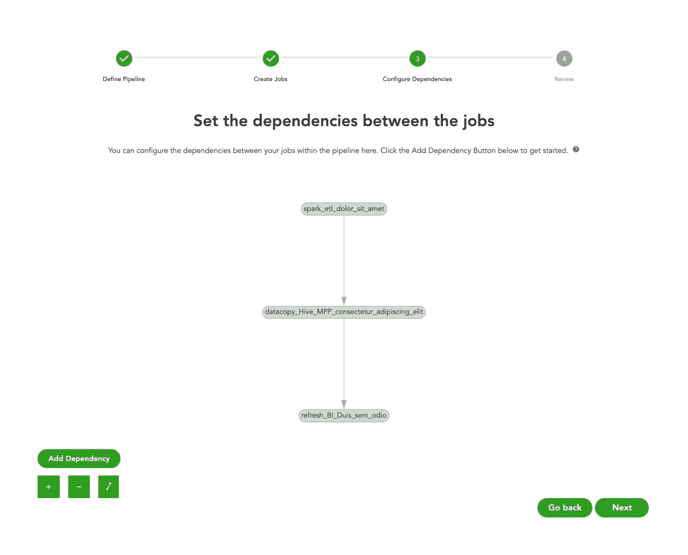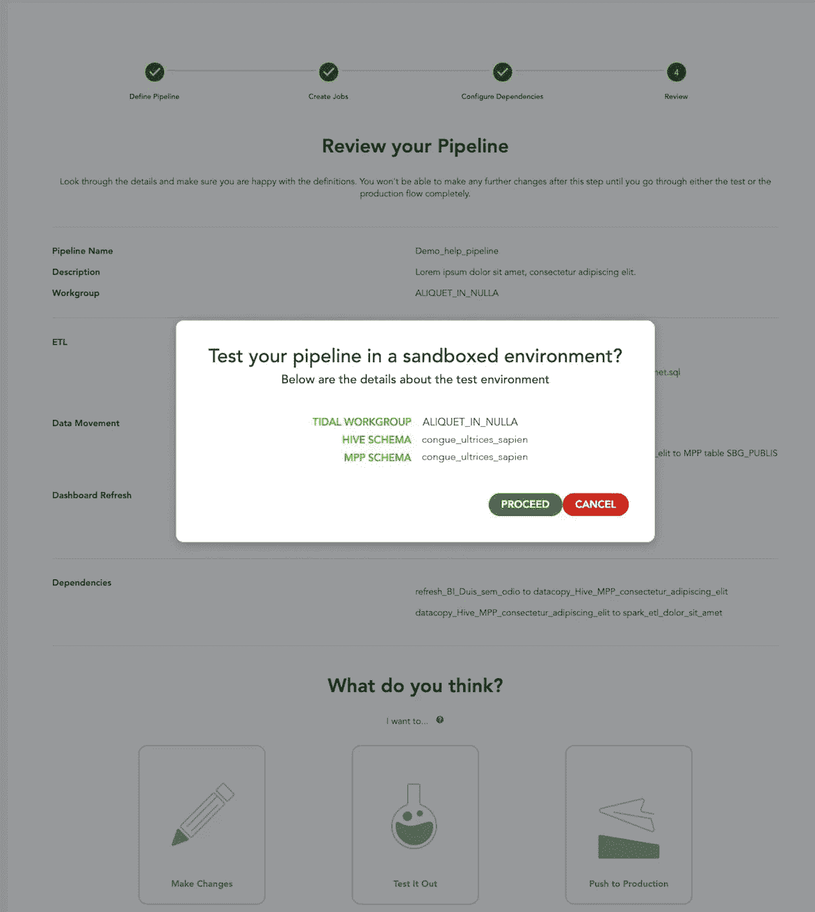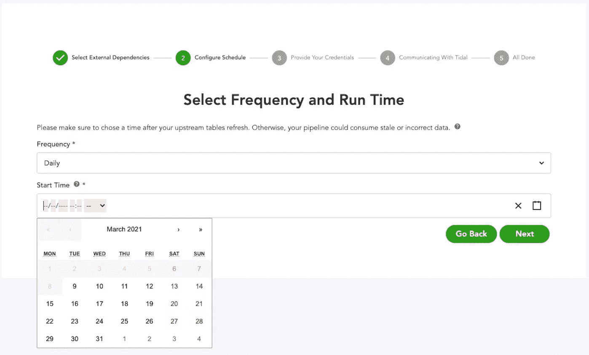

以上流水线步骤用于展示一个例子。在现实生活中，您可以想象在一个管道中有多种类型的数据处理、数据移动和/或报告刷新步骤。下图显示了创建的管道，其中包含编辑管道、重新运行管道、查看执行日志和查看沿袭的控件。

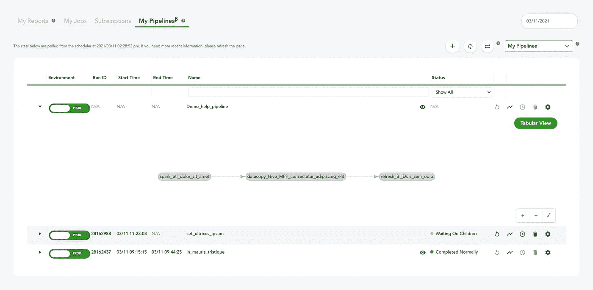

我的管道页面

# 个性化

启用管道以及沿袭和可观察性将 Superglue 转变为一个平台工具，用于构建、管理和监控分析管道。

有 250 多名用户使用不同的旅行地图和角色，我们提供个性化的体验变得非常重要。事实上，个性化是由我们用户群的输入驱动的。我们想让用户轻松登陆强力胶，从对他们来说最重要的事情开始他们的旅程。下面是我们介绍的几个功能

*   已启用 SSO 身份验证
*   添加了个性化视图—我的报告、我的管道、我的工作和我的[提醒]订阅
*   使用来自人力资源系统的数据启用组织层次结构，并引入组织级工件和指标
*   支持管道共享性和可转移性
*   添加了针对故障、延迟和异常的简易警报订阅(包括订阅他人拥有的资产)
*   在产品中添加了视频教程、常见问题解答和入职页面的自助功能

以下是“我的报告”登录页面的快照示例

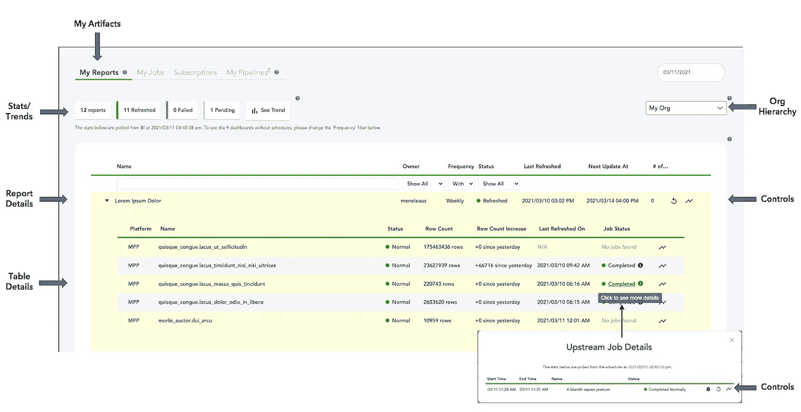

我的报告页面

# 开放源码

Superglue 的一部分包括 SQL 解析器、表格沿袭和 UI/搜索功能，在 https://github.com/intuit/superglue[开源。它会给你一个良好的开端去衍生、坚持和视觉化血统。如果你对强力胶感兴趣，请查看我们的](https://github.com/intuit/superglue)[投稿指南](https://github.com/intuit/superglue/blob/master/.github/CONTRIBUTING.md)。

# 下一步是什么

在过去的几年里，我们一直在研究强力胶，我们在 Intuit 的业务部门和职能部门中实现数据民主化的旅程仍在继续。我们正致力于通过增加可测试性、可调试性和支持多处理运行时的特性来为高级用户提供强力胶。

# 组

在 Intuit Data Engineering leadership 的支持下，Anand Elluru、Shradha Ambekar、Sooji Son、周扬、Rama Arvabhumi、Veena Bitra 和 Sunil Goplani 等团队实现了这一美妙的旅程。