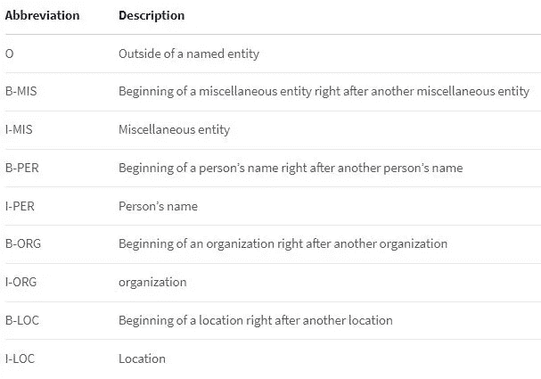

# 使用预建的 Google BERT 进行高级人名识别

> 原文：<https://towardsdatascience.com/superior-person-name-recognition-with-pre-built-google-bert-e6215186eae0?source=collection_archive---------7----------------------->

## 当基地需要电梯时

照片由[布雷特·乔丹](https://unsplash.com/@brett_jordan?utm_source=medium&utm_medium=referral)在 [Unsplash](https://unsplash.com?utm_source=medium&utm_medium=referral) 拍摄

使用 spaCy 进行命名实体识别效果很好，但并不是在所有情况下都是如此，尤其是涉及人名时。然而，由于[拥抱脸](https://huggingface.co/)，你可以作为一名 ML 工程师(而不是作为一名数据科学家)使用谷歌伯特模型，轻松提高个人 NER 准确性。

**免责声明** : spaCy 可以结合类似于我将要描述的技术，所以不要把 spaCy 排除在外，这篇文章只是结合该技术的一种替代方法。

## 伯特和拥抱脸上的几个字

拥抱脸将自己描述为一个社区，在这里我们可以“构建、训练和部署由自然语言处理中的参考开源提供支持的最先进的模型。”

这是一个构建模型或使用其他人构建的模型的地方——这最后一点尤其重要。

Google BERT(来自变压器的双向编码器表示)是 Google 为 NLP 创造的技术，没有被它的工作方式所干扰。[看看这件由伯特建筑师事务所创作的作品，它深入探究了伯特是如何工作的](https://ai.googleblog.com/2018/11/open-sourcing-bert-state-of-art-pre.html)。简而言之，使用 Google BERT 构建的模型运行良好。是的，我知道，这是一个荒谬的过度简化，但这篇文章是关于使用 BERT，而不是创建基于 BERT 的模型。

## 具有空间结果的样本

下面是一个为循环抛出(基)空间的名称列表:

`names_string = “Hi there Jon Jones Jon Jones Jr. Jon Paul Jones John D. Jones”`

下面是一些 Python 代码，使用 spaCy 的基本 NER 和那个名字列表。

结果是:

这并不可怕，但如果你需要它变得伟大，它将功亏一篑。

另一个选择是使用 transformers Python 包，它(多亏了拥抱脸)可以让你访问包括 Google BERT 在内的模型。

## `transformers` Python 包

变形金刚包装是使用拥抱脸模型的关键部分。安装可能有点复杂，这取决于你是否已经安装了 PyTorch 和/或 TensorFlow。在我的一台计算机上，我已经安装了 TensorFlow，我所需要做的(运行我的示例，它可能不完全适合您的情况)就是运行:

`pip install transformers[torch]`

我通过在命令行输入以下命令打开 interactive Python 来验证我的安装:

发生了几件重要的事情:

1.  情感分析模型是从拥抱脸自动下载的(这很重要)。
2.  我从第二行代码中得到以下结果:

`[{‘label’: ‘POSITIVE’, ‘score’: 0.9998704791069031}]`

模型结果是这样返回的(至少对于我尝试过的所有 NLP 模型是这样):一个字典列表。好的，很好。是时候说出人名了。

## NER 谷歌伯特模型

有几个关于拥抱脸的模型用于命名实体识别(NER)。我只关注其中一个——它被称为`dslim/bert-large-NER.`。使用它，你所需要的(除了安装之外)就是如下代码。

导入引入了一些助手对象，用于随管道引入模型。`pipeline`允许我指定从拥抱脸中引入什么模型。

执行前三行代码时，会自动从 Hugging Face 下载几个文件(如果您有防火墙限制，可以手动下载这些文件——如果需要，可以留下评论)。**重要提示**:BERT 型号为 1.3GB，下载需要一点时间。虽然您只下载一次，但是即使在下载之后，也总是需要 4-6 秒来实例化模型(您可能想要找出一种方法来将模型保存在内存中)。

`pipeline`设置模型以供使用，并返回一个对象，即您的“nlp”引擎。请注意，我给了对象一个字符串，我想为它获取命名实体。就像情感分析的简单例子一样，`nlp`对象返回一个字典列表，只是这个更大。

`[{‘entity’: ‘B-PER’, ‘score’: 0.99802744, ‘index’: 3, ‘word’: ‘Jon’, ‘start’: 9, ‘end’: 12}, {‘entity’: ‘I-PER’, ‘score’: 0.9969795, ‘index’: 4, ‘word’: ‘Jones’, ‘start’: 13, ‘end’: 18}, {‘entity’: ‘B-PER’, ‘score’: 0.99703735, ‘index’: 5, ‘word’: ‘Jon’, ‘start’: 19, ‘end’: 22}, {‘entity’: ‘I-PER’, ‘score’: 0.99666214, ‘index’: 6, ‘word’: ‘Jones’, ‘start’: 23, ‘end’: 28}, {‘entity’: ‘I-PER’, ‘score’: 0.8733999, ‘index’: 7, ‘word’: ‘Jr’, ‘start’: 29, ‘end’: 31}, {‘entity’: ‘B-PER’, ‘score’: 0.9935467, ‘index’: 9, ‘word’: ‘Jon’, ‘start’: 33, ‘end’: 36}, {‘entity’: ‘I-PER’, ‘score’: 0.9749524, ‘index’: 10, ‘word’: ‘Paul’, ‘start’: 37, ‘end’: 41}, {‘entity’: ‘I-PER’, ‘score’: 0.9960336, ‘index’: 11, ‘word’: ‘Jones’, ‘start’: 42, ‘end’: 47}, {‘entity’: ‘B-PER’, ‘score’: 0.9971614, ‘index’: 12, ‘word’: ‘John’, ‘start’: 48, ‘end’: 52}, {‘entity’: ‘I-PER’, ‘score’: 0.9858689, ‘index’: 13, ‘word’: ‘D’, ‘start’: 53, ‘end’: 54}, {‘entity’: ‘I-PER’, ‘score’: 0.4625939, ‘index’: 14, ‘word’: ‘.’, ‘start’: 54, ‘end’: 55}, {‘entity’: ‘I-PER’, ‘score’: 0.9968941, ‘index’: 15, ‘word’: ‘Jones’, ‘start’: 56, ‘end’: 61}]`

## 这是件大事

对我来说，这个 BERT 模型的特别之处在于`B-PER` `entity`。根据文档，BERT 模型可以识别几种不同类型的实体:

图片作者来自[https://huggingface.co/dslim/bert-base-NER](https://huggingface.co/dslim/bert-base-NER)

对 B-PER 的描述有一点误导，因为 B-PER 不仅是另一个人名字之后的一个人名字的开头，它还是第一个人名字中的第一个名字。这里非常重要的一点是，B-PER 是名称列表中每个名称的分隔符。(同样的概念也适用于其他实体类型，这同样很有价值。)

请允许我剖析一下伯特的名单和 NER 实体。

作者图片

太棒了。每个实际的名字都是一个`B-PER`实体。然后我需要做的就是通过遍历字典将这些名字组合在一起。

输出并不完全是我想要的(很快就会变得更有意义)，但是很接近:

`[[[‘Jon’, ‘Jones’]], [[‘Jon’, ‘Jones’, ‘Jr’]], [[‘Jon’, ‘Paul’, ‘Jones’]], [[‘John’, ‘D’, ‘.’, ‘Jones’]]]`

我可以加入这些，我就完成了，但这并不那么简单(但几乎如此)。

## 不寻常名字的奇怪结果

我见过的“奇怪”的事情之一(即，我不知道它为什么这样做，但可能有一个完全合乎逻辑的原因)是从 BERT 返回的一个字典条目列表，它似乎分解了不常见的名称。就拿我的姓来说吧——纽格鲍尔。

`[{‘entity’: ‘I-PER’, ‘score’: 0.9993844, ‘index’: 2, ‘word’: ’N’, ‘start’: 6, ‘end’: 7}, {‘entity’: ‘I-PER’, ‘score’: 0.99678946, ‘index’: 3, ‘word’: ‘##eu’, ‘start’: 7, ‘end’: 9}, {‘entity’: ‘I-PER’, ‘score’: 0.9744214, ‘index’: 4, ‘word’: ‘##ge’, ‘start’: 9, ‘end’: 11}, {‘entity’: ‘I-PER’, ‘score’: 0.92124516, ‘index’: 5, ‘word’: ‘##ba’, ‘start’: 11, ‘end’: 13}, {‘entity’: ‘I-PER’, ‘score’: 0.82978016, ‘index’: 6, ‘word’: ‘##uer’, ‘start’: 13, ‘end’: 16}]`

伯特似乎把我的名字分解成了碎片，我猜测(没有证据)这是因为变形金刚在伯特体内是如何工作的。不管什么原因，这种情况必须处理，这就是为什么我没有从上一节开始完成我的代码。

这是最后一段代码，它建立在最后一段代码的基础上，没有修改最后一段代码。

这不仅消除了不常见名称的标签，还将文本连接在一起。(句点的替换类似于“John J. Jones”中的标签和交易的替换。)

运行这段代码给了我想要的东西:

`[[‘Jon Jones’], [‘Jon Jones Jr’], [‘Jon Paul Jones’], [‘John D. Jones’]]`

我必须大声承认，当我第一次看到这个 run 时，我震惊地发现所有的名字都是正确的。玩得好谷歌，拥抱脸，和谁建立了伯特的名字模型。打得好。

## 结论和改进

我发现伯特 NER 引擎非常准确，但注意它并不总是*准确，它只是*更准确*。但更直接的说，它标志着好和伟大的区别。*

您可以通过使用分数并保留从 BERT(即 transformers)返回的开始和结束字符串位置来改进我的代码。但是，您可能需要做一些修改:

*   分数应该是由`B-PER`类型分隔的名称序列中每个标记的平均分数
*   开始是一个人序列中`B-PER`的开始，结束是*最后* `I-PER`的结束

我希望你喜欢这个，并有机会与`transformers`一起工作。真的很了不起。我还想尽可能地尊重 spaCy 的好人们，并再次声明，我刚才展示的只是另一种做事方式(这可能会被纳入 spaCy)。

## 参考

[1]HuggingFace.org。(未注明)拥抱脸—*AI 社区构建未来*。https://[huggingface.co/](https://huggingface.co/)

[2]德夫林，雅各布和陈，刘明伟.(2018 年 11 月 2 日。)*开源 BERT:最先进的自然语言处理预培训*。[https://ai . Google blog . com/2018/11/open-sourcing-Bert-state-of-art-pre . html](https://ai.googleblog.com/2018/11/open-sourcing-bert-state-of-art-pre.html)

[3]HuggingFace.org。(未标明) *dslim/bert-base-NER* 。[https://huggingface.co/dslim/bert-base-NER](https://huggingface.co/dslim/bert-base-NER)