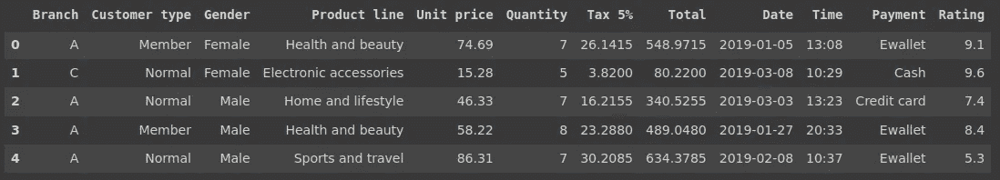
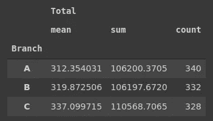
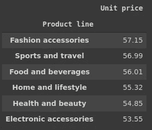
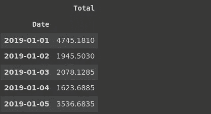
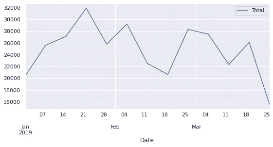
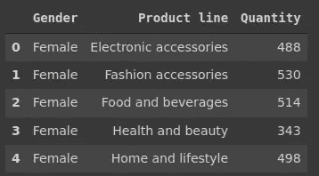
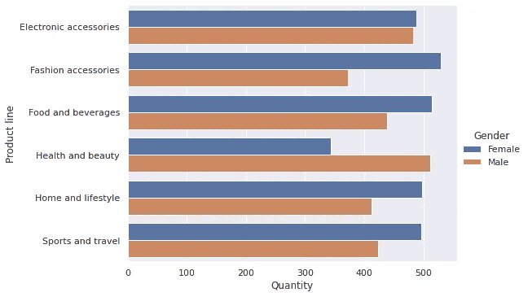
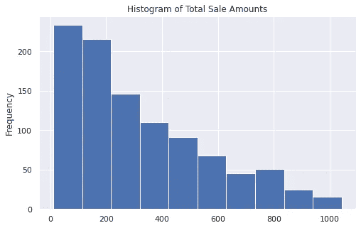

# 熊猫超市数据分析

> 原文：<https://towardsdatascience.com/supermarket-data-analysis-with-pandas-e4991f3e0a9?source=collection_archive---------14----------------------->

## 熊猫综合实用指南


Photo by [卓倩 李](https://unsplash.com/@unrivaledmarijuana?utm_source=unsplash&utm_medium=referral&utm_content=creditCopyText) on [Unsplash](https://unsplash.com/s/photos/supermarket?utm_source=unsplash&utm_medium=referral&utm_content=creditCopyText)

Pandas 是 Python 中使用最广泛的数据分析和操作库。其直观和多功能的功能使得数据分析过程高效、简单且易于理解。

在本文中，我们将在 Kaggle 上的超市销售数据集上练习熊猫。它包含一家连锁超市不同分店在 3 个月内的销售数据。

让我们从导入库和读取数据集开始。

```
import numpy as np
import pandas as pddf = pd.read_csv("/content/supermarket.xls", 
parse_dates=['Date'])
```

我们使用 parse_dates 参数存储 datetime 数据类型的 date 列，这样我们就不必在以后转换数据类型。datetime 数据类型允许使用 dt 访问器下特定于日期和时间的函数。

有些列是多余的，与我们的分析无关。

*   发票标识:唯一的发票标识号。不具备任何分析信息。
*   Cogs:单价和数量列的乘积。
*   毛利百分比:由一个值 4.761905 组成。
*   总收入:可以用总计栏乘以 0.04761905(即毛利率百分比)得到。
*   城市:与分支列完全相关。每个城市有一个分支机构。

为了简化数据集，我们删除了这些列。

```
to_drop = ['Invoice ID', 'City','cogs', 'gross margin percentage', 'gross income']df.drop(to_drop, axis=1, inplace=True)df.head()
```



超市数据集(图片由作者提供)

我们应该经常检查数据集中是否有缺失值。

```
df.isna().sum().sum()
0
```

isna 函数返回数据帧，用“True”表示缺少的值。通过链接一个 sum 函数，我们可以得到每一列中缺失值的数量。第二个 sum 函数给出了整个数据帧中缺失值的数量。

我们可能对每个分公司的销售概况感兴趣。可以用 groupby 函数计算每张发票的总销售额和平均销售额。

```
df[['Branch', 'Total']]\
.groupby('Branch').agg(['mean','sum','count'])
```



(图片由作者提供)

每张发票的平均金额在 C 分公司更高。因此，尽管发票数量较少，但该分公司的总销售额高于其他分公司。

我们还可以查看每个产品线中产品的平均单价。让我们也按降序对它们进行排序，以获得更有条理的概述。

```
df[['Product line', 'Unit price']].groupby('Product line').mean()\
.sort_values(by='Unit price', ascending=False).round(2)
```



(图片由作者提供)

时尚配饰位居榜首，但平均单价彼此非常接近。

我们还可以查看这家连锁超市每周销售额的趋势。第一步是按日期对总销售额进行分组。

```
dates = df[['Date','Total']].groupby('Date').sum()dates.head()
```



(图片由作者提供)

日期数据帧包含每日销售额。为了检查每周销售额，我们需要在绘图前重新取样。一个简单的方法是使用重采样函数。

```
dates.resample('7D').sum().plot(figsize=(9,4))
```



周销售额(图片由作者提供)

重采样周期由“7D”指定，表示 7 天。我们还需要一个函数来告诉 pandas 如何在重新采样的周期中聚合值(例如，sum 或 mean)。

我们也来看看女性和男性的产品偏好。一种方法是计算每个产品线中购买的商品总数。我们首先使用 groupby 函数获取数据，然后创建一个条形图进行比较。

```
gender = df[['Gender','Product line','Quantity']]\
.groupby(['Gender','Product line'], as_index=False).sum()gender.head()
```



(图片由作者提供)

我们现在有了每个类别中男性和女性的数量。下一步是绘制它们。

```
import seaborn as sns
sns.set(style='darkgrid')sns.catplot(data=gender, y='Product line', x='Quantity',
            kind='bar', hue='Gender', aspect=1.6, orient='h')
```



(图片由作者提供)

catplot 函数是一个图形级接口，用于生成分类图。绘图类型由 kind 参数定义。

女性购买更多的时尚配饰产品，这是意料之中的。然而，我有点惊讶地看到男性在健康和美容类别中超过了女性。

基于条件筛选数据是数据分析中的典型任务。就如何过滤数据而言，Pandas 非常高效。例如，查询函数接受字符串形式的条件。当然，有一些限制，但它在许多情况下是很方便的。

我们可以使用下面的查询功能过滤总金额大于 300 且数量大于 4 的采购。

```
df.query('Total > 300 and Quantity > 4').shape
(393, 12)
```

有 393 次购买符合这些标准。

变量的分布总是为数据分析提供有价值的见解。例如，我们可以检查总销售额的分布情况。一种方法是绘制直方图，这可以很容易地用熊猫的绘图功能来完成。

```
df.Total.plot(kind='hist', figsize=(8,5), 
              title='Histogram of Total Sale Amounts')
```



(图片由作者提供)

直方图将连续变量的值范围划分为离散的条块，并计算每个条块中数据点(即行)的数量。结果，我们得到了值的分布的概况。

我们还可以根据一天中的时间段来分析销售额。例如，我们可能对发现人们是否倾向于在早上比晚上花费更多感兴趣。

为了有效地使用 pandas 的 dt 访问器下的日期和时间功能，我们应该将 time 列的数据类型转换为 datetime。

```
df.Time = pd.to_datetime(df.Time)
```

hour 方法以字符串形式返回时间的小时。我们需要将其转换为整数以用于过滤。

```
df[df.Time.dt.hour.astype('int') >= 20]['Total'].mean().round(2)
306.26df[df.Time.dt.hour.astype('int') <= 10]['Total'].mean().round(2)
311.10
```

下面详细阐述一下上面我们做了什么。dt 访问器的 hour 方法将小时提取为字符串。我们使用 astype 函数将其转换为整数，并使用它来过滤 20 年后购买的产品。最后的操作是取符合指定条件的购买的平均值。然后我们对 10 点前购买的东西做同样的处理。

## 结论

本文的主要目的是演示各种 pandas 函数，帮助我们分析表格数据。熊猫函数的参数非常重要，因为它们使函数更加强大和通用。因此，了解参数所能达到的效果非常重要。

我喜欢熊猫的一点是，完成一项任务几乎总是有不止一种方法。例如，我们在示例中所做的也可以用不同的方式来完成。事实上，你可以挑战自己用不同的函数做同样的事情。

感谢您的阅读。如果您有任何反馈，请告诉我。