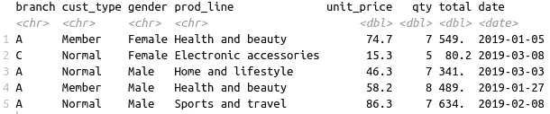
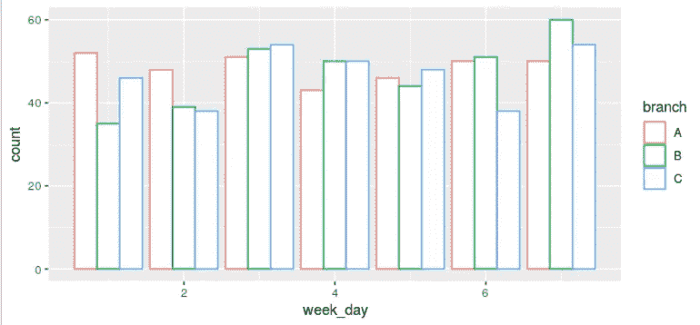
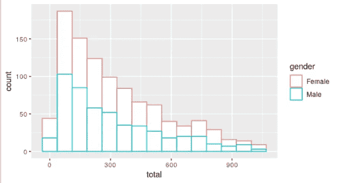

# 基于 R 的超市数据分析

> 原文：<https://towardsdatascience.com/supermarket-data-analysis-with-r-5284be9541c4?source=collection_archive---------18----------------------->

R 数据科学软件包实用指南


Photo by [卓倩 李](https://unsplash.com/@unrivaledmarijuana?utm_source=unsplash&utm_medium=referral&utm_content=creditCopyText) on [Unsplash](https://unsplash.com/s/photos/supermarket?utm_source=unsplash&utm_medium=referral&utm_content=creditCopyText)

在本文中，我们将在 Kaggle 上的超市销售数据集上练习 tidyverse，这是一个用于数据科学的 R 包集合。它包含一家连锁超市不同分店在 3 个月内的销售数据。

我以前曾使用[熊猫](/supermarket-data-analysis-with-pandas-e4991f3e0a9)和 [SQL](/supermarket-data-analysis-with-sql-92c153638ad5) 在同一个数据集上写过文章。我认为学习如何用不同的工具完成给定的任务是一个很好的实践。它让你清楚地看到它们之间的区别和相似之处。此外，它有助于建立一种直觉，了解这些工具的创造者是如何处理特定问题的。

让我们从使用 readr 包的 read_csv 函数读取数据集开始。readr 包是 tidyverse 的一部分，用于读取矩形数据。

```
> library(readr)> supermarket <- read_csv("/home/soner/Downloads/datasets/supermarket.csv")> head(supermarket, 5)
```



超市 tibble(图片由作者提供)

readr 中的表格数据结构称为 tibble。它类似于 Pandas 中的 dataframe 和 SQL 中的 table。

注意:这是 Kaggle 上原始[数据集](https://www.kaggle.com/aungpyaeap/supermarket-sales)的简化版本。我删除了分析中多余的列。

在开始分析之前，我们应该检查一下数据中是否有遗漏的值。is.na 函数可用于查找整个表或特定列中缺失值的数量，如下所示。

```
> sum(is.na(supermarket)) #entire tibble
[1] 0> sum(is.na(supermarket$branch)) #branch column
[1] 0
```

数据中没有缺失值，因此我们可以继续。

对于过滤、选择和探索等数据操作任务，我们将使用 tidyverse 的 dplyr 包。它为有效的数据分析和操作提供了几个功能。

```
> library(dplyr)
```

我们可能想了解每个分公司的销售概况。每个分店的平均销售额和销售数量可以计算如下:

```
> by_total = group_by(supermarket, branch)
> summarise(by_total, avg_total = mean(total), qty = n()) branch    avg_total   qty
  *<chr>*     *<dbl>*       *<int>*
1  A         312\.       340
2  B         320\.       332
3  C         337\.       328
```

在第一行中，观察值(即行)按分支列分组。然后，summarise 函数用于计算每个分支的 total 列的平均值，并计算每个组的观察次数。

C 支既有最高的平均金额，又有最少的销售笔数。

我们还可以查看每个产品线中产品的平均单价。让我们也按降序对它们进行排序，以获得更有条理的概述。我们首先按照 prod_line 列对行进行分组。

```
> by_prod <- group_by(supermarket, prod_line)
```

我们现在可以计算每个类别的平均单价，并根据平均值对结果进行排序。

```
> summarise(by_prod, avg_unitprice = mean(unit_price)) %>%
+ arrange(desc(avg_unitprice)) prod_line               avg_unitprice
  *<chr>*                           *<dbl>*
1 Fashion accessories              57.2
2 Sports and travel                57.0
3 Food and beverages               56.0
4 Home and lifestyle               55.3
5 Health and beauty                54.9
6 Electronic accessories           53.6
```

我们使用“%>%”将两个操作组合在一个管道中。默认情况下，arrange 函数按升序对结果进行排序。我们通过使用 desc 函数来改变这个设置。

时尚配饰位居榜首，但平均单价彼此非常接近。

我们可能想知道分支机构在一周中的某一天是否有更多的销售。让我们首先创建一个包含日期的星期几的列。我们将使用 lubridate 包的 wday 函数，这使得在 r 中处理日期和时间变得更加容易。

```
> library(lubridate)> supermarket <- mutate(supermarket, week_day = wday(date))
```

dplyr 包的 mutate 函数允许在现有列的基础上添加新列。超市 tibble 现在有一个名为 week_day 的新列。

我们可以创建一个条形图来查看每周的购买数量。下面是如何使用 tidyverse 下的 ggplot2 包创建条形图。

```
> library(ggplot2)> ggplot(supermarket) + geom_bar(mapping = aes(x=week_day, color=branch), fill='white', position='dodge')
```

我们来详细说明一下语法。ggplot 函数接受数据并创建一个空图。第二步根据给定的映射和绘图类型在图上添加一个新层。geom_bar 函数创建条形图。颜色参数根据给定列中的离散值区分这些值。

position 参数设置为“dodge ”,以便并排放置每个类别的条形。



每周一天的销售数量(图片由作者提供)

另一个重要的衡量标准是总销售额的分配。它让我们大致了解了顾客每次购物可能花费的金额。

检查连续变量分布的一种方法是创建直方图。它将值范围划分为离散的箱，并计算每个箱中的观察值(即行)的数量。

我们可以使用 ggplot2 包的 geom_histogram 函数创建如下直方图。

```
> ggplot(supermarket) + geom_histogram(mapping = aes(x=total, color=gender), bins=15, fill='white')
```

性别列被传递给颜色参数，以分别检查男性和女性的分布。箱参数设置箱的数量。



总销售额直方图(按作者分类的图片)

男性和女性总销售额的分布非常相似。

## 结论

本文的主要目的是演示各种 R 包，帮助我们分析表格数据。当然，我们还可以对这个数据集做更多的研究。

为了提高数据分析技能，我们要学习统计学，也要善于使用库和框架。更好地使用这些工具的最好方法是通过实践。

感谢您的阅读。如果您有任何反馈，请告诉我。