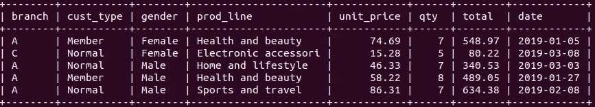

# 用 SQL 进行超市数据分析

> 原文：<https://towardsdatascience.com/supermarket-data-analysis-with-sql-92c153638ad5?source=collection_archive---------9----------------------->

## 如何有效地使用 SQL 查询


在 [Unsplash](https://unsplash.com/s/photos/grocery?utm_source=unsplash&utm_medium=referral&utm_content=creditCopyText) 上 [NeONBRAND](https://unsplash.com/@neonbrand?utm_source=unsplash&utm_medium=referral&utm_content=creditCopyText) 拍摄的照片

SQL 是一种编程语言，用于管理关系数据库中的数据，关系数据库以带有标签的行和列的表格形式存储数据。如果你打算从事数据科学领域的工作，SQL 是一个放入你的技能集的基本工具。

我们可以查询数据库来检索数据，而无需任何修改或过滤。然而，这不是一种主动或有效的方式。我们最有可能对原始数据进行一些数据处理或过滤，使其更加有用。

SQL 非常擅长数据操作和过滤操作。使用 SQL 执行此类任务的优势在于，我们只需要检索我们需要的数据，而不是一次性获取所有数据。此外，它允许在检索数据的同时进行数据分析。

在本文中，我们将分析 Kaggle 上的超市销售[数据集](https://www.kaggle.com/aungpyaeap/supermarket-sales)。我对数据集做了一些修改，并通过排除一些列来简化它。我用数据集的修改版本在 MySQL 数据库中创建了一个表。



超市表格的前 5 行(图片由作者提供)

该数据集包含一家连锁超市不同分店在 3 个月内的销售详情。

**注意**:我用 Pandas 写了另一篇关于这个[数据集](/supermarket-data-analysis-with-pandas-e4991f3e0a9)的实用文章，Pandas 是一个非常流行的 Python 数据分析和操作库。

我们可能希望根据总销售额对产品类别进行排序。

```
mysql> select prod_line, sum(total)
    -> from supermarket
    -> group by prod_line
    -> order by sum(total) desc;+----------------------+------------+
| prod_line            | sum(total) |
+----------------------+------------+
| Food and beverages   |   56144.86 |
| Sports and travel    |   55122.88 |
| Electronic accessori |   54337.52 |
| Fashion accessories  |   54305.88 |
| Home and lifestyle   |   53861.87 |
| Health and beauty    |   49193.81 |
+----------------------+------------+
```

我们首先选择列并应用聚合。下一步是按产品类别对聚合列进行分组。最后，我们根据总销售额对结果进行降序排序。

客户类型和性别列可用于了解客户组合的概况。我们可以计算属于每个交叉类别的购买数量。

```
mysql> select cust_type, gender, count(*)
    -> from supermarket
    -> group by cust_type, gender;+-----------+--------+----------+
| cust_type | gender | count(*) |
+-----------+--------+----------+
| Member    | Female |      261 |
| Member    | Male   |      240 |
| Normal    | Female |      240 |
| Normal    | Male   |      259 |
+-----------+--------+----------+
```

就客户类型和性别列而言，分布相当均衡。

where 子句可以在 select 语句中实现，以便对所选行应用条件。例如，我们可以计算总金额高于 500 的平均采购量。

```
mysql> select avg(qty)
    -> from supermarket
    -> where total > 500;
+----------+
| avg(qty) |
+----------+
|   8.3744 |
+----------+mysql> select avg(qty)
    -> from supermarket;
+----------+
| avg(qty) |
+----------+
|   5.5100 |
+----------+
```

该条件应用于上面的第一个查询。第二个查询返回整个表的平均数量。

我们可以应用基于日期的条件。例如，以下查询返回 2019 年 1 月 5 日到 2019 年 1 月 7 日之间的所有销售额。

```
mysql> select *
    -> from supermarket
    -> where date between "2019-01-05" and "2019-01-07";
```

考虑我们需要找到总销售额最高的前 5 个日期。我们首先需要根据日期对销售额进行分组，因为每天都有许多采购。之后，根据总销售额对结果进行降序排序，并选择前 5 个。

```
mysql> select date, sum(total)
    -> from supermarket
    -> group by date
    -> order by sum(total) desc
    -> limit 5;+------------+------------+
| date       | sum(total) |
+------------+------------+
| 2019-03-09 |    7474.04 |
| 2019-02-07 |    7228.22 |
| 2019-03-14 |    7214.62 |
| 2019-02-15 |    6830.78 |
| 2019-03-02 |    6560.30 |
+------------+------------+
```

假设我们需要找到总金额最大的销售日期。完成这项任务有多种方法。一种是使用嵌套的 select 语句，如下所示:

```
mysql> select date 
    -> from supermarket
    -> where total = (select max(total) from supermarket);+------------+
| date       |
+------------+
| 2019-02-15 |
+------------+
```

我们使用另一个 select 语句在 where 子句中指定条件。嵌套的 select 语句返回总计列的最大值。

我们可以实现多个嵌套的 select 语句。假设我们想要找出在发生最大总金额的销售的日期发生了多少次销售。

这项任务可以分为三个部分:

1.  找出最大的总销售额
2.  查找总销售额最大的日期
3.  统计这一天的销售额

下面的嵌套查询将给出我们想要的结果。

```
mysql> select count(*) from supermarket                # 3
    -> where date = (                                  # 2
    ->    select date from supermarket 
    ->    where total = (                              # 1
    ->        select max(total) from supermarket ));+----------+
| count(*) |
+----------+
|       19 |
+----------+
```

该数据集包含一家连锁超市的 3 家分店。顾客分为两类。我们可以找到这两列中每个交叉类别的平均总销售额。

```
mysql> select branch, cust_type, avg(total)
    -> from supermarket
    -> group by branch, cust_type
    -> order by avg(total) desc;+--------+-----------+------------+
| branch | cust_type | avg(total) |
+--------+-----------+------------+
| C      | Normal    | 337.656604 |
| C      | Member    | 336.575799 |
| B      | Member    | 325.483273 |
| A      | Member    | 321.182455 |
| B      | Normal    | 314.329341 |
| A      | Normal    | 303.831792 |
+--------+-----------+------------+
```

最后一行中的 order by 子句根据平均值对结果进行降序排序。

产品分为几个产品线。我们可能希望根据每个类别中售出的商品总数对产品线进行排序。

```
mysql> select prod_line, sum(qty) 
    -> from supermarket
    -> group by prod_line
    -> order by sum(qty) desc;+----------------------+----------+
| prod_line            | sum(qty) |
+----------------------+----------+
| Electronic accessori |      971 |
| Food and beverages   |      952 |
| Sports and travel    |      920 |
| Home and lifestyle   |      911 |
| Fashion accessories  |      902 |
| Health and beauty    |      854 |
+----------------------+----------+
```

它类似于前面的例子。我们选择“产品系列”和“数量总和”列。结果按产品线分组，并按数量总和排序。

我们还可以在 select 语句中实现聚合函数的组合。例如，以下查询将返回健康和美容产品系列中最贵和最便宜产品的单价之间的差异。

```
mysql> select max(unit_price) - min(unit_price) as diff
    -> from supermarket
    -> where prod_line = "Health and beauty";+-------+
| diff  |
+-------+
| 89.88 |
+-------+
```

我们选择单价列的最大值和最小值，并计算差值。“as”关键字用于为聚合列分配别名。

如果我们希望为每个产品线计算相同的差异，我们可以省略 where 子句，而使用 group by 子句。

```
mysql> select prod_line, max(unit_price) - min(unit_price) as diff
    -> from supermarket
    -> group by prod_line;+----------------------+-------+
| prod_line            | diff  |
+----------------------+-------+
| Electronic accessori | 89.17 |
| Fashion accessories  | 89.71 |
| Food and beverages   | 89.66 |
| Health and beauty    | 89.88 |
| Home and lifestyle   | 89.39 |
| Sports and travel    | 89.79 |
+----------------------+-------+
```

## 结论

我们已经做了几个例子来演示 SQL 如何被用作数据分析工具。它允许编写能够过滤、操作和转换存储在关系数据库中的数据的查询。

这种查询的主要优点是我们只检索我们需要的数据，这可以节省大量的内存。动态应用转换和聚合加快了数据分析过程。

感谢您的阅读。如果您有任何反馈，请告诉我。