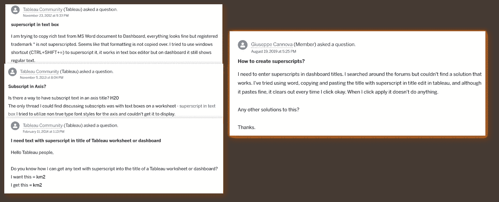

# Tableau 中的上标和下标——为什么以及如何实现它

> 原文：<https://towardsdatascience.com/superscript-and-subscript-in-tableau-why-and-how-you-can-implement-it-764caf0cc932?source=collection_archive---------20----------------------->

## 让你的化学/数学方程式对用户更具可读性

[Tableau dashboard Tool](https://www.tableau.com/)一直是最成功的商业数据可视化工具之一。虽然自第一次发布以来，它已经有了多个版本的修改，但缺乏实现上标/下标格式的内置规范是非常令人惊讶的**，因为 Tableau 用户的一些请求或相关问题在在线论坛上仍然很常见，包括 Tableau 自己的官方平台—**[**Tableau 社区**](https://community.tableau.com/s/)

作者截图|左边 Tableau 社区上的帖子是从 2012 年**到 2014 年**连续被问的，而右边的另一个相关帖子的日期**至少是最近的 2019 年**

考虑到[描述性数据分析](https://www.analyticssteps.com/blogs/overview-descriptive-analysis)是用户的主要意图，因此其用例往往与研究工作重叠——假设**用户往往需要脚注参考和数学/化学符号不会太牵强；这两者都需要上标/下标符号。**

虽然通常的做法是用`^`符号*来表示上标(更多示例请参考* [*用纯文本电子邮件*](https://pages.uoregon.edu/ncp/Courses/MathInPlainTextEmail.html)*)*:

图片由作者提供|左等式和右等式表示相同的意思|而左等式用纯文本表示，右等式用上标表示

> 对于仪表板用户来说，在可视化仪表板时，用纯文本符号处理数学方程是一项额外的脑力劳动，**尤其是当数学方程变得令人沮丧地冗长时**。

# **幸运的是，虽然 Tableau 没有内置的**规范来显示上标/下标符号，但它支持 ASCII 字符的呈现，包括上标和下标数字符号。

图片作者| 1 我过去的 Tableau 仪表板目前部署在 [Tableau Public](https://public.tableau.com/app/profile/charmaine.chui/viz/HowDoesSGUseitsLand/how_SG_uses_its_land) |红色轮廓表示脚注引用的上标符号的用法

虽然您可以参考 [Unicode 表](https://unicode-table.com/en/sets/)获得可用的上标&下标符号的完整列表，但是我通过创建一个 JavaScript 工具让其他 Tableau 用户的生活变得更容易。在文本框中输入需要转换的字符，然后选择**【转换】**按钮，如下图所示:

作者图片|说明了字符输入到相应文本字段上方的指定 Unicode 字符的转换

另外，还包括了将明文转换成装饰性字体(如𝕺𝖑𝖉 𝕾𝖙𝖞𝖑𝖊 𝕰𝖓𝖌𝖑𝖎𝖘𝖍字体)的附加功能😝

可以在我的 GitHub 直接下载 HTML 文件[。只需双击它，在任何支持 JavaScript 的浏览器(Chrome，Edge)中运行它，就可以了！🙃](https://gist.githubusercontent.com/incubated-geek-cc/cf051097ef241a25a5138484d2d15107/raw/618e9f8a8bec13a5a36d5c882f054742e582e5dc/TableauScriptingTool.html)

希望您发现这很有用，如果您对数据分析或其他与 Tableau 相关的内容❤感兴趣，请[关注我的 Medium](https://medium.com/@geek-cc)

<https://geek-cc.medium.com/membership>  

以下是您可能感兴趣的其他 **Tableau 技巧&窍门**(每篇文章的 Tableau 工具已部署在: [Tableau 数据实用工具](https://tableau-data-utility.glitch.me/)):

</how-to-plot-a-custom-map-image-on-tableau-dashboard-in-just-3-easy-steps-no-calculations-required-8db0d41680c4>  </leverage-on-d3-js-v4-to-build-a-network-graph-for-tableau-with-ease-cc274cba69ce>  </selective-formatting-of-numbers-in-tableau-f5035cc64b68>  </5-lesser-known-tableau-tips-tricks-hacks-with-use-case-demo-463f98fbdc7e>  </underrated-combined-functionalities-of-tableau-point-linestring-polygon-mapping-b4c0568a4de2> 