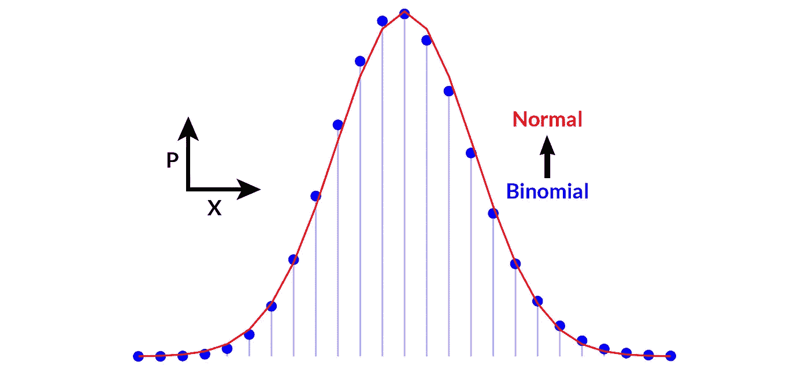

# 监督学习算法连接解释

> 原文：<https://towardsdatascience.com/supervised-learning-algorithm-connections-explained-733d2353b7ee?source=collection_archive---------15----------------------->

图片作者。

## **机器学习模型嵌套——从维恩图到回归、决策树、支持向量机&人工神经网络**

你有没有想过复杂的机器学习技术是如何问世的？纯天才还是多年迭代的产物？让我们采用第二种选择，因为它会让我们都感觉好一些。更重要的是，它将帮助我们成为更好的机器学习实践者。

> “如果说我看得更远，那是因为我站在巨人的肩膀上”——*艾萨克·牛顿，1675*

在这篇文章中，**我将解释监督机器学习技术是如何联系在一起的**，简单的模型嵌套在更复杂的模型中，它们本身嵌入在更复杂的算法中。接下来的将不仅仅是模型的备忘单，不仅仅是监督方法的年表，它将用文字、方程和图表解释机器学习技术的主要家族之间的关系以及它们在偏差-方差权衡难题中的相对位置。

注意:关于无监督学习的例子，参见我的另一篇文章“从零开始的混合建模”，见 R 。

嵌套模型的示例:错误的概率密度< Linear regression < Logistic regression < Feedforward neural network < Convolutional neural network (see text for details). Source: Russian doll photo by *cottonbro* 来自 [*pexels*](https://www.pexels.com/) ，由作者修改(文本添加在裁剪版本上)。

## 从维恩图到最简单的机器学习模型

图片作者。

重构机器学习技术的历史让我们回到**概率论**。概率论可以从 Kolmogorov 公理或简单地从**文氏图**中推导出来。麦克道尔的《*破解编码访谈*》对此做了最好的解释。我们有两个事件 A 和 b，两个圆圈的面积代表它们的概率。重叠的区域就是事件{A 和 B}。我们直接得到 P(A 和 B) = P(A)×P(B 给定 A ),因为我们需要事件 A 发生以及事件 B 给定 A 已经发生。A 和 B 可以互换，所以我们也有 P(A 和 B) = P(B)×P(A 给定 B)。瞧，我们通过结合两个关系得到**贝叶斯定理**:P(A | B)= P(A)×P(B | A)/P(B)。自然，朴素贝叶斯分类器也随之而来。

现在，事件{A 或 B}的概率是多少？在维恩图上，我们观察到它是 A 的面积和 B 的面积之和，然而，为了避免重复计算重叠面积，我们有 P(A 或 B) = P(A) + P(B)-P(A 和 B)。正如我们现在将发现的，两个逻辑关系 AND 和 OR 导致二项式分布，然后导致正态分布，这将是线性回归的基础。

让我们深入探讨一下。**二项式分布**采用以下形式

在使用二项式系数的 *n* 次独立伯努利试验中，准确获得 *k* 次成功的概率是多少

由帕斯卡三角形描述(见上图)。乍一看，这看起来很复杂。然而，它可以很容易地从文氏图中推导出来。独立伯努利试验意味着事件 a 和 b 是独立的，因此 b 不以 a 为条件，a 也不以 b 为条件。从上面可以得出，P(A 和 B) = P(A)×P(B)，或者，在本实验中，P(A *k* 次，而不是 A ( *n* - *k* )次，它等于 *p^k* 次(1- *p* )^( *n* 如果我们拿一个硬币来说，有 *k* 正面(事件 A)和 *n* - *k* 反面(事件 B，即不是 A)，这种事件有不同的实现方式，用二项式系数来表示。举例来说，假设在 3 次试验中成功了 2 次，我们可能有{H，H，T}，{H，T，H}或{T，H，H}。所有那些路径都是互斥的，给出 P(A '或 B') = P(A') + P(B ')，或者 3 乘以 *p^k* 乘以(1-*p*)^(*n*-*k*)，这就是二项分布！假设 *n* 足够大，则**正态分布**

是具有均值 *np* 和方差 *np* (1- *p* )的二项分布的良好近似(演示不在这篇短文的范围之内)。

大 *n* 和小 *p* 的二项分布(离散)和正态分布(连续)。图片作者。

机器学习和统计的主力是**线性回归**

为了训练该模型，要最小化的误差函数是残差平方和(观察值和预测值之间的差)。正是高斯在 19 世纪早期成功地将最小二乘法与概率原理和正态分布(具有剩余高斯误差)联系起来。正态分布和线性回归之间的联系在线性回归的概率公式中变得很清楚:

请注意我们是如何从一个简单的维恩图达到这个阶段的！

噪声服从正态分布的线性回归。图片作者。

基于熵的决策树概念。图片作者。

让我们回到概率论来发展我们成长之树的另一个分支(在这个隐含的剧透中没有双关语；参见下面的图表)。香农在 1948 年将**熵** *H* 定义为-p_i×log_2[p_i]之和，这是一个纯度的度量(也是一个惊奇的度量)。上两节课 *y* =(🔴,🔵)，集合的熵{🔴,🔴,🔵,🔵,🔴}为增加 *x* 为-p(🔴)×log_2[p(🔴)]-p(🔵)×log_2[p(🔵)]或者这里-3/5×log _ 2[3/5]-2/5×log _ 2[2/5]≈0.97，非常不纯(集合纯时熵从 0 到相反情况下的 1)。然后**决策树**包括在给定的 *x* 处进行分裂，使得 2 个子集的组合熵最小化，这是在{{🔴,🔴}, { 🔵,🔵,🔴}}.这是通过**信息增益**的概念来实现的，信息增益是集合熵减去划分子集的熵的加权和。这里，0.97-(2/5×[-1×log _ 2(1)]+3/5×[-1/3×log _ 2(1/3)-2/3×log _ 2(2/3)])≈0.42，这表明由分裂造成的熵的实质性减少。为了清楚起见，决策树分裂的目标是最大化信息增益。这在 Provost & Fawcett 的书《商业数据科学*》中有很好的解释。从那里，通过 bagging(通过 bootstrapping)和 boosting，可以开发一组基于决策树的技术，包括**随机森林**和 **Boosted 树**。*

嵌套监督学习模型-第一部分。作者图片。

## 从线性回归到其他一切！

现在让我们从线性回归分支展开进化树。首先，结合线性回归和贝叶斯定理产生了几种机器学习技术。这在墨菲 2012 年的“*机器学习的概率视角*”中有很好的描述。让我们首先将贝叶斯定理改写为 P(模型|观测值)= P(模型)×P(观测值)/ P(观测值)，或者换句话说，后验概率等于先验概率乘以似然概率，用边际函数归一化。线性回归以前被形式化为一个似然函数，忽略了均匀先验。**正则化技术**(最小化过度拟合)包括在**脊**模型的情况下从均匀先验分布移动到正态先验分布，在**套索**模型的情况下移动到拉普拉斯先验分布。这些技术对非线性回归特别有用；因此，让我们添加**基函数展开**的概念，以从线性回归移动到非线性回归，例如使用**多项式回归**:

随着

下图说明了多项式回归以及通过山脊和套索进行正则化的作用。

由脊或套索调整的过拟合多项式回归。图片作者。

最大边缘超平面和分离两类的 SVM 的边缘。图片作者。

仍然有两个机器学习家族要从线性回归中定义:支持向量机和人工神经网络。**支持向量机** (SVM)是一个线性模型，它通过一个所谓的最大间隔超平面将两个类别分开，最大间隔超平面可以写成满足以下等式的点集 *x* :

将两类数据分开以使它们之间的距离尽可能大的两个平行超平面被定义为

叫做利润。不用深入 SVM 的细节，我们马上就能看到它与线性回归的联系。

回想一下，线性回归被定义为正态分布的可能性。如果我们现在用伯努利分布(二项式分布的特殊情况)代替正态分布，我们得到**逻辑回归**:

这里，在 sigmoid 函数中实现线性回归，以确保结果本质上是概率性的，即在 0 和 1 之间，具有类别而不是连续值。

图片作者。

现在，逻辑回归类似于一个人工神经元，连接几个神经元导致**人工前馈神经网络**。不同的特征排列和网络架构最终导致**卷积神经网络**、**递归神经网络**等深度学习模型。

图片作者。

嵌套监督学习模型-第二部分。图片作者。

## 监督学习的进化树

既然已经描述了所有的连接，让我们在最后一张图中概括所有的内容。就像生命的进化树一样，我们现在可以清楚地看到有监督的机器学习模型的嵌套。它有助于我们理解不同技术之间的联系，但最重要的是，它为我们在探索偏差/方差权衡时测试哪一系列模型提供了一些指导。

作为进化树的嵌套监督学习模型。图片作者。

## 参考

[1] G.L .麦克道尔，《破解编码访谈*》(2015)，第 6 版。，CareerCup，687 页。*

[2] K.P .墨菲，《*机器学习的概率视角*》(2012)，麻省理工学院出版社，1104 页

[3] F. Provost & T. Fawcett，《*商业数据科学*》(2013 年)，奥赖利媒体，414 页