# 监督学习算法备忘单

> 原文：<https://towardsdatascience.com/supervised-learning-algorithms-cheat-sheet-40009e7f29f5?source=collection_archive---------10----------------------->

## 你应该知道的所有监督机器学习算法的完整备忘单，包括优点、缺点和超参数

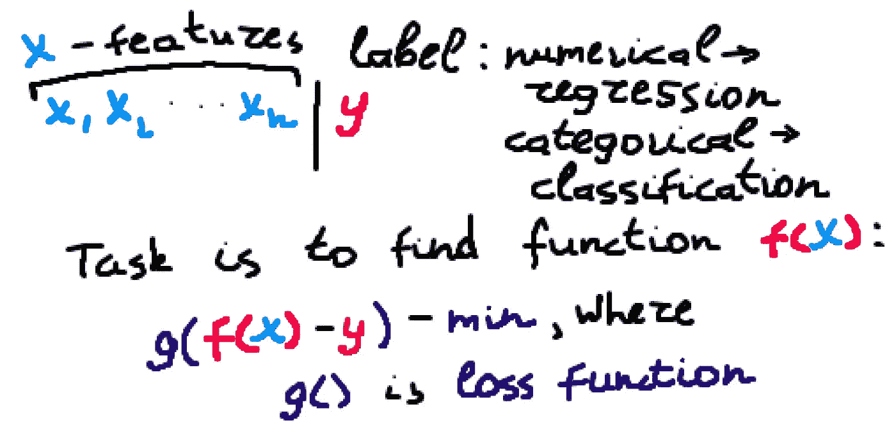

监督机器学习算法的本质。作者图片

本文提供了不同的监督学习机器学习概念和算法的备忘单。这不是一个教程，但它可以帮助你更好地理解机器学习的结构，或者刷新你的记忆。

要了解更多关于特定算法的信息，只需谷歌一下或者在 [*sklearn 文档*](https://scikit-learn.org/stable/) 中查找。

接下来，将回顾或提及以下算法:

*   *线性回归*
*   *逻辑回归*
*   *支持向量机*
*   *k-最近邻*
*   *决策树*
*   *装袋*和*粘贴*
*   *随机森林*和*多余的树木*
*   *增压*
*   *堆垛*和*混合*

这篇文章卷帙浩繁，不建议你一次看完。将这篇文章添加到阅读列表中以便稍后回来，通过 GitLab 阅读章节[或下载这篇文章的 pdf 版本并打印出来(可在同一位置获得)。](https://gitlab.com/Winston-90/supervised_algorithms)

<https://gitlab.com/Winston-90/supervised_algorithms>  

## 介绍

*监督学习*是基于示例输入输出对学习将输入映射到输出的函数的机器学习任务。监督学习算法分析训练数据并产生推断的函数，该函数可以在以后用于映射新的示例。

最受欢迎的监督学习任务是*回归*和*分类*。

解决*回归*任务的结果是一个可以进行*数值预测*的模型。例如:

*   房地产价值预测
*   预测贵公司明年的收入

解决*分类*任务的结果是一个可以进行*分类预测*的模型。例如:

*   垃圾邮件检测
*   新闻文章分类
*   根据验血预测患癌概率(0 到 1 之间)。

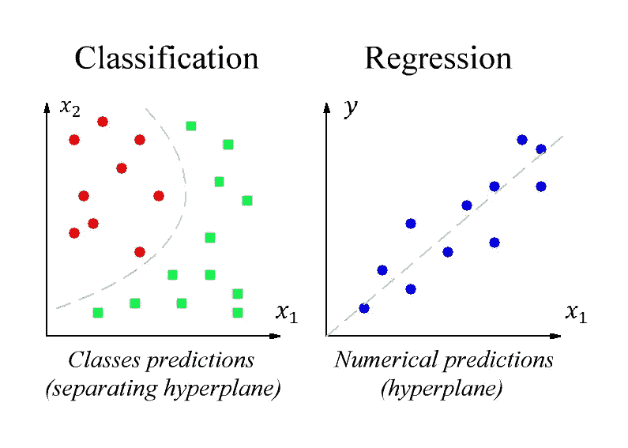

分类与回归。作者图片

分类算法也可以分为**硬**和**软**:

*   **硬分类算法**预测数据点是否属于特定类别**，而不产生概率估计**。
*   **软分类算法**反过来也估计了类别条件**概率**。

分类算法也可以按照要分类的类的数量来划分:

*   **二元分类**——只有两类。
*   **多类分类** —两个以上的类。
*   **多标记分类**(multi label-multi class)——多个类，但类是二元的(图像中人的存在)。结果— [0，0，1]或[1，0，1]。
*   **多输出分类** (Multioutput-multiclass)又称**多任务分类** —多个类，但类不是二进制的(预测项数)。结果— [5，0，1]或[7，0，0]。

有些算法是专为二元分类问题设计的(例如 *SVM* )。因此，它们不能直接用于多类分类任务。相反，可以使用启发式方法将多类分类问题分成多个二进制分类数据集，并分别训练一个二进制分类模型:

*   **OvR**(one-vs-rest)——有时**OvA**(one-vs-all)——你必须为 N 个类训练 N 个分类器，但是是在完整的数据集上。
*   **OvO** (一对一)——你必须为 N 个类训练 N*(N-1)/2 个分类器，但是是在你的数据集中的子样本上。更适合不平衡的数据。

注意，*除了*线性回归(仅回归)*和*逻辑回归(仅分类)*之外，所有接下来的算法都解决分类和回归任务*。

# 简单的算法

我使用短语*简单算法*并不是指它们实现起来简单(尽管它们中的一些确实很简单)，而是指这些是独立的算法，而不是我们稍后将看到的*集成学习*。

## 线性回归

在最简单的情况下，回归任务是通过数据点画一条线，使得这条线(预测)和真实值之间的误差最小。一般来说，这是*最小化损失函数*的问题，所以*优化问题*。通常损失函数是 *MSE —均方误差*(因为*最大似然估计*)，优化算法是*梯度下降*。总之，可以使用优化算法的任何其他损失函数。

线性回归的一个重要特性是，最优参数(根据 *MSE* ，同样是因为*最大似然估计*)可以用简单的**正态方程**计算出来。但是这种方法不能很好地适应大量的特征，因此可以应用任何其他优化方法来代替。

如果数据相关性比直线更复杂，我们可以添加每个特征的幂作为新特征(可以使用来自 *sklearn* 的*多项式特征*类),然后训练线性回归模型。这种技术被称为**多项式回归**。创造新特征的过程(如 xⁿ，或 log(x)，eˣ等)。)被称为*特征工程*，可以显著提高线性模型性能。

这种算法的另一个流行版本是**贝叶斯线性回归**，它通过建立*置信区间*，不仅预测数值，还预测概率。多亏了贝叶斯定理，这才成为可能。

避免过度拟合和离群值影响回归的最有效方法之一是**正则化**。正则化项*被添加到损失函数中，因此回归系数必须尽可能小。*

*   **套索回归** —实现 L1 正则化，+ |coeff|。
*   **岭回归** —实现 L2 正则化，+ coeff。又称*吉洪诺夫正规化*。
*   **弹性网络回归** —实现 L1 和 L2 正则化。

正则化回归也可以像*特征选择*工具一样使用。例如，由于某些属性，LASSO 回归可以删除无关紧要的要素(将其系数设置为零)。

如前所述，*线性回归只解决回归任务*。

**主要超参数**:

*   *特征工程*和*特征选择*
*   正则化类型和参数
*   求解器—优化算法

**优点**:

*   参数少，学习速度快
*   可使用*随机梯度下降*进行配置，无需将所有样本存储在存储器中，并可用于*在线学习*
*   比复杂的模型更容易解释
*   非常适用于具有少量数据点和大量要素的问题
*   非常适合稀疏数据

**缺点**:

*   复杂依赖关系恢复不佳
*   需要数据预处理

## 逻辑回归

与线性回归模型一样，逻辑回归(也称为 **logit regression** )计算输入要素(加上偏差)的加权和，但它不是直接输出该结果，而是输出结果的*逻辑*。*逻辑*是一个 *sigmoid 函数*，它输出一个介于 0 和 1 之间的数字，因此逻辑回归是一个**软二元分类器**，它估计实例属于正类的概率。根据某些阈值，可以获得不同的准确度/召回率值。可以使用与线性回归中相同类型的正则化。

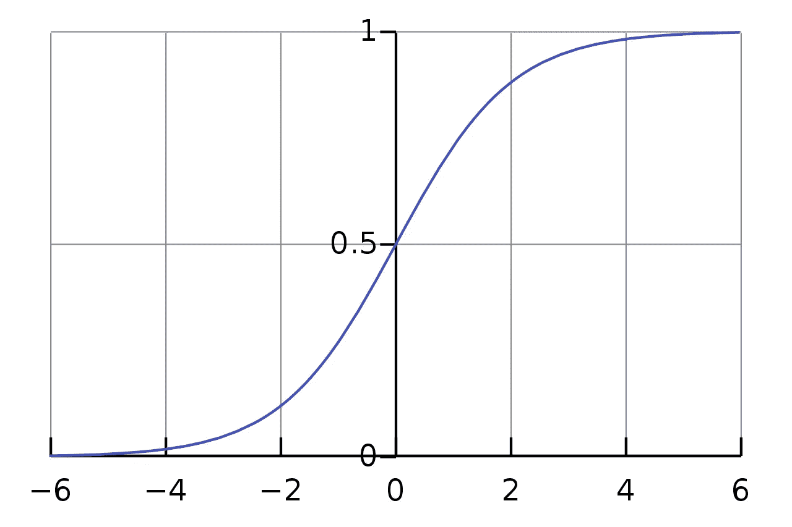

乙状结肠函数。[公共领域](https://en.wikipedia.org/wiki/Sigmoid_function#/media/File:Logistic-curve.svg)

非常相似的**概率单位回归**使用了稍微不同的函数——概率单位函数，而不是 sigmoid。

可以将逻辑回归模型推广到直接支持多个类别，而无需训练多个分类器。这被称为 **Softmax 回归**(或*多项逻辑回归*)。该模型计算每个类别的分数，然后通过应用 *softmax 函数*(也称为*归一化指数*)来估计每个类别的概率。

如前所述，*逻辑回归只解决分类任务*。

基于线性回归，因此继承了该算法的所有超参数、优点和缺点。需要单独说明的是，该算法的*解释*水平较高，因此通常被广泛用于*信用评分*任务和*医疗诊断*。

## 支持向量机

支持向量机算法基于*支持向量*概念——极值点(图中用黑色圈出)。

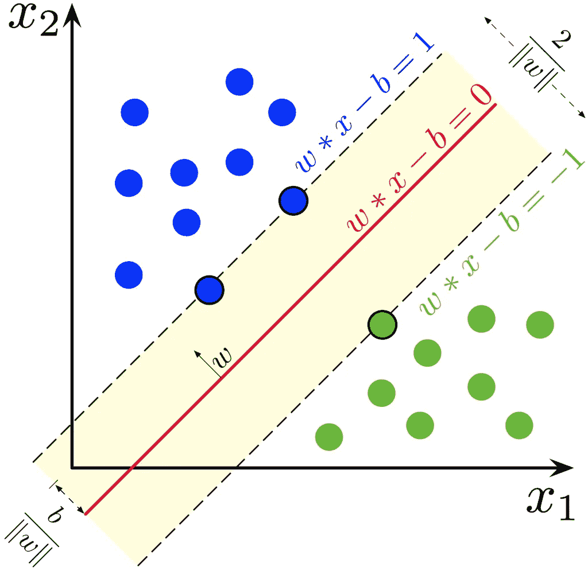

支持向量。[公共领域](https://en.wikipedia.org/wiki/Support-vector_machine#/media/File:SVM_margin.png)

在*分类任务*的情况下，它试图在类别之间画一条分隔线，使得*支持向量*位于离这条线尽可能远的地方(在一般情况下是分离超平面):

*   *硬边界分类* —假设相同类别的实例无例外地位于分离超平面的同一侧。
*   *软边界分类*-允许违反决策边界，由正则化参数控制。

在*回归任务*的情况下，相反，它试图画一条线来适应边界内尽可能多的实例，“在街上”。

由于 SVM 要求计算点与点之间的距离，它也要求*特征缩放*。

SVM 最重要也是数学上最优雅的特征是，*对偶问题*(这是 SVM 的基础)的解不直接依赖于特征(作为向量)，而*只依赖于它们的两两标量积*。这就允许我们用某个函数 *k(a，b)* 来代替标量积，这个函数叫做*内核*。事实上，内核是另一个空间中的*标量积。这个过程允许你在不增加新特征的情况下建立非线性分类器(在更大的维度空间中实际上是线性的),被称为**内核技巧**。*

不同内核的使用允许该算法在*分类*和*回归*任务中恢复非常复杂的相关性。最受欢迎的内核是:

*   多项式
*   RBF —高斯径向基函数
*   乙状结肠和其他

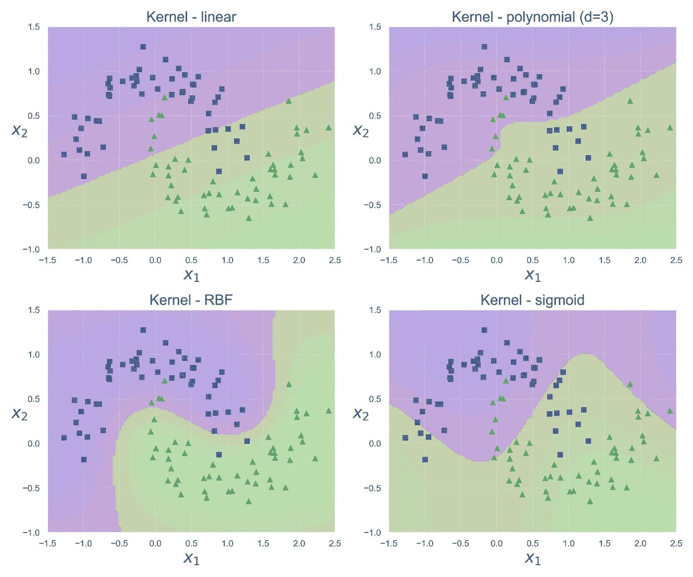

具有不同内核和默认参数的 SVM。作者图片

一级 SVM 也可以用于*异常检测*问题。

**主要超参数**:

*   内核类型
*   正则化参数 C——对每个错误分类的数据点的惩罚(通常为 0.1 < C < 100)
*   regularization parameter gamma — controls regions separating different classes. Large gamma leads to too specific class regions (overfitting). (usually 0.0001 < gamma < 10)

**赞成**):

*   最强大和最灵活的模型之一
*   由于线性模型继承了线性回归的优点

**缺点**:

*   需要数据预处理
*   它适用于许多要素，但不适用于样本，因此仅适用于小型和中型数据集

## k-最近邻

最近邻算法作为*度量方法*的代表，对数据分布做了两个假设:

*   *回归*的连续性假设——相近的对象对应相近的答案，并且
*   *分类*的紧密性假设——接近的对象对应同一类。

对于一个新的对象，我们必须找到 k 个最近的邻居。最近的*的定义取决于我们想要使用的距离度量(曼哈顿、欧几里德等。).*

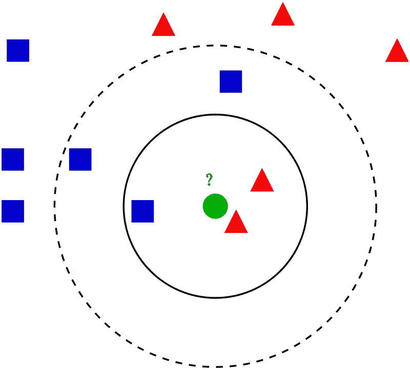

k-最近邻算法。结果可能因 k. [公共域](https://en.wikipedia.org/wiki/K-nearest_neighbors_algorithm#/media/File:KnnClassification.svg)而异

最重要的超参数是相邻点的数量——k。k 的一个好的初始近似值是将 *k 设置为数据点数*的平方根，但是，当然，k 可以通过*交叉验证*找到。*分类*然后根据每个点的最近邻居的简单多数投票计算，*回归*——根据每个点的最近邻居的平均值。

**主要超参数**:

*   k —邻居的数量
*   距离度量

**优点**:

*   *懒惰学习*——我们只需将数据载入内存
*   简单解读
*   简单实现

**缺点**:

*   需要数据预处理
*   复杂的依赖关系恢复不佳(高度重叠数据的分类)
*   任何度量算法在处理稀疏的高维数据时都表现不佳
*   由于任何基于*实例的算法*都必须将所有训练数据存储在内存中

## 决策树

在每一步，训练集被分成两个(或更多)部分，这取决于特定的选择。通常，树构建算法是*贪婪*，这意味着，它们在特定步骤寻找*局部*最优解。构建树的常用算法有:

*   **ID3** (最古老的算法之一，*迭代二分法 3* 是由*罗斯·昆兰*发明的)，
*   **C4.5，c 5.0**(ID3 算法的扩展，它们是由同一个人开发的，并且在于*在使用 ID3 之后修剪*树)，
*   **CART** ( *分类和回归树*针对分类(*基尼系数*作为度量)和回归( *MSE* 作为度量)树进行了优化，并在 *scikit-learn* 中实现。

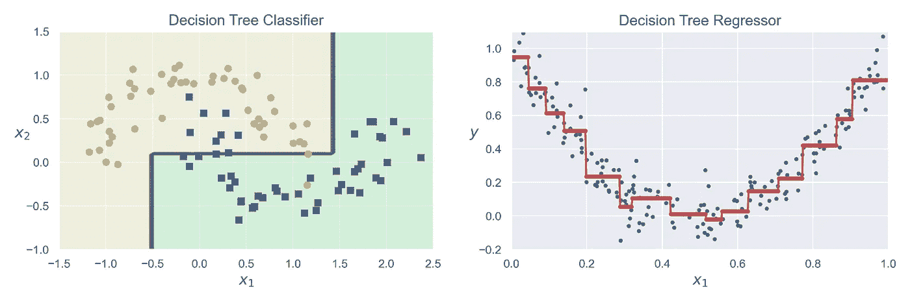

决策树分类器和回归器。作者图片

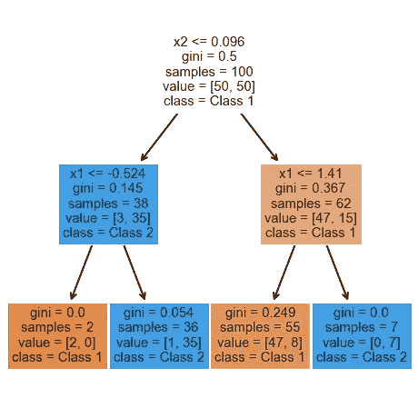

使用上述示例决策树分类器的决策树结构。作者图片

可以使用不同的方法来计算*信息增益*。然后决策树算法使用信息增益来拆分特定节点:

*   *熵*——无序的一种度量。
*   *基尼杂质*。

所谓的**决策树剪枝**比单纯限制树的长度更能说明问题。这是当我们建立一个完整深度的树时的过程，在此之后，我们移除树的无关紧要的节点。然而，这一过程需要更多的资源。

**主要超参数**:

*   树的最大深度:越小-过度拟合越小，通常为 10–20
*   一个叶中的最小对象数:越大-过度拟合越少，通常为 20+

**优点**:

*   简单解读
*   简单实现
*   计算简单性
*   不需要特征预处理，可以处理缺失值
*   可以使用信息增益来计算特征重要性

**缺点**:

*   不稳定且易变(对贪婪算法的研究)-输入数据的微小变化会完全改变树的结构
*   对训练集的内容和噪声高度敏感
*   复杂(非线性)依赖关系的恢复较差
*   在树的较大深度处过度拟合的趋势
*   与线性模型不同，它们不是外推的(它们只能预测从训练集的最小值到最大值范围内的值)

# 集成方法

集成方法(也称为**集成学习**)是创建多个模型，然后将它们组合起来以产生改进结果的技术。集合方法通常比单一模型产生更精确的解。

## 制袋材料

**装袋**代表*引导汇总*。

当我们有一个训练集`X_train (N x M) N data points and M features`时，我们在`X`上训练`n`个模型，其中`X (N x M)`是`X_train`的一个相同大小的随机子样本。当`X`成型时**带替换**的算法称为**装袋**，当`X`成型时**不带替换**的算法称为**粘贴**。当这个模型进行预测时，实际上，它从`n`个不同的模型中获得`n`个预测，并汇总它们。*分类*通过模型的简单多数投票计算，回归*通过模型预测的平均值计算。*

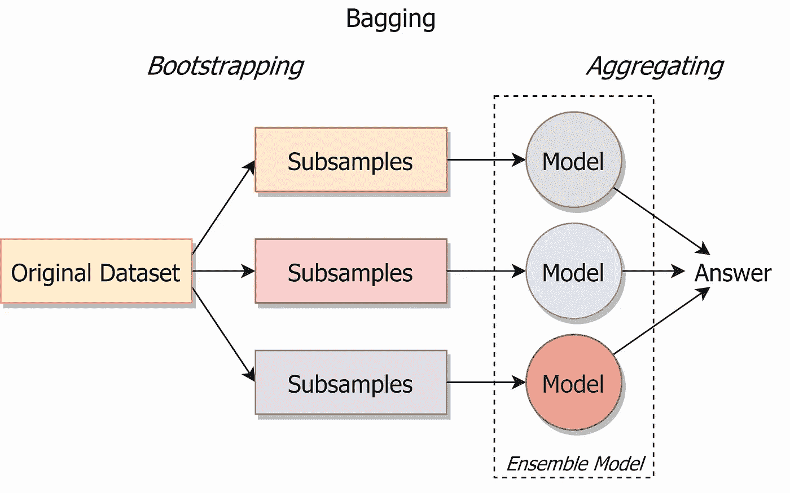

装袋。作者图片

**粘贴**最初是为**大数据集**计算能力有限时设计的。**另一方面，Bagging** 可以多次使用相同的子集，这对于较小的样本量非常有用，它提高了稳健性。

这种方法允许**保持相同的偏差，但是由于*中心极限定理*而减少了方差**。算法的变量越多，其预测的相关性就越低，因此，CLT 的效果就越好(决策树是一个很好的选择)。

如果我们使用装袋，有可能一个样本永远不会被选中，而其他样本可能会被多次选中。一般来说，对于一个大数据集，37%的样本从未被选择，我们可以用它来测试我们的模型。这被称为**出袋得分**，或 **OOB 得分**。

**主要超参数**:

*   型号类型
*   n_estimators —集合中模型的数量
*   max _ samples 从训练集中获取的用于训练每个基本模型的样本数
*   max _ features 从训练集中提取的用于训练每个基础模型的特征数

**优点**:

*   质量非常好
*   训练过程可以简单地并行化，因为模型相互独立地学习
*   不需要特征预处理和特征重要性的内置评估(在树的情况下)
*   抗过度配合
*   抵抗异常值
*   *OOB 评分*允许使用完整数据集，而无需将其分为训练和验证

**缺点**:

*   解释的复杂性
*   无法很好地处理大量要素或稀疏数据
*   训练和预测速度明显慢于线性模型

## 随机森林

尽管*装袋*可以应用于所有类型的算法，但是**装袋超过决策树**已经变得很普遍。因为它们是不稳定的和可变的，所以获得了好的结果。实际上，**随机森林**就是用随机子空间方法对决策树进行**打包。**

当我们有一个训练集`X_train N x M (N data points and M features)`时，我们在`X`上训练`n`树，其中`X (N x m)`是带有替换的`X_train`的随机子样本，但是我们也取`m (m < M)`特征的随机子集。这被称为*随机子空间方法*。当这个模型进行预测时，实际上，它从`n`个不同的模型中获得`n`个预测，并汇总它们。*分类*通过模型的简单多数投票计算得出，而*回归*通过模型预测的平均值计算得出。

这种方法允许**保持相同的偏差，但是由于*中心极限定理*而减少了方差**。

如已知的**隔离森林**算法也可用于*异常检测*问题。

**继承套袋的利弊**。

主要超参数:

*   n _ estimators——集合中树的数量——越多越好
*   max_features —从训练集中提取的特征数，用于训练每个基树—建议使用`n/3`进行回归，使用`sqrt(n)`进行分类
*   max _ depth 树的最大深度
*   min_sample_leaf —分割内部节点所需的最小样本数

## 额外的树

额外的树与广泛使用的随机森林算法有关。

*   **与 bagging 和 random forest** 从训练数据集的引导样本中训练每个决策树不同，*额外树*算法在**整个训练数据集**上训练每个决策树。
*   **像随机森林**一样，*额外树*算法将**在决策树的每个分裂点随机采样特征**。
*   **与随机森林**使用贪婪算法选择最佳分割点不同，*额外树*算法**随机选择分割点**。

它通常可以实现与随机森林算法一样好或更好的性能，尽管它使用更简单的算法来构建用作集成成员的决策树，因此**工作更快**。

**继承所有超参数，随机森林的利弊**。

## 助推

A boosting 是顺序训练**的弱算法**(预测精度略好于随机算法)的集合，每个后续算法考虑前一个算法的误差。

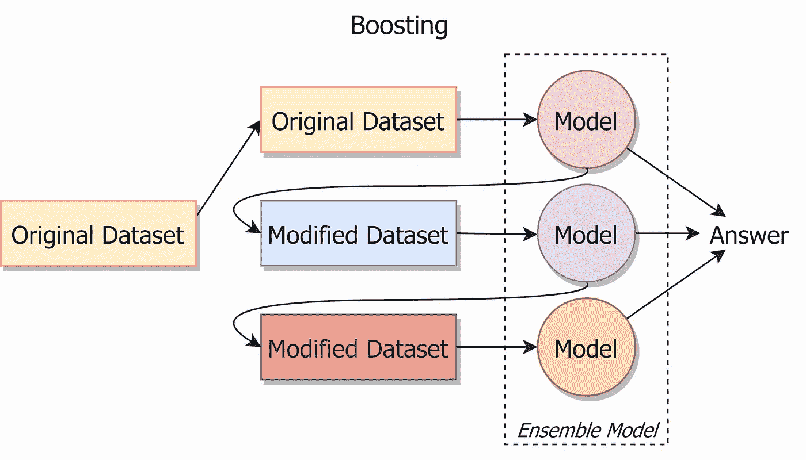

助推。作者图片

升压的一般思想可以以不同的方式实现。三种最受欢迎的升压类型是:

*   **AdaBoost**

AdaBoost 代表*自适应增压*。这是一个贪婪的迭代算法。在每一步，它识别错误分类的数据点，并调整权重以最小化训练误差。
这个版本的 boosting 对异常值很敏感。

*   **梯度推进**

梯度推进也叫*梯度推进机— GBM* 。与任何升压实现一样，在每一步，该算法都试图最小化前面步骤中产生的误差。但是 GBM 不是改变权重(像 AdaBoost)，而是根据前一个模型的残差训练下一个模型。GDM 的实现之一是 [LightGBM](https://lightgbm.readthedocs.io/en/latest/) 。

*   **XGBoost**

[XGBoost](https://xgboost.readthedocs.io/en/latest/index.html) 代表*极限梯度提升*。这种实现旨在提高速度和性能，它与 GPU 和 Hadoop 并行工作。XGBFIR 是一个非常棒的 XGBoost 特性重要性分析库。

由于 boosting 的主要实现仍然使用决策树作为基本模型，因此 boosting 与随机森林一样，决定了特征的重要性。但是 boosting 的流行创造了许多允许您进行更详细分析的库(例如，XGBFIR 库允许您不仅分析一个特性的重要性，还可以分析它们的双重甚至三重组合)。

**主要超参数**:

*   模型的类型及其相互作用的方式

**优点**:

*   质量非常好，通常比随机森林好
*   功能重要性的内置评估

**缺点**:

*   学习比随机森林慢，因为学习过程必须严格按顺序进行(尽管像 XGBoost 或 LightGBM 这样的实现对此有争议)
*   倾向于过度拟合
*   仅适用于足够大的数据集

## 堆垛

堆叠模型的架构涉及**两个或更多基础模型**，通常称为*0 级模型*，以及一个组合了基础模型预测的**元模型，称为*1 级模型*。**

*   *0 级模型(基础模型)*:训练数据被分成`K`个折叠。然后`K`个模特在`K-1`上训练折叠。
*   *一级模型(元模型)*:学习如何以最佳方式组合基础模型预测的模型。

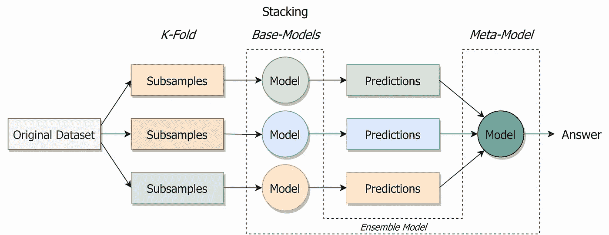

堆叠。作者图片

与增压的区别:

*   **与装袋**不同，在堆叠中，**模型通常与**不同(例如，并非所有决策树)。
*   **与增强**不同，在堆叠中，**使用单个模型来学习如何最好地组合来自贡献模型**的预测(例如，代替校正先前模型的预测的模型序列)。

使用一个简单的线性模型作为元模型通常会给叠加起一个通俗的名字**混合**。

**主要超参数**:

*   模型的类型及其相互作用的方式

**优点**:

*   在没有其他帮助的情况下提高模型的质量
*   允许您有效地混合不同类别的模型，结合它们的优势
*   帮助你在 Kaggle 上赢得金牌

**缺点**:

*   高计算复杂度
*   解释的复杂性
*   很容易出现信息泄露
*   仅适用于足够大的数据集

# 结论

这里描述了最流行的监督学习算法(当然，还有其他算法)。总之，我想描述选择一种算法来解决一个典型的监督学习任务(分类或回归)的过程。很简单——你只需要回答两个问题。

你的数据稀疏吗？如果是，那么你将不得不使用线性方法。这通常是一个 *SVM* ，使用不同的内核，它将允许你恢复复杂的依赖关系。请记住，线性方法需要数据预处理，这在某些情况下可能会有问题。

如果你的数据密集，那么你就比较幸运。现在一切都取决于他们的数量。如果有很多，那就用一个*助推*，否则——*随机森林*。这两种算法都很强大，抗噪声，会给你看很好的质量，但是需要很长时间的学习和预测。此外，请记住，升压容易过度拟合。

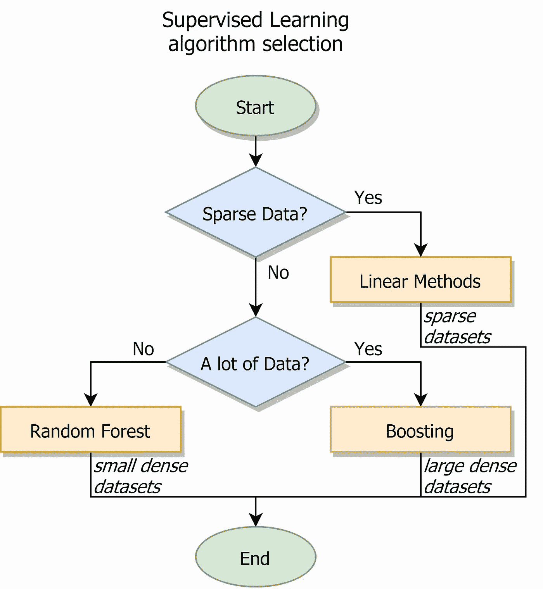

算法选择框图。作者图片

*大量数据*是什么意思？多少钱？通常，谈论一个阈值 *10 万个样本*，但是无论如何，你可以(并且很可能会)尝试不同的算法。

这只是一个建议，您应该使用不同的超参数尝试不同的算法，以最佳方式解决您的任务。

您可能还对以下内容感兴趣:

</unsupervised-learning-algorithms-cheat-sheet-d391a39de44a>  

# 感谢您的阅读！

*   我希望这些材料对你有用。[在 Medium 上关注我](https://medium.com/@andimid)获取更多类似的文章。
*   如果您有任何问题或意见，我将很高兴得到任何反馈。在评论里问我，或者通过 [LinkedIn](https://www.linkedin.com/in/andimid/) 或者 [Twitter](https://twitter.com/dimid_ml) 联系。
*   为了支持我作为一名作家，并获得数以千计的其他媒体文章，使用[我的推荐链接](https://medium.com/@andimid/membership)获得媒体会员资格(不收取额外费用)。

# 参考

[1] Aurélien Géron，[使用 Scikit-Learn、Keras 和 TensorFlow 进行机器学习，第二版](https://www.oreilly.com/library/view/hands-on-machine-learning/9781492032632/) (2019)，奥赖利媒体公司