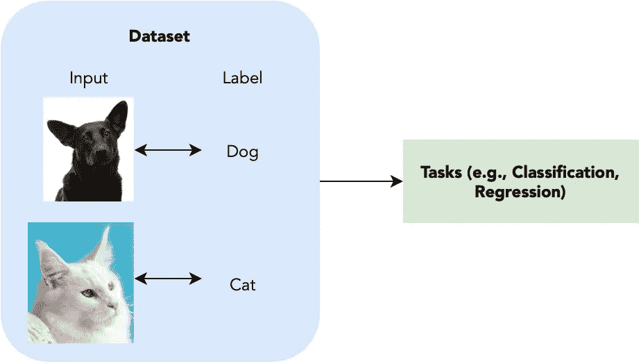
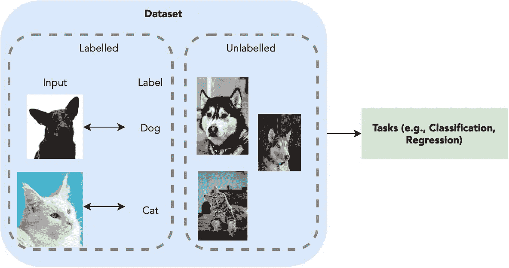
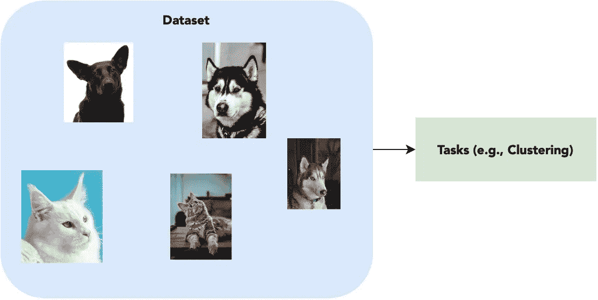
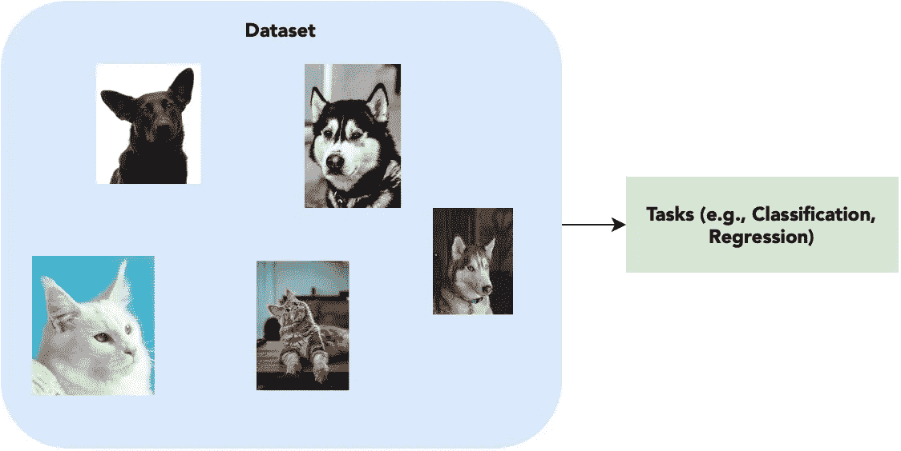

# 监督、半监督、非监督和自我监督学习

> 原文：<https://towardsdatascience.com/supervised-semi-supervised-unsupervised-and-self-supervised-learning-7fa79aa9247c?source=collection_archive---------2----------------------->

## 揭开每个学习任务的神秘面纱

指数数量的研究和出版物在机器学习领域引入了许多术语和概念，但其中许多已经退化为仅仅是时髦的词汇，人们没有完全理解它们的差异。

本文揭示了机器学习领域的四个核心机制——监督、半监督、非监督和自我监督学习——并讨论了解决这些问题的几个示例/方法。尽情享受吧！

# 监督学习

图一。监督学习图解。作者使用来自 [Unsplash](https://unsplash.com) 的资源制作的图像。

最常见的，也许是我们在谈论机器学习时提到的类型是监督学习。

> 简而言之，**监督学习**提供了一组输入输出对，这样我们就可以学习一个将输入映射到正确输出的中间系统。

监督学习的一个简单例子是基于图像及其对应类别的数据集来确定图像的类别(即，狗/猫等)，我们将图像及其对应类别称为它们的标签。

对于给定的输入-标签对，当前流行的方法将是直接训练深度神经网络(即，卷积神经网络)以从给定图像输出标签预测，计算预测和实际正确答案之间的可区分损失，并通过网络反向传播以更新权重来优化预测。

总的来说，监督学习是最直接的学习方法，因为它假设给定了每个图像的标签，这简化了学习过程，因为网络更容易学习。

# 半监督学习

图二。半监督学习图解。图片由作者利用来自 [Unsplash](https://unsplash.com) 的资源制作。

虽然监督学习假设要在任务上训练的整个数据集对于每个输入都有相应的标签，但现实可能并不总是这样。贴标签是一项劳动密集型的处理任务，输入数据通常不成对。

> **半监督学习**旨在解决这个问题:我们如何使用一小组输入-输出对和另一组仅有的输入来优化我们正在解决的任务的模型？

回头参考图像分类任务，图像和图像标签现在仅部分存在于数据集中。是否有可能在没有任何标签的情况下仍然使用这些数据？

简而言之，是的。事实上，有一个叫做伪标签的简单方法可以做到这一点。首先，我们使用具有正确标签的图像来训练分类模型。然后，我们使用这个分类模型来标记未标记的图像。然后，来自模型的具有高置信度标签的图像将被添加到模型中，它们的预测标签作为伪标签用于继续训练。我们重复这个过程，直到所有的数据都被用于最佳分类模型。

当然，这种方法虽然看起来很聪明，但很容易出错。如果标记数据的数量非常有限，则模型很可能过度拟合训练数据，并在早期阶段给出错误的伪标签，从而导致整个模型完全错误。因此，决定置信度阈值以将输入伪标签对包括到训练中也是非常重要的。

为了避免在早期阶段模型过度拟合，还可以采用数据扩充技术来增加训练规模并创建更广泛的数据分布。*如果有兴趣，也可以参考我的文章* [*mixup*](/enhancing-neural-networks-with-mixup-in-pytorch-5129d261bc4a) *作为图像分类任务最占优势的增强策略之一。*

# 无监督学习

图 3。无监督学习的图解。作者使用来自 [Unsplash](https://unsplash.com) 的资源制作的图像。

现在我们已经了解了如何使用最小标签进行训练，我们可以更进一步考虑:一个完全没有标签的数据集。

> **无监督学习**处于光谱的另一端，只有输入数据没有相应的分类或标记。目标是找到每个数据集的潜在模式。

涉及无监督学习的任务包括客户细分、推荐系统等等。然而，一个人如何在没有任何标签的情况下学习任何东西？

因为我们没有每个输入标签的“正确答案”,所以找到一个模式的最好方法是对它们进行聚类。也就是说，给定一组数据特征，我们试图找到彼此相似的特征，并将它们分组在一起。一些聚类方法包括 K-Means 和 K-Medoids 方法。

仅仅是聚类实际上可能会产生许多见解。以推荐系统为例:通过根据用户的活动对他们进行分组，人们可以向其他用户推荐一个用户喜欢的内容，而无需明确了解每个用户的兴趣是什么。

# 自我监督学习

图 4。自我监督学习图解。作者使用来自 [Unsplash](https://unsplash.com) 的资源制作的图像。自我监督学习与无监督学习非常相似，除了自我监督学习旨在处理传统上由监督学习完成的任务。

现在到了棘手的部分。看起来我们已经涵盖了学习的所有方面，那么什么是自我监督学习呢？？嗯，答案可能比你想象的要简单！

> **自我监督学习**在某种意义上是一种无监督学习，因为它遵循没有给定标签的标准。然而，自我监督学习不是寻找用于聚类的高级模式，而是试图在没有任何可用标记的情况下仍然解决传统上由监督学习(例如，图像分类)针对的任务。

乍一看，这似乎是不可能的，但最近的许多研究已经提出了创造性的和有趣的技术来学习这一点，其中之一是臭名昭著的积极和消极的对比学习。

简而言之，在相同的图像上执行增强，并将它们标记为正对，将不同的图像标记为负对，并且试图推开负对的学习特征，同时拉近正特征。这使得网络能够学习对相似类别的图像进行分组，这进一步使得像分类和分割这样原本需要固定标签来学习的任务在没有给定地面事实的情况下变得可能。

# 测试每个概念

如果你想亲自体验个别概念，你可以检索任何数据集，并亲自移除部分或全部标签，以测试每种学习方法。

需要注意的一点是，如果你直接从 torchvision 检索数据集，他们已经为你预定义了标签，如果你想测试半监督或自我监督学习，下载并编写自己的数据加载器会更好。我发现一个对检索数据集特别有用的地方是 [Graviti 开放数据集](https://gas.graviti.com/open-datasets)。有这么多不同的数据集和论文，通常很难理解使用什么数据集。开放数据集平台组织了所有受欢迎的数据集，以便您可以轻松找到它们并重定向到它们的官方网站。他们目前也在致力于提供一个好的 API 来帮助简化设计数据加载器的过程，我相信这对未来的使用会很有帮助。

我个人建议在需要较少计算能力的 MNIST 或 CIFAR-10 数据集上进行测试。如果你有一台笔记本电脑，他们会更容易训练。

# **要阅读的附加论文**

有关自我监督学习的更多论文和技术，您也可以参考来自 [paperswithcode](https://paperswithcode.com/task/self-supervised-learning) 的论文，其中包括当前的基准和最先进的方法。

# 结论

现在你知道了！希望在这篇文章之后，你会知道监督、半监督、无监督和自我监督学习之间的细微差别。玩得开心，不断学习！

*谢谢你能走到这一步*🙏*！* *我会在计算机视觉/深度学习的不同领域发布更多内容，所以* [*加入并订阅*](https://taying-cheng.medium.com/membership) *如果你有兴趣了解更多！*