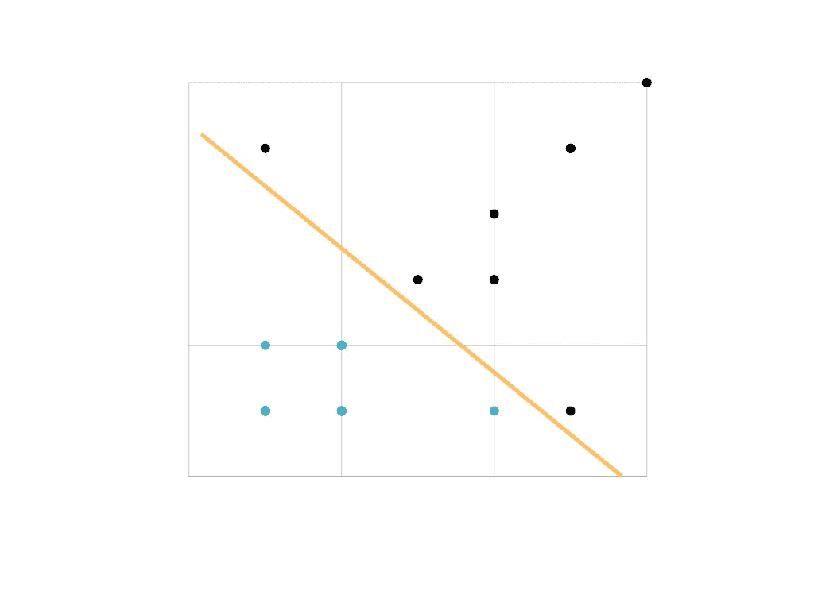
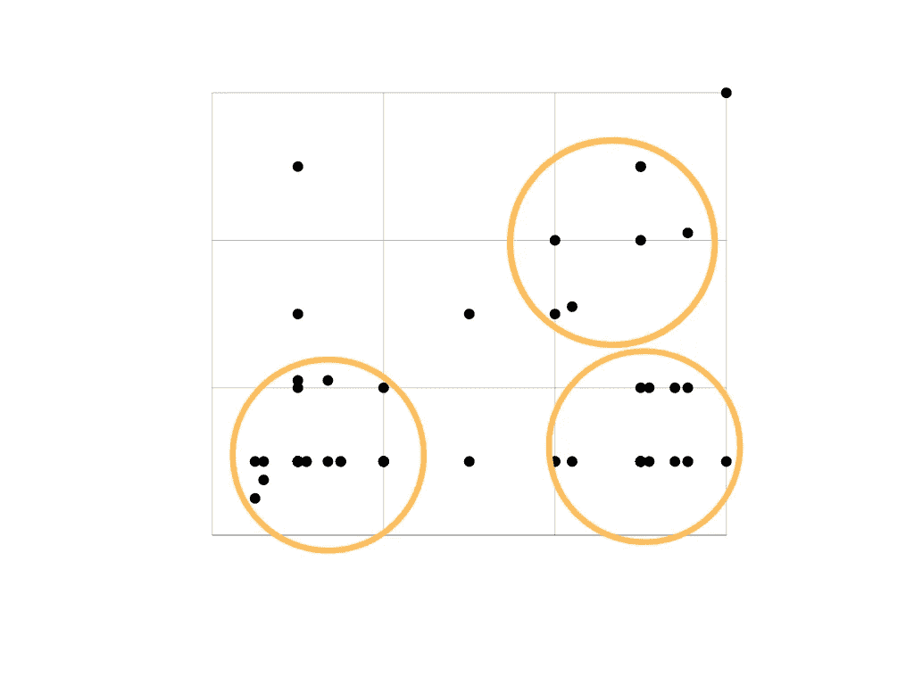

# 监督与非监督学习

> 原文：<https://towardsdatascience.com/supervised-vs-unsupervised-learning-bf2eab13f288?source=collection_archive---------5----------------------->

## 讨论机器学习中**监督学习、**无监督学习和半监督学习的主要区别

由[Gert RDA valasevi it](https://unsplash.com/@skraidantisdrambliukas?utm_source=unsplash&utm_medium=referral&utm_content=creditCopyText)在 [Unsplash](https://unsplash.com/s/photos/artificial-intelligence?utm_source=unsplash&utm_medium=referral&utm_content=creditCopyText) 上拍摄的照片

## **简介**

在机器学习领域，有两种基本的学习类型，即**监督的**和**非监督的**方法。现在，根据我们想要解决的问题、我们需要回答的问题以及我们可以访问的数据，我们需要选择合适的*学习*算法。

因此，整个学习过程依赖于对上述问题的回答。鉴于这些答案可能会有所不同，在选择特定的学习算法之前，我们首先需要明确什么样的学习类型适合我们试图解决的问题的性质。

## 监督学习

在监督学习中，感兴趣的数据集包含解释变量(也称为**输入**或**特征**)以及目标响应(也称为**输出** **标签**)。这种算法试图学习一个函数，该函数以某种方式近似特征值和标签之间的关系，它能够很好地将**推广到**新的看不见的数据。

换句话说，监督学习算法将训练样本的输入特征与相应的输出标签相关联，以便它们能够对所有可能的输入执行足够好的**预测**。这种学习方法也被称为**从范例中学习**。

需要监督学习方法的问题可以进一步分组为 ***分类*** 和 ***回归*** 问题。前者是输出变量(标签)对应一个类别时；例如垃圾邮件与业余电子邮件，而后者是当输出变量是一个真实值时；例如距离或价格。

监督学习-来源:[作者](https://medium.com/@gmyrianthous)

监督学习算法的一些例子包括*线性回归、随机森林、决策树和支持向量机。*

## 无监督学习

另一方面，无监督学习适用于需要算法来识别和提取输入之间的相似性的问题，以便可以将相似的输入分类到一起。与监督学习相反，当**输出变量**(即**标签**)是**而不是** **时，非监督学习方法是合适的，前提是**。

无监督学习方法的两种基本类型是**聚类**和**密度估计**。前者(可能是最常用的)涉及需要将数据分组到特定类别(称为集群)的问题，而后者涉及汇总数据的分布。

无监督学习—来源:[作者](https://gmyrianthous.medium.com/)

无监督学习算法的一些例子包括 K-均值聚类、主成分分析和分层聚类。

## 半监督学习

现在还有另一种称为**半监督**的学习类型，当我们**没有训练数据集**中所有例子的目标标签时，它就派上了用场。因此，这类问题需要监督和非监督学习技术的混合。

需要这种方法的一个非常常见的问题是图像分类或对象检测。通常，包含图像的数据集可能仅具有所包括的示例子集的标签，而其余的则根本没有标签。

## 最后的想法

在今天的文章中，我们讨论了两种基本的机器学习方法之间的主要区别，即监督学习和非监督学习。

总之，当可用的数据集包含每个示例的特征和正确标签时，监督学习方法是有用的。当我们想要对感兴趣的数据进行某种预测时，例如对一封电子邮件是否是垃圾邮件进行分类，这样的方法非常有用。另一方面，当我们无法访问输出标签并且需要将数据分类(或聚类)到组中时，无监督学习方法就派上了用场。

同样重要的是要提到，在机器学习的背景下，这些并不是唯一的学习方法。其他一些类型包括强化学习和进化学习，这些都超出了本文的范围。

</feature-scaling-and-normalisation-in-a-nutshell-5319af86f89b>  </fit-vs-predict-vs-fit-predict-in-python-scikit-learn-f15a34a8d39f>  <https://medium.com/geekculture/fit-vs-transform-vs-fit-transform-in-python-scikit-learn-2623d5a691e3> 