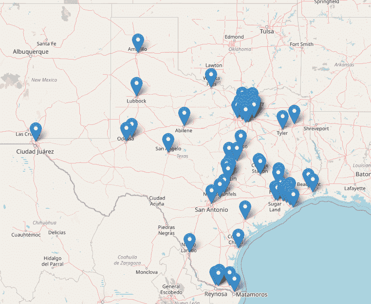
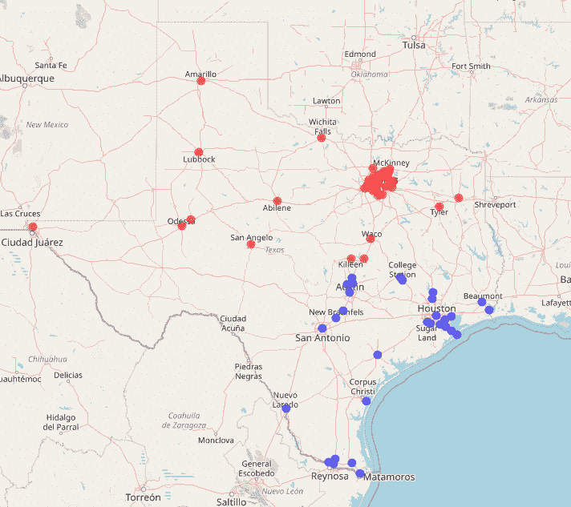

# 使用 R 的供应链设计:不受约束的仓库/客户对齐

> 原文：<https://towardsdatascience.com/supply-chain-design-using-r-unconstrained-warehouse-customer-alignment-9ec11c1e4345?source=collection_archive---------23----------------------->

## 用 R &运筹学温和地介绍供应链设计

我最近在 R for Data Science([https://www.rfordatasci.com/](https://www.rfordatasci.com/))Slack 频道上有一个很棒的讨论，关于如何使用 R 编程语言建立一个供应链网络模型，将客户与配送中心(DC)联系起来。因为我总是渴望鼓励供应链设计领域的新手，所以我写了这个小示例脚本。利用`ompr`进行优化建模，`leaflet`进行绘图，`geosphere`进行测距，`tidyverse`进行数据准备。

在这个例子中，我使用了`maps`包的`us.cities`函数，“一个数据库是美国人口超过 40，000 的城市和所有州的首府。”仅过滤德克萨斯州，我们就有 71 个城市的现成客户数据集:

```
#learning R script on warehouse network design
#install packages if necessary first!
library(tidyverse)
library(magrittr)
library(leaflet)
library(ompr)
library(ompr.roi)
library(ROI.plugin.glpk)require(geosphere)
require(measurements)
require(maps)# customer set are the largest cities in Texastx_cities <- maps::us.cities %>% dplyr::filter(country.etc=='TX') %>%
  #demand is proportional to population
  dplyr::mutate(demand = ceiling(pop/10))#real quick leaflet of the cities
leaflet(tx_cities) %>% addTiles() %>% addMarkers()
```



现在我们已经使用`leaflet`验证了所有被过滤的客户城市实际上都在德克萨斯境内，我们需要创建一组潜在的仓库(DC)位置。在大多数现实生活的评估中，你会有 6 个以上的潜在选项，这些选项将使用定性和定量技术的组合来创建。但是在这种情况下，我们将只使用德克萨斯州的 6 个城市。

```
#potential DC sets are Dallas, Amarillo, Houston, El Paso, San Antonio, Beaumont
tx_dc <- tx_cities %>% dplyr::filter(
  name %in% c('Dallas TX','Amarillo TX','Houston TX','El Paso TX',
              'San Antonio TX', 'Beaumont TX'))
```

在本例中，我们将要求开立两个跟单信用证，对每个仓库对应的客户总数和 DC 对应的客户总量没有任何限制。这被称为*无约束*模型。在现实生活中，DC 容量是有限制的，这些限制应该纳入现实生活中的网络设计模型。

在无约束网络设计中，您要做的是最小化或最大化通过将需求点 *D_i* 与配送中心*C _ j*对齐而产生的*总利益指标*。该指标通常与总网络单位英里数相关。例如，如果 D_1 有 50 个单位的需求与 30 英里外的 C_2 对齐，则单位英里数为(50*30=1500)。

在仓库网络优化模型中，您本质上告诉优化求解器，*“这里是所有潜在的组合，(i * j)个选项，这里是对我最重要的感兴趣的度量，我希望您最小化。此外，这些选项还有一些限制。”*

然后，优化求解器会找到一个解决方案，即一组客户/配送中心组合，该组合可以最小化或最大化该指标。感兴趣的度量通常是成本函数；在这种情况下，您会告诉求解程序最小化。在其他情况下，该指标可能代表您希望求解程序最大化的利润函数。作为建模者，您输入度量标准是什么。(对于那些有优化建模或供应链网络设计背景的人来说，我知道这是一个*专业*简化，但我只是试图理解优化建模所做事情的本质。)

在本例中，我们希望将客户与配送中心的匹配所产生的总需求里程降至最低。我们将使用`geosphere`包找出每个客户城市和潜在 DC 之间的直线距离。(这种成对距离被称为*哈弗线距离*。公式相当复杂，并且考虑到了地球的曲率；`geosphere`将复杂的公式隐藏在函数后面。)

```
#create a distance matrix between the demand points and DCs
customer_dc_distmat <- geosphere::distm(
  x=cbind(tx_cities$long,tx_cities$lat),
  y=cbind(tx_dc$long,tx_dc$lat)) %>% 
  #convert from meters (default) to miles
  measurements::conv_unit('m','mi')
row.names(customer_dc_distmat) = paste0('Customer_',tx_cities$name)
colnames(customer_dc_distmat) = paste0('DC_',tx_dc$name)#create a matrix that is the metric you wish to minimize or maximize.
#in this example, the metric is unit-miles
#just multiply the demand by city, into the distance from that city to each DC
unitmiles_customer_dc_matrix <- 
  tx_cities$demand * customer_dc_distmat #define scalars for the number of Customers and DC options
customer_count <- nrow(tx_cities)
dc_option_count <- nrow(tx_dc)
```

现在是时候使用`ompr`包来构建我们的优化模型了。如果你没有上过*运筹学*或*线性规划*的课，这个符号会是新的。网上有很多学习基础知识的资源，我鼓励你去寻找更多。

```
#now make optimization model
dc_location_model <- ompr::MIPModel() %>%
  #binary decision variables: for each customer, which DC to align to?  Yes/no decisions, align Customer A to DC B yes, or no?
  add_variable(customer_dc_align[customerindex,dcindex],
               customerindex=1:customer_count,
               dcindex=1:dc_option_count,type='binary') %>%
  #binary decision variable: open a DC or no?
  add_variable(open_dc_binary[dcindex],dcindex=1:dc_option_count,type='binary') %>%
  #first constraint: each customer aligned to 1 and only 1 DC
  add_constraint(sum_expr(customer_dc_align[customerindex,dcindex],
                          dcindex=1:dc_option_count)==1,
                 customerindex=1:customer_count) %>%
  #add in "Big M" constraints that activate open_dc_binary when
  #any customers are aligned to a DC
  add_constraint(sum_expr(customer_dc_align[customerindex,dcindex],
                          customerindex=1:customer_count)<=
                   99999*open_dc_binary[dcindex],dcindex=1:dc_option_count) %>%

  #limit the number of opened DCs to EXACTLY 2
  add_constraint(sum_expr(open_dc_binary[dcindex],dcindex=1:dc_option_count)==2) %>%
  #set objective function, the sumproduct
  #of the customer/DC alignment integer variables,
  #and the matrix of the unit-miles for each customer/DC pair
  #sense is either "min" or "max", minimize or maximize the values?
  set_objective(sum_expr(customer_dc_align[customerindex,dcindex]*
                           unitmiles_customer_dc_matrix[customerindex,dcindex],
                         customerindex=1:customer_count,
                         dcindex=1:dc_option_count),sense='min')
```

优化模型建立后，我们现在将它发送给选择的求解器。这段代码利用了`glpk`，但是`ompr`框架允许几个不同的线性规划解算器。更多信息见[https://dirkschumacher.github.io/ompr/](https://dirkschumacher.github.io/ompr/)。

```
solution <- ompr::solve_model(dc_location_model,with_ROI(solver = "glpk"))
```

`solution`是具有整体模型解的对象，包括目标函数值。我们现在需要提取我们最关心的决策变量的结果:客户/DC 一致性。然后，我们将做一些数据处理，引入客户和 DC 的姓名、纬度和经度。

```
customer_dc_alignment_df <- get_solution(solution,customer_dc_align[customerindex,dcindex]) %>%
  dplyr::filter(value==1) %>%
  dplyr::select(customerindex,dcindex) %>%
  #add in customer and DC names and lat/long
  dplyr::mutate(Customer_City = tx_cities$name[customerindex],
                Customer_Lat = tx_cities$lat[customerindex],
                Customer_Lng = tx_cities$long[customerindex],
                DC_City = tx_dc$name[dcindex],
                DC_Lat = tx_dc$lat[dcindex],
                DC_Lng = tx_dc$long[dcindex]) %>%
  dplyr::select(Customer_City,Customer_Lat,Customer_Lng,
                DC_City,DC_Lat,DC_Lng)
```

我们唯一的限制是每个客户都与一个 DC 相关，并且只选择了两个分拨中心。首先，我们将检查以确保每个客户城市在`customer_dc_alignment_df`中只出现一次。

```
View(table(customer_dc_alignment_df$Customer_City)) #View assumes you're using RStudio.
```

在这个频率表中有 71 行，每个客户城市一行。`Freq`值将全部为 1，表示每个客户城市与一个且仅一个 DC 相关联。

现在验证是否只选择了两个 DC，达拉斯和休斯顿:

```
#verify only two DCs selected, should be Dallas and Houston
dc_cities_selected <- unique(customer_dc_alignment_df$DC_City)
dc_cities_selected
[1] "Dallas TX"  "Houston TX"
```

现在使用`leaflet`目视检查对准情况:

```
#leaflet: color customer city by aligned DC.
customer_dc_alignment_df %<>% dplyr::mutate(
  leaflet_dc_color = dplyr::if_else(DC_City==dc_cities_selected[1],'red','blue'))leaflet(customer_dc_alignment_df) %>% addTiles() %>%
  addCircleMarkers(lat=~Customer_Lat,lng=~Customer_Lng,
                   color=~leaflet_dc_color,radius=3)
```



令人放心的是，靠近达拉斯的城市与达拉斯 DC(红点)对齐；靠近休斯顿的城市与休斯顿 DC(蓝点)对齐。这符合我们的优化模型的目标，即最小化总单位英里数。选择达拉斯和休斯顿作为 DC 的位置也是有道理的，因为它们是得克萨斯州两个最大的大都市区的支柱城市，因此是需求最大的两个大都市区。

就是这样！这是一个非常简单的例子，但是如果你刚刚开始，希望它能对你有所帮助！完整代码位于[https://github . com/datadrivensupplychain/teaching _ bits/blob/main/facility _ location . r](https://github.com/datadrivensupplychain/teaching_bits/blob/main/facility_location.r)

如果你有兴趣了解更多关于如何通过优化建模、模拟和高级分析来改善你的供应链，请给我发电子邮件 ralph@datadrivensupplychain.com 讨论。

既然你已经读到这里，如果你觉得这很有价值，你会考虑[捐赠](https://buy.stripe.com/6oE4jG3IC00eaVWbIL)吗？

谢谢，学习愉快！

(原载于 https://datadrivensupplychain.com/blog/